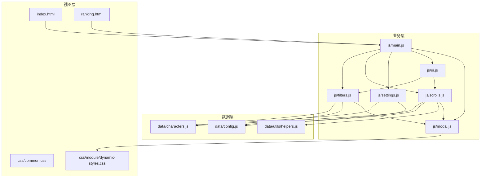
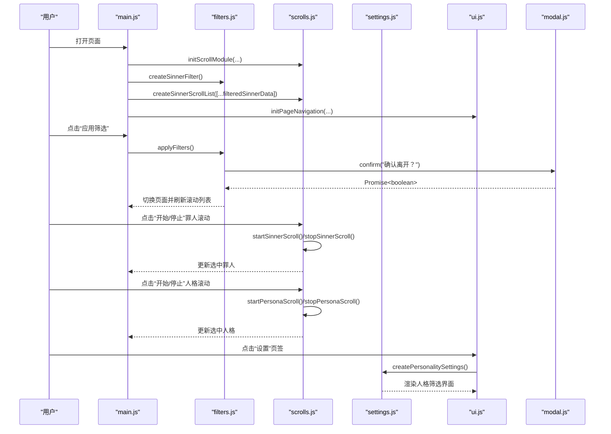
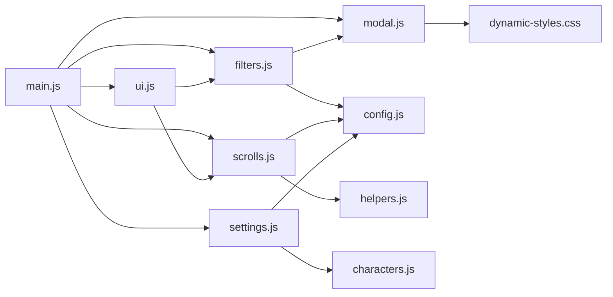

# 代码贡献

<cite>
**本文引用的文件**
- [README.md](file://README.md)
- [OPTIMIZATION_GUIDE.md](file://OPTIMIZATION_GUIDE.md)
- [index.html](file://index.html)
- [ranking.html](file://ranking.html)
- [js/main.js](file://js/main.js)
- [js/filters.js](file://js/filters.js)
- [js/scrolls.js](file://js/scrolls.js)
- [js/settings.js](file://js/settings.js)
- [js/ui.js](file://js/ui.js)
- [js/modal.js](file://js/modal.js)
- [data/characters.js](file://data/characters.js)
- [data/config.js](file://data/config.js)
- [data/utils/helpers.js](file://data/utils/helpers.js)
- [css/common.css](file://css/common.css)
- [css/module/dynamic-styles.css](file://css/module/dynamic-styles.css)
</cite>

## 目录
1. [简介](#简介)
2. [项目结构](#项目结构)
3. [核心组件](#核心组件)
4. [架构总览](#架构总览)
5. [详细组件分析](#详细组件分析)
6. [依赖关系分析](#依赖关系分析)
7. [性能与可维护性考量](#性能与可维护性考量)
8. [贡献指南与代码风格](#贡献指南与代码风格)
9. [手动测试流程](#手动测试流程)
10. [故障排查](#故障排查)
11. [结论](#结论)

## 简介
本项目是一个边狱公司主题的随机选择器，支持罪人与人格的随机抽取、自定义筛选、计时与排行榜等功能。为帮助贡献者快速理解并高质量地参与开发，本文档基于现有架构，给出代码风格、模块化组织、新增功能建议以及提交前的手动测试流程。

## 项目结构
项目采用清晰的模块化组织：
- 数据层：角色与配置、工具函数
- 业务层：主入口、筛选、滚动、设置、UI、弹窗
- 视图层：HTML页面与CSS样式

图表来源
- [js/main.js](file://js/main.js#L1-L60)
- [js/filters.js](file://js/filters.js#L1-L40)
- [js/scrolls.js](file://js/scrolls.js#L1-L40)
- [js/settings.js](file://js/settings.js#L1-L40)
- [js/ui.js](file://js/ui.js#L1-L40)
- [js/modal.js](file://js/modal.js#L1-L40)
- [data/characters.js](file://data/characters.js#L1-L40)
- [data/config.js](file://data/config.js#L1-L29)
- [data/utils/helpers.js](file://data/utils/helpers.js#L1-L45)
- [index.html](file://index.html#L1-L40)
- [ranking.html](file://ranking.html#L1-L40)
- [css/common.css](file://css/common.css#L1-L40)
- [css/module/dynamic-styles.css](file://css/module/dynamic-styles.css#L1-L40)

章节来源
- [README.md](file://README.md#L15-L45)

## 核心组件
- 主入口模块：负责页面导航、初始化滚动与筛选、事件绑定、与各模块协作
- 筛选模块：负责罪人/人格筛选UI与状态管理、应用/重置筛选、返回主页面时的列表刷新
- 滚动模块：负责罪人/人格滚动列表的创建与滚动控制、高亮、停止定位、随机选择
- 设置模块：负责人格筛选设置界面的创建与控制（全选/反选/按罪人维度控制）
- UI模块：负责页面导航切换、按钮事件绑定、应用筛选按钮的动态添加
- 弹窗模块：自定义弹窗，替换原生alert/confirm，提供Promise接口，统一视觉风格
- 数据与工具：角色数据、配置常量、安全随机数与防抖/节流工具

章节来源
- [js/main.js](file://js/main.js#L1-L120)
- [js/filters.js](file://js/filters.js#L1-L120)
- [js/scrolls.js](file://js/scrolls.js#L1-L120)
- [js/settings.js](file://js/settings.js#L1-L120)
- [js/ui.js](file://js/ui.js#L1-L66)
- [js/modal.js](file://js/modal.js#L1-L109)
- [data/characters.js](file://data/characters.js#L1-L60)
- [data/config.js](file://data/config.js#L1-L29)
- [data/utils/helpers.js](file://data/utils/helpers.js#L1-L45)

## 架构总览
整体采用“主入口协调 + 模块化职责分离”的设计：
- 主入口导入各模块并建立依赖关系
- 筛选与滚动模块通过共享的全局状态（window对象）协同
- 弹窗模块以独立IIFE封装，提供统一的异步交互
- 数据与工具模块集中管理配置与通用能力

图表来源
- [js/main.js](file://js/main.js#L120-L261)
- [js/filters.js](file://js/filters.js#L120-L274)
- [js/scrolls.js](file://js/scrolls.js#L280-L478)
- [js/settings.js](file://js/settings.js#L60-L263)
- [js/ui.js](file://js/ui.js#L1-L66)
- [js/modal.js](file://js/modal.js#L70-L109)

## 详细组件分析

### 主入口模块（main.js）
- 职责：导入数据与模块、初始化滚动与筛选、页面导航、事件绑定、与UI/滚动/筛选/设置/弹窗协作
- 关键点：
  - 使用ES6模块导入各子模块
  - 通过window对象共享筛选状态与当前选中项
  - 使用弹窗模块进行确认/提示
  - 动态导入滚动模块以绑定按钮事件

章节来源
- [js/main.js](file://js/main.js#L1-L120)
- [js/main.js](file://js/main.js#L160-L261)

### 筛选模块（filters.js）
- 职责：创建罪人筛选UI、更新筛选状态、校验筛选设置、应用/重置筛选、返回主页面时刷新滚动列表
- 关键点：
  - 通过动态导入数据模块获取最新数据
  - 使用弹窗模块进行提示与确认
  - 与滚动模块配合刷新列表与高亮

章节来源
- [js/filters.js](file://js/filters.js#L1-L120)
- [js/filters.js](file://js/filters.js#L120-L274)

### 滚动模块（scrolls.js）
- 职责：创建罪人/人格滚动列表、控制滚动与停止、随机选择、高亮显示、重置状态
- 关键点：
  - 使用配置常量与安全随机数工具
  - 通过弹窗模块进行错误提示
  - 与主入口共享全局状态

章节来源
- [js/scrolls.js](file://js/scrolls.js#L1-L120)
- [js/scrolls.js](file://js/scrolls.js#L280-L478)
- [js/scrolls.js](file://js/scrolls.js#L480-L718)

### 设置模块（settings.js）
- 职责：创建人格筛选界面、全选/反选/按罪人维度控制、更新筛选状态
- 关键点：
  - 动态导入角色数据并渲染分页
  - 通过window对象维护筛选状态

章节来源
- [js/settings.js](file://js/settings.js#L1-L120)
- [js/settings.js](file://js/settings.js#L120-L263)

### UI模块（ui.js）
- 职责：页面导航切换、按钮事件绑定、应用筛选按钮的动态添加
- 关键点：
  - 通过动态导入绑定事件，避免重复绑定
  - 与筛选/滚动模块解耦

章节来源
- [js/ui.js](file://js/ui.js#L1-L66)

### 弹窗模块（modal.js）
- 职责：自定义弹窗，提供alert/confirm的Promise接口，统一视觉风格
- 关键点：
  - IIFE封装，避免全局污染
  - 与CSS模块化样式配合

章节来源
- [js/modal.js](file://js/modal.js#L1-L109)
- [css/module/dynamic-styles.css](file://css/module/dynamic-styles.css#L1-L133)

### 数据与工具
- 角色数据（data/characters.js）：集中管理罪人与人格数据
- 配置常量（data/config.js）：集中管理滚动、界面、消息等配置
- 工具函数（data/utils/helpers.js）：安全随机数、防抖、节流

章节来源
- [data/characters.js](file://data/characters.js#L1-L60)
- [data/config.js](file://data/config.js#L1-L29)
- [data/utils/helpers.js](file://data/utils/helpers.js#L1-L45)

## 依赖关系分析
- 主入口依赖：数据模块、工具模块、筛选、滚动、设置、UI、弹窗
- 筛选依赖：配置、弹窗；动态导入数据模块
- 滚动依赖：配置、工具、数据、弹窗
- 设置依赖：数据、配置
- UI依赖：筛选、滚动
- 弹窗依赖：样式模块

图表来源
- [js/main.js](file://js/main.js#L1-L60)
- [js/filters.js](file://js/filters.js#L1-L20)
- [js/scrolls.js](file://js/scrolls.js#L1-L10)
- [js/settings.js](file://js/settings.js#L1-L20)
- [js/ui.js](file://js/ui.js#L1-L20)
- [js/modal.js](file://js/modal.js#L1-L20)
- [data/config.js](file://data/config.js#L1-L29)
- [data/utils/helpers.js](file://data/utils/helpers.js#L1-L20)
- [data/characters.js](file://data/characters.js#L1-L20)
- [css/module/dynamic-styles.css](file://css/module/dynamic-styles.css#L1-L40)

## 性能与可维护性考量
- 模块化与职责分离：各模块边界清晰，便于维护与扩展
- ES6模块导入：按需动态导入，减少初始加载压力
- 弹窗模块：替换原生弹窗，避免阻塞与样式不一致
- 配置集中化：滚动、界面、消息等配置集中在配置常量中，便于统一调整
- 安全随机数：优先使用加密安全的随机数生成，回退到Math.random

章节来源
- [OPTIMIZATION_GUIDE.md](file://OPTIMIZATION_GUIDE.md#L240-L353)
- [data/config.js](file://data/config.js#L1-L29)
- [data/utils/helpers.js](file://data/utils/helpers.js#L1-L20)

## 贡献指南与代码风格

### 代码风格要求
- 使用ES6+语法：模块导入/导出、箭头函数、模板字符串、解构赋值等
- 命名规范：采用驼峰命名（camelCase），变量与函数名语义化
- 模块化组织：遵循现有模块划分，避免破坏当前架构

章节来源
- [README.md](file://README.md#L72-L78)
- [OPTIMIZATION_GUIDE.md](file://OPTIMIZATION_GUIDE.md#L240-L265)

### 新功能扩展建议
- 扩展角色数据：在角色数据文件中添加新条目，保持字段一致性
  - 参考路径：[data/characters.js](file://data/characters.js#L1-L60)
- 新增模块：在js目录下创建新模块，通过主入口导入并按需绑定事件
  - 参考现有模块：[js/filters.js](file://js/filters.js#L1-L60)、[js/scrolls.js](file://js/scrolls.js#L1-L60)、[js/settings.js](file://js/settings.js#L1-L60)、[js/ui.js](file://js/ui.js#L1-L40)
- 弹窗统一：如需提示/确认，优先使用弹窗模块，保持视觉一致
  - 参考：[js/modal.js](file://js/modal.js#L70-L109)，样式参考：[css/module/dynamic-styles.css](file://css/module/dynamic-styles.css#L1-L133)

章节来源
- [data/characters.js](file://data/characters.js#L1-L60)
- [js/main.js](file://js/main.js#L1-L60)
- [js/modal.js](file://js/modal.js#L1-L109)
- [css/module/dynamic-styles.css](file://css/module/dynamic-styles.css#L1-L133)

### 遵循现有模块划分
- 主控模块：主入口负责协调，避免在模块内直接写大量业务逻辑
  - 参考：[js/main.js](file://js/main.js#L1-L120)
- 筛选逻辑：筛选模块负责筛选UI与状态管理
  - 参考：[js/filters.js](file://js/filters.js#L1-L120)
- 滚动与随机：滚动模块负责滚动与随机选择
  - 参考：[js/scrolls.js](file://js/scrolls.js#L280-L478)
- 设置与UI：设置模块负责人格筛选界面，UI模块负责导航与按钮事件
  - 参考：[js/settings.js](file://js/settings.js#L60-L160)、[js/ui.js](file://js/ui.js#L1-L66)

章节来源
- [js/main.js](file://js/main.js#L1-L120)
- [js/filters.js](file://js/filters.js#L1-L120)
- [js/scrolls.js](file://js/scrolls.js#L1-L120)
- [js/settings.js](file://js/settings.js#L1-L120)
- [js/ui.js](file://js/ui.js#L1-L66)

### 代码质量标准（参考优化实践）
- IIFE封装：弹窗模块采用IIFE封装，避免全局污染
  - 参考：[js/modal.js](file://js/modal.js#L1-L40)
- 统一异步交互：使用Promise接口，支持async/await
  - 参考：[js/modal.js](file://js/modal.js#L70-L109)
- 动态导入：按需导入，减少初始加载
  - 参考：[js/main.js](file://js/main.js#L190-L205)、[js/ui.js](file://js/ui.js#L20-L40)

章节来源
- [js/modal.js](file://js/modal.js#L1-L109)
- [js/main.js](file://js/main.js#L190-L205)
- [js/ui.js](file://js/ui.js#L20-L40)
- [OPTIMIZATION_GUIDE.md](file://OPTIMIZATION_GUIDE.md#L240-L315)

## 手动测试流程
为确保提交的代码不破坏现有功能，建议按以下流程进行本地测试：

- 启动方式
  - 使用静态HTTP服务器运行，推荐使用Python或Node.js
  - 参考：[README.md](file://README.md#L47-L56)

- 功能验证清单
  - 罪人抽取：点击开始/停止，验证随机选择与高亮
    - 参考：[js/scrolls.js](file://js/scrolls.js#L280-L478)
  - 人格抽取：在选中罪人后进行抽取，验证过滤与随机
    - 参考：[js/scrolls.js](file://js/scrolls.js#L480-L718)
  - 筛选功能：全选/反选/按罪人维度控制，应用筛选后返回主页面
    - 参考：[js/filters.js](file://js/filters.js#L100-L180)、[js/settings.js](file://js/settings.js#L60-L160)
  - 弹窗交互：确认离开、重置筛选、提示信息
    - 参考：[js/main.js](file://js/main.js#L80-L140)、[js/filters.js](file://js/filters.js#L120-L160)、[js/scrolls.js](file://js/scrolls.js#L280-L320)
  - 页面导航：主页面与设置页面切换
    - 参考：[js/ui.js](file://js/ui.js#L1-L40)、[js/main.js](file://js/main.js#L80-L120)
  - 计时与排行榜：本地计时与排行榜页面功能
    - 参考：[README.md](file://README.md#L80-L110)、[ranking.html](file://ranking.html#L1-L40)

- 视觉与兼容性
  - CSS样式保持不变，响应式布局正常
    - 参考：[css/common.css](file://css/common.css#L1-L40)、[css/module/dynamic-styles.css](file://css/module/dynamic-styles.css#L1-L133)
  - 浏览器兼容性：现代浏览器支持ES6模块
    - 参考：[OPTIMIZATION_GUIDE.md](file://OPTIMIZATION_GUIDE.md#L500-L543)

章节来源
- [README.md](file://README.md#L47-L110)
- [js/main.js](file://js/main.js#L80-L140)
- [js/filters.js](file://js/filters.js#L100-L180)
- [js/scrolls.js](file://js/scrolls.js#L280-L478)
- [js/settings.js](file://js/settings.js#L60-L160)
- [js/ui.js](file://js/ui.js#L1-L40)
- [css/common.css](file://css/common.css#L1-L40)
- [css/module/dynamic-styles.css](file://css/module/dynamic-styles.css#L1-L133)
- [OPTIMIZATION_GUIDE.md](file://OPTIMIZATION_GUIDE.md#L500-L543)

## 故障排查
- 弹窗模块加载失败
  - 现象：调用弹窗时报错
  - 处理：检查模块导入路径与ES模块支持，必要时使用可选链与降级方案
  - 参考：[OPTIMIZATION_GUIDE.md](file://OPTIMIZATION_GUIDE.md#L294-L315)
- 滚动列表异常
  - 现象：滚动卡顿或高亮不生效
  - 处理：检查配置常量与DOM结构，确认transition与transform设置
  - 参考：[js/scrolls.js](file://js/scrolls.js#L300-L370)
- 筛选状态不同步
  - 现象：设置页面与主页面状态不一致
  - 处理：确认通过window对象共享状态，并在应用筛选后刷新列表
  - 参考：[js/filters.js](file://js/filters.js#L160-L220)

章节来源
- [OPTIMIZATION_GUIDE.md](file://OPTIMIZATION_GUIDE.md#L294-L315)
- [js/scrolls.js](file://js/scrolls.js#L300-L370)
- [js/filters.js](file://js/filters.js#L160-L220)

## 结论
本项目采用清晰的模块化架构与ES6+技术栈，贡献者应遵循现有模块划分与命名规范，新增功能时优先使用现有模块（弹窗、筛选、滚动、设置、UI），并通过统一的测试流程确保质量。参考优化实践，保持代码风格一致与可维护性。