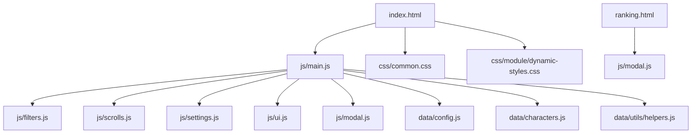
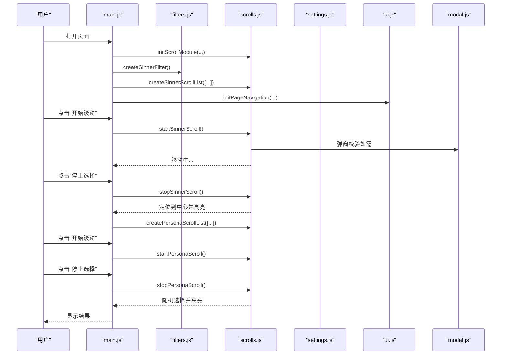
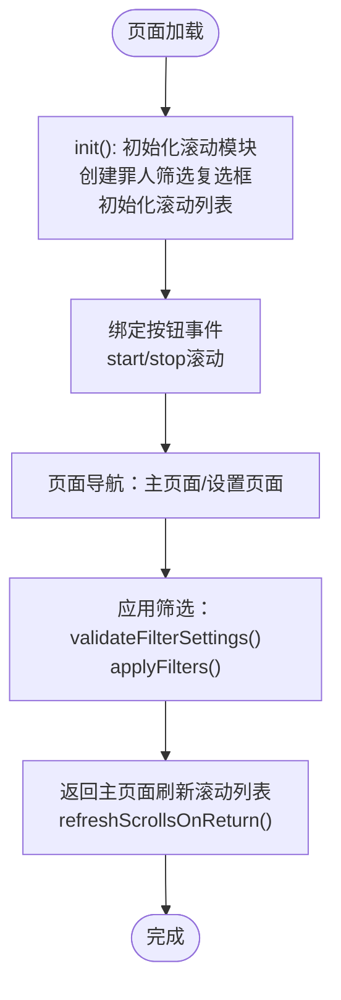
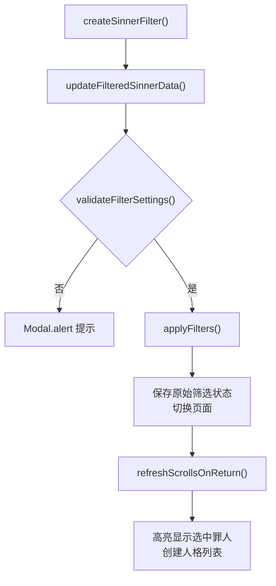
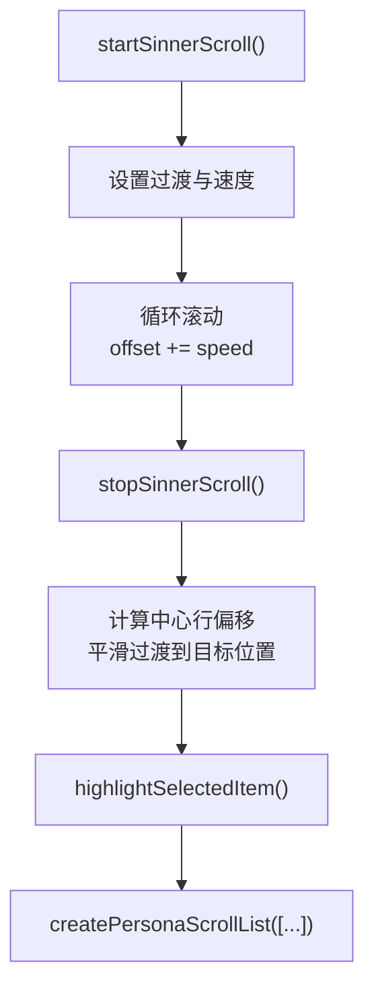
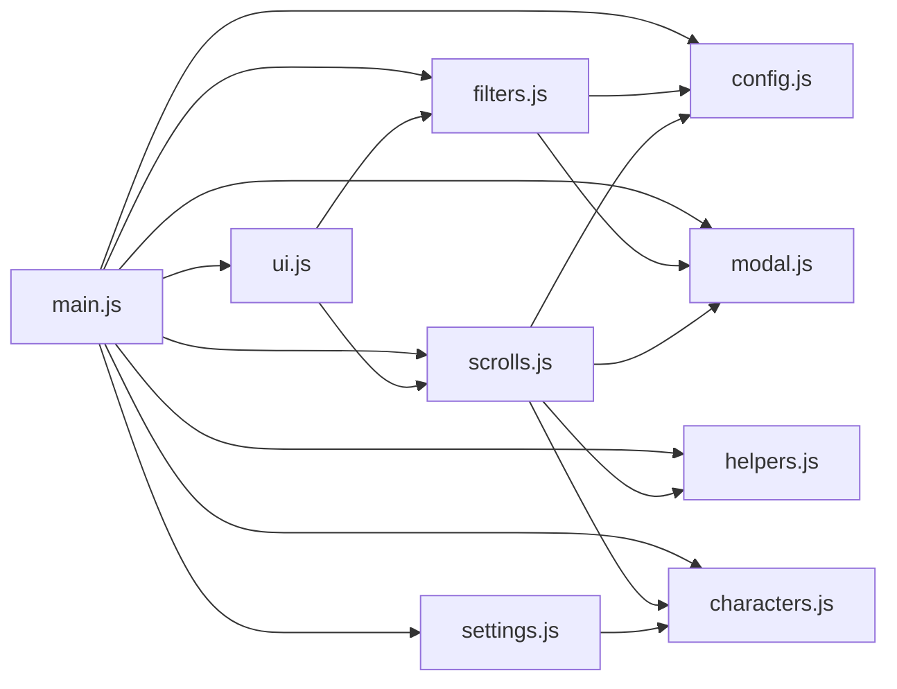

# 开发者指南

<cite>
**本文引用的文件**
- [README.md](file://README.md)
- [package.json](file://package.json)
- [index.html](file://index.html)
- [ranking.html](file://ranking.html)
- [OPTIMIZATION_GUIDE.md](file://OPTIMIZATION_GUIDE.md)
- [js/main.js](file://js/main.js)
- [js/filters.js](file://js/filters.js)
- [js/scrolls.js](file://js/scrolls.js)
- [js/settings.js](file://js/settings.js)
- [js/ui.js](file://js/ui.js)
- [js/modal.js](file://js/modal.js)
- [data/config.js](file://data/config.js)
- [data/characters.js](file://data/characters.js)
- [data/utils/helpers.js](file://data/utils/helpers.js)
- [BUG_FIX_REPORT.md](file://BUG_FIX_REPORT.md)
</cite>

## 目录
1. [简介](#简介)
2. [项目结构](#项目结构)
3. [核心组件](#核心组件)
4. [架构总览](#架构总览)
5. [详细组件分析](#详细组件分析)
6. [依赖关系分析](#依赖关系分析)
7. [性能考虑](#性能考虑)
8. [测试方法](#测试方法)
9. [故障排查](#故障排查)
10. [结论](#结论)

## 简介
本指南面向希望参与项目开发或二次开发的技术人员，围绕“环境搭建”“代码贡献”“测试方法”三大主题展开，并结合性能优化建议，帮助快速上手并高质量迭代。

- 环境搭建：说明如何克隆项目、使用本地HTTP服务器运行应用，以及package.json中test脚本的作用。
- 代码贡献：概述代码风格规范、模块化组织原则和提交流程，鼓励遵循现有架构进行扩展。
- 测试方法：解释如何手动验证各功能模块的行为一致性，并建议未来可引入的自动化测试方案。
- 性能优化：参考OPTIMIZATION_GUIDE.md，提供减少重绘、优化滚动算法等建议。

## 项目结构
项目采用“静态网页 + ES模块”的前端架构，核心文件分布如下：
- HTML页面：index.html（主页面）、ranking.html（排行榜页面）
- 样式：css/ 下的 reset.css、common.css、season.css、module/dynamic-styles.css
- 数据与工具：data/ 下的 characters.js（罪人与人格数据）、config.js（配置常量）、utils/helpers.js（工具函数）
- 脚本：js/ 下的 main.js（主应用逻辑）、filters.js（筛选功能）、scrolls.js（滚动列表）、settings.js（人格设置）、ui.js（UI交互）、modal.js（自定义弹窗）

图表来源
- [index.html](file://index.html#L1-L176)
- [js/main.js](file://js/main.js#L1-L261)
- [js/filters.js](file://js/filters.js#L1-L274)
- [js/scrolls.js](file://js/scrolls.js#L1-L718)
- [js/settings.js](file://js/settings.js#L1-L263)
- [js/ui.js](file://js/ui.js#L1-L66)
- [js/modal.js](file://js/modal.js)
- [data/config.js](file://data/config.js#L1-L29)
- [data/characters.js](file://data/characters.js#L1-L260)
- [data/utils/helpers.js](file://data/utils/helpers.js#L1-L45)
- [ranking.html](file://ranking.html#L1-L94)

章节来源
- [README.md](file://README.md#L15-L46)

## 核心组件
- 主应用逻辑（main.js）：负责页面导航、初始化滚动模块、绑定按钮事件、协调各模块协作。
- 筛选模块（filters.js）：负责罪人筛选复选框创建、筛选状态更新、应用/重置筛选、返回主页面时的滚动列表刷新。
- 滚动模块（scrolls.js）：负责罪人/人格滚动列表的创建、滚动控制、停止定位、高亮显示、随机选择。
- 人格设置模块（settings.js）：负责人格筛选界面的动态生成、全选/反选、分页切换。
- UI模块（ui.js）：负责页面导航切换、按钮事件绑定、应用筛选按钮的动态添加。
- 弹窗模块（modal.js）：提供自定义弹窗（alert/confirm），替换原生弹窗，统一样式与交互。
- 配置与数据（data/config.js、data/characters.js、data/utils/helpers.js）：提供滚动配置、罪人与人格数据、安全随机数等。

章节来源
- [js/main.js](file://js/main.js#L1-L261)
- [js/filters.js](file://js/filters.js#L1-L274)
- [js/scrolls.js](file://js/scrolls.js#L1-L718)
- [js/settings.js](file://js/settings.js#L1-L263)
- [js/ui.js](file://js/ui.js#L1-L66)
- [js/modal.js](file://js/modal.js)
- [data/config.js](file://data/config.js#L1-L29)
- [data/characters.js](file://data/characters.js#L1-L260)
- [data/utils/helpers.js](file://data/utils/helpers.js#L1-L45)

## 架构总览
应用采用“页面 + 模块化JS”的结构，通过ES模块导入/导出实现松耦合。核心流程：
- 页面加载后，main.js 初始化滚动模块、创建筛选复选框、初始化滚动列表、绑定按钮事件。
- filters.js 负责筛选状态管理；scrolls.js 负责滚动与随机选择；settings.js 负责人格筛选界面；ui.js 负责页面导航与按钮事件；modal.js 统一弹窗交互。
- 数据与配置通过 data/ 下的模块提供，避免在业务逻辑中散落硬编码。

图表来源
- [js/main.js](file://js/main.js#L160-L261)
- [js/filters.js](file://js/filters.js#L1-L274)
- [js/scrolls.js](file://js/scrolls.js#L281-L718)
- [js/settings.js](file://js/settings.js#L60-L263)
- [js/ui.js](file://js/ui.js#L1-L66)
- [js/modal.js](file://js/modal.js)

## 详细组件分析

### 主应用逻辑（main.js）
- 负责页面导航、初始化滚动模块、创建筛选复选框、初始化滚动列表、绑定按钮事件、协调各模块协作。
- 通过 import 导入 filters、scrolls、settings、ui、modal 等模块，形成清晰的职责边界。
- 使用 window 对象存储全局状态（如筛选数据、当前选中角色、未保存更改标记），确保模块间共享。

图表来源
- [js/main.js](file://js/main.js#L160-L261)
- [js/filters.js](file://js/filters.js#L117-L184)
- [js/scrolls.js](file://js/scrolls.js#L46-L111)

章节来源
- [js/main.js](file://js/main.js#L1-L261)

### 筛选模块（filters.js）
- 创建罪人筛选复选框，支持头像占位符与图片加载失败回退。
- 更新筛选状态，维护原始筛选数据，标记未保存更改。
- 校验筛选设置（至少一个罪人、每个罪人至少一个人格），应用筛选并返回主页面刷新滚动列表。
- 在返回主页面时，根据筛选结果自动选择唯一罪人并高亮显示，同时正确过滤并显示该罪人的人格列表。

图表来源
- [js/filters.js](file://js/filters.js#L1-L274)
- [js/scrolls.js](file://js/scrolls.js#L324-L478)

章节来源
- [js/filters.js](file://js/filters.js#L1-L274)
- [BUG_FIX_REPORT.md](file://BUG_FIX_REPORT.md#L1-L205)

### 滚动模块（scrolls.js）
- 负责罪人/人格滚动列表的创建、滚动控制、停止定位、高亮显示、随机选择。
- 通过 Config 控制滚动速度、过渡时长、可见行数等参数。
- 使用 secureRandInt 提供安全随机数，避免伪随机偏差。
- 在停止滚动时，计算目标偏移量，确保选中项位于中心行，随后高亮显示并更新结果。

图表来源
- [js/scrolls.js](file://js/scrolls.js#L281-L478)
- [data/config.js](file://data/config.js#L1-L29)
- [data/utils/helpers.js](file://data/utils/helpers.js#L1-L19)

章节来源
- [js/scrolls.js](file://js/scrolls.js#L1-L718)
- [data/config.js](file://data/config.js#L1-L29)
- [data/utils/helpers.js](file://data/utils/helpers.js#L1-L19)

### 人格设置模块（settings.js）
- 动态生成人格筛选界面，支持全局与按罪人维度的全选/反选。
- 通过 dataset 传递罪人ID与人格索引，更新 window.filteredPersonalityData。
- 创建分页控件，支持切换不同罪人的人格设置页面。

章节来源
- [js/settings.js](file://js/settings.js#L1-L263)

### UI模块（ui.js）
- 负责页面导航切换、按钮事件绑定、应用筛选按钮的动态添加。
- 通过 import 按需加载模块，避免一次性加载造成性能压力。

章节来源
- [js/ui.js](file://js/ui.js#L1-L66)

### 弹窗模块（modal.js）
- 提供 Modal.alert 与 Modal.confirm，替换原生 alert/confirm，统一样式与交互。
- 通过 ES 模块导入/导出，支持 async/await 调用，避免阻塞主线程。

章节来源
- [js/modal.js](file://js/modal.js)
- [OPTIMIZATION_GUIDE.md](file://OPTIMIZATION_GUIDE.md#L13-L67)

### 数据与配置（data/config.js、data/characters.js、data/utils/helpers.js）
- config.js：集中管理滚动配置、界面配置、消息配置等常量。
- characters.js：提供12名罪人及其人格的完整数据。
- helpers.js：提供安全随机数、防抖、节流等工具函数。

章节来源
- [data/config.js](file://data/config.js#L1-L29)
- [data/characters.js](file://data/characters.js#L1-L260)
- [data/utils/helpers.js](file://data/utils/helpers.js#L1-L45)

## 依赖关系分析
- main.js 依赖 filters、scrolls、settings、ui、modal、config、characters、helpers。
- filters 依赖 config、modal。
- scrolls 依赖 config、helpers、characters、modal。
- settings 依赖 characters。
- ui 依赖 filters、scrolls。
- modal 为独立模块，被多处调用。
- data/ 下模块为纯数据/配置，被业务模块导入。

图表来源
- [js/main.js](file://js/main.js#L1-L37)
- [js/filters.js](file://js/filters.js#L1-L3)
- [js/scrolls.js](file://js/scrolls.js#L1-L6)
- [js/settings.js](file://js/settings.js#L1-L2)
- [js/ui.js](file://js/ui.js#L1-L20)
- [js/modal.js](file://js/modal.js)
- [data/config.js](file://data/config.js#L1-L29)
- [data/characters.js](file://data/characters.js#L1-L20)
- [data/utils/helpers.js](file://data/utils/helpers.js#L1-L10)

章节来源
- [js/main.js](file://js/main.js#L1-L37)
- [js/filters.js](file://js/filters.js#L1-L3)
- [js/scrolls.js](file://js/scrolls.js#L1-L6)
- [js/settings.js](file://js/settings.js#L1-L2)
- [js/ui.js](file://js/ui.js#L1-L20)
- [js/modal.js](file://js/modal.js)
- [data/config.js](file://data/config.js#L1-L29)
- [data/characters.js](file://data/characters.js#L1-L20)
- [data/utils/helpers.js](file://data/utils/helpers.js#L1-L10)

## 性能考虑
参考 OPTIMIZATION_GUIDE.md 的优化要点，结合本项目实际，提出以下建议：
- 减少重绘与回流
  - 使用 CSS 类替代内联样式，避免频繁修改样式属性引发重绘（见 OPTIMIZATION_GUIDE.md 中 HTML/CSS 优化）。
  - 滚动时尽量使用 transform 与 transition，避免触发布局与绘制（scrolls.js 已使用 transform 过渡）。
- 优化滚动算法
  - 滚动列表通过重复项目实现无缝循环，注意控制 totalHeight 与 offset，避免过度计算（参考 scrolls.js 的循环重置逻辑）。
  - 在停止滚动时，使用中心行定位策略，减少不必要的 DOM 查询与更新。
- 模块化与懒加载
  - 按需 import 模块（如 UI 模块中对 settings/scrolls 的动态导入），降低初始加载压力。
- 弹窗与交互
  - 使用自定义弹窗替代原生弹窗，避免阻塞主线程（见 modal.js 与 OPTIMIZATION_GUIDE.md）。

章节来源
- [OPTIMIZATION_GUIDE.md](file://OPTIMIZATION_GUIDE.md#L395-L473)
- [js/scrolls.js](file://js/scrolls.js#L281-L478)
- [js/ui.js](file://js/ui.js#L23-L39)
- [js/modal.js](file://js/modal.js)

## 测试方法
- 手动验证
  - 罪人筛选：仅勾选1个罪人，应用筛选后返回主页面，验证一级滚动列表显示头像与名称，二级滚动列表正确显示该罪人的人格。
  - 人格筛选：为某罪人勾选部分人格，应用筛选后进行随机抽取，验证最终结果仅从勾选的人格中随机选择。
  - 单罪人单人格：验证一级与二级滚动列表均正确显示并可直接选择。
  - 默认全选：不修改人格筛选设置，验证所有人格均可被抽取。
  - 重置筛选：验证重置后筛选状态恢复至原始状态。
  - 页面导航：验证主页面与设置页面之间的切换与状态保持。
  - 计时器与排行榜：验证计时器功能、排行榜保存与查看、清空记录。
- 自动化测试建议
  - 单元测试：针对 filters.js 的筛选逻辑、scrolls.js 的滚动与随机选择、settings.js 的界面生成进行断言。
  - 集成测试：模拟用户操作流程（筛选 -> 抽取 -> 结果显示 -> 排行榜保存），覆盖边界场景（单罪人、单人格、空筛选等）。
  - 性能测试：测量滚动停止定位的耗时、弹窗显示的延迟、页面切换的流畅度。
  - CI/CD：在 PR 中自动运行测试与构建，确保变更不破坏既有功能。

章节来源
- [BUG_FIX_REPORT.md](file://BUG_FIX_REPORT.md#L133-L205)
- [js/filters.js](file://js/filters.js#L117-L184)
- [js/scrolls.js](file://js/scrolls.js#L281-L718)
- [js/settings.js](file://js/settings.js#L60-L263)
- [ranking.html](file://ranking.html#L1-L94)

## 故障排查
- 症状：仅勾选1个罪人后返回主页面，一级滚动列表未显示头像与名称。
  - 原因：缺少高亮显示逻辑（见 BUG_FIX_REPORT.md）。
  - 解决：在返回主页面时调用高亮显示函数，确保头像与名称正确渲染。
- 症状：最终抽取结果显示未勾选的人格。
  - 原因：人格筛选逻辑错误（undefined 与 false 的比较）。
  - 解决：采用显式判断，仅当明确设置为 false 时不选中，其余情况视为选中。
- 症状：图片加载失败导致空白。
  - 解决：在图片 onerror 中替换为占位符，确保界面稳定。
- 症状：原生弹窗阻塞与样式不统一。
  - 解决：使用自定义弹窗模块，支持 Promise 与 async/await，避免阻塞主线程。

章节来源
- [BUG_FIX_REPORT.md](file://BUG_FIX_REPORT.md#L1-L205)
- [js/filters.js](file://js/filters.js#L194-L271)
- [js/scrolls.js](file://js/scrolls.js#L480-L718)
- [js/modal.js](file://js/modal.js)
- [OPTIMIZATION_GUIDE.md](file://OPTIMIZATION_GUIDE.md#L13-L67)

## 结论
本项目采用清晰的模块化架构与 ES 模块导入机制，配合完善的筛选与滚动逻辑，提供了良好的可扩展性。建议在二次开发中：
- 遵循现有模块边界与命名规范，保持低耦合高内聚。
- 使用自定义弹窗统一交互，避免阻塞主线程。
- 在性能敏感路径（滚动、弹窗）优先使用 transform/transition 与按需加载。
- 通过手动与自动化测试保障功能正确性与稳定性。