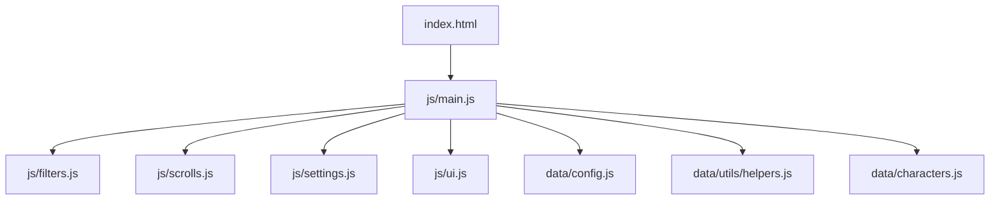
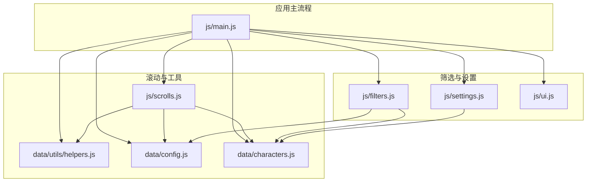
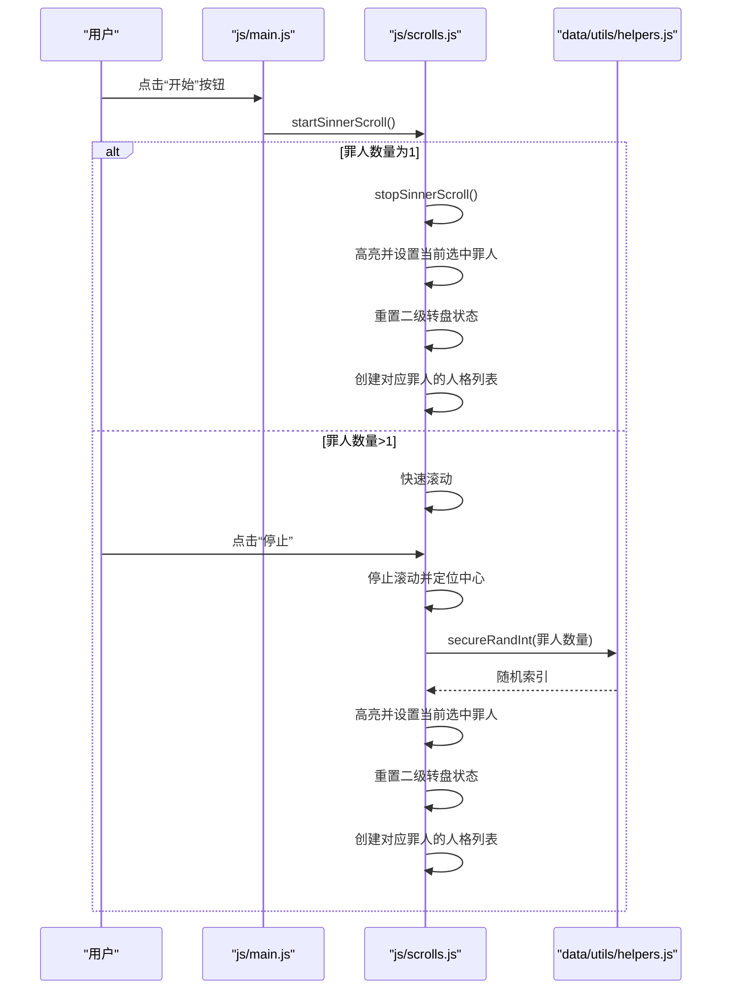
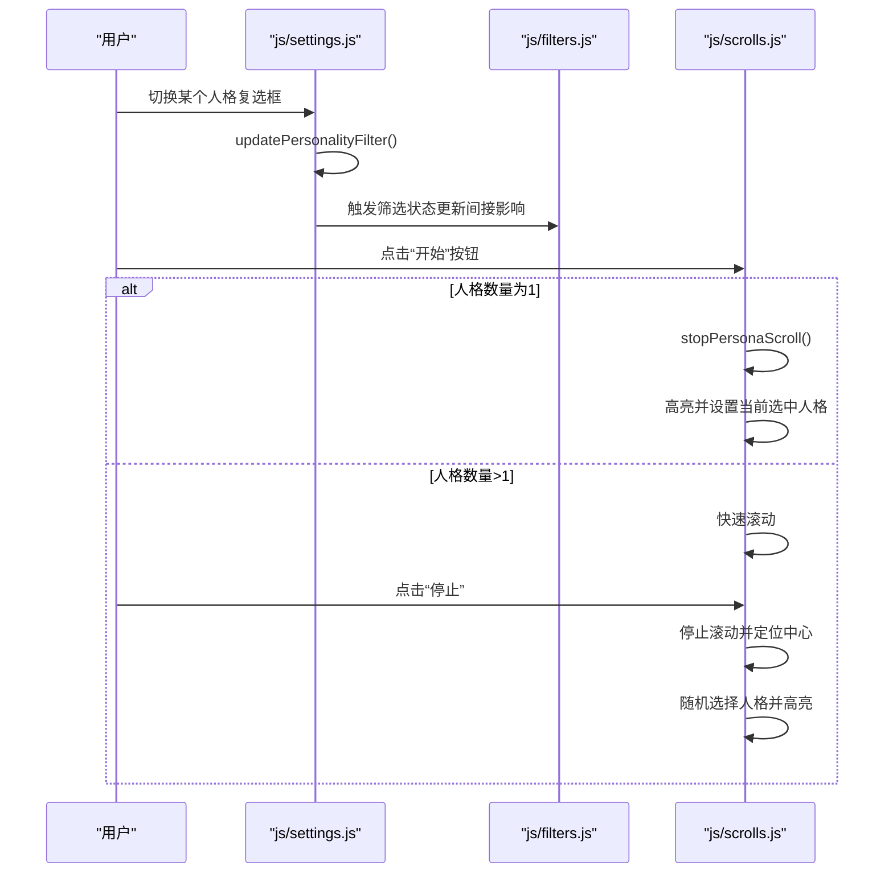
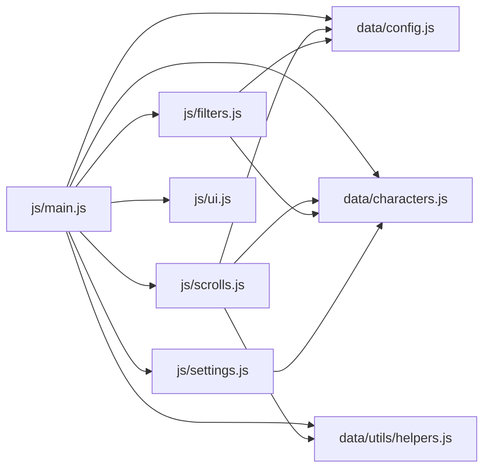

# 测试方法

<cite>
**本文引用的文件**
- [package.json](file://package.json)
- [README.md](file://README.md)
- [OPTIMIZATION_GUIDE.md](file://OPTIMIZATION_GUIDE.md)
- [data/utils/helpers.js](file://data/utils/helpers.js)
- [data/config.js](file://data/config.js)
- [data/characters.js](file://data/characters.js)
- [js/main.js](file://js/main.js)
- [js/filters.js](file://js/filters.js)
- [js/scrolls.js](file://js/scrolls.js)
- [js/settings.js](file://js/settings.js)
- [js/ui.js](file://js/ui.js)
</cite>

## 目录
1. [简介](#简介)
2. [项目结构](#项目结构)
3. [核心组件](#核心组件)
4. [架构总览](#架构总览)
5. [详细组件分析](#详细组件分析)
6. [依赖关系分析](#依赖关系分析)
7. [性能考量](#性能考量)
8. [故障排查指南](#故障排查指南)
9. [结论](#结论)
10. [附录](#附录)

## 简介
本文件聚焦于项目的测试策略与实施方法。当前项目采用以人工验证为主的测试方式，围绕核心功能行为一致性进行逐一核验，包括罪人随机选择、人格筛选、计时功能与排行榜等。同时，本文解释了 package.json 中 test 脚本的执行方式与用途，并基于 OPTIMIZATION_GUIDE.md 的优化实践，提出未来引入自动化测试（单元测试与端到端测试）的建议，以及调试技巧（如利用浏览器开发者工具监控 localStorage 与事件监听器）。

## 项目结构
项目采用模块化组织，核心逻辑分布在 js/ 与 data/ 目录中，分别承载应用主流程、筛选与滚动、配置与工具函数、角色数据等。README 对功能与项目结构进行了概览；OPTIMIZATION_GUIDE.md 记录了弹窗模块化、计时器与排行榜等优化内容与验证清单。

图表来源
- [js/main.js](file://js/main.js#L1-L60)
- [js/filters.js](file://js/filters.js#L1-L40)
- [js/scrolls.js](file://js/scrolls.js#L1-L40)
- [js/settings.js](file://js/settings.js#L1-L40)
- [js/ui.js](file://js/ui.js#L1-L30)
- [data/config.js](file://data/config.js#L1-L29)
- [data/utils/helpers.js](file://data/utils/helpers.js#L1-L20)
- [data/characters.js](file://data/characters.js#L1-L30)

章节来源
- [README.md](file://README.md#L1-L60)
- [package.json](file://package.json#L1-L17)

## 核心组件
- 主入口与状态管理：负责初始化滚动模块、创建筛选与滚动列表、页面导航、按钮事件绑定与全局状态维护。
- 筛选模块：负责罪人筛选复选框创建、筛选状态更新、应用筛选、验证筛选设置、返回主页面时刷新滚动列表。
- 滚动模块：负责罪人/人格滚动列表构建、开始/停止滚动、高亮选中项、随机选择、边界与循环滚动逻辑。
- 设置模块：负责人格筛选界面创建、全选/反选/全不选、特定罪人筛选控制、筛选状态写入全局对象。
- UI 模块：负责页面导航初始化、按钮事件绑定、应用筛选按钮注入。
- 工具与配置：安全随机数、防抖/节流、滚动配置常量、角色数据。

章节来源
- [js/main.js](file://js/main.js#L1-L120)
- [js/filters.js](file://js/filters.js#L1-L120)
- [js/scrolls.js](file://js/scrolls.js#L1-L120)
- [js/settings.js](file://js/settings.js#L1-L120)
- [js/ui.js](file://js/ui.js#L1-L66)
- [data/utils/helpers.js](file://data/utils/helpers.js#L1-L45)
- [data/config.js](file://data/config.js#L1-L29)
- [data/characters.js](file://data/characters.js#L1-L60)

## 架构总览
下图展示了模块间的依赖关系与调用方向，体现主入口对各模块的协调作用。

图表来源
- [js/main.js](file://js/main.js#L1-L120)
- [js/filters.js](file://js/filters.js#L1-L120)
- [js/scrolls.js](file://js/scrolls.js#L1-L120)
- [js/settings.js](file://js/settings.js#L1-L120)
- [js/ui.js](file://js/ui.js#L1-L66)
- [data/utils/helpers.js](file://data/utils/helpers.js#L1-L20)
- [data/config.js](file://data/config.js#L1-L29)
- [data/characters.js](file://data/characters.js#L1-L60)

## 详细组件分析

### 测试策略与当前实践
- 以人工验证为主：通过浏览器打开页面，逐一核验核心功能行为一致性，包括罪人随机选择、人格筛选、计时与排行榜等。
- 验证清单参考：OPTIMIZATION_GUIDE.md 的“验证清单”提供了功能、视觉与性能方面的核验要点，可作为人工测试的对照表。
- test 脚本用途：package.json 中的 test 脚本指向 node test-modules.js，用于验证模块导入的完整性（例如 ES 模块导入链路是否畅通）。当前仓库未包含该脚本文件，因此该脚本需另行准备或移除。

章节来源
- [package.json](file://package.json#L1-L17)
- [OPTIMIZATION_GUIDE.md](file://OPTIMIZATION_GUIDE.md#L546-L582)

### 罪人随机选择与滚动流程

图表来源
- [js/scrolls.js](file://js/scrolls.js#L280-L478)
- [data/utils/helpers.js](file://data/utils/helpers.js#L1-L20)

章节来源
- [js/scrolls.js](file://js/scrolls.js#L280-L478)
- [data/utils/helpers.js](file://data/utils/helpers.js#L1-L20)

### 人格筛选与滚动流程

图表来源
- [js/settings.js](file://js/settings.js#L1-L120)
- [js/filters.js](file://js/filters.js#L117-L170)
- [js/scrolls.js](file://js/scrolls.js#L480-L684)

章节来源
- [js/settings.js](file://js/settings.js#L1-L120)
- [js/filters.js](file://js/filters.js#L117-L170)
- [js/scrolls.js](file://js/scrolls.js#L480-L684)

### 计时功能与排行榜（基于优化指南）
- 计时器与排行榜属于优化范围内的功能模块，OPTIMIZATION_GUIDE.md 的“验证清单”中包含计时器与排行榜相关条目，可作为人工验证的依据。
- 若需自动化测试，可在后续引入单元测试（针对计时器逻辑）与端到端测试（模拟计时与排行榜交互）。

章节来源
- [OPTIMIZATION_GUIDE.md](file://OPTIMIZATION_GUIDE.md#L546-L582)

### test 脚本执行方式与模块导入验证
- package.json 中 scripts.test 指向 node test-modules.js，用于验证模块导入链路是否完整（例如 ES 模块导入是否成功、路径是否正确）。
- 当前仓库未包含 test-modules.js 文件，因此该脚本需补充或移除，以免执行时报错。

章节来源
- [package.json](file://package.json#L1-L17)

## 依赖关系分析
- 主入口 js/main.js 依赖 filters、scrolls、settings、ui、config、helpers、characters 等模块。
- 滚动模块 js/scrolls.js 依赖 config、helpers、characters，并在运行时通过 DOM 元素与全局状态协作。
- 筛选模块 js/filters.js 依赖 config、characters，并与 UI 交互。
- 设置模块 js/settings.js 依赖 characters，并与全局筛选状态交互。
- 工具模块 data/utils/helpers.js 提供安全随机数、防抖与节流等通用能力。

图表来源
- [js/main.js](file://js/main.js#L1-L120)
- [js/scrolls.js](file://js/scrolls.js#L1-L120)
- [js/filters.js](file://js/filters.js#L1-L120)
- [js/settings.js](file://js/settings.js#L1-L120)
- [js/ui.js](file://js/ui.js#L1-L66)
- [data/utils/helpers.js](file://data/utils/helpers.js#L1-L20)
- [data/config.js](file://data/config.js#L1-L29)
- [data/characters.js](file://data/characters.js#L1-L60)

章节来源
- [js/main.js](file://js/main.js#L1-L120)
- [js/scrolls.js](file://js/scrolls.js#L1-L120)
- [js/filters.js](file://js/filters.js#L1-L120)
- [js/settings.js](file://js/settings.js#L1-L120)
- [js/ui.js](file://js/ui.js#L1-L66)
- [data/utils/helpers.js](file://data/utils/helpers.js#L1-L20)
- [data/config.js](file://data/config.js#L1-L29)
- [data/characters.js](file://data/characters.js#L1-L60)

## 性能考量
- 滚动性能：滚动模块通过配置常量控制滚动速度、过渡时长与循环倍数，避免过度重绘与卡顿。
- 随机算法：安全随机数函数在可用时优先使用加密安全的随机源，回退到 Math.random，兼顾安全性与性能。
- 事件绑定：模块间通过动态 import 与事件委托机制减少耦合，避免重复绑定导致的性能问题。

章节来源
- [data/config.js](file://data/config.js#L1-L29)
- [data/utils/helpers.js](file://data/utils/helpers.js#L1-L20)
- [js/scrolls.js](file://js/scrolls.js#L280-L478)

## 故障排查指南
- 模块导入失败：若执行 npm test 或直接 node test-modules.js 报错，检查 ES 模块路径与文件是否存在。
- 滚动异常：检查 Config 中的 itemHeight、scrollSpeed、transitionDuration 等参数是否合理；确认 DOM 元素存在且 ID 正确。
- 筛选状态异常：确认 window.filteredSinnerData 与 window.filteredPersonalityData 是否按预期更新；检查 Filters.validateFilterSettings 的提示逻辑。
- 人格选择异常：确认当前选中的罪人是否仍在筛选列表中；若不在，需重置二级转盘状态并提示用户先选择罪人。
- 计时与排行榜：根据 OPTIMIZATION_GUIDE.md 的验证清单逐项核验，确保计时器与排行榜功能正常。

章节来源
- [js/scrolls.js](file://js/scrolls.js#L280-L684)
- [js/filters.js](file://js/filters.js#L117-L170)
- [OPTIMIZATION_GUIDE.md](file://OPTIMIZATION_GUIDE.md#L546-L582)

## 结论
当前项目以人工验证为核心测试手段，结合 OPTIMIZATION_GUIDE.md 的验证清单，能够有效保障核心功能的行为一致性。随着功能复杂度上升，建议逐步引入自动化测试：使用 Jest 对 helpers.js 等工具函数进行单元测试，使用 Puppeteer 对用户交互（如点击、滚动、筛选）进行端到端验证。同时，完善 test 脚本与测试文件，形成可持续的测试体系。

## 附录

### 建议的自动化测试方案
- 单元测试（Jest）
  - 测试目标：helpers.js 中的安全随机数、防抖与节流函数。
  - 测试要点：边界条件（max≤0）、回退路径（crypto不可用）、函数返回值与副作用。
- 端到端测试（Puppeteer）
  - 测试目标：模拟用户点击“开始/停止”按钮、切换筛选、查看结果与排行榜。
  - 测试要点：DOM 更新、滚动定位、高亮状态、事件监听器绑定情况、localStorage 数据变化。

章节来源
- [data/utils/helpers.js](file://data/utils/helpers.js#L1-L45)
- [js/scrolls.js](file://js/scrolls.js#L280-L684)
- [js/filters.js](file://js/filters.js#L117-L170)

### 调试技巧
- 浏览器开发者工具
  - 监控 localStorage：在 Application/Storage 下观察数据变化，核对筛选状态与当前选中项。
  - 事件监听器：在 Elements 面板中查看元素的事件监听器，确认绑定是否正确。
  - 控制台与断点：在关键函数（如 startSinnerScroll、stopSinnerScroll、updatePersonalityFilter）设置断点，逐步跟踪执行路径。
- 日志辅助
  - 滚动模块中存在日志输出，可用于确认列表创建、高亮与选择流程是否按预期执行。

章节来源
- [js/scrolls.js](file://js/scrolls.js#L113-L160)
- [js/scrolls.js](file://js/scrolls.js#L256-L279)
- [js/scrolls.js](file://js/scrolls.js#L350-L478)
- [js/scrolls.js](file://js/scrolls.js#L572-L684)