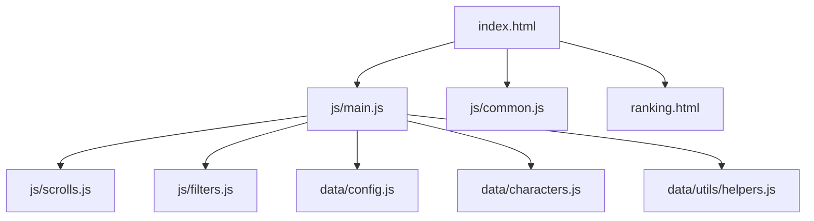
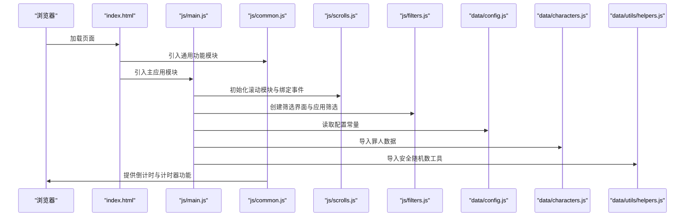

# 环境搭建

<cite>
**本文引用的文件**
- [README.md](file://README.md)
- [package.json](file://package.json)
- [index.html](file://index.html)
- [ranking.html](file://ranking.html)
- [js/main.js](file://js/main.js)
- [js/common.js](file://js/common.js)
- [js/scrolls.js](file://js/scrolls.js)
- [js/filters.js](file://js/filters.js)
- [data/config.js](file://data/config.js)
- [data/characters.js](file://data/characters.js)
- [data/utils/helpers.js](file://data/utils/helpers.js)
</cite>

## 目录
1. [简介](#简介)
2. [项目结构](#项目结构)
3. [核心组件](#核心组件)
4. [架构总览](#架构总览)
5. [详细组件分析](#详细组件分析)
6. [依赖分析](#依赖分析)
7. [性能考虑](#性能考虑)
8. [故障排查指南](#故障排查指南)
9. [结论](#结论)
10. [附录](#附录)

## 简介
本指南面向开发者，提供本地开发环境搭建的完整步骤与注意事项，包括：
- 通过 git 克隆或直接下载源码的方式获取项目
- 本地运行所需的运行环境要求（支持 ES 模块的现代浏览器与本地 HTTP 服务器）
- 使用 Python 内置 HTTP 服务器启动应用的方法与访问方式
- package.json 中 test 脚本的作用说明
- 常见问题与解决方案（如 file:// 协议下 ES 模块加载失败）
- VS Code Live Server 等开发工具的推荐与使用建议

## 项目结构
该项目为纯前端静态站点，采用模块化 JavaScript（ES 模块），通过 HTML 引入样式与脚本，并以本地 HTTP 服务器提供服务以避免跨域与模块加载限制。

图表来源
- [index.html](file://index.html#L1-L176)
- [js/main.js](file://js/main.js#L1-L261)
- [js/common.js](file://js/common.js#L1-L326)
- [js/scrolls.js](file://js/scrolls.js#L1-L200)
- [js/filters.js](file://js/filters.js#L1-L200)
- [data/config.js](file://data/config.js#L1-L29)
- [data/characters.js](file://data/characters.js#L1-L200)
- [data/utils/helpers.js](file://data/utils/helpers.js#L1-L45)
- [ranking.html](file://ranking.html#L1-L94)

章节来源
- [README.md](file://README.md#L1-L121)
- [index.html](file://index.html#L1-L176)
- [ranking.html](file://ranking.html#L1-L94)

## 核心组件
- 入口页面与模块加载
  - index.html 通过 type="module" 方式引入主模块 js/main.js，同时引入 js/common.js 以提供倒计时与计时器等通用功能。
  - ranking.html 同样以 ES 模块方式导入 js/modal.js 并在页面中动态渲染本地存储的排行榜数据。
- 主应用逻辑
  - js/main.js 负责初始化滚动模块、筛选模块、设置模块与 UI 模块，并协调各模块之间的交互。
- 滚动与筛选
  - js/scrolls.js 提供滚动列表的创建与控制逻辑；js/filters.js 提供筛选设置的创建与校验。
- 配置与数据
  - data/config.js 提供滚动与界面配置常量；data/characters.js 提供罪人与人格数据；data/utils/helpers.js 提供安全随机数与防抖/节流工具。

章节来源
- [index.html](file://index.html#L1-L176)
- [js/main.js](file://js/main.js#L1-L261)
- [js/scrolls.js](file://js/scrolls.js#L1-L200)
- [js/filters.js](file://js/filters.js#L1-L200)
- [data/config.js](file://data/config.js#L1-L29)
- [data/characters.js](file://data/characters.js#L1-L200)
- [data/utils/helpers.js](file://data/utils/helpers.js#L1-L45)
- [ranking.html](file://ranking.html#L1-L94)

## 架构总览
下图展示了浏览器端模块加载与页面交互的关键流程。

图表来源
- [index.html](file://index.html#L1-L176)
- [js/main.js](file://js/main.js#L1-L261)
- [js/common.js](file://js/common.js#L1-L326)
- [js/scrolls.js](file://js/scrolls.js#L1-L200)
- [js/filters.js](file://js/filters.js#L1-L200)
- [data/config.js](file://data/config.js#L1-L29)
- [data/characters.js](file://data/characters.js#L1-L200)
- [data/utils/helpers.js](file://data/utils/helpers.js#L1-L45)

## 详细组件分析

### 组件一：入口页面与模块加载
- index.html 通过 type="module" 引入 js/main.js，确保浏览器以 ES 模块方式解析与执行。
- 同时引入 js/common.js，以便在页面加载早期提供倒计时与计时器等通用能力。
- ranking.html 以 ES 模块方式导入 js/modal.js，并在页面中动态渲染本地存储的排行榜数据。

章节来源
- [index.html](file://index.html#L1-L176)
- [ranking.html](file://ranking.html#L1-L94)

### 组件二：主应用逻辑（js/main.js）
- 负责导入并组合使用滚动、筛选、设置、UI 等模块。
- 初始化滚动模块、创建罪人与人格滚动列表、绑定滚动按钮事件。
- 维护全局状态（如当前选中的罪人与人格、筛选数据等）。

章节来源
- [js/main.js](file://js/main.js#L1-L261)

### 组件三：滚动模块（js/scrolls.js）
- 提供滚动列表的创建、滚动控制与高亮逻辑。
- 根据配置常量与传入数据动态计算容器高度与项目数量，保证平滑滚动效果。
- 支持罪人与人格两类滚动列表的不同处理逻辑。

章节来源
- [js/scrolls.js](file://js/scrolls.js#L1-L200)
- [data/config.js](file://data/config.js#L1-L29)

### 组件四：筛选模块（js/filters.js）
- 负责创建罪人筛选复选框、更新筛选数据、应用筛选设置与校验。
- 在设置页面与主页面之间切换时刷新滚动列表。
- 与滚动模块协作，确保筛选结果正确反映到滚动列表。

章节来源
- [js/filters.js](file://js/filters.js#L1-L200)
- [js/scrolls.js](file://js/scrolls.js#L1-L200)

### 组件五：配置与数据（data/config.js、data/characters.js、data/utils/helpers.js）
- data/config.js 提供滚动、界面、动画、数据与消息等配置常量。
- data/characters.js 提供罪人与人格数据，包含头像与名称等信息。
- data/utils/helpers.js 提供安全随机数生成、防抖与节流等工具函数。

章节来源
- [data/config.js](file://data/config.js#L1-L29)
- [data/characters.js](file://data/characters.js#L1-L200)
- [data/utils/helpers.js](file://data/utils/helpers.js#L1-L45)

## 依赖分析
- 浏览器端依赖
  - ES 模块：index.html 与 ranking.html 通过 type="module" 引入 JS 模块，要求现代浏览器支持 ES 模块。
  - 本地 HTTP 服务器：由于 ES 模块在 file:// 协议下受限，需使用本地 HTTP 服务器提供服务。
- Node.js 与测试脚本
  - package.json 中定义了 test 脚本，用于运行模块化测试（例如 test-modules.js），但当前仓库未包含该测试文件，因此该脚本无法直接运行。

章节来源
- [index.html](file://index.html#L1-L176)
- [ranking.html](file://ranking.html#L1-L94)
- [package.json](file://package.json#L1-L17)

## 性能考虑
- 滚动性能
  - 通过增加项目数量与循环策略实现平滑滚动，合理设置 itemHeight 与可见行数，避免过度渲染导致卡顿。
- 事件处理
  - 使用防抖与节流工具（helpers.js）优化高频事件（如窗口尺寸变化、滚动事件）的处理。
- 资源加载
  - 图片加载失败时提供占位符，减少因资源异常导致的布局抖动与重绘。

章节来源
- [js/scrolls.js](file://js/scrolls.js#L1-L200)
- [data/utils/helpers.js](file://data/utils/helpers.js#L1-L45)

## 故障排查指南
- ES 模块在 file:// 协议下加载失败
  - 现象：直接双击打开 index.html 或 ranking.html，浏览器控制台报错，提示 ES 模块无法加载。
  - 原因：现代浏览器出于安全考虑，在 file:// 协议下限制 ES 模块的加载。
  - 解决方案：使用本地 HTTP 服务器提供服务，推荐使用 Python 内置 HTTP 服务器在项目根目录执行命令，然后在浏览器访问 http://localhost:8000。
- 计时器与排行榜功能
  - 计时器功能由 js/common.js 提供，依赖本地存储（localStorage）保存排行榜记录。
  - 若浏览器禁用本地存储或清理缓存，可能导致排行榜为空或计时器状态丢失。
- 图片资源加载失败
  - 若角色头像加载失败，页面会显示带背景色的问号占位符，不影响功能使用。
- VS Code Live Server
  - 推荐使用 VS Code Live Server 插件在本地快速启动 HTTP 服务器，提升开发体验与热更新效率。

章节来源
- [README.md](file://README.md#L47-L56)
- [js/common.js](file://js/common.js#L1-L326)
- [js/scrolls.js](file://js/scrolls.js#L1-L200)

## 结论
- 本地开发应使用支持 ES 模块的现代浏览器与本地 HTTP 服务器，避免 file:// 协议带来的模块加载限制。
- 通过 Python 内置 HTTP 服务器在项目根目录启动服务并在浏览器访问 http://localhost:8000 即可正常运行。
- package.json 中的 test 脚本用于运行模块化测试，但当前仓库缺少对应测试文件，无法直接执行。
- 推荐使用 VS Code Live Server 等开发工具提升开发体验与调试效率。

## 附录

### 本地开发环境搭建步骤
- 克隆或下载源码
  - 通过 git 克隆项目仓库，或直接下载压缩包并解压到本地目录。
- 启动本地 HTTP 服务器
  - 在项目根目录执行命令，启动本地 HTTP 服务器。
  - 在浏览器中访问 http://localhost:8000。
- 运行与访问
  - 打开 index.html 即可使用主页面功能；通过计时器弹窗进入排行榜页面，或直接访问 ranking.html。

章节来源
- [README.md](file://README.md#L47-L56)
- [index.html](file://index.html#L1-L176)
- [ranking.html](file://ranking.html#L1-L94)

### package.json 中 test 脚本说明
- scripts.test：用于运行模块化测试（例如 test-modules.js），但当前仓库未包含该测试文件，因此该脚本无法直接运行。
- 建议：如需运行测试，请在本地准备对应的测试文件并确保测试脚本与模块加载方式兼容。

章节来源
- [package.json](file://package.json#L1-L17)