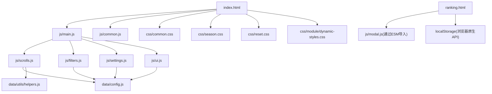
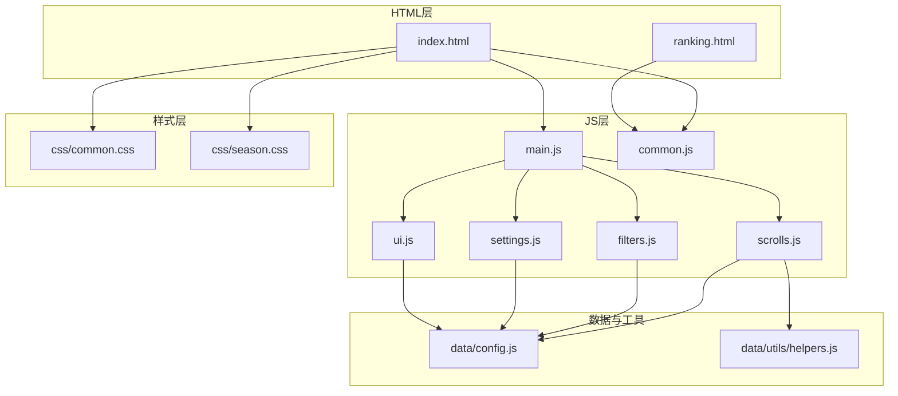
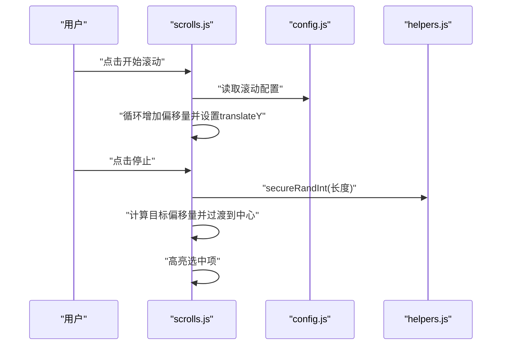
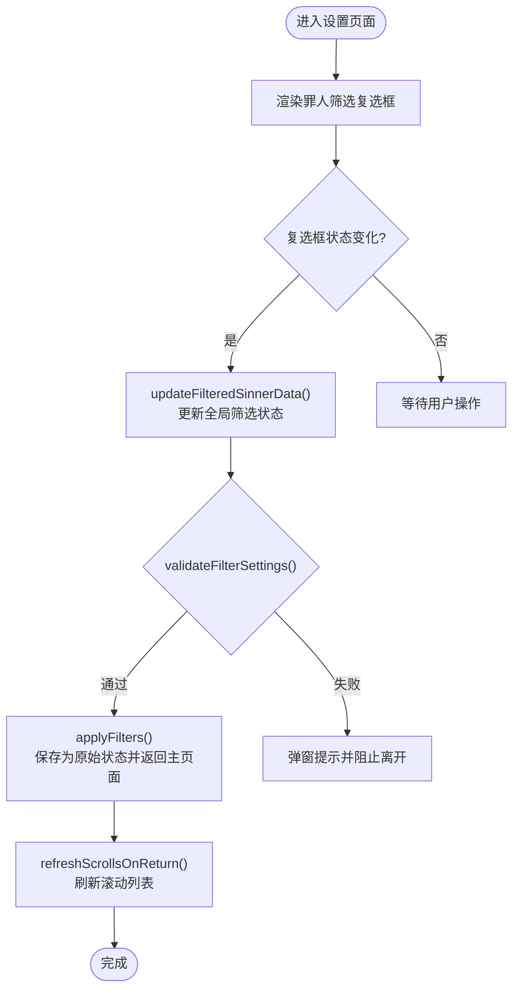
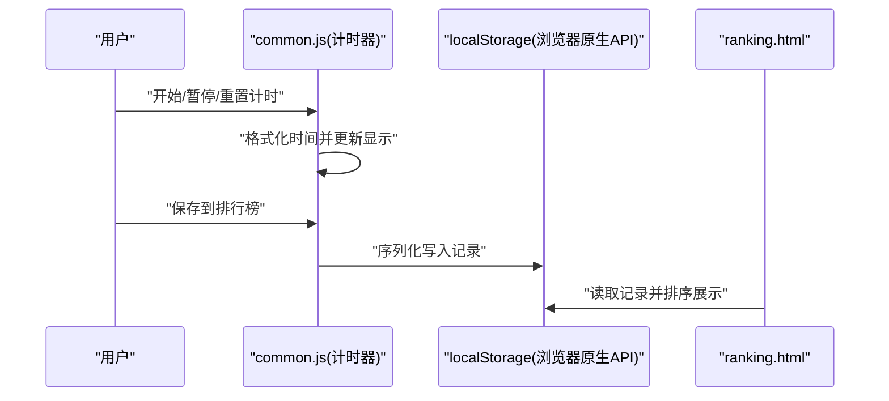
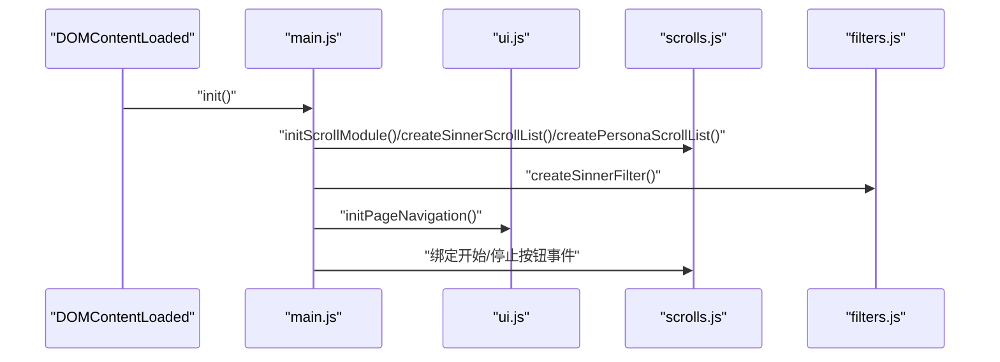
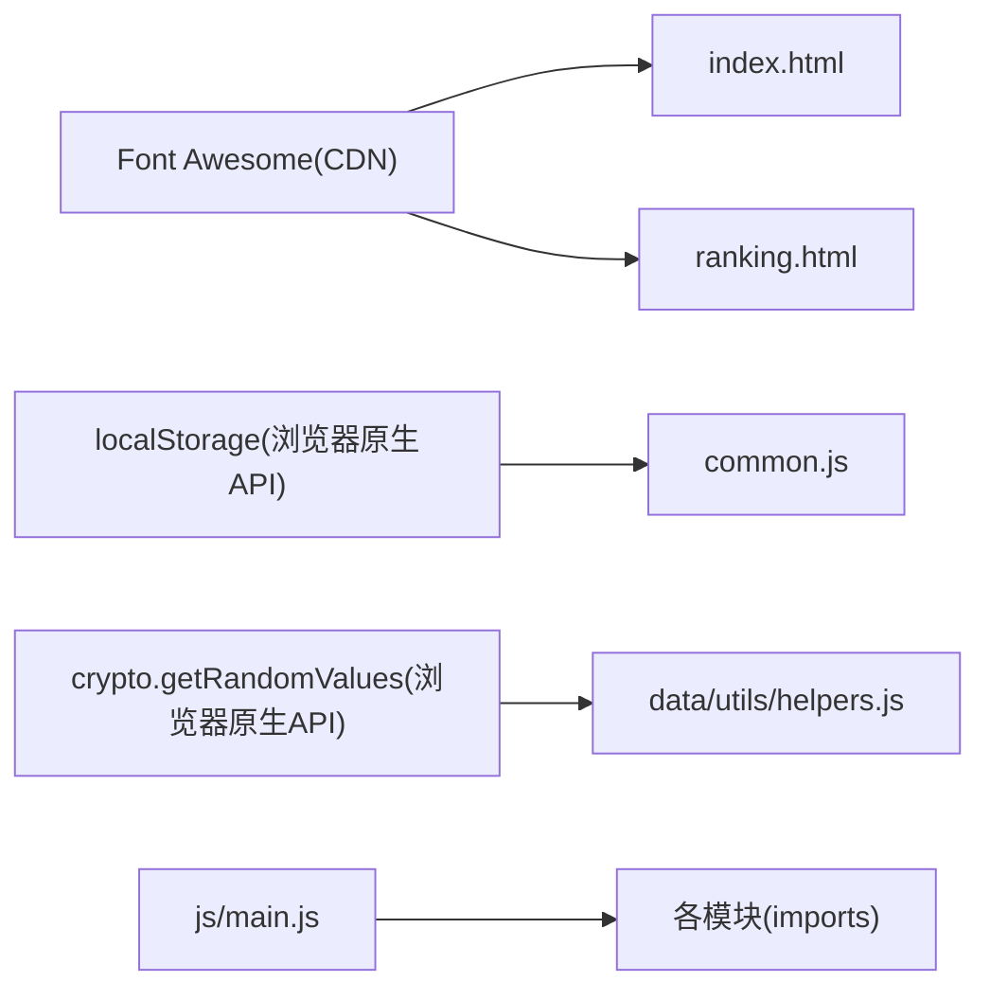

# 技术栈与依赖

<cite>
**本文引用的文件**
- [index.html](file://index.html)
- [ranking.html](file://ranking.html)
- [package.json](file://package.json)
- [README.md](file://README.md)
- [js/main.js](file://js/main.js)
- [js/common.js](file://js/common.js)
- [js/scrolls.js](file://js/scrolls.js)
- [js/filters.js](file://js/filters.js)
- [js/settings.js](file://js/settings.js)
- [js/ui.js](file://js/ui.js)
- [data/config.js](file://data/config.js)
- [data/utils/helpers.js](file://data/utils/helpers.js)
- [css/common.css](file://css/common.css)
- [css/season.css](file://css/season.css)
</cite>

## 目录
1. [简介](#简介)
2. [项目结构](#项目结构)
3. [核心组件](#核心组件)
4. [架构总览](#架构总览)
5. [详细组件分析](#详细组件分析)
6. [依赖分析](#依赖分析)
7. [性能考量](#性能考量)
8. [故障排查指南](#故障排查指南)
9. [结论](#结论)

## 简介
本项目采用原生 HTML5、CSS3 与 ES6+ JavaScript 构建，不依赖任何前端框架（如 Vue 或 React）。通过 ES 模块（type: module）组织代码，结合浏览器原生 API（如 localStorage、crypto.getRandomValues）实现动画滚动、状态管理与数据持久化。项目同时引入 Font Awesome 图标库（通过 CDN）以提供统一的图标资源。该技术选型强调：
- 性能：零框架开销，减少包体积与运行时负担
- 可维护性：模块化、职责分离、清晰的导入导出约定
- 部署简易性：静态站点，无需打包构建，直接托管于 GitHub Pages 等平台

## 项目结构
项目采用按功能模块划分的目录组织方式，核心文件如下：
- HTML 页面：index.html（主页面）、ranking.html（排行榜页面）
- JS 模块：main.js（主应用入口）、common.js（通用功能）、scrolls.js（滚动交互）、filters.js（筛选逻辑）、settings.js（人格设置）、ui.js（界面交互）
- 数据与配置：data/config.js（配置常量）、data/utils/helpers.js（工具函数）
- 样式：css/common.css（通用样式）、css/season.css（季节性动画样式）、css/reset.css、css/module/dynamic-styles.css

图表来源
- [index.html](file://index.html#L1-L176)
- [js/main.js](file://js/main.js#L1-L261)
- [js/common.js](file://js/common.js#L1-L326)
- [js/scrolls.js](file://js/scrolls.js#L1-L718)
- [js/filters.js](file://js/filters.js#L1-L274)
- [js/settings.js](file://js/settings.js#L1-L263)
- [js/ui.js](file://js/ui.js#L1-L66)
- [data/config.js](file://data/config.js#L1-L29)
- [data/utils/helpers.js](file://data/utils/helpers.js#L1-L45)
- [css/common.css](file://css/common.css#L1-L200)
- [css/season.css](file://css/season.css#L1-L38)
- [ranking.html](file://ranking.html#L1-L94)

章节来源
- [README.md](file://README.md#L1-L121)

## 核心组件
- 主应用入口（main.js）：负责页面导航、初始化滚动模块、绑定按钮事件、协调各模块协作
- 通用功能（common.js）：倒计时、计时器与排行榜本地存储、模态弹窗
- 滚动模块（scrolls.js）：实现罪人与人格的无限循环滚动、随机停止定位、高亮选中项
- 筛选模块（filters.js）：罪人筛选复选框、筛选状态校验与应用、返回主页面时刷新滚动列表
- 人格设置（settings.js）：按罪人分页的人格筛选界面、全选/反选、状态持久化
- UI 模块（ui.js）：页面切换、按钮事件绑定、应用筛选按钮注入
- 配置与工具（data/config.js、data/utils/helpers.js）：统一配置常量、安全随机数生成、防抖节流

章节来源
- [js/main.js](file://js/main.js#L1-L261)
- [js/common.js](file://js/common.js#L1-L326)
- [js/scrolls.js](file://js/scrolls.js#L1-L718)
- [js/filters.js](file://js/filters.js#L1-L274)
- [js/settings.js](file://js/settings.js#L1-L263)
- [js/ui.js](file://js/ui.js#L1-L66)
- [data/config.js](file://data/config.js#L1-L29)
- [data/utils/helpers.js](file://data/utils/helpers.js#L1-L45)

## 架构总览
应用采用“主入口 + 模块化子模块”的分层架构：
- HTML 层：index.html 提供页面骨架与 Font Awesome CDN 引入
- JS 层：ESM 导入导出，模块间通过命名导出与默认导出协作
- 数据层：config.js 统一配置；helpers.js 提供安全随机数与工具函数
- 样式层：common.css 提供通用样式与滚动动画；season.css 提供季节性发光动画

图表来源
- [index.html](file://index.html#L1-L176)
- [ranking.html](file://ranking.html#L1-L94)
- [js/main.js](file://js/main.js#L1-L261)
- [js/common.js](file://js/common.js#L1-L326)
- [js/scrolls.js](file://js/scrolls.js#L1-L718)
- [js/filters.js](file://js/filters.js#L1-L274)
- [js/settings.js](file://js/settings.js#L1-L263)
- [js/ui.js](file://js/ui.js#L1-L66)
- [data/config.js](file://data/config.js#L1-L29)
- [data/utils/helpers.js](file://data/utils/helpers.js#L1-L45)
- [css/common.css](file://css/common.css#L1-L200)
- [css/season.css](file://css/season.css#L1-L38)

## 详细组件分析

### 动画滚动与状态管理（scrolls.js）
- 滚动实现要点
  - 通过 Config 控制项目高度、可见行数、滚动速度与过渡时长
  - 采用 translateY 结合 transition 实现平滑滚动与循环重置
  - 使用安全随机数生成器（secureRandInt）保证随机性
  - 高亮选中项通过 selected 类与 transform 缩放增强视觉反馈
- 状态管理
  - 使用 window 对象共享 filteredSinnerData、filteredPersonalityData、currentSelectedSinner、currentSelectedPersona 等全局状态
  - 通过 clearHighlight/highlightSelectedItem 管理选中态
- 错误处理
  - 当罪人或人格为空时，弹窗提示并禁用相应按钮

图表来源
- [js/scrolls.js](file://js/scrolls.js#L1-L718)
- [data/config.js](file://data/config.js#L1-L29)
- [data/utils/helpers.js](file://data/utils/helpers.js#L1-L45)

章节来源
- [js/scrolls.js](file://js/scrolls.js#L1-L718)
- [data/config.js](file://data/config.js#L1-L29)
- [data/utils/helpers.js](file://data/utils/helpers.js#L1-L45)

### 筛选与设置（filters.js、settings.js）
- 罪人筛选
  - 通过复选框集合生成选中 ID，过滤罪人数据并更新全局状态
  - 验证筛选设置：至少选择一个罪人；每个罪人至少选择一个人格
- 人格设置
  - 按罪人分页展示人格卡片，支持全选/反选/按罪人反选
  - 通过 window.filteredPersonalityData 持久化筛选状态
- 返回主页面刷新
  - 若仅剩一个罪人，自动选中并更新人格列表；否则重置状态

图表来源
- [js/filters.js](file://js/filters.js#L1-L274)
- [js/settings.js](file://js/settings.js#L1-L263)

章节来源
- [js/filters.js](file://js/filters.js#L1-L274)
- [js/settings.js](file://js/settings.js#L1-L263)

### 计时器与本地排行榜（common.js、ranking.html）
- 计时器
  - 通过定时器每秒递增秒数，格式化显示 HH:MM:SS
  - 保存到本地存储（localStorage）时携带角色与人格信息
- 排行榜
  - ranking.html 通过 ES 模块导入 Modal，读取 localStorage 并排序展示
  - 支持清空记录与返回主页

图表来源
- [js/common.js](file://js/common.js#L1-L326)
- [ranking.html](file://ranking.html#L1-L94)

章节来源
- [js/common.js](file://js/common.js#L1-L326)
- [ranking.html](file://ranking.html#L1-L94)

### 主入口与模块协作（main.js、ui.js）
- 主入口
  - 初始化滚动模块、创建筛选与滚动列表、绑定按钮事件
  - 处理页面导航与返回时的状态刷新
- UI 模块
  - 注入“应用筛选”按钮，统一事件绑定策略

图表来源
- [js/main.js](file://js/main.js#L1-L261)
- [js/ui.js](file://js/ui.js#L1-L66)
- [js/scrolls.js](file://js/scrolls.js#L1-L718)
- [js/filters.js](file://js/filters.js#L1-L274)

章节来源
- [js/main.js](file://js/main.js#L1-L261)
- [js/ui.js](file://js/ui.js#L1-L66)

## 依赖分析
- 外部依赖
  - Font Awesome 图标库：通过 CDN 引入，用于页面图标显示
  - 浏览器原生 API：localStorage（本地存储）、crypto.getRandomValues（安全随机数回退）
- 内部依赖
  - ES 模块：通过 import/export 组织模块间依赖
  - 配置与工具：统一配置常量与安全随机数工具

图表来源
- [index.html](file://index.html#L1-L176)
- [ranking.html](file://ranking.html#L1-L94)
- [js/common.js](file://js/common.js#L1-L326)
- [data/utils/helpers.js](file://data/utils/helpers.js#L1-L45)
- [js/main.js](file://js/main.js#L1-L261)

章节来源
- [index.html](file://index.html#L1-L176)
- [ranking.html](file://ranking.html#L1-L94)
- [js/common.js](file://js/common.js#L1-L326)
- [data/utils/helpers.js](file://data/utils/helpers.js#L1-L45)

## 性能考量
- 零框架开销：原生 JS 与 ES 模块，避免虚拟 DOM 与运行时框架成本
- 模块化与按需加载：通过动态 import 在需要时加载模块，降低初始加载压力
- 动画与滚动：使用 translateY 与 transform，利用 GPU 加速，减少重排重绘
- 随机数安全性：优先使用 crypto.randomInt/crypto.getRandomValues，失败回退到 Math.random，兼顾性能与安全
- 本地存储：localStorage 读写简单高效，适合轻量数据持久化

## 故障排查指南
- 计时器保存失败
  - 检查 localStorage 是否可用；确认保存前已完成一次计时
  - 查看控制台错误信息，确认弹窗提示
- 滚动停止无响应
  - 确认罪人/人格筛选列表非空；检查按钮禁用状态
  - 检查 Config 配置是否合理（itemHeight、scrollSpeed 等）
- 排行榜为空
  - 确认 localStorage 中存在 personalRanking 键；检查是否被清理
- 页面图标不显示
  - 检查 CDN 是否可达；确认 index.html 与 ranking.html 中的 Font Awesome 引入

章节来源
- [js/common.js](file://js/common.js#L1-L326)
- [js/scrolls.js](file://js/scrolls.js#L1-L718)
- [ranking.html](file://ranking.html#L1-L94)

## 结论
本项目以原生技术栈为核心，借助 ES 模块化与浏览器原生能力，实现了高性能、易维护且部署简易的应用。通过合理的模块分工与配置抽象，滚动动画、筛选设置、计时与本地排行榜等功能得以清晰解耦与稳定运行。对于追求极致性能与最小化依赖的场景，该技术选型提供了良好的实践范例。