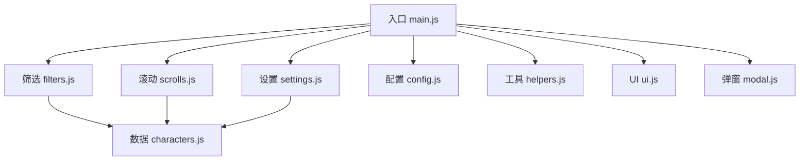
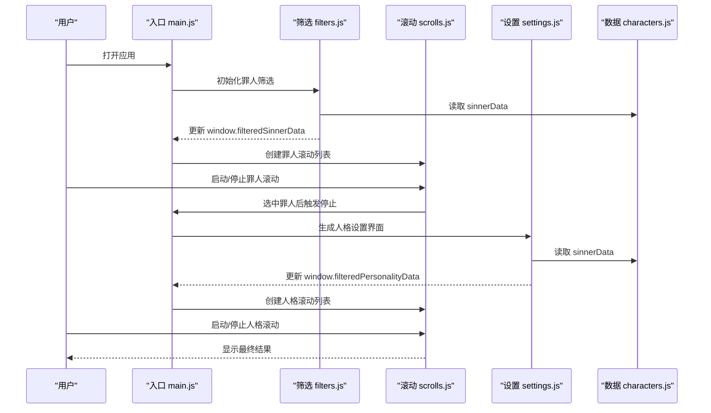
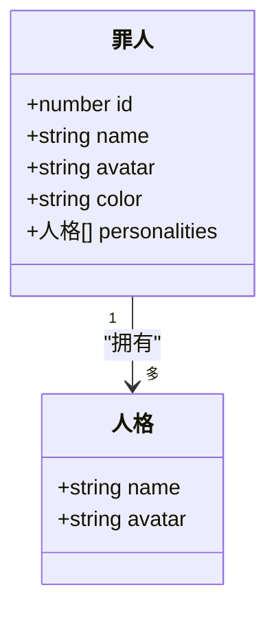
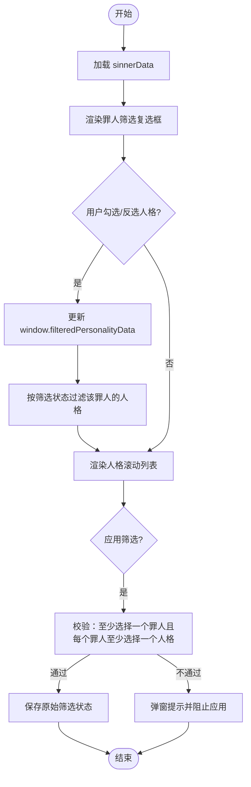
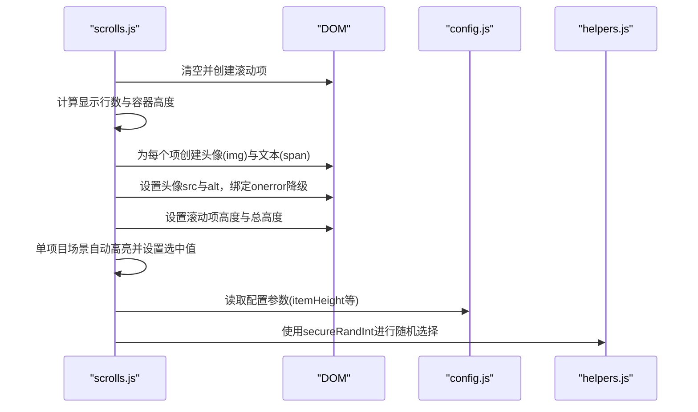
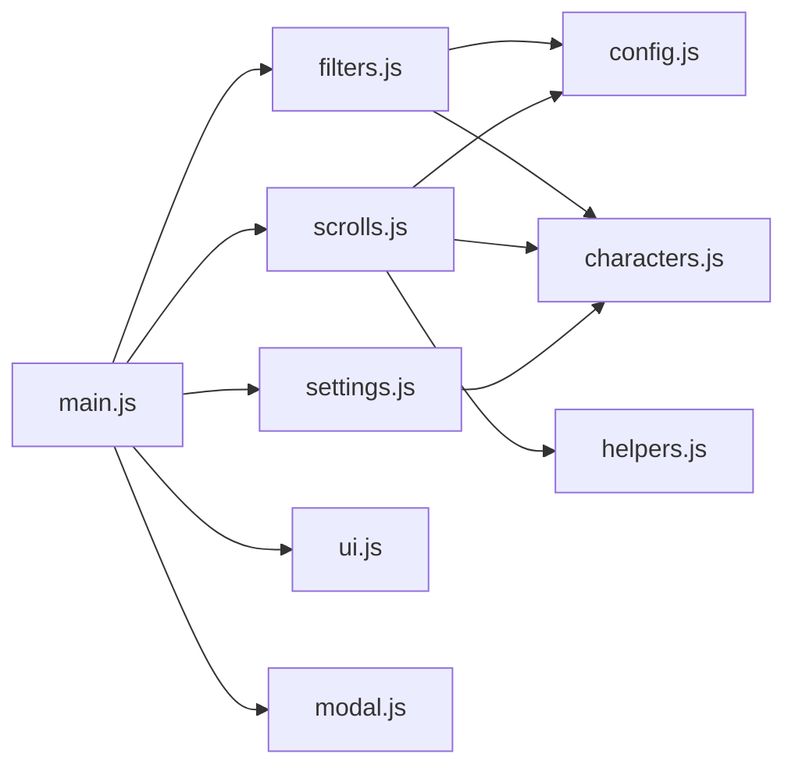

# 人格数据结构

<cite>
**本文引用的文件**
- [data/characters.js](file://data/characters.js)
- [js/settings.js](file://js/settings.js)
- [js/scrolls.js](file://js/scrolls.js)
- [js/filters.js](file://js/filters.js)
- [js/main.js](file://js/main.js)
- [data/config.js](file://data/config.js)
- [data/utils/helpers.js](file://data/utils/helpers.js)
- [js/ui.js](file://js/ui.js)
- [js/modal.js](file://js/modal.js)
</cite>

## 目录
1. [简介](#简介)
2. [项目结构](#项目结构)
3. [核心组件](#核心组件)
4. [架构总览](#架构总览)
5. [详细组件分析](#详细组件分析)
6. [依赖分析](#依赖分析)
7. [性能考虑](#性能考虑)
8. [故障排查指南](#故障排查指南)
9. [结论](#结论)
10. [附录](#附录)

## 简介
本文件围绕“人格数据结构”展开，重点解析 data/characters.js 中 sinnerData 的 personalities 数组中人格对象的 name 与 avatar 属性在系统中的技术实现与业务意义；结合 js/settings.js 的人格筛选逻辑，阐述人格数据如何参与动态过滤流程；并通过 js/scrolls.js 展示人格在滚动选择器中的渲染过程，说明其与罪人主体数据的层级关系；最后提供常见问题解答，帮助快速定位与解决实际使用中的问题。

## 项目结构
- 数据层：data/characters.js 提供罪人与人格的静态数据模型
- 业务层：js/filters.js 负责罪人筛选与人格筛选校验；js/settings.js 负责人格设置界面与筛选状态持久化
- 交互层：js/scrolls.js 负责罪人与人格滚动选择器的渲染与交互；js/main.js 作为入口协调各模块
- 配置与工具：data/config.js 提供滚动与界面配置；data/utils/helpers.js 提供安全随机数等工具

图表来源
- [js/main.js](file://js/main.js#L1-L261)
- [js/filters.js](file://js/filters.js#L1-L274)
- [js/scrolls.js](file://js/scrolls.js#L1-L718)
- [js/settings.js](file://js/settings.js#L1-L263)
- [data/characters.js](file://data/characters.js#L1-L260)
- [data/config.js](file://data/config.js#L1-L29)
- [data/utils/helpers.js](file://data/utils/helpers.js#L1-L45)
- [js/ui.js](file://js/ui.js#L1-L66)
- [js/modal.js](file://js/modal.js#L1-L109)

章节来源
- [js/main.js](file://js/main.js#L1-L261)

## 核心组件
- 人格数据模型：sinnerData 中每个罪人对象包含 personalities 数组，数组中的人格对象具有 name 与 avatar 两个关键属性
- 人格筛选模块：js/settings.js 维护 window.filteredPersonalityData，按罪人 id 与人格索引记录筛选状态
- 滚动选择器：js/scrolls.js 负责渲染罪人与人格列表，支持头像占位与错误处理
- 筛选校验与应用：js/filters.js 在应用筛选时对“至少选择一个罪人、且每个罪人至少选择一个人格”的约束进行校验

章节来源
- [data/characters.js](file://data/characters.js#L1-L260)
- [js/settings.js](file://js/settings.js#L1-L263)
- [js/scrolls.js](file://js/scrolls.js#L1-L718)
- [js/filters.js](file://js/filters.js#L1-L274)

## 架构总览
人格数据贯穿“筛选—渲染—交互—应用”的完整链路。name 字段既作为筛选条件（在设置页中呈现），又作为显示文本（滚动列表与设置卡片中均使用）。avatar 字段用于绑定游戏内形象资源，负责在罪人与人格滚动列表以及设置页中显示头像，同时具备错误兜底策略。

图表来源
- [js/main.js](file://js/main.js#L1-L261)
- [js/filters.js](file://js/filters.js#L1-L274)
- [js/scrolls.js](file://js/scrolls.js#L1-L718)
- [js/settings.js](file://js/settings.js#L1-L263)
- [data/characters.js](file://data/characters.js#L1-L260)

## 详细组件分析

### 人格数据模型与层级关系
- 结构要点
  - sinnerData：罪人数组，每个元素包含 id、name、avatar、color 以及 personalities 数组
  - personalities：每项为“人格对象”，包含 name 与 avatar
- 层级关系
  - 罪人对象与人格对象是一对多关系；人格对象属于某一个罪人
  - 人格对象的 name 与 avatar 分别承担“筛选显示文本”和“头像资源”的职责

图表来源
- [data/characters.js](file://data/characters.js#L1-L260)

章节来源
- [data/characters.js](file://data/characters.js#L1-L260)

### name 字段的技术实现与业务意义
- 技术实现
  - 在筛选界面（罪人筛选复选框）中，name 作为显示文本与 alt 文本使用
  - 在滚动选择器中，name 作为列表项的文本内容
  - 在设置页的人格卡片中，name 作为显示文本
- 业务意义
  - 作为筛选条件：用户通过勾选罪人来间接影响人格的可用性；在设置页中，name 作为可读性标识
  - 作为显示文本：在所有 UI 卡片与滚动列表中统一展示，保证一致性

章节来源
- [js/filters.js](file://js/filters.js#L1-L274)
- [js/scrolls.js](file://js/scrolls.js#L1-L718)
- [js/settings.js](file://js/settings.js#L1-L263)

### avatar 字段的技术实现与资源绑定
- 技术实现
  - 在罪人滚动列表与人格滚动列表中，avatar 作为 img 的 src 使用，并在加载失败时降级为占位符
  - 在设置页的人格卡片中，avatar 作为 img 的 src 使用，并在加载失败时降级为占位符
- 资源绑定
  - avatar 路径指向 assets/images 下的图片资源，需确保路径正确且资源存在
  - 若 avatar 缺失或加载失败，系统会显示占位符“?”，避免空白或报错

章节来源
- [js/scrolls.js](file://js/scrolls.js#L1-L718)
- [js/settings.js](file://js/settings.js#L1-L263)

### 人格筛选逻辑与动态过滤流程
- 筛选状态存储
  - window.filteredPersonalityData 以“罪人 id -> 人格索引 -> 布尔值”的映射存储筛选状态
  - 默认情况下，未显式设置的人格被视为“选中”
- 动态过滤流程
  - 用户在设置页勾选/反选人格后，通过 updatePersonalityFilter 更新 window.filteredPersonalityData
  - 当罪人被选中或切换时，滚动模块根据 window.filteredPersonalityData 对该罪人的人格进行过滤
  - filters.js 在应用筛选时，会对“每个罪人至少选择一个人格”进行校验

图表来源
- [js/settings.js](file://js/settings.js#L1-L263)
- [js/filters.js](file://js/filters.js#L1-L274)
- [js/scrolls.js](file://js/scrolls.js#L1-L718)
- [data/characters.js](file://data/characters.js#L1-L260)

章节来源
- [js/settings.js](file://js/settings.js#L1-L263)
- [js/filters.js](file://js/filters.js#L1-L274)
- [js/scrolls.js](file://js/scrolls.js#L1-L718)

### 人格在滚动选择器中的渲染过程
- 步骤概览
  - 创建滚动列表时，根据 items 参数决定渲染模式（字符串提示、空列表、单项目、多项目）
  - 为每个列表项创建头像元素与文本元素，头像优先使用 avatar，否则使用占位符
  - 为单项目场景自动高亮并设置选中值
- 关键点
  - 头像加载失败时的降级策略一致，确保 UI 稳定
  - 单项目时直接选中并禁用开始按钮，避免不必要的交互

图表来源
- [js/scrolls.js](file://js/scrolls.js#L1-L718)
- [data/config.js](file://data/config.js#L1-L29)
- [data/utils/helpers.js](file://data/utils/helpers.js#L1-L45)

章节来源
- [js/scrolls.js](file://js/scrolls.js#L1-L718)
- [data/config.js](file://data/config.js#L1-L29)
- [data/utils/helpers.js](file://data/utils/helpers.js#L1-L45)

### 与罪人主体数据的层级关系
- 罪人对象包含 personalities 数组，人格对象属于该数组
- 筛选状态以“罪人 id -> 人格索引”的方式与罪人主体数据解耦，便于独立维护
- 应用筛选时，滚动模块基于当前罪人对象的人格数组进行过滤，而非依赖外部状态

章节来源
- [data/characters.js](file://data/characters.js#L1-L260)
- [js/scrolls.js](file://js/scrolls.js#L1-L718)

## 依赖分析
- 模块耦合
  - main.js 作为协调者，依赖 filters.js、scrolls.js、settings.js、ui.js、modal.js
  - filters.js 依赖 data/config.js 与 data/characters.js
  - scrolls.js 依赖 data/config.js、data/utils/helpers.js、data/characters.js
  - settings.js 依赖 data/characters.js
- 外部依赖
  - 浏览器环境提供的 window、document、crypto 等
- 循环依赖
  - 未发现明显循环依赖；模块间通过导入导出与异步加载避免强耦合

图表来源
- [js/main.js](file://js/main.js#L1-L261)
- [js/filters.js](file://js/filters.js#L1-L274)
- [js/scrolls.js](file://js/scrolls.js#L1-L718)
- [js/settings.js](file://js/settings.js#L1-L263)
- [data/config.js](file://data/config.js#L1-L29)
- [data/utils/helpers.js](file://data/utils/helpers.js#L1-L45)
- [data/characters.js](file://data/characters.js#L1-L260)
- [js/ui.js](file://js/ui.js#L1-L66)
- [js/modal.js](file://js/modal.js#L1-L109)

章节来源
- [js/main.js](file://js/main.js#L1-L261)
- [js/filters.js](file://js/filters.js#L1-L274)
- [js/scrolls.js](file://js/scrolls.js#L1-L718)
- [js/settings.js](file://js/settings.js#L1-L263)
- [data/config.js](file://data/config.js#L1-L29)
- [data/utils/helpers.js](file://data/utils/helpers.js#L1-L45)
- [data/characters.js](file://data/characters.js#L1-L260)
- [js/ui.js](file://js/ui.js#L1-L66)
- [js/modal.js](file://js/modal.js#L1-L109)

## 性能考虑
- 滚动列表渲染
  - 通过 Config.itemHeight 控制项目高度，减少重排与重绘
  - 使用 transform 进行滚动，避免频繁布局计算
- 随机选择
  - 使用 secureRandInt 生成安全随机索引，避免伪随机带来的分布偏差
- 图片加载
  - 为头像绑定 onerror 降级，避免阻塞渲染与用户体验
- 状态存储
  - 将筛选状态存储于 window 对象，避免跨模块重复计算

章节来源
- [data/config.js](file://data/config.js#L1-L29)
- [data/utils/helpers.js](file://data/utils/helpers.js#L1-L45)
- [js/scrolls.js](file://js/scrolls.js#L1-L718)
- [js/settings.js](file://js/settings.js#L1-L263)

## 故障排查指南
- 为何某些人格在不同罪人下重复出现？
  - 解释：人格对象仅描述名称与头像，未强制去重；重复出现是数据层面的设计，不影响筛选逻辑
  - 影响：筛选时仍按索引维度独立控制，不会产生逻辑冲突
- 如何确保 avatar 路径正确加载？
  - 检查路径是否存在于 assets/images 下，文件名大小写与扩展名是否一致
  - 若加载失败，系统会显示占位符“?”，可通过浏览器开发者工具查看网络请求与控制台错误
- 为什么应用筛选时报“请至少选择一个人格”？
  - 检查 filters.js 的 validateFilterSettings 是否检测到某罪人的人格筛选状态全部为 false
  - 解决：在设置页对该罪人的人格进行勾选，或使用“全选”功能
- 为什么设置页的人格列表为空？
  - 检查罪人筛选是否勾选了至少一个罪人
  - 检查该罪人的人格筛选状态是否全部被设为 false
- 为什么头像加载失败？
  - 确认路径正确、资源存在且可公开访问
  - 检查跨域与缓存问题；必要时清理缓存后重试

章节来源
- [js/filters.js](file://js/filters.js#L1-L274)
- [js/settings.js](file://js/settings.js#L1-L263)
- [js/scrolls.js](file://js/scrolls.js#L1-L718)

## 结论
本系统通过清晰的数据模型与模块化架构，实现了“罪人—人格”的灵活筛选与可视化交互。name 与 avatar 两大属性分别承担“显示文本”与“头像资源”的职责，配合 window.filteredPersonalityData 的索引级筛选机制，既保证了灵活性，又确保了良好的用户体验。通过滚动选择器与设置页的协同，用户可以高效地完成筛选与抽取流程。

## 附录
- 关键实现路径参考
  - 人格数据模型：[data/characters.js](file://data/characters.js#L1-L260)
  - 人格筛选状态更新：[js/settings.js](file://js/settings.js#L1-L263)
  - 罪人/人格滚动渲染：[js/scrolls.js](file://js/scrolls.js#L1-L718)
  - 筛选校验与应用：[js/filters.js](file://js/filters.js#L1-L274)
  - 入口协调与状态初始化：[js/main.js](file://js/main.js#L1-L261)
  - 配置与工具：[data/config.js](file://data/config.js#L1-L29)、[data/utils/helpers.js](file://data/utils/helpers.js#L1-L45)
  - UI 与弹窗：[js/ui.js](file://js/ui.js#L1-L66)、[js/modal.js](file://js/modal.js#L1-L109)