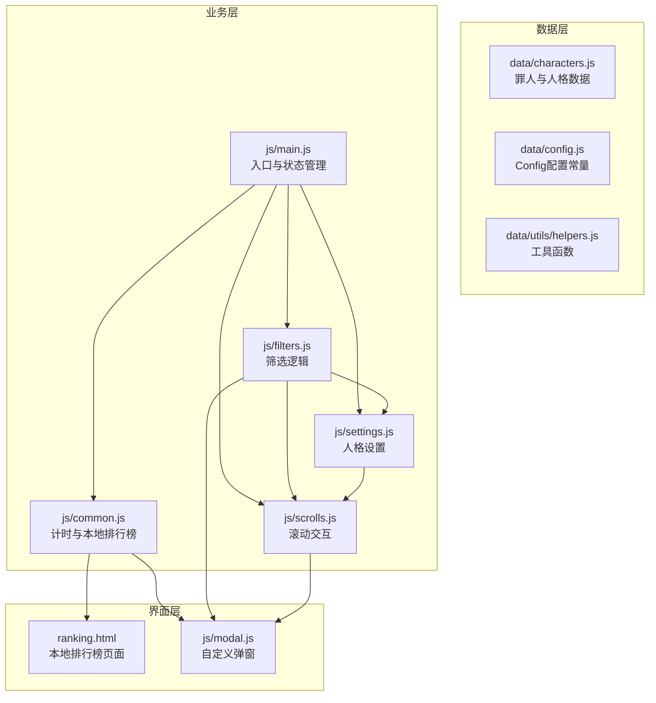
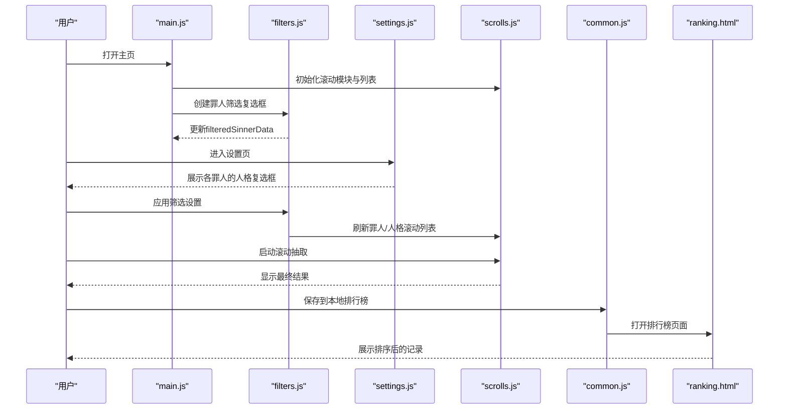
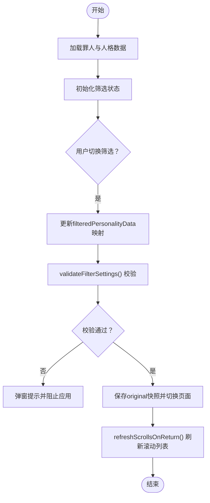
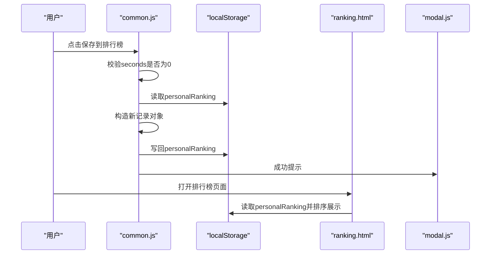
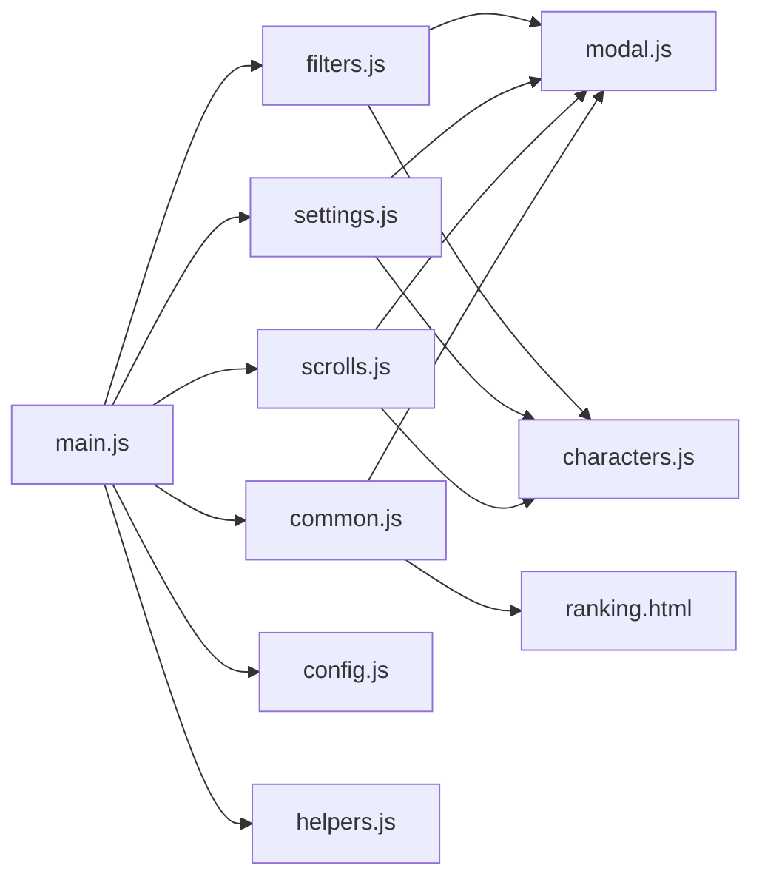

# 数据模型

<cite>
**本文引用的文件**
- [data/characters.js](file://data/characters.js)
- [data/config.js](file://data/config.js)
- [data/utils/helpers.js](file://data/utils/helpers.js)
- [js/main.js](file://js/main.js)
- [js/filters.js](file://js/filters.js)
- [js/settings.js](file://js/settings.js)
- [js/scrolls.js](file://js/scrolls.js)
- [js/common.js](file://js/common.js)
- [ranking.html](file://ranking.html)
- [js/modal.js](file://js/modal.js)
</cite>

## 目录
1. [简介](#简介)
2. [项目结构](#项目结构)
3. [核心数据模型](#核心数据模型)
4. [架构总览](#架构总览)
5. [组件与数据流详解](#组件与数据流详解)
6. [依赖关系分析](#依赖关系分析)
7. [性能与可用性考量](#性能与可用性考量)
8. [故障排查指南](#故障排查指南)
9. [结论](#结论)

## 简介
本文件系统性梳理应用中的数据结构设计，重点覆盖：
- 罪人数据模型：字段定义、12位罪人的基本信息与人格列表
- 人格对象的属性与筛选显示逻辑
- 配置常量Config对滚动与界面行为的影响
- 本地排行榜记录的数据格式与校验、错误处理机制

## 项目结构
应用采用“数据层-业务层-界面层”的分层组织：
- 数据层：罪人与人格数据、配置常量、工具函数
- 业务层：筛选与设置逻辑、滚动交互、计时与排行榜
- 界面层：HTML页面、样式与事件绑定

图表来源
- [js/main.js](file://js/main.js#L1-L120)
- [js/filters.js](file://js/filters.js#L1-L120)
- [js/settings.js](file://js/settings.js#L1-L120)
- [js/scrolls.js](file://js/scrolls.js#L490-L540)
- [js/common.js](file://js/common.js#L150-L220)
- [ranking.html](file://ranking.html#L1-L40)
- [js/modal.js](file://js/modal.js#L1-L60)

章节来源
- [js/main.js](file://js/main.js#L1-L120)
- [data/characters.js](file://data/characters.js#L1-L60)
- [data/config.js](file://data/config.js#L1-L29)

## 核心数据模型

### 罪人数据模型（sinnerData）
- 结构要点
  - 每个罪人对象包含：id、name、avatar、color、personalities 数组
  - personalities 是人格对象数组，每项含 name、avatar
- 12位罪人基本信息
  - 李箱、浮士德、堂吉诃德、良秀、默尔索、鸿璐、希斯克利夫、以实玛利、罗佳、辛克莱、格里高尔、奥提斯
- 人格对象属性
  - name：人格名称（用于显示与筛选）
  - avatar：人格头像（用于显示；加载失败时降级为占位符）

章节来源
- [data/characters.js](file://data/characters.js#L1-L260)

### Config配置对象（Config）
- 滚动与界面
  - itemHeight：每项高度
  - minVisibleRows、maxVisibleRows：最小/最大可见行数
  - scrollSpeed：滚动速度
  - scrollInterval：滚动间隔（毫秒）
  - transitionDuration、transitionType：滚动过渡时长与类型
  - totalHeightMultiplier：循环滚动的总高度乘数
  - defaultPage：默认页面
- 动画
  - highlightAnimationDuration：高亮动画时长
- 数据与消息
  - defaultFilterAll：默认筛选状态（全选）
  - errorMessages.noPersonasSelected：未选择人格时的提示文案

章节来源
- [data/config.js](file://data/config.js#L1-L29)

### 本地排行榜记录（localStorage）
- 存储键：personalRanking
- 记录结构
  - time：用时（秒）
  - comment：玩家备注
  - timestamp：记录时间（ISO字符串）
  - sinner：选中的罪人信息（name、avatar）
  - persona：选中的人格信息（name、avatar）
- 展示与排序
  - 页面按用时升序排列
  - 时间格式化为 HH:MM:SS
  - 支持清空全部记录

章节来源
- [js/common.js](file://js/common.js#L160-L210)
- [ranking.html](file://ranking.html#L36-L70)

## 架构总览
应用围绕“罪人-人格”双滚动选择与筛选展开，结合计时器与本地排行榜形成完整闭环。

图表来源
- [js/main.js](file://js/main.js#L150-L210)
- [js/filters.js](file://js/filters.js#L159-L184)
- [js/settings.js](file://js/settings.js#L60-L120)
- [js/scrolls.js](file://js/scrolls.js#L499-L529)
- [js/common.js](file://js/common.js#L160-L210)
- [ranking.html](file://ranking.html#L36-L70)

## 组件与数据流详解

### 罪人与人格数据流
- 数据来源：data/characters.js 提供 sinnerData
- 筛选状态：
  - window.filteredSinnerData：当前筛选后的罪人数组
  - window.filteredPersonalityData：按罪人id索引的人格布尔映射（索引为true表示保留）
  - window.originalFilteredSinnerData / originalFilteredPersonalityData：初始筛选快照
- 选择流程：
  - 用户在设置页为每个罪人的人格勾选/反选
  - filters.js.validateFilterSettings() 校验：至少选一个罪人；每个罪人至少选一个人格
  - 应用筛选后，scrolls.js 刷新滚动列表，按布尔映射过滤人格

图表来源
- [js/filters.js](file://js/filters.js#L117-L166)
- [js/filters.js](file://js/filters.js#L160-L184)
- [js/scrolls.js](file://js/scrolls.js#L499-L529)

章节来源
- [js/filters.js](file://js/filters.js#L117-L166)
- [js/filters.js](file://js/filters.js#L160-L184)
- [js/scrolls.js](file://js/scrolls.js#L499-L529)

### Config对滚动与界面行为的影响
- 滚动参数
  - scrollSpeed、scrollInterval 控制滚动速率与节拍
  - transitionDuration、transitionType 控制滚动过渡动画
  - totalHeightMultiplier 用于循环滚动的总高度计算
  - itemHeight、minVisibleRows、maxVisibleRows 影响可视区域与滚动范围
- 界面参数
  - defaultPage 决定初始页面
  - highlightAnimationDuration 控制高亮动画时长
- 数据参数
  - defaultFilterAll 作为默认筛选状态（全选）

章节来源
- [data/config.js](file://data/config.js#L1-L29)
- [js/main.js](file://js/main.js#L67-L78)

### 本地排行榜数据格式与校验
- 数据格式
  - time：数字（秒）
  - comment：字符串（备注）
  - timestamp：ISO字符串
  - sinner/persona：对象（name、avatar），任一存在即可
- 保存流程
  - common.js.saveToLocalRanking() 读取 localStorage，追加新记录，写回
  - 若 seconds 为0，弹窗提示“请先完成一次游戏计时”
- 错误处理
  - try/catch 包裹保存过程，捕获异常并通过自定义弹窗反馈
  - 清空记录前二次确认

图表来源
- [js/common.js](file://js/common.js#L160-L210)
- [ranking.html](file://ranking.html#L36-L70)
- [js/modal.js](file://js/modal.js#L74-L106)

章节来源
- [js/common.js](file://js/common.js#L160-L210)
- [ranking.html](file://ranking.html#L36-L70)
- [js/modal.js](file://js/modal.js#L74-L106)

## 依赖关系分析

图表来源
- [js/main.js](file://js/main.js#L1-L120)
- [js/filters.js](file://js/filters.js#L1-L60)
- [js/settings.js](file://js/settings.js#L1-L60)
- [js/scrolls.js](file://js/scrolls.js#L490-L540)
- [js/common.js](file://js/common.js#L150-L220)
- [ranking.html](file://ranking.html#L1-L40)
- [js/modal.js](file://js/modal.js#L1-L60)
- [data/characters.js](file://data/characters.js#L1-L60)
- [data/config.js](file://data/config.js#L1-L29)
- [data/utils/helpers.js](file://data/utils/helpers.js#L1-L45)

章节来源
- [js/main.js](file://js/main.js#L1-L120)
- [js/filters.js](file://js/filters.js#L1-L60)
- [js/settings.js](file://js/settings.js#L1-L60)
- [js/scrolls.js](file://js/scrolls.js#L490-L540)
- [js/common.js](file://js/common.js#L150-L220)
- [ranking.html](file://ranking.html#L1-L40)
- [js/modal.js](file://js/modal.js#L1-L60)
- [data/characters.js](file://data/characters.js#L1-L60)
- [data/config.js](file://data/config.js#L1-L29)
- [data/utils/helpers.js](file://data/utils/helpers.js#L1-L45)

## 性能与可用性考量
- 滚动性能
  - scrollSpeed、scrollInterval、transitionDuration共同决定滚动体验与性能平衡
  - itemHeight、minVisibleRows、maxVisibleRows 控制可视区域大小，减少DOM节点数量
- 防抖与节流
  - helpers.js 提供防抖与节流工具，可用于优化高频事件（如窗口尺寸变化、滚动事件）
- 数据一致性
  - filters.js 对“未显式设置的人格筛选”采用“默认全选”的策略，避免遗漏
  - validateFilterSettings() 在应用筛选前进行强约束，防止无效状态进入滚动模块

章节来源
- [data/config.js](file://data/config.js#L1-L29)
- [data/utils/helpers.js](file://data/utils/helpers.js#L1-L45)
- [js/filters.js](file://js/filters.js#L117-L166)

## 故障排查指南
- “请至少选择一个人格”的提示
  - 触发条件：validateFilterSettings() 发现某罪人的人格筛选映射中，所有索引均为 false 或未设置
  - 处理建议：在设置页为该罪人至少勾选一个选项
- “请先选择一个罪人”的提示
  - 触发条件：滚动前未选择任何罪人或仅剩一个罪人且未自动选中
  - 处理建议：在筛选页勾选至少一个罪人，或让应用自动选中唯一罪人
- 保存失败
  - 触发条件：JSON序列化/写入localStorage异常
  - 处理建议：检查浏览器存储权限与容量，清理缓存后重试
- 图片加载失败
  - 触发条件：罪人或人格头像URL不可达
  - 处理建议：设置占位符（字符“?”）并提示用户更换头像

章节来源
- [js/filters.js](file://js/filters.js#L117-L166)
- [js/scrolls.js](file://js/scrolls.js#L499-L529)
- [js/common.js](file://js/common.js#L160-L210)
- [js/filters.js](file://js/filters.js#L1-L60)
- [js/settings.js](file://js/settings.js#L160-L210)

## 结论
本应用以清晰的数据模型与严格的筛选校验为基础，结合可配置的滚动参数与本地排行榜机制，实现了稳定、直观且可扩展的“罪人-人格”抽取体验。通过统一的状态管理与错误处理，保证了在复杂交互下的可用性与一致性。