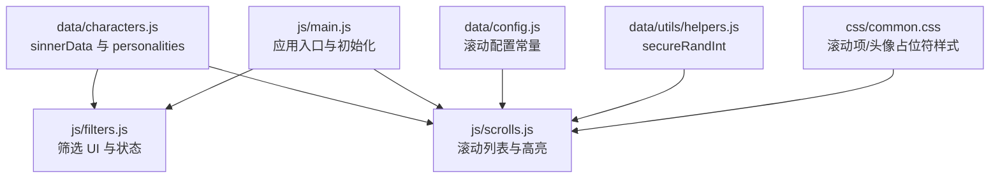
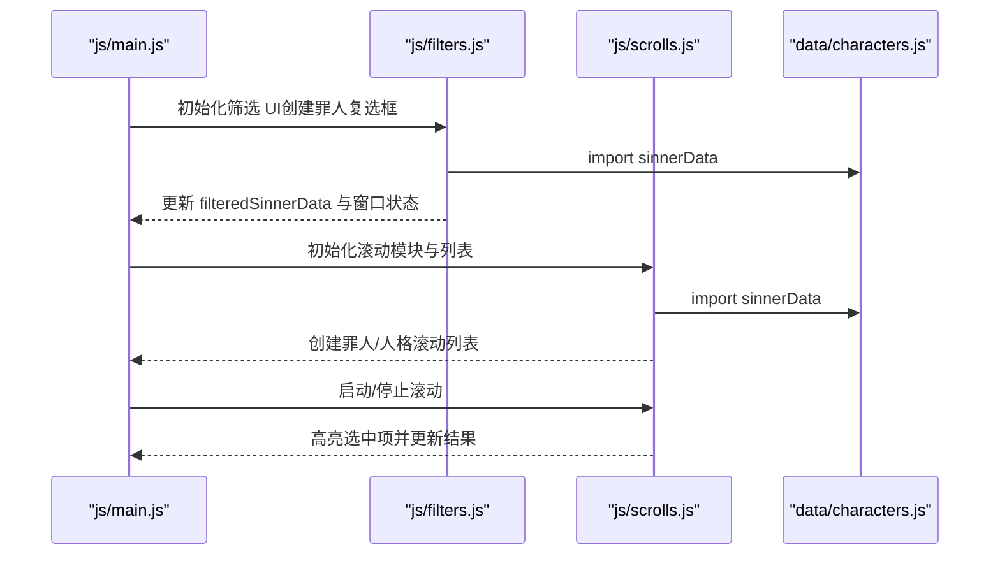
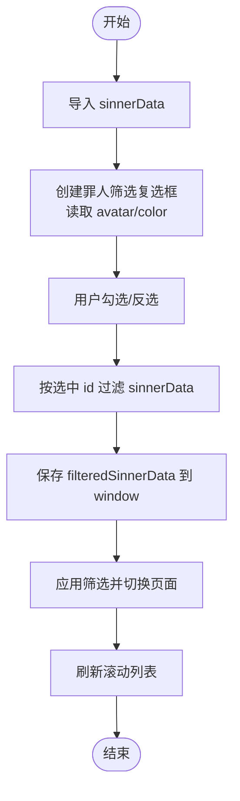
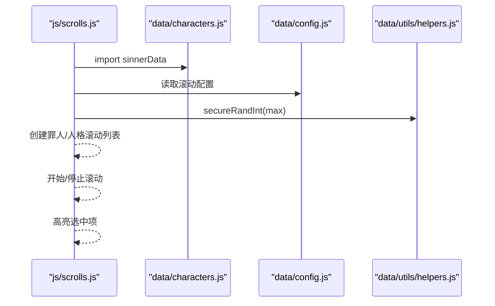
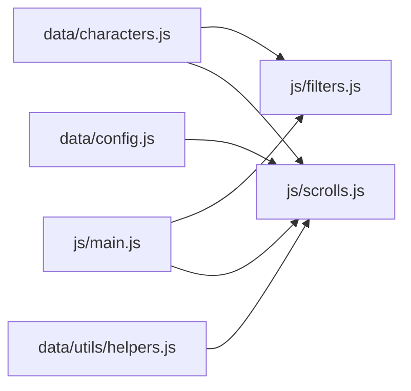

# 罪人数据结构

<cite>
**本文引用的文件**
- [data/characters.js](file://data/characters.js)
- [js/filters.js](file://js/filters.js)
- [js/scrolls.js](file://js/scrolls.js)
- [js/main.js](file://js/main.js)
- [data/config.js](file://data/config.js)
- [data/utils/helpers.js](file://data/utils/helpers.js)
- [README.md](file://README.md)
- [css/common.css](file://css/common.css)
</cite>

## 目录
1. [简介](#简介)
2. [项目结构](#项目结构)
3. [核心组件](#核心组件)
4. [架构总览](#架构总览)
5. [详细组件分析](#详细组件分析)
6. [依赖关系分析](#依赖关系分析)
7. [性能考量](#性能考量)
8. [故障排查指南](#故障排查指南)
9. [结论](#结论)
10. [附录](#附录)

## 简介
本文件系统性梳理“sinnerData 数组”的结构设计与使用方式，重点说明：
- 每位罪人对象的 id、name、avatar、color 字段的用途与在 UI 中的应用
- personalities 数组如何存储每位罪人的人格列表
- 12 位罪人的基本信息与人格数量统计
- filters.js 与 scrolls.js 如何基于该数据结构进行筛选与滚动展示
- avatar 路径命名规范与资源组织逻辑
- color 字段在主题样式中的继承与使用
- 数据扩展指南：如何安全地添加新罪人或人格而不破坏现有功能

## 项目结构
围绕罪人数据结构的关键文件与职责如下：
- data/characters.js：存放 sinnerData 与 personalities 的完整定义
- js/filters.js：负责罪人筛选 UI 的创建与筛选状态管理
- js/scrolls.js：负责罪人与人格滚动列表的创建、滚动与高亮
- js/main.js：应用入口，初始化滚动模块、筛选状态与页面导航
- data/config.js：滚动与界面配置常量
- data/utils/helpers.js：安全随机数等工具函数
- css/common.css：滚动项、头像占位符、高亮等通用样式

图表来源
- [data/characters.js](file://data/characters.js#L1-L260)
- [js/filters.js](file://js/filters.js#L1-L274)
- [js/scrolls.js](file://js/scrolls.js#L1-L718)
- [js/main.js](file://js/main.js#L1-L261)
- [data/config.js](file://data/config.js#L1-L29)
- [data/utils/helpers.js](file://data/utils/helpers.js#L1-L45)
- [css/common.css](file://css/common.css#L1-L200)

章节来源
- [README.md](file://README.md#L1-L121)

## 核心组件
- sinnerData：包含 12 位罪人的完整数组，每条记录包含 id、name、avatar、color、personalities
- personalities：每个罪人对应的多个人格对象数组，每个对象包含 name 与 avatar
- 过滤与滚动模块：filters.js 与 scrolls.js 通过导入 sinnerData 来构建 UI 与交互

章节来源
- [data/characters.js](file://data/characters.js#L1-L260)
- [js/filters.js](file://js/filters.js#L1-L120)
- [js/scrolls.js](file://js/scrolls.js#L46-L111)

## 架构总览
sinnerData 作为数据层的核心，向上游模块提供：
- 罪人基础信息（id/name/avatar/color）
- 每位罪人的人格集合（personalities）
- filters.js 与 scrolls.js 通过导入该数据进行筛选与滚动展示

图表来源
- [js/main.js](file://js/main.js#L160-L206)
- [js/filters.js](file://js/filters.js#L16-L57)
- [js/scrolls.js](file://js/scrolls.js#L46-L111)
- [data/characters.js](file://data/characters.js#L1-L260)

## 详细组件分析

### sinnerData 结构设计与字段用途
- id：罪人的唯一标识，用于筛选状态映射与滚动定位
- name：罪人的显示名称
- avatar：罪人头像资源路径，支持 .jpg 与 .webp
- color：罪人主题色，用于筛选 UI 的头像占位符背景色
- personalities：该罪人的人格列表，每项含 name 与 avatar

字段在 UI 中的应用：
- 罪人筛选复选框：使用 avatar 展示头像，否则使用 color 生成圆形占位符
- 滚动列表：罪人与人格项均以头像 + 名称形式展示；头像加载失败时统一降级为圆形占位符

章节来源
- [data/characters.js](file://data/characters.js#L1-L260)
- [js/filters.js](file://js/filters.js#L7-L13)
- [js/scrolls.js](file://js/scrolls.js#L70-L100)

### 12 位罪人基本信息与人格数量
- 李箱：14 个人格
- 浮士德：13 个人格
- 堂吉诃德：13 个人格
- 良秀：13 个人格
- 默尔索：13 个人格
- 鸿璐：13 个人格
- 希斯克利夫：14 个人格
- 以实玛利：13 个人格
- 罗佳：13 个人格
- 辛克莱：14 个人格
- 格里高尔：13 个人格
- 奥提斯：13 个人格

章节来源
- [data/characters.js](file://data/characters.js#L1-L260)

### filters.js 对 sinnerData 的使用
- 创建筛选 UI：遍历 sinnerData，生成罪人复选框，读取 avatar 与 color
- 更新筛选状态：根据复选框选中情况过滤出 filteredSinnerData
- 应用筛选：保存当前筛选为原始状态，切换页面并刷新滚动列表
- 验证筛选：确保每个罪人至少选择一个人格（缺省为“所有人格均被选中”）

图表来源
- [js/filters.js](file://js/filters.js#L16-L101)
- [js/filters.js](file://js/filters.js#L160-L200)

章节来源
- [js/filters.js](file://js/filters.js#L16-L101)
- [js/filters.js](file://js/filters.js#L160-L200)

### scrolls.js 对 sinnerData 的使用
- 初始化滚动模块：接收 DOM 元素与全局状态（包含 sinnerData）
- 创建罪人滚动列表：复制 items 以实现平滑循环滚动，支持字符串或对象数组
- 创建人格滚动列表：根据当前选中罪人的人格集合过滤并展示
- 滚动与停止：使用 Config 配置控制滚动速度与过渡；使用 secureRandInt 实现随机选择
- 高亮选中项：通过 dataset.originalIndex 匹配并添加 selected 类

图表来源
- [js/scrolls.js](file://js/scrolls.js#L1-L718)
- [data/characters.js](file://data/characters.js#L1-L260)
- [data/config.js](file://data/config.js#L1-L29)
- [data/utils/helpers.js](file://data/utils/helpers.js#L1-L45)

章节来源
- [js/scrolls.js](file://js/scrolls.js#L46-L111)
- [js/scrolls.js](file://js/scrolls.js#L114-L279)
- [js/scrolls.js](file://js/scrolls.js#L281-L478)
- [js/scrolls.js](file://js/scrolls.js#L480-L718)

### avatar 路径命名规范与资源组织逻辑
- 资源目录：assets/images/[角色名]/ 下存放头像
- 支持格式：.jpg 与 .webp
- 加载失败降级：当头像加载失败时，统一显示带背景色的问号占位符
- 命名建议：以角色英文名或中文名作为子目录，文件名包含角色名与特征标识（如 LCB、W、Seven 等），便于区分不同形态与人格

章节来源
- [README.md](file://README.md#L66-L71)
- [js/filters.js](file://js/filters.js#L32-L47)
- [js/scrolls.js](file://js/scrolls.js#L80-L99)
- [js/scrolls.js](file://js/scrolls.js#L216-L242)

### color 字段在主题样式中的继承与使用
- 筛选 UI：filters.js 在创建头像占位符时使用 sinner.color 作为背景色
- 滚动 UI：滚动列表项本身不直接使用 color，但整体主题色统一采用金色系（见 common.css），与 color 字段形成视觉呼应
- 样式类：common.css 定义了滚动项、头像占位符、高亮等通用样式，保证跨模块一致性

章节来源
- [js/filters.js](file://js/filters.js#L7-L13)
- [css/common.css](file://css/common.css#L102-L137)
- [css/common.css](file://css/common.css#L120-L127)

## 依赖关系分析
- 数据依赖：filters.js 与 scrolls.js 均依赖 data/characters.js 提供的 sinnerData
- 配置依赖：scrolls.js 依赖 data/config.js 的滚动参数
- 工具依赖：scrolls.js 依赖 data/utils/helpers.js 的安全随机数函数
- 入口依赖：js/main.js 负责初始化滚动模块、筛选状态与页面导航，并在应用生命周期中协调各模块

图表来源
- [data/characters.js](file://data/characters.js#L1-L260)
- [js/filters.js](file://js/filters.js#L1-L274)
- [js/scrolls.js](file://js/scrolls.js#L1-L718)
- [data/config.js](file://data/config.js#L1-L29)
- [data/utils/helpers.js](file://data/utils/helpers.js#L1-L45)
- [js/main.js](file://js/main.js#L1-L261)

章节来源
- [js/main.js](file://js/main.js#L160-L206)

## 性能考量
- 滚动循环：通过复制 items 并乘以固定倍数实现平滑循环，避免卡顿
- 过渡动画：使用较短过渡时长与线性过渡类型，提升滚动流畅度
- 随机选择：使用安全随机数生成函数，保证随机性与稳定性
- DOM 更新：在滚动停止后延迟高亮，确保 DOM 更新完成再执行高亮逻辑

章节来源
- [data/config.js](file://data/config.js#L1-L29)
- [data/utils/helpers.js](file://data/utils/helpers.js#L1-L45)
- [js/scrolls.js](file://js/scrolls.js#L281-L478)
- [js/scrolls.js](file://js/scrolls.js#L480-L718)

## 故障排查指南
- 头像加载失败：检查 avatar 路径是否正确且资源存在；确认 assets/images 目录结构与文件名
- 筛选后无可用人格：filters.js 的验证逻辑会提示至少为每位罪人选择一个人格；检查 filteredPersonalityData 的映射
- 滚动无响应：确认 Config 配置项有效；检查滚动按钮事件绑定是否成功
- 随机选择异常：确认 secureRandInt 返回值范围与边界条件

章节来源
- [js/filters.js](file://js/filters.js#L118-L157)
- [js/scrolls.js](file://js/scrolls.js#L480-L718)
- [data/utils/helpers.js](file://data/utils/helpers.js#L1-L45)

## 结论
sinnerData 以简洁而清晰的结构承载了 12 位罪人与其人格的完整信息，配合 filters.js 与 scrolls.js 的模块化实现，形成了稳定、可扩展的筛选与滚动展示体系。通过统一的资源命名规范与样式约定，项目在视觉与交互层面保持一致性和可维护性。

## 附录

### 数据扩展指南：安全添加新罪人或人格
- 新增罪人步骤
  1) 在 data/characters.js 的 sinnerData 数组末尾追加一条记录，填写 id、name、avatar、color、personalities
  2) 为该罪人准备头像资源，放置于 assets/images/[角色名]/ 目录，命名包含角色名与特征标识
  3) 确认 avatar 路径正确，支持 .jpg 与 .webp
  4) 若需在筛选 UI 中显示颜色占位符，确保 color 字段有效
  5) 保存后在 filters.js 与 scrolls.js 中无需额外改动即可生效
- 新增人格步骤
  1) 在对应罪人的 personalities 数组中追加一项，包含 name 与 avatar
  2) 准备对应的人格头像资源，命名与现有风格保持一致
  3) 保存后在 filters.js 的筛选验证与 scrolls.js 的滚动列表中将自动识别
- 注意事项
  - id 必须唯一且与筛选状态映射一致
  - 若未设置某罪人的人格筛选映射，默认视为“所有人格均被选中”
  - 头像加载失败将自动降级为占位符，不影响整体功能

章节来源
- [data/characters.js](file://data/characters.js#L1-L260)
- [js/filters.js](file://js/filters.js#L118-L157)
- [js/scrolls.js](file://js/scrolls.js#L374-L396)
- [js/scrolls.js](file://js/scrolls.js#L466-L478)