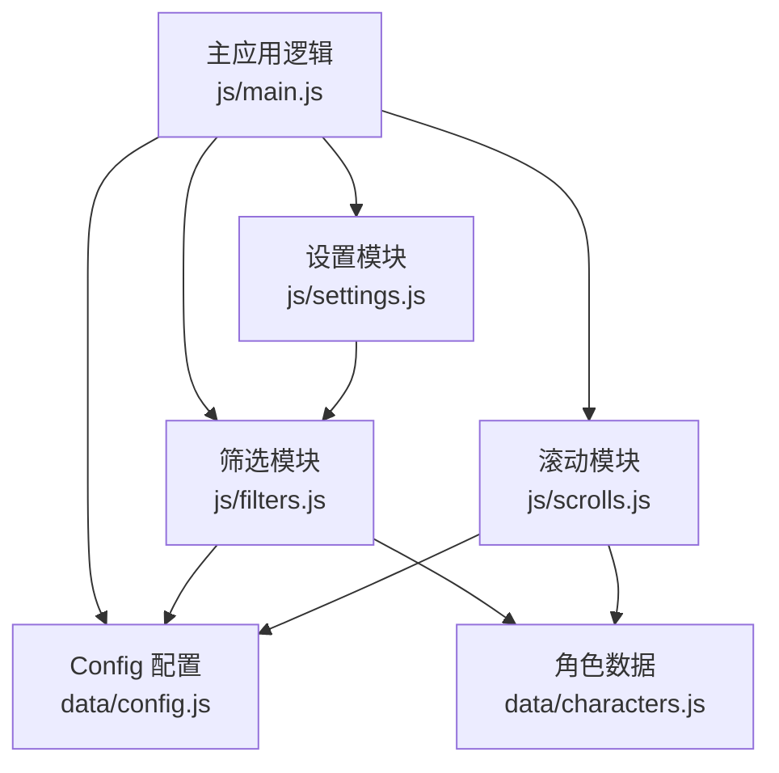
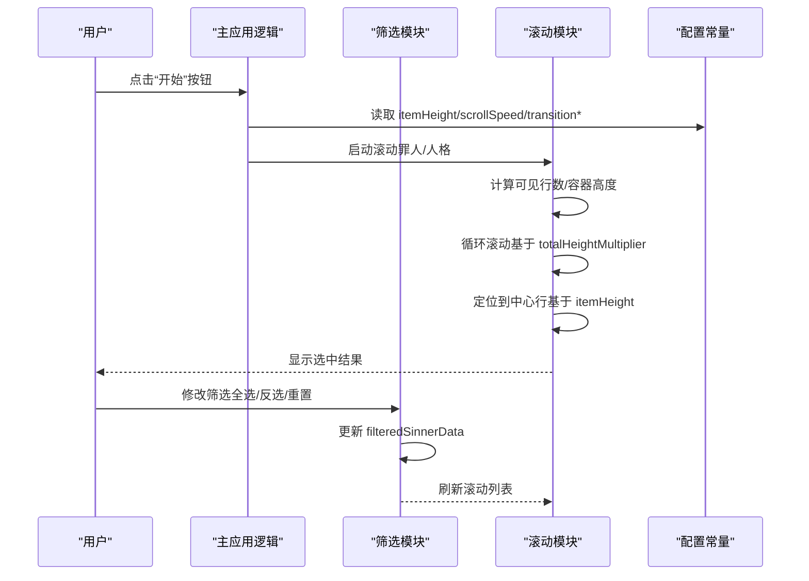
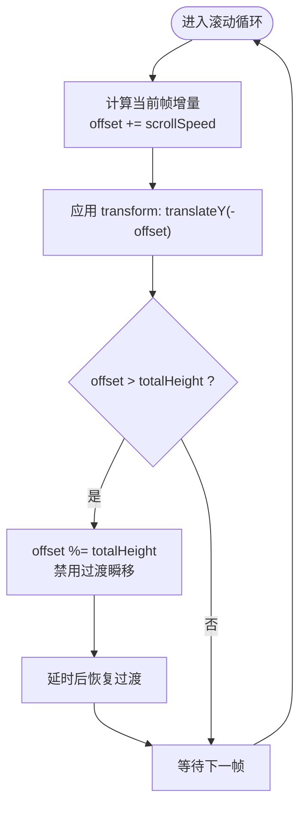
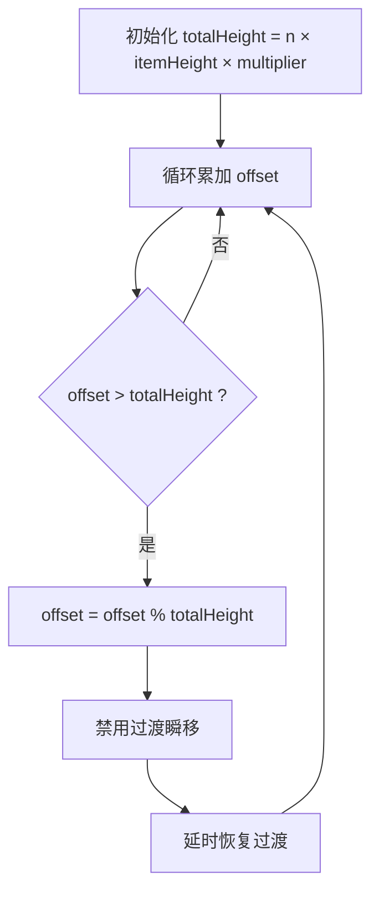
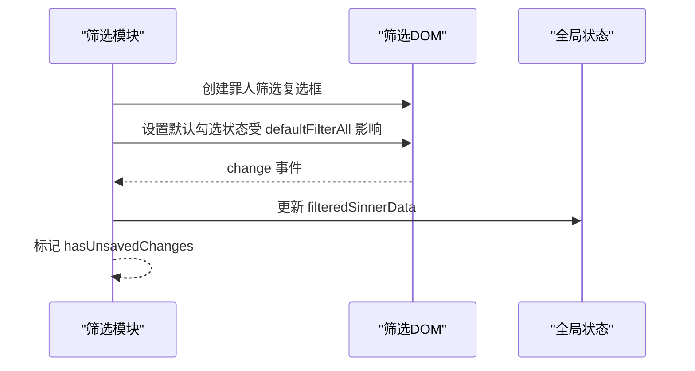
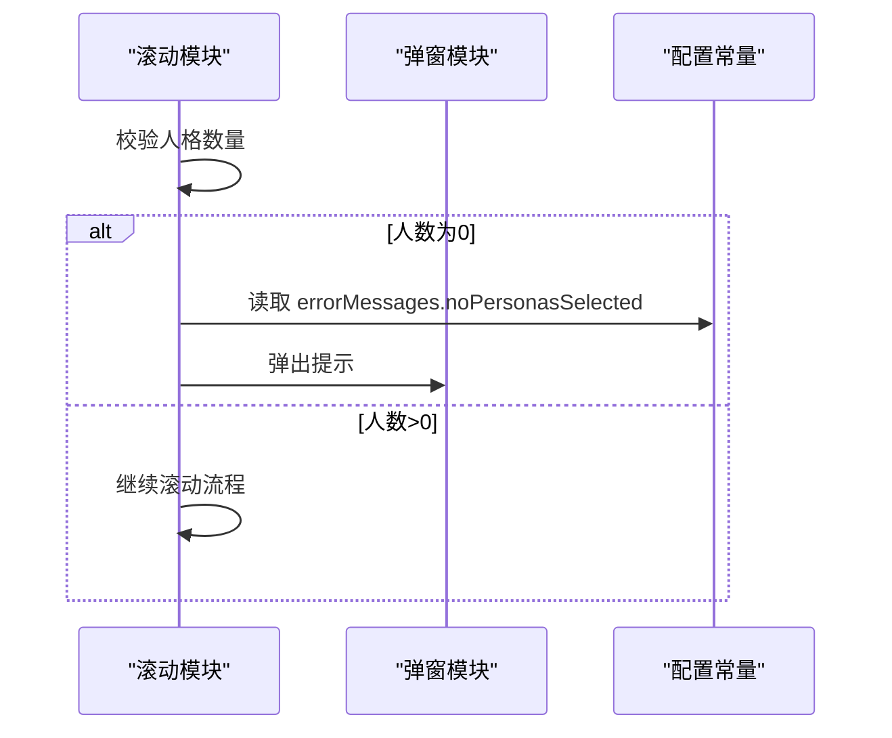
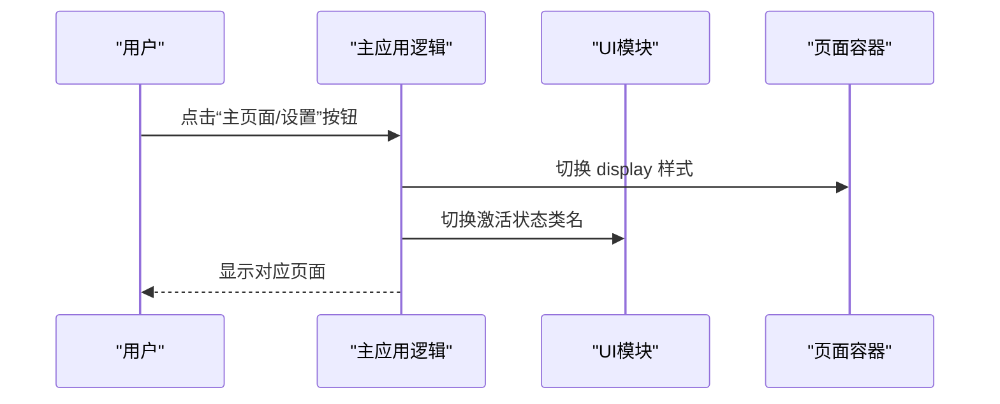
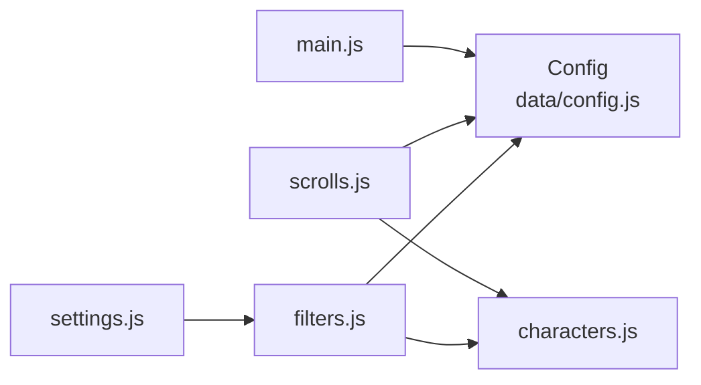

# 配置数据结构

<cite>
**本文引用的文件**
- [data/config.js](file://data/config.js)
- [js/scrolls.js](file://js/scrolls.js)
- [js/main.js](file://js/main.js)
- [js/filters.js](file://js/filters.js)
- [js/settings.js](file://js/settings.js)
- [data/characters.js](file://data/characters.js)
- [README.md](file://README.md)
</cite>

## 目录
1. [简介](#简介)
2. [项目结构](#项目结构)
3. [核心组件](#核心组件)
4. [架构概览](#架构概览)
5. [详细组件分析](#详细组件分析)
6. [依赖分析](#依赖分析)
7. [性能考虑](#性能考虑)
8. [故障排查指南](#故障排查指南)
9. [结论](#结论)
10. [附录](#附录)

## 简介
本文件围绕 Config 对象的各项配置参数展开，系统性解析其技术含义与运行时影响，重点覆盖：
- itemHeight、scrollSpeed、transitionDuration 等参数如何共同控制滚动动画行为
- defaultFilterAll 如何决定初始筛选状态
- errorMessages 如何支持国际化错误提示
- totalHeightMultiplier 在实现无缝循环滚动中的数学原理与实际应用
- defaultPage 在页面路由中的作用机制
并提供配置修改建议，包括性能调优范围（如 scrollInterval 最小安全值）与用户体验优化策略。

## 项目结构
该项目采用模块化组织，配置集中在 data/config.js，滚动交互在 js/scrolls.js，筛选与设置在 js/filters.js 与 js/settings.js，入口逻辑在 js/main.js，角色数据在 data/characters.js。

图表来源
- [data/config.js](file://data/config.js#L1-L29)
- [js/main.js](file://js/main.js#L1-L261)
- [js/scrolls.js](file://js/scrolls.js#L1-L718)
- [js/filters.js](file://js/filters.js#L1-L274)
- [js/settings.js](file://js/settings.js#L1-L263)
- [data/characters.js](file://data/characters.js#L1-L200)

章节来源
- [README.md](file://README.md#L1-L121)

## 核心组件
本节聚焦 Config 对象的关键参数及其在运行时的作用。

- itemHeight
  - 含义：每条滚动项的高度（像素）。用于计算容器高度、定位中心行、以及循环滚动的总高度。
  - 运行时影响：直接影响可见行数计算、容器尺寸、定位偏移量与循环边界。
  - 关键使用点：
    - 容器高度计算：容器高度 = 可见行数 × itemHeight
    - 定位偏移量：目标偏移 = 索引 × itemHeight
    - 循环总高度：totalHeight = 项目数 × itemHeight × totalHeightMultiplier

- scrollSpeed
  - 含义：每次滚动步进的速度（像素/帧），配合 scrollInterval 控制滚动速率。
  - 运行时影响：越大滚动越快，视觉上更“冲”，但可能降低精度与稳定性。
  - 关键使用点：滚动循环中累加 offset，驱动 translateY 变换。

- transitionDuration
  - 含义：CSS 过渡时长，用于平滑定位与快速滚动阶段的过渡。
  - 运行时影响：影响定位动画的顺滑度与视觉节奏；过短可能卡顿，过长显得拖沓。
  - 关键使用点：快速滚动阶段设置 transform 过渡；定位阶段使用不同缓动曲线与时长。

- transitionType
  - 含义：CSS 过渡类型（如 linear），用于快速滚动阶段的线性插值。
  - 运行时影响：线性过渡保证滚动均匀，避免非线性导致的“加速/减速”感。
  - 关键使用点：快速滚动阶段设置 transition 属性。

- totalHeightMultiplier
  - 含义：循环滚动的总高度倍数，用于构造足够长的虚拟列表以实现无缝循环。
  - 数学原理：totalHeight = 项目数 × itemHeight × totalHeightMultiplier。当 offset 超过 totalHeight 时，通过取模重置 offset，并短暂禁用过渡以“瞬移”回起点，再恢复过渡，形成无缝循环。
  - 关键使用点：罪人滚动与人格滚动均使用该参数计算循环边界。

- defaultFilterAll
  - 含义：初始筛选状态是否默认全选。
  - 运行时影响：初始化时控制罪人筛选复选框的勾选状态，从而决定初始窗口 filteredSinnerData 的内容。
  - 关键使用点：filters.js 中创建筛选复选框时使用该值设置默认勾选。

- errorMessages
  - 含义：错误提示文案集合，支持国际化（当前为中文）。
  - 运行时影响：在滚动前校验“至少选择一个罪人/人格”等前置条件，弹窗提示用户。
  - 关键使用点：scrolls.js 中在人格滚动前校验并弹出错误消息。

- defaultPage
  - 含义：默认页面标识，用于页面路由切换。
  - 运行时影响：在页面导航事件中根据该标识切换主页面与设置页面的显示状态。
  - 关键使用点：main.js 中页面切换逻辑使用该值。

章节来源
- [data/config.js](file://data/config.js#L1-L29)
- [js/filters.js](file://js/filters.js#L16-L101)
- [js/scrolls.js](file://js/scrolls.js#L281-L322)
- [js/scrolls.js](file://js/scrolls.js#L560-L570)
- [js/main.js](file://js/main.js#L82-L115)

## 架构概览
Config 参数贯穿筛选、滚动与页面路由三大模块，形成“配置驱动”的行为控制链路。

图表来源
- [js/main.js](file://js/main.js#L160-L203)
- [js/filters.js](file://js/filters.js#L16-L101)
- [js/scrolls.js](file://js/scrolls.js#L281-L322)
- [data/config.js](file://data/config.js#L1-L29)

## 详细组件分析

### 滚动动画参数：itemHeight、scrollSpeed、transitionDuration、transitionType
- itemHeight
  - 用于容器高度与定位偏移量的计算，确保“中心行”对齐与视觉稳定。
  - 在创建滚动列表时，容器高度 = 可见行数 × itemHeight；定位时 targetOffset = 索引 × itemHeight。
- scrollSpeed
  - 在快速滚动阶段，每 scrollInterval 帧增加 offset，驱动 translateY 变换。
  - 与 scrollInterval 协同决定滚动速率：速度越快，单位时间内位移越大。
- transitionDuration 与 transitionType
  - 快速滚动阶段使用线性过渡，保证均匀滚动；
  - 定位阶段使用缓动曲线与较长时长，提升视觉顺滑度。

图表来源
- [js/scrolls.js](file://js/scrolls.js#L304-L321)
- [data/config.js](file://data/config.js#L9-L13)

章节来源
- [js/scrolls.js](file://js/scrolls.js#L281-L322)
- [js/scrolls.js](file://js/scrolls.js#L560-L570)
- [data/config.js](file://data/config.js#L9-L13)

### 无缝循环滚动：totalHeightMultiplier 的数学原理与应用
- 数学原理
  - totalHeight = 项目数 × itemHeight × totalHeightMultiplier
  - 当 offset > totalHeight 时，offset = offset % totalHeight，使滚动“回到起点”，并短暂禁用过渡以瞬移，再恢复过渡，形成无缝循环。
- 实际应用
  - 罪人滚动：使用 Config.totalHeightMultiplier 计算 totalHeight，并在循环中重置 offset。
  - 人格滚动：在循环中同样使用 totalHeight（虽然代码中直接写死了 5，但与 Config 的设计理念一致）。

图表来源
- [js/scrolls.js](file://js/scrolls.js#L311-L321)
- [js/scrolls.js](file://js/scrolls.js#L560-L569)
- [data/config.js](file://data/config.js#L13-L13)

章节来源
- [js/scrolls.js](file://js/scrolls.js#L311-L321)
- [js/scrolls.js](file://js/scrolls.js#L560-L569)
- [data/config.js](file://data/config.js#L13-L13)

### 初始筛选状态：defaultFilterAll 的作用机制
- defaultFilterAll 决定筛选复选框的初始勾选状态，从而影响 window.filteredSinnerData 的初始内容。
- filters.js 在创建筛选复选框时使用该值设置默认勾选，随后调用 updateFilteredSinnerData 初始化筛选数据。
- 若 defaultFilterAll 为 true，则初始包含所有罪人；反之则为空集，需用户手动勾选。

图表来源
- [js/filters.js](file://js/filters.js#L16-L57)
- [js/filters.js](file://js/filters.js#L60-L101)
- [data/config.js](file://data/config.js#L22-L22)

章节来源
- [js/filters.js](file://js/filters.js#L16-L57)
- [js/filters.js](file://js/filters.js#L60-L101)
- [data/config.js](file://data/config.js#L22-L22)

### 国际化错误提示：errorMessages 的使用
- errorMessages 提供错误文案集合，当前包含“至少选择一个人格”的提示。
- scrolls.js 在人格滚动前校验“至少选择一个人格”，若不满足则弹窗提示。
- 若需国际化，可在 Config 中扩展多语言映射，并在弹窗处按语言选择对应文案。

图表来源
- [js/scrolls.js](file://js/scrolls.js#L532-L534)
- [data/config.js](file://data/config.js#L25-L28)

章节来源
- [js/scrolls.js](file://js/scrolls.js#L532-L534)
- [data/config.js](file://data/config.js#L25-L28)

### 页面路由：defaultPage 的作用机制
- defaultPage 用于页面切换逻辑，main.js 中通过按钮事件切换主页面与设置页面的显示状态。
- 切换时根据 defaultPage 的值设置当前激活页签，并调用 UI 初始化与滚动刷新逻辑。

图表来源
- [js/main.js](file://js/main.js#L82-L115)

章节来源
- [js/main.js](file://js/main.js#L82-L115)

## 依赖分析
- Config 作为单一事实来源，被 main.js、scrolls.js、filters.js、settings.js 多处导入使用。
- scrolls.js 依赖 Config 的 itemHeight、scrollSpeed、transitionDuration、transitionType、totalHeightMultiplier。
- filters.js 依赖 Config 的 defaultFilterAll 与 errorMessages（间接通过 Modal 与 Config 的组合使用）。
- settings.js 依赖 filters.js 的筛选状态与 DOM 更新。
- characters.js 提供罪人与人格数据，为滚动列表与筛选提供数据基础。

图表来源
- [data/config.js](file://data/config.js#L1-L29)
- [js/main.js](file://js/main.js#L1-L261)
- [js/scrolls.js](file://js/scrolls.js#L1-L718)
- [js/filters.js](file://js/filters.js#L1-L274)
- [js/settings.js](file://js/settings.js#L1-L263)
- [data/characters.js](file://data/characters.js#L1-L200)

章节来源
- [data/config.js](file://data/config.js#L1-L29)
- [js/main.js](file://js/main.js#L1-L261)
- [js/scrolls.js](file://js/scrolls.js#L1-L718)
- [js/filters.js](file://js/filters.js#L1-L274)
- [js/settings.js](file://js/settings.js#L1-L263)
- [data/characters.js](file://data/characters.js#L1-L200)

## 性能考虑
- scrollInterval 最小安全值
  - 当前滚动循环使用固定的时间间隔触发，建议最小值不低于 10ms，以平衡流畅度与 CPU 占用。
  - 过小可能导致帧率抖动与过度重绘，过大则滚动迟滞。
- scrollSpeed 与 transitionDuration 的权衡
  - 速度过快时，建议适当延长 transitionDuration 以维持定位顺滑；线性过渡适合快速滚动，定位阶段可使用缓动曲线。
- totalHeightMultiplier 的取值
  - 建议保持为整数且不小于 5，以确保循环边界清晰、定位稳定；过大将增加 DOM 项数量，需关注内存与渲染压力。
- itemHeight 的一致性
  - 统一 itemHeight 可减少布局抖动与定位误差；若动态变化，需在变更后重新计算容器高度与定位偏移。

[本节为通用性能建议，不直接分析具体文件]

## 故障排查指南
- “至少选择一个人格”提示频繁出现
  - 检查 filters.js 的 validateFilterSettings 是否正确执行，确认 window.filteredPersonalityData 的结构与索引映射。
  - 确认 scrolls.js 在人格滚动前的校验逻辑是否命中。
- 滚动卡顿或跳变
  - 检查 scrollSpeed 与 scrollInterval 的组合是否合理；适当增大 scrollInterval 或减小 scrollSpeed。
  - 确认 transitionDuration 是否过短，定位阶段可适当延长。
- 循环边界不准确
  - 检查 totalHeightMultiplier 的取值与实际项目数是否匹配；确保 offset 重置逻辑生效。
- 初始筛选状态异常
  - 检查 defaultFilterAll 是否正确传入 filters.js 的筛选复选框创建流程。

章节来源
- [js/filters.js](file://js/filters.js#L118-L157)
- [js/scrolls.js](file://js/scrolls.js#L532-L534)
- [js/scrolls.js](file://js/scrolls.js#L304-L321)
- [js/scrolls.js](file://js/scrolls.js#L560-L569)

## 结论
Config 对象通过统一的参数化配置，将滚动动画、筛选状态、错误提示与页面路由等横切关注点解耦，提升了系统的可维护性与可扩展性。totalHeightMultiplier 是实现无缝循环滚动的关键，itemHeight、scrollSpeed、transitionDuration/Type 共同决定了滚动的速率与顺滑度。defaultFilterAll 与 defaultPage 则分别影响初始筛选状态与页面路由行为。建议在性能与体验之间找到平衡点，并在国际化场景下扩展 errorMessages 的多语言支持。

[本节为总结性内容，不直接分析具体文件]

## 附录
- 配置参数一览表（基于当前实现）
  - itemHeight：滚动项高度（像素）
  - scrollSpeed：滚动步进速度（像素/帧）
  - scrollInterval：滚动帧间隔（毫秒）
  - transitionDuration：过渡时长
  - transitionType：过渡类型（如 linear）
  - totalHeightMultiplier：循环总高度倍数
  - defaultFilterAll：初始筛选是否全选
  - errorMessages：错误提示文案集合
  - defaultPage：默认页面标识

[本节为概念性汇总，不直接分析具体文件]