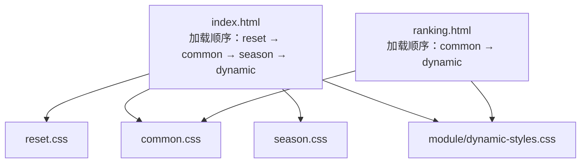
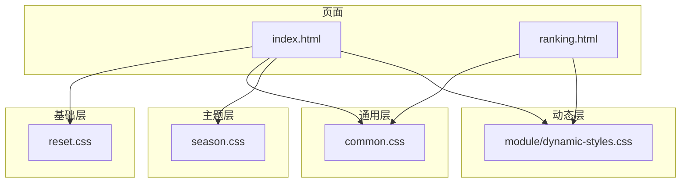
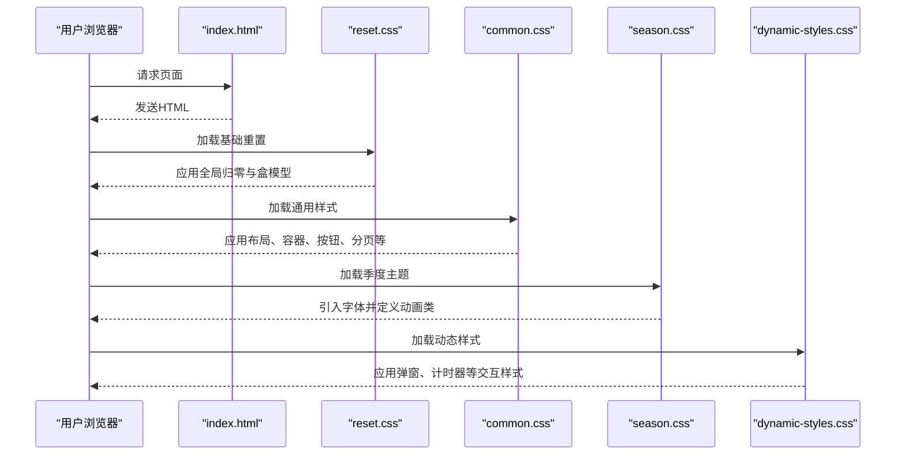

# CSS文件结构

<cite>
**本文引用的文件**
- [reset.css](file://css/reset.css)
- [common.css](file://css/common.css)
- [season.css](file://css/season.css)
- [dynamic-styles.css](file://css/module/dynamic-styles.css)
- [index.html](file://index.html)
- [ranking.html](file://ranking.html)
- [package.json](file://package.json)
</cite>

## 目录
1. [引言](#引言)
2. [项目结构](#项目结构)
3. [核心组件](#核心组件)
4. [架构总览](#架构总览)
5. [详细组件分析](#详细组件分析)
6. [依赖分析](#依赖分析)
7. [性能考虑](#性能考虑)
8. [故障排查指南](#故障排查指南)
9. [结论](#结论)

## 引言
本文件系统化梳理前端样式体系的文件组织结构，重点说明：
- reset.css 如何通过重置所有元素的 margin 和 padding 并统一 box-sizing 模型，消除浏览器默认样式差异，为项目建立一致的渲染基础；
- common.css 的模块化组织方式，包括全局布局、选择器容器、滚动列表、按钮控件、响应式断点等核心样式模块的设计逻辑与复用机制；
- season.css 如何通过 @import 引入 Lora 字体并定义第七赛季特有的动画效果类（如 glowIn），实现动态视觉主题；
- 结合 HTML 结构说明各 CSS 文件的加载顺序与优先级关系，阐述这种分层架构在维护性和扩展性方面的优势。

## 项目结构
样式体系采用“基础重置 + 通用模块 + 季度主题 + 动态样式模块”的分层组织：
- 基础层：reset.css 提供全局样式归一化；
- 通用层：common.css 定义通用布局、组件与交互样式；
- 主题层：season.css 引入字体并定义季度专属动画；
- 动态层：dynamic-styles.css 提供运行时交互组件的样式（计时器弹窗、分页、导航等）。



图表来源
- [index.html](file://index.html#L1-L20)
- [ranking.html](file://ranking.html#L1-L12)

章节来源
- [index.html](file://index.html#L1-L20)
- [ranking.html](file://ranking.html#L1-L12)

## 核心组件
- reset.css：全局重置，统一盒模型，消除跨浏览器差异。
- common.css：通用布局、容器、滚动列表、按钮、分页、导航、指令区、排行榜等模块化样式。
- season.css：引入 Lora 字体，定义季度文本与 glowIn 动画。
- dynamic-styles.css：计时器弹窗、分页、导航按钮、自定义弹窗等动态交互组件样式。

章节来源
- [reset.css](file://css/reset.css#L1-L6)
- [common.css](file://css/common.css#L1-L797)
- [season.css](file://css/season.css#L1-L38)
- [dynamic-styles.css](file://css/module/dynamic-styles.css#L1-L984)

## 架构总览
分层架构的优势：
- 可维护性：基础层独立，主题层与通用层解耦，便于替换或升级；
- 可扩展性：新增功能优先在 dynamic-styles.css 或 common.css 扩展，避免破坏既有样式；
- 可复用性：通用组件（按钮、分页、导航）在多页面复用，减少重复定义；
- 可测试性：通过明确的加载顺序与模块边界，降低样式冲突风险。



图表来源
- [index.html](file://index.html#L1-L20)
- [ranking.html](file://ranking.html#L1-L12)
- [reset.css](file://css/reset.css#L1-L6)
- [common.css](file://css/common.css#L1-L797)
- [season.css](file://css/season.css#L1-L38)
- [dynamic-styles.css](file://css/module/dynamic-styles.css#L1-L984)

## 详细组件分析

### reset.css：全局样式归一化
- 设计目标：统一所有元素的 margin、padding 与 box-sizing，消除浏览器默认样式差异，保证后续样式在不同浏览器中的一致表现。
- 关键点：
  - 对所有元素进行 margin/padding 归零，避免默认外边距与内边距影响布局；
  - 统一 box-sizing 为 border-box，简化宽度计算与边框叠加处理；
  - 作为最底层样式，优先加载以确保其对后续样式具有最高优先级。

章节来源
- [reset.css](file://css/reset.css#L1-L6)
- [index.html](file://index.html#L1-L20)

### common.css：模块化通用样式
- 全局布局与基础排版
  - body 背景渐变、最小高度、内边距等，提供统一的背景与视口适配；
  - container 最大宽度与水平居中，统一页面内容宽度与对齐方式。
- 选择器容器与滚动列表
  - selector-container 与 scroll-container 定义容器边框、圆角、阴影与背景，形成统一的视觉层级；
  - scroll-list 与 scroll-item 定义绝对定位、过渡动画与禁用交互状态，确保滚动体验稳定；
  - selected 高亮态通过背景、阴影与缩放增强视觉反馈。
- 按钮控件
  - control-btn、nav-btn、page-btn 等统一尺寸、圆角、渐变背景、阴影与 hover/active/disabled 状态，提升一致性与可用性；
  - 使用 box-sizing 与阴影模拟立体感，增强触控反馈。
- 分页与筛选
  - pagination 与 page-btn 提供横向滚动分页容器与按钮样式；
  - sinner-checkbox-label 与 personality-* 相关样式定义筛选标签的布局、悬停态与占位图。
- 指令区与说明
  - instructions 容器用于展示使用说明，统一字体大小与列表样式。
- 排行榜样式
  - ranking-list、ranking-item、ranking-number、ranking-time 等定义金色主题的排行榜视觉风格与悬停效果。
- 响应式断点
  - 在 768px 与更小断点下，调整标题、容器、按钮、分页与筛选网格的尺寸与布局，保证移动端可读性与可操作性。

章节来源
- [common.css](file://css/common.css#L1-L797)
- [index.html](file://index.html#L1-L176)

### season.css：季度主题与动画
- 字体引入
  - 通过 @import 引入 Lora 字体，为季度文本提供优雅的衬线字体体验；
  - season-text 类统一字体家族、字号、字重与颜色，确保一致性。
- 动画效果
  - glowIn 类为文本片段提供闪烁发光动画，配合 @keyframes glow-in 实现从透明到高亮再到半透明的循环效果；
  - 适用于第七赛季的强调文案，增强节日氛围与视觉焦点。

章节来源
- [season.css](file://css/season.css#L1-L38)

### dynamic-styles.css：动态交互组件样式
- 计时器弹窗
  - timer-modal 与 timer-modal-content 定义模态框背景、圆角、阴影与入场动画；
  - timer-display 使用等宽字体与渐变文字效果，营造科技感；
  - timer-start-btn、timer-pause-btn、timer-reset-btn 提供统一的按钮样式与悬停/激活态。
- 分页与导航
  - pagination、page-btn、navigation-buttons、nav-btn 等样式在通用层与动态层均有覆盖，确保在不同页面中保持一致的交互体验；
  - nav-btn.active 状态突出当前页面，提升导航清晰度。
- 自定义弹窗
  - modal-overlay、modal-box、modal-header、modal-body、modal-footer 与 modal-btn 定义通用弹窗结构与交互样式，支持动画与响应式布局。

章节来源
- [dynamic-styles.css](file://css/module/dynamic-styles.css#L1-L984)
- [index.html](file://index.html#L1-L176)

### 页面加载顺序与优先级关系
- index.html 加载顺序
  - reset.css → common.css → season.css → module/dynamic-styles.css
  - 顺序确保：基础归零 → 通用样式 → 季度主题 → 动态交互样式；后加载的样式可覆盖前者的同名规则，但应尽量避免不必要的覆盖。
- ranking.html 加载顺序
  - common.css → module/dynamic-styles.css
  - 该页面不包含 season.css，因此不会应用 Lora 字体与 glowIn 动画，符合页面职责分离。



图表来源
- [index.html](file://index.html#L1-L20)
- [reset.css](file://css/reset.css#L1-L6)
- [common.css](file://css/common.css#L1-L797)
- [season.css](file://css/season.css#L1-L38)
- [dynamic-styles.css](file://css/module/dynamic-styles.css#L1-L984)

章节来源
- [index.html](file://index.html#L1-L20)
- [ranking.html](file://ranking.html#L1-L12)

## 依赖分析
- 外部依赖
  - season.css 通过 @import 引入 Google Fonts 的 Lora 字体，需网络可达；
  - ranking.html 引入 Font Awesome CDN，用于图标显示。
- 内部依赖
  - common.css 为多个页面提供基础样式；
  - dynamic-styles.css 与 common.css 存在部分样式重叠（如按钮、分页、导航），通过加载顺序与选择器特异性控制最终呈现；
  - index.html 同时加载 season.css 与 dynamic-styles.css，而 ranking.html 仅加载 common 与 dynamic，体现页面职责分离。

```mermaid
graph LR
S["season.css"] --> |@import| GF["Google Fonts Lora"]
H1["index.html"] --> R["reset.css"]
H1 --> C["common.css"]
H1 --> S
H1 --> D["module/dynamic-styles.css"]
H2["ranking.html"] --> C
H2 --> D
H2 --> FA["Font Awesome CDN"]
```

图表来源
- [season.css](file://css/season.css#L1-L38)
- [index.html](file://index.html#L1-L20)
- [ranking.html](file://ranking.html#L1-L12)

章节来源
- [season.css](file://css/season.css#L1-L38)
- [index.html](file://index.html#L1-L20)
- [ranking.html](file://ranking.html#L1-L12)

## 性能考虑
- 样式加载顺序与缓存
  - 将 reset.css 放在首位，确保浏览器尽早应用基础样式，减少重绘；
  - common.css 与 dynamic-styles.css 拆分加载，避免一次性加载过多样式导致阻塞；
  - season.css 仅在需要的页面加载，减少无关页面的字体请求。
- 选择器复杂度与特异性
  - 避免过度嵌套与高特异性选择器，降低样式计算成本；
  - 复用通用类名（如 .control-btn、.nav-btn）减少重复定义。
- 动画与滤镜
  - glowIn 与计时器弹窗动画使用 transform/opacity 等 GPU 友好属性，减少主线程压力；
  - 合理使用 backdrop-filter 与阴影时注意性能开销，避免在低端设备上造成卡顿。

## 故障排查指南
- 字体未生效
  - 检查 season.css 的 @import 是否成功加载，确认网络可达；
  - 若页面未加载 season.css（如 ranking.html），则不会应用 Lora 字体。
- 样式被覆盖
  - 检查 index.html 的加载顺序，确认 common.css 与 dynamic-styles.css 的相对位置；
  - 通过增加选择器特异性或使用 !important（谨慎使用）临时定位问题。
- 移动端显示异常
  - 检查 768px 断点下的响应式规则是否正确应用；
  - 确认容器、按钮与分页在小屏下的尺寸与间距是否合理。
- 动画不生效
  - 检查 glowIn 与对应 keyframes 是否存在；
  - 确认 season.css 已被加载且无网络错误。

章节来源
- [season.css](file://css/season.css#L1-L38)
- [index.html](file://index.html#L1-L20)
- [ranking.html](file://ranking.html#L1-L12)

## 结论
该样式体系通过 reset.css 奠定一致的渲染基础，common.css 提供模块化、可复用的通用样式，season.css 实现季度主题与动态视觉效果，dynamic-styles.css 覆盖运行时交互组件的样式需求。index.html 与 ranking.html 的差异化加载策略体现了职责分离与按需加载的原则。整体架构在可维护性、可扩展性与可测试性方面具备良好基础，适合长期演进与团队协作。