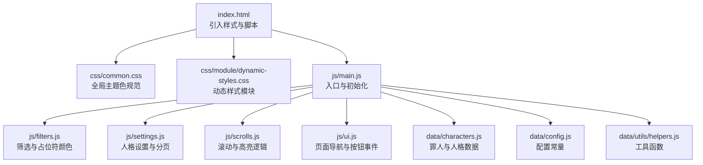
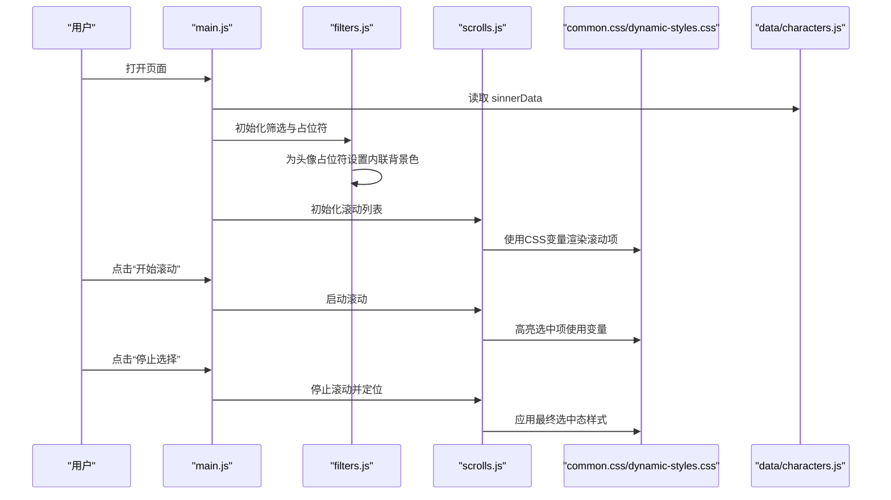
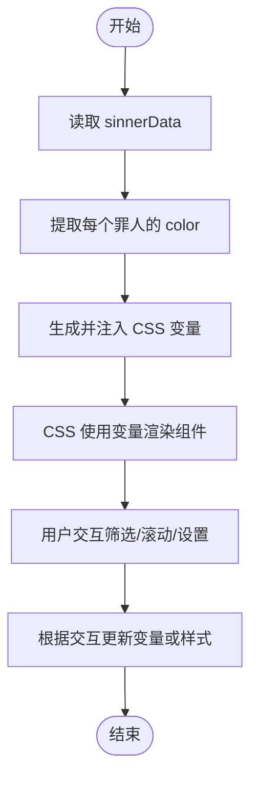
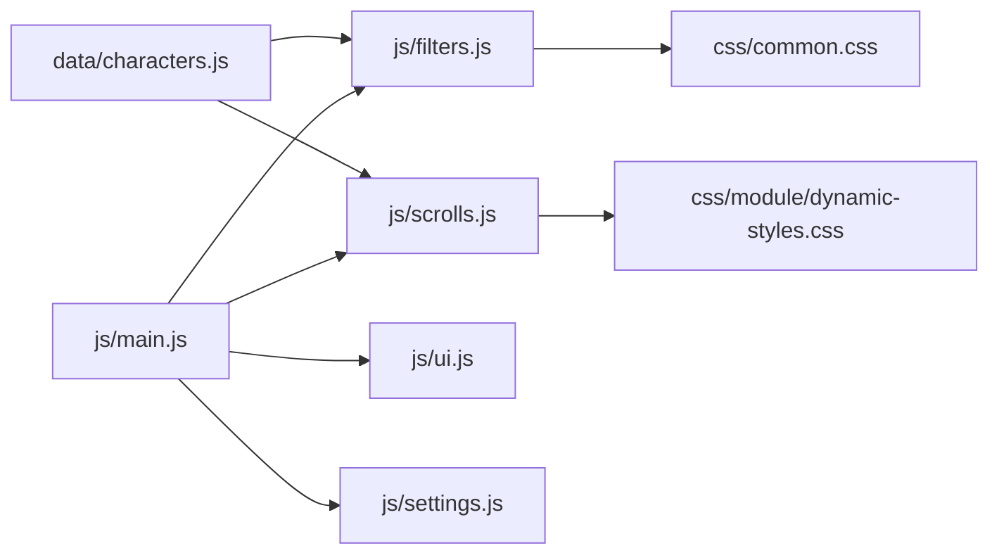

# 主题颜色

<cite>
**本文引用的文件**
- [index.html](file://index.html)
- [data/characters.js](file://data/characters.js)
- [data/config.js](file://data/config.js)
- [data/utils/helpers.js](file://data/utils/helpers.js)
- [js/main.js](file://js/main.js)
- [js/filters.js](file://js/filters.js)
- [js/settings.js](file://js/settings.js)
- [js/scrolls.js](file://js/scrolls.js)
- [js/ui.js](file://js/ui.js)
- [css/common.css](file://css/common.css)
- [css/module/dynamic-styles.css](file://css/module/dynamic-styles.css)
</cite>

## 目录
1. [简介](#简介)
2. [项目结构](#项目结构)
3. [核心组件](#核心组件)
4. [架构总览](#架构总览)
5. [详细组件分析](#详细组件分析)
6. [依赖关系分析](#依赖关系分析)
7. [性能考量](#性能考量)
8. [故障排查指南](#故障排查指南)
9. [结论](#结论)
10. [附录](#附录)

## 简介
本文件围绕项目中的“主题颜色系统”展开，重点解释：
- 如何基于 data/characters.js 中每个罪人的 color 字段（如 '#d4af37'），在运行时动态生成并注入 CSS 变量，从而为页面组件提供个性化配色。
- dynamic-styles.css 如何利用这些 CSS 变量，为按钮、边框、背景等组件应用罪人专属配色。
- common.css 中全局主题色（如 #d4af37 作为主色调）的使用规范，包括渐变背景、阴影效果、文字高亮等统一设计语言。
- 主题色在提升用户体验与品牌识别度方面的作用与价值。

## 项目结构
该项目采用“数据驱动 + 模块化 JS + CSS 模块”的组织方式：
- 数据层：data/characters.js 提供罪人与人格数据，包含 color 字段。
- 表现层：index.html 引入 css/common.css 与 css/module/dynamic-styles.css；JS 模块负责读取数据、生成动态样式并应用到 DOM。
- 关键流程：JS 读取 sinnerData，提取 color，注入 CSS 变量；CSS 使用变量为组件着色；UI 交互由多个模块协作完成。

图表来源
- [index.html](file://index.html#L1-L176)
- [css/common.css](file://css/common.css#L1-L220)
- [css/module/dynamic-styles.css](file://css/module/dynamic-styles.css#L1-L200)
- [js/main.js](file://js/main.js#L1-L261)
- [js/filters.js](file://js/filters.js#L1-L120)
- [js/settings.js](file://js/settings.js#L1-L120)
- [js/scrolls.js](file://js/scrolls.js#L1-L120)
- [js/ui.js](file://js/ui.js#L1-L66)
- [data/characters.js](file://data/characters.js#L1-L120)
- [data/config.js](file://data/config.js#L1-L29)
- [data/utils/helpers.js](file://data/utils/helpers.js#L1-L45)

章节来源
- [index.html](file://index.html#L1-L176)

## 核心组件
- 数据源：sinnerData 数组，每个罪人对象包含 id、name、avatar、color、personalities 等字段。color 字段是主题色系统的关键输入。
- JS 动态样式注入：通过 JS 读取 sinnerData，提取 color，生成 CSS 变量并注入到页面，使 CSS 能够按需使用。
- CSS 变量消费：dynamic-styles.css 与 common.css 中大量使用 CSS 变量，实现按钮、边框、背景、滚动条、分页等组件的统一配色。
- 组件化样式：common.css 定义全局主题色规范，dynamic-styles.css 提供模块化动态样式，两者协同实现一致的品牌视觉。

章节来源
- [data/characters.js](file://data/characters.js#L1-L120)
- [css/common.css](file://css/common.css#L1-L220)
- [css/module/dynamic-styles.css](file://css/module/dynamic-styles.css#L1-L200)

## 架构总览
主题颜色系统的工作流如下：
- JS 读取 data/characters.js 的 sinnerData。
- 从每个罪人对象提取 color，生成 CSS 变量声明。
- 将 CSS 变量注入到页面的根节点或特定容器，使 CSS 能够消费这些变量。
- CSS 在按钮、边框、背景、滚动条、分页等处使用变量，形成统一的主题风格。
- 用户交互（筛选、滚动、设置）触发样式更新，保证一致性。

图表来源
- [js/main.js](file://js/main.js#L150-L261)
- [js/filters.js](file://js/filters.js#L1-L120)
- [js/scrolls.js](file://js/scrolls.js#L280-L478)
- [css/common.css](file://css/common.css#L1-L220)
- [css/module/dynamic-styles.css](file://css/module/dynamic-styles.css#L1-L200)
- [data/characters.js](file://data/characters.js#L1-L120)

## 详细组件分析

### 数据层：sinnerData 与 color 字段
- sinnerData 是罪人与人格数据的集合，每个罪人对象包含 color 字段，作为主题色的来源。
- color 字段在 JS 层被读取，用于生成 CSS 变量或设置内联样式。

章节来源
- [data/characters.js](file://data/characters.js#L1-L120)

### JS 动态样式注入与消费
- 头像占位符颜色：在筛选模块中，为每个罪人创建头像占位符时，使用内联样式设置背景色，直接消费 sinner.color。
- 滚动项高亮：滚动模块在高亮选中项时，使用 CSS 变量控制选中态的背景与阴影，确保与全局主题一致。
- 分页与滚动条：common.css 与 dynamic-styles.css 中的分页按钮、滚动条颜色均使用 CSS 变量，保证与主色调一致。

图表来源
- [js/filters.js](file://js/filters.js#L1-L120)
- [js/scrolls.js](file://js/scrolls.js#L686-L718)
- [css/common.css](file://css/common.css#L236-L266)
- [css/module/dynamic-styles.css](file://css/module/dynamic-styles.css#L120-L170)

章节来源
- [js/filters.js](file://js/filters.js#L1-L120)
- [js/scrolls.js](file://js/scrolls.js#L686-L718)
- [css/common.css](file://css/common.css#L236-L266)
- [css/module/dynamic-styles.css](file://css/module/dynamic-styles.css#L120-L170)

### CSS 变量在 dynamic-styles.css 中的应用
- 分页按钮与滚动条：分页容器与滚动条的颜色使用 CSS 变量，确保与全局主色调一致。
- 模态框与计时器：模态框头部、计时器按钮等使用渐变与阴影，颜色体系与主色调协调。
- 设置页面：设置容器、标题、分页按钮等均使用主色调作为边框与高亮色。

章节来源
- [css/module/dynamic-styles.css](file://css/module/dynamic-styles.css#L120-L170)
- [css/module/dynamic-styles.css](file://css/module/dynamic-styles.css#L726-L799)

### CSS 变量在 common.css 中的应用
- 全局背景与标题：页面背景使用深色渐变，标题文字使用主色调渐变与高光。
- 容器边框与阴影：选择器容器、结果容器、设置容器均使用主色调作为边框与阴影。
- 滚动条与分页：滚动条颜色、分页按钮高亮与激活态均使用主色调。
- 文字高亮：高亮类名统一使用主色调，增强可读性与品牌感。

章节来源
- [css/common.css](file://css/common.css#L1-L220)
- [css/common.css](file://css/common.css#L236-L266)

### 组件化样式与主题一致性
- 按钮组件：普通按钮与主按钮均使用渐变与阴影，颜色与主色调一致，hover 与 active 态提供层次变化。
- 滚动列表：选中态使用主色调高光与阴影，突出当前选择。
- 分页与滚动条：统一使用主色调，保证跨组件的一致性。

章节来源
- [css/module/dynamic-styles.css](file://css/module/dynamic-styles.css#L130-L170)
- [css/common.css](file://css/common.css#L456-L500)

## 依赖关系分析
- JS 依赖 data/characters.js 提供颜色数据；filters.js 与 scrolls.js 在渲染阶段消费颜色。
- CSS 依赖 JS 注入的变量或直接使用常量主色调；common.css 与 dynamic-styles.css 共同维护主题一致性。
- UI 交互由 main.js、ui.js、filters.js、scrolls.js 协作完成，确保主题色贯穿交互过程。

图表来源
- [data/characters.js](file://data/characters.js#L1-L120)
- [js/filters.js](file://js/filters.js#L1-L120)
- [js/scrolls.js](file://js/scrolls.js#L1-L120)
- [css/common.css](file://css/common.css#L1-L220)
- [css/module/dynamic-styles.css](file://css/module/dynamic-styles.css#L1-L200)
- [js/main.js](file://js/main.js#L1-L120)
- [js/ui.js](file://js/ui.js#L1-L66)
- [js/settings.js](file://js/settings.js#L1-L120)

章节来源
- [js/main.js](file://js/main.js#L1-L120)
- [js/filters.js](file://js/filters.js#L1-L120)
- [js/scrolls.js](file://js/scrolls.js#L1-L120)
- [css/common.css](file://css/common.css#L1-L220)
- [css/module/dynamic-styles.css](file://css/module/dynamic-styles.css#L1-L200)

## 性能考量
- 颜色计算与注入：颜色来源于静态数据，无需复杂计算；CSS 变量注入成本低，适合频繁更新。
- 滚动与高亮：滚动动画使用 transform 与过渡，避免频繁重排；高亮切换只修改类名，性能良好。
- 按钮与模态框：渐变与阴影使用硬件加速友好的属性，减少重绘。

[本节为通用指导，不涉及具体文件分析]

## 故障排查指南
- 头像占位符颜色异常：检查 filters.js 中为占位符设置内联样式的逻辑，确认 sinner.color 是否存在且有效。
- 滚动高亮不生效：检查 scrolls.js 中高亮函数是否正确调用，以及 CSS 中选中态类名是否与 JS 一致。
- 分页与滚动条颜色不一致：检查 common.css 与 dynamic-styles.css 中滚动条与分页按钮的颜色变量是否正确使用。
- 主题色未随选择变化：确认 JS 是否在交互后更新了 CSS 变量或样式，CSS 是否正确消费变量。

章节来源
- [js/filters.js](file://js/filters.js#L1-L120)
- [js/scrolls.js](file://js/scrolls.js#L686-L718)
- [css/common.css](file://css/common.css#L236-L266)
- [css/module/dynamic-styles.css](file://css/module/dynamic-styles.css#L120-L170)

## 结论
本项目通过“数据驱动 + CSS 变量”的方式实现了主题颜色系统：
- data/characters.js 的 color 字段为每个罪人提供专属主色；
- JS 在渲染阶段消费颜色，注入 CSS 变量或设置内联样式；
- CSS 通过变量统一应用到按钮、边框、背景、滚动条、分页等组件；
- common.css 与 dynamic-styles.css 协同，形成一致的品牌视觉语言；
- 主题色提升了用户体验与品牌识别度，使界面具有个性化与统一性的双重优势。

[本节为总结性内容，不涉及具体文件分析]

## 附录
- 主题色使用建议
  - 优先使用 CSS 变量，便于集中管理与动态更新。
  - 对于局部占位符或临时元素，可使用内联样式快速应用颜色。
  - 统一使用主色调作为边框、高亮与激活态颜色，保持视觉一致性。
  - 渐变与阴影应与主色调协调，避免过度饱和影响可读性。

[本节为通用指导，不涉及具体文件分析]