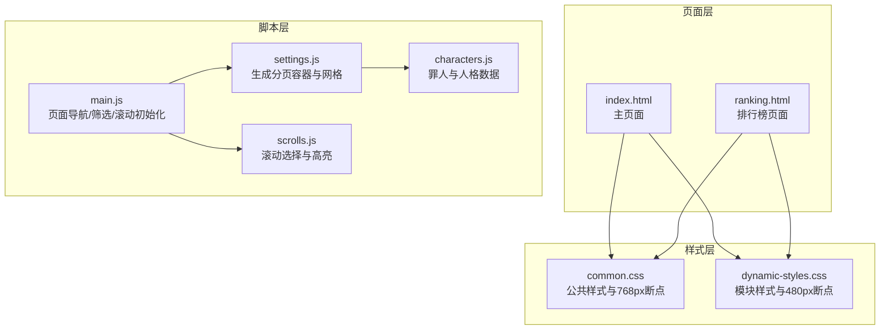
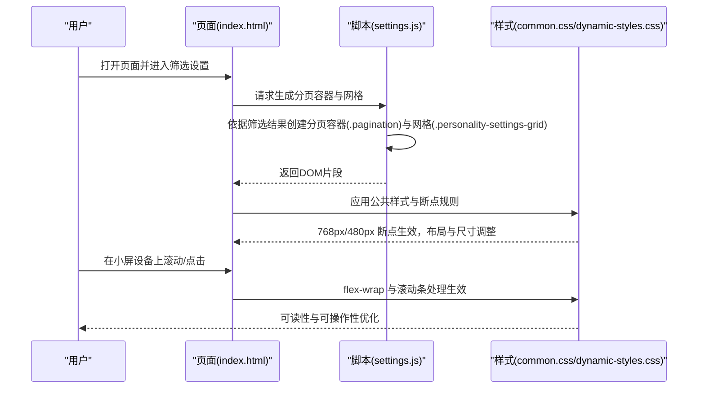
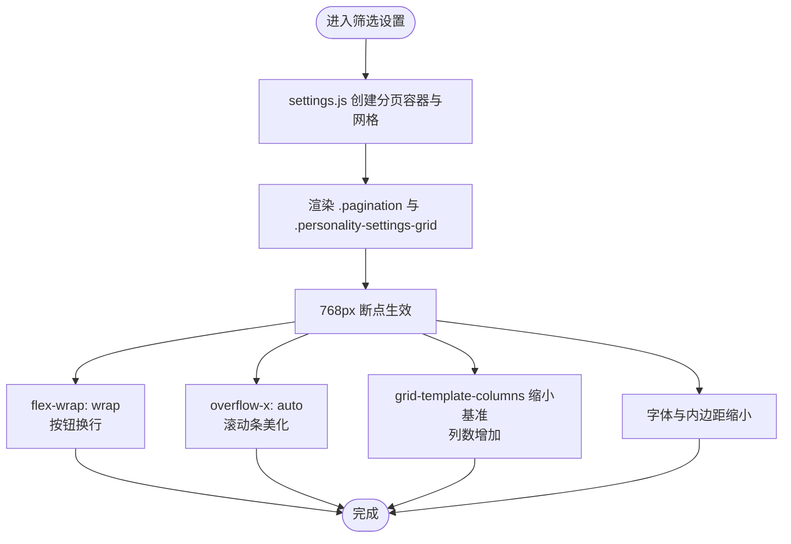
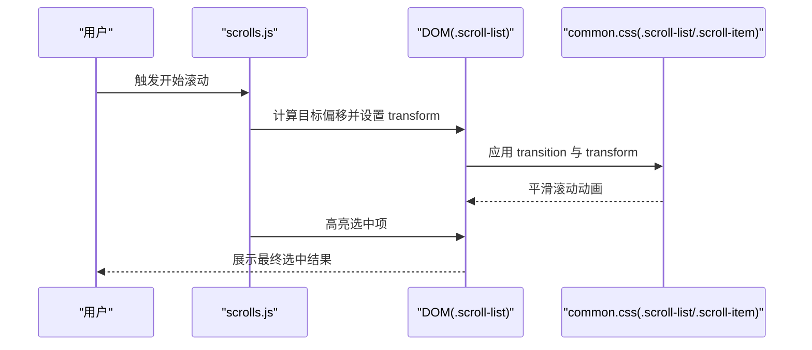
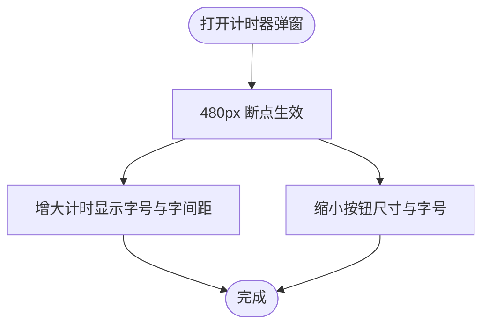
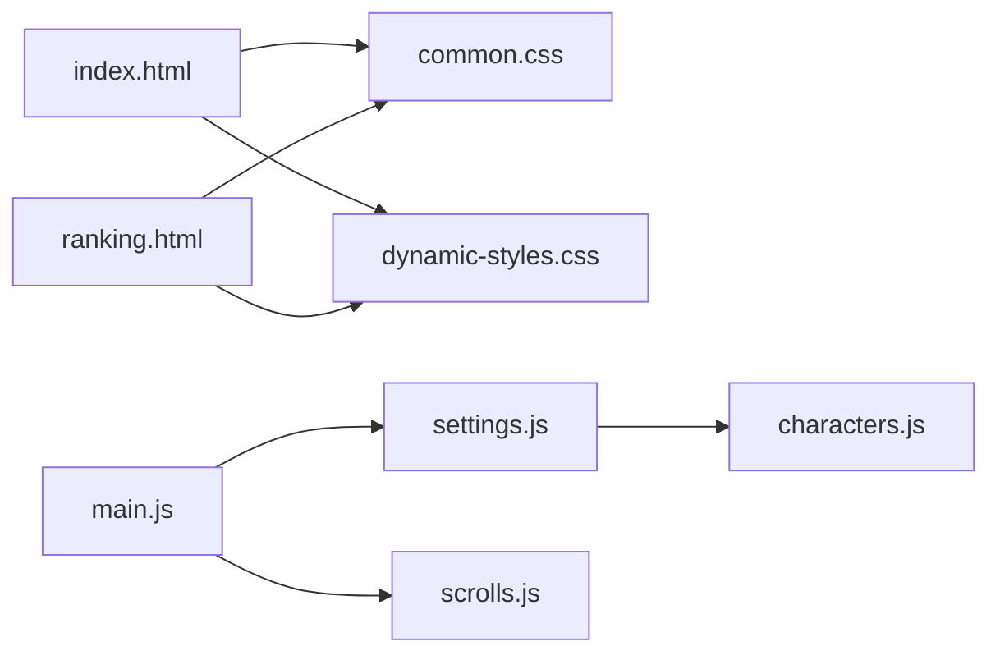

# 响应式设计

<cite>
**本文引用的文件**
- [css/common.css](file://css/common.css)
- [css/module/dynamic-styles.css](file://css/module/dynamic-styles.css)
- [index.html](file://index.html)
- [ranking.html](file://ranking.html)
- [js/main.js](file://js/main.js)
- [js/settings.js](file://js/settings.js)
- [js/scrolls.js](file://js/scrolls.js)
- [data/characters.js](file://data/characters.js)
</cite>

## 目录
1. [简介](#简介)
2. [项目结构](#项目结构)
3. [核心组件](#核心组件)
4. [架构总览](#架构总览)
5. [详细组件分析](#详细组件分析)
6. [依赖关系分析](#依赖关系分析)
7. [性能考量](#性能考量)
8. [故障排查指南](#故障排查指南)
9. [结论](#结论)
10. [附录](#附录)

## 简介
本文件系统性梳理该项目的响应式设计策略，围绕 CSS 中的媒体查询断点（max-width: 768px 和 480px）展开，逐项说明在不同屏幕尺寸下对容器宽度、字体大小、按钮尺寸、网格列数、间距等关键样式的适配规则；解析 HTML 结构如何配合 CSS 实现流式布局，确保在移动设备上的可读性与可操作性；重点说明分页容器（pagination）与人格设置网格（personality-settings-grid）在小屏下的弹性布局（flex-wrap）与滚动处理；并提供跨设备测试建议，帮助保障兼容性与体验一致性。

## 项目结构
- 样式层：
  - 公共样式：css/common.css 定义了全局基础样式与主要响应式断点（768px）。
  - 动态样式：css/module/dynamic-styles.css 定义了额外的响应式断点（480px）以及部分模块化样式。
- 页面层：
  - 主页 index.html：包含主选择器、筛选设置、说明与计时器弹窗等区域。
  - 排行榜页面 ranking.html：展示排行榜列表与操作按钮。
- 脚本层：
  - js/main.js：页面导航、筛选应用与刷新、滚动初始化等。
  - js/settings.js：根据筛选结果生成分页容器与人格设置网格，并创建分页按钮。
  - js/scrolls.js：滚动选择逻辑与高亮处理。
  - data/characters.js：罪人与人格数据，用于渲染网格与分页。

**图表来源**
- [css/common.css](file://css/common.css#L499-L797)
- [css/module/dynamic-styles.css](file://css/module/dynamic-styles.css#L706-L899)
- [index.html](file://index.html#L1-L176)
- [ranking.html](file://ranking.html#L1-L94)
- [js/main.js](file://js/main.js#L1-L200)
- [js/settings.js](file://js/settings.js#L92-L222)
- [js/scrolls.js](file://js/scrolls.js#L645-L718)
- [data/characters.js](file://data/characters.js#L1-L260)

**章节来源**
- [css/common.css](file://css/common.css#L499-L797)
- [css/module/dynamic-styles.css](file://css/module/dynamic-styles.css#L706-L899)
- [index.html](file://index.html#L1-L176)
- [ranking.html](file://ranking.html#L1-L94)
- [js/main.js](file://js/main.js#L1-L200)
- [js/settings.js](file://js/settings.js#L92-L222)
- [js/scrolls.js](file://js/scrolls.js#L645-L718)
- [data/characters.js](file://data/characters.js#L1-L260)

## 核心组件
- 响应式断点与适配规则
  - 768px 断点：覆盖容器、标题、描述、倒计时、滚动项、控件、分页、网格、设置页、导航按钮、说明等关键元素的字体、间距、尺寸与布局调整。
  - 480px 断点：聚焦计时器弹窗内的按钮尺寸与布局，保证移动端触摸可操作性。
- HTML 结构与流式布局
  - 主页采用 .container 容器承载内容，配合 flex 布局与 flex-wrap 在小屏下自动换行，避免横向滚动。
  - 分页容器与人格网格使用 display:flex 或 display:grid，结合 gap 与 minmax 规则，实现弹性布局与自适应列数。
- 关键交互与滚动
  - 分页容器（pagination）与人格设置网格（personality-settings-grid）在小屏下通过 flex-wrap 与滚动条处理，确保内容完整可见且可触达。
  - 滚动选择器（scroll-container + scroll-list）在小屏下通过缩小字体、间距与最小高度，提升可读性与可操作性。

**章节来源**
- [css/common.css](file://css/common.css#L499-L797)
- [css/module/dynamic-styles.css](file://css/module/dynamic-styles.css#L706-L899)
- [index.html](file://index.html#L1-L176)
- [js/settings.js](file://js/settings.js#L92-L222)
- [js/scrolls.js](file://js/scrolls.js#L645-L718)

## 架构总览
从“样式断点—HTML 结构—脚本渲染”的角度，构建响应式体系：
- 样式断点：768px 与 480px 两个断点分别负责通用布局与特定模块（计时器弹窗）的适配。
- HTML 结构：容器、网格、分页容器、滚动容器等元素配合 CSS 的 flex/grid 与媒体查询，形成流式布局。
- 脚本渲染：根据用户筛选动态生成分页容器与网格，确保小屏下仍能完整展示与交互。

**图表来源**
- [index.html](file://index.html#L1-L176)
- [js/settings.js](file://js/settings.js#L92-L222)
- [css/common.css](file://css/common.css#L499-L797)
- [css/module/dynamic-styles.css](file://css/module/dynamic-styles.css#L706-L899)

## 详细组件分析

### 组件A：分页容器（pagination）与人格设置网格（personality-settings-grid）
- 结构与职责
  - 分页容器（#pagination-container/.pagination）：用于在多个“罪人-人格”页面之间切换，支持横向滚动与滚动条美化。
  - 人格设置网格（.personality-settings-grid）：按罪人分页展示其人格卡片，支持自动换列与间距调整。
- 小屏适配要点
  - flex-wrap：在小屏下通过 flex-wrap 允许按钮换行，避免横向溢出。
  - 横向滚动：overflow-x: auto 与 -webkit-overflow-scrolling: touch 提升滚动体验。
  - 字体与尺寸：在 768px 断点下调小字体与内边距，保证紧凑布局下的可读性。
  - 网格列数：在 768px 断点下调小 minmax 基准值，增加列数以充分利用空间。
- 与脚本的协作
  - settings.js 动态创建分页容器与分页按钮，按钮类名使用 .page-btn，样式由 common.css/.pagination 控制。
  - 人格网格由 .personality-settings-grid 与 .personality-setting-card 组成，卡片内含头像、名称与开关，布局由 grid 与 gap 控制。

**图表来源**
- [js/settings.js](file://js/settings.js#L92-L222)
- [css/common.css](file://css/common.css#L235-L266)
- [css/common.css](file://css/common.css#L338-L385)
- [css/common.css](file://css/common.css#L429-L490)
- [css/common.css](file://css/common.css#L551-L628)

**章节来源**
- [js/settings.js](file://js/settings.js#L92-L222)
- [css/common.css](file://css/common.css#L235-L266)
- [css/common.css](file://css/common.css#L338-L385)
- [css/common.css](file://css/common.css#L429-L490)
- [css/common.css](file://css/common.css#L551-L628)

### 组件B：滚动选择器（scroll-container + scroll-list）
- 结构与职责
  - 滚动容器（.scroll-container）：隐藏溢出，固定高度，作为滚动视口。
  - 滚动列表（.scroll-list）：绝对定位，通过 transform 控制滚动位移。
  - 滚动项（.scroll-item）：包含头像占位与文本，支持高亮与选中态。
- 小屏适配要点
  - 字体与内边距：在 768px 断点下调小字体与内边距，同时设置最小高度，保证在小屏下仍有足够的视觉高度。
  - 头像尺寸：头像占位在小屏下限制最大宽高，避免挤占文本空间。
  - 文本截断：对超长文本使用省略号，确保可读性。
- 与脚本的协作
  - scrolls.js 负责计算滚动偏移、平滑过渡与高亮选中项，配合 CSS 的 transform 与 transition 实现流畅滚动。

**图表来源**
- [js/scrolls.js](file://js/scrolls.js#L645-L718)
- [css/common.css](file://css/common.css#L86-L120)
- [css/common.css](file://css/common.css#L537-L541)

**章节来源**
- [js/scrolls.js](file://js/scrolls.js#L645-L718)
- [css/common.css](file://css/common.css#L86-L120)
- [css/common.css](file://css/common.css#L537-L541)

### 组件C：计时器弹窗（timer-modal）
- 结构与职责
  - 弹窗容器与内容区，包含计时显示、控制按钮与排行榜表单。
- 小屏适配要点
  - 480px 断点：减小计时显示字号与按钮尺寸，使弹窗在小屏下更易阅读与点击。
  - 按钮宽度：在 480px 断点下限制按钮宽度，避免横向溢出。
- 与脚本的协作
  - main.js 负责弹窗的打开/关闭与计时逻辑，样式由 dynamic-styles.css 控制。

**图表来源**
- [css/module/dynamic-styles.css](file://css/module/dynamic-styles.css#L706-L724)
- [index.html](file://index.html#L133-L174)
- [js/main.js](file://js/main.js#L1-L200)

**章节来源**
- [css/module/dynamic-styles.css](file://css/module/dynamic-styles.css#L706-L724)
- [index.html](file://index.html#L133-L174)
- [js/main.js](file://js/main.js#L1-L200)

### 组件D：排行榜页面（ranking.html）
- 结构与职责
  - 排行榜列表容器（#ranking-list）与操作按钮（返回主页、清空记录）。
- 小屏适配要点
  - 排行榜项采用 flex 布局，包含排名、角色信息、备注与时间，小屏下通过缩进与字体调整保持可读性。
  - 操作按钮在小屏下保持紧凑布局，避免横向溢出。

**章节来源**
- [ranking.html](file://ranking.html#L1-L94)
- [css/common.css](file://css/common.css#L631-L797)

## 依赖关系分析
- 样式依赖
  - common.css 提供全局样式与主要断点（768px），dynamic-styles.css 提供次要断点（480px）与模块化样式。
- 结构依赖
  - index.html 与 ranking.html 分别依赖 common.css 与 dynamic-styles.css 的断点规则。
- 脚本依赖
  - main.js 依赖 settings.js 与 scrolls.js，后者负责滚动与高亮，前者负责筛选与分页容器生成。
- 数据依赖
  - settings.js 依赖 characters.js 的罪人与人格数据，用于生成网格与分页。

**图表来源**
- [index.html](file://index.html#L1-L176)
- [ranking.html](file://ranking.html#L1-L94)
- [css/common.css](file://css/common.css#L499-L797)
- [css/module/dynamic-styles.css](file://css/module/dynamic-styles.css#L706-L899)
- [js/main.js](file://js/main.js#L1-L200)
- [js/settings.js](file://js/settings.js#L92-L222)
- [js/scrolls.js](file://js/scrolls.js#L645-L718)
- [data/characters.js](file://data/characters.js#L1-L260)

**章节来源**
- [index.html](file://index.html#L1-L176)
- [ranking.html](file://ranking.html#L1-L94)
- [css/common.css](file://css/common.css#L499-L797)
- [css/module/dynamic-styles.css](file://css/module/dynamic-styles.css#L706-L899)
- [js/main.js](file://js/main.js#L1-L200)
- [js/settings.js](file://js/settings.js#L92-L222)
- [js/scrolls.js](file://js/scrolls.js#L645-L718)
- [data/characters.js](file://data/characters.js#L1-L260)

## 性能考量
- 滚动性能
  - 使用 transform 替代改变布局属性，减少重排重绘。
  - 在小屏下适度缩小字体与内边距，降低渲染复杂度。
- 布局稳定性
  - grid 与 flex 的组合在小屏下通过 gap 与 minmax 实现稳定换列，避免频繁回流。
- 交互响应
  - 按钮尺寸与间距在 480px 断点下缩小，提升触摸命中率，减少误触。

[本节为通用指导，无需具体文件分析]

## 故障排查指南
- 常见问题
  - 横向滚动条遮挡或不可见：检查 overflow-x 与滚动条样式是否在断点下生效。
  - 按钮换行导致拥挤：确认 flex-wrap 是否开启，gap 是否合理。
  - 文本截断过早：检查文本容器的最大宽度与省略策略。
  - 滚动卡顿：确认 transform 与 transition 的使用是否正确，避免在滚动过程中触发昂贵的布局计算。
- 测试建议
  - 使用浏览器开发者工具的设备模拟器，分别在 768px 与 480px 断点下验证布局与交互。
  - 在真实设备上进行滚动与点击测试，关注按钮尺寸与文本可读性。
  - 对于排行榜页面，验证列表项在小屏下的排列与时间显示是否清晰。

**章节来源**
- [css/common.css](file://css/common.css#L429-L490)
- [css/common.css](file://css/common.css#L551-L628)
- [css/module/dynamic-styles.css](file://css/module/dynamic-styles.css#L706-L724)
- [js/scrolls.js](file://js/scrolls.js#L645-L718)

## 结论
该项目通过 768px 与 480px 两个关键断点，系统性地实现了从通用布局到特定模块（计时器弹窗）的响应式适配。HTML 结构与 CSS 的 flex/grid、媒体查询、滚动条美化与字体/间距调整共同作用，确保在移动设备上的可读性与可操作性。分页容器与人格设置网格在小屏下通过 flex-wrap 与滚动处理，有效避免横向溢出并提升交互体验。建议在后续迭代中持续进行跨设备测试，以进一步优化小屏体验与性能表现。

[本节为总结，无需具体文件分析]

## 附录
- 断点与适配清单（768px）
  - 容器与标题：容器最大宽度、标题字号、描述字号。
  - 滚动项：字体、内边距、最小高度、头像最大尺寸、文本省略策略。
  - 控件与按钮：内边距、字号、间距。
  - 分页容器：内边距、外边距、按钮内边距与字号、最小宽度。
  - 网格：网格列数与间距调整。
  - 设置页与导航：内边距、字号、间距。
- 断点与适配清单（480px）
  - 计时器弹窗：计时显示字号与字间距、按钮尺寸与字号。

**章节来源**
- [css/common.css](file://css/common.css#L500-L628)
- [css/module/dynamic-styles.css](file://css/module/dynamic-styles.css#L706-L724)