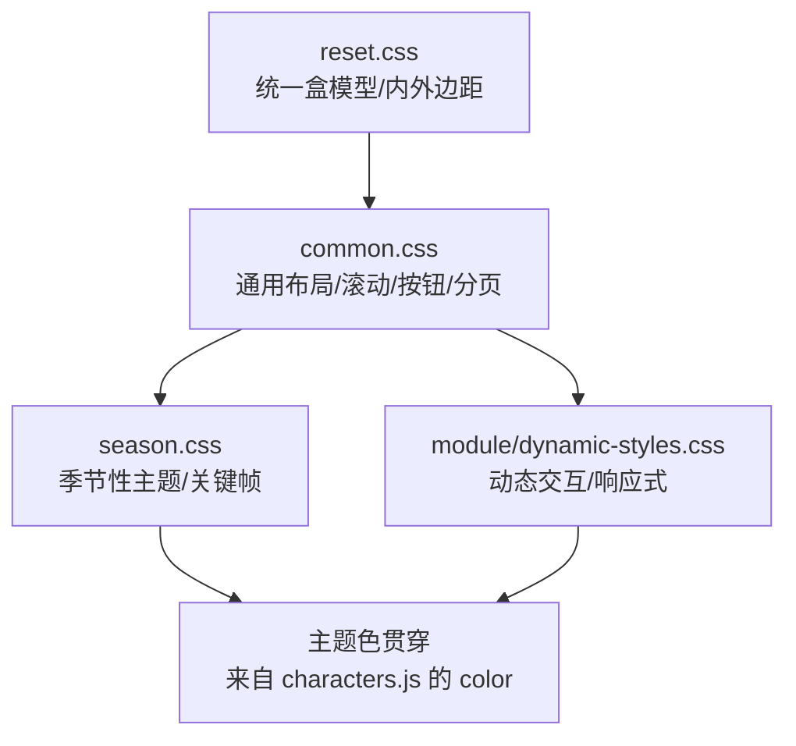
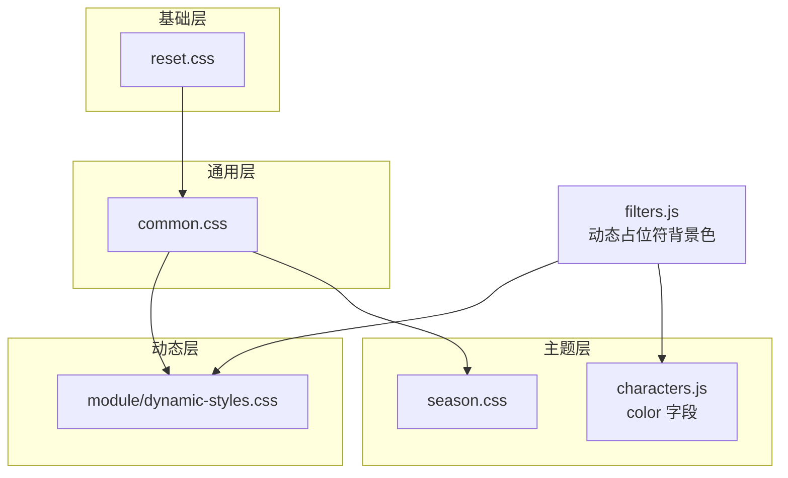
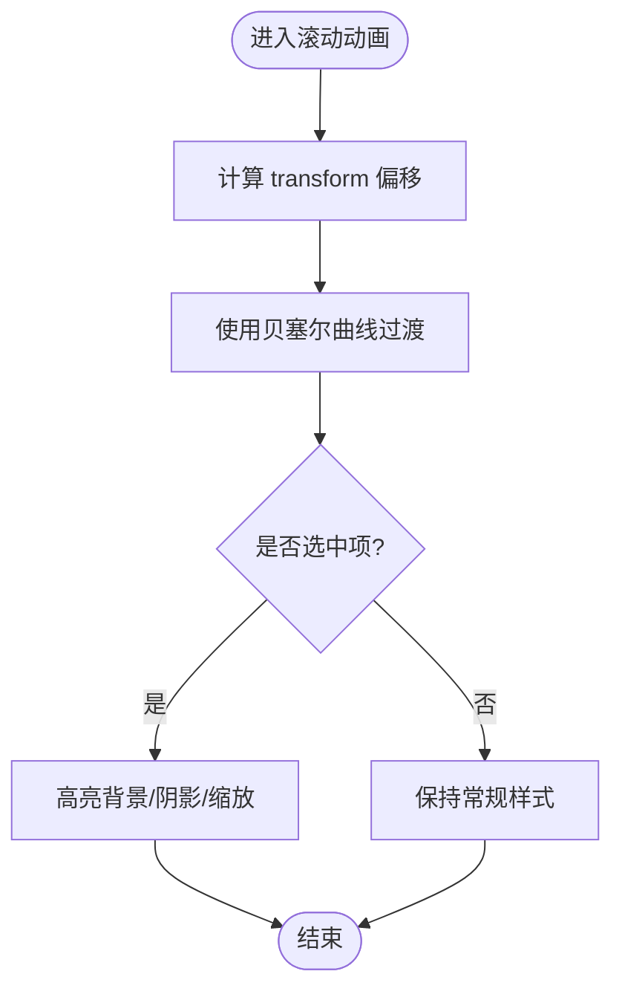
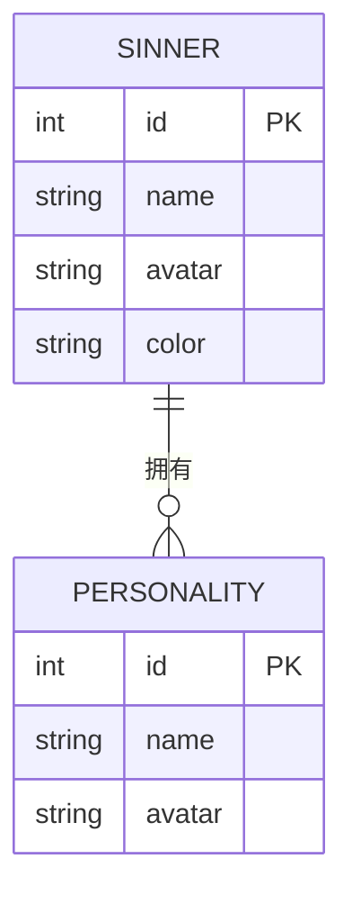
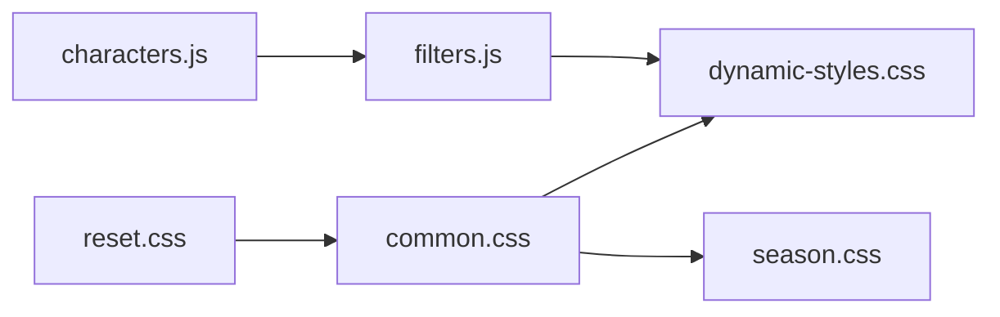

# 样式架构

<cite>
**本文引用的文件**
- [reset.css](file://css/reset.css)
- [common.css](file://css/common.css)
- [season.css](file://css/season.css)
- [dynamic-styles.css](file://css/module/dynamic-styles.css)
- [characters.js](file://data/characters.js)
- [filters.js](file://js/filters.js)
- [main.js](file://js/main.js)
</cite>

## 目录
1. [简介](#简介)
2. [项目结构](#项目结构)
3. [核心组件](#核心组件)
4. [架构总览](#架构总览)
5. [详细组件分析](#详细组件分析)
6. [依赖关系分析](#依赖关系分析)
7. [性能考量](#性能考量)
8. [故障排查指南](#故障排查指南)
9. [结论](#结论)

## 简介
本文件系统化阐述前端样式体系的构建方式，围绕以下目标展开：
- reset.css 如何消除浏览器默认样式差异，建立一致的渲染基础
- common.css 中的通用类、布局规则、按钮样式与动画定义，尤其是滚动动画的关键帧实现
- season.css 如何支持季节性视觉主题切换
- module/dynamic-styles.css 如何动态生成与罪人颜色（color 字段）匹配的 CSS 变量，实现个性化界面
- 结合 data/characters.js 中的 color 值，说明主题色如何贯穿整个 UI 设计
- 响应式布局在不同屏幕尺寸下的适配策略

## 项目结构
样式体系由四层构成：
- 基础层：reset.css 统一盒模型与内外边距，消除浏览器差异
- 通用层：common.css 定义全局排版、容器、滚动、按钮、分页等通用样式
- 动态层：module/dynamic-styles.css 提供动态交互样式与响应式适配
- 主题层：season.css 引入季节性字体与关键帧动画，形成节日/活动主题



图表来源
- [reset.css](file://css/reset.css#L1-L6)
- [common.css](file://css/common.css#L1-L120)
- [dynamic-styles.css](file://css/module/dynamic-styles.css#L1-L120)
- [season.css](file://css/season.css#L1-L38)
- [characters.js](file://data/characters.js#L1-L260)

章节来源
- [reset.css](file://css/reset.css#L1-L6)
- [common.css](file://css/common.css#L1-L120)
- [dynamic-styles.css](file://css/module/dynamic-styles.css#L1-L120)
- [season.css](file://css/season.css#L1-L38)

## 核心组件
- reset.css：全局重置，确保跨浏览器一致性
- common.css：通用布局、滚动容器与列表、按钮与分页、指令与说明、排行榜等
- dynamic-styles.css：计时器弹窗、按钮 hover 效果、模态框、响应式断点等
- season.css：Lora 字体引入与“发光”关键帧，用于节日/活动文本强调
- 数据源：characters.js 提供罪人 color 字段，驱动主题色与动态占位符背景色

章节来源
- [reset.css](file://css/reset.css#L1-L6)
- [common.css](file://css/common.css#L1-L797)
- [dynamic-styles.css](file://css/module/dynamic-styles.css#L1-L984)
- [season.css](file://css/season.css#L1-L38)
- [characters.js](file://data/characters.js#L1-L260)

## 架构总览
样式架构遵循“基础—通用—动态—主题”的分层设计，配合 JavaScript 在运行时注入颜色，形成“数据驱动的主题色”。



图表来源
- [reset.css](file://css/reset.css#L1-L6)
- [common.css](file://css/common.css#L1-L797)
- [dynamic-styles.css](file://css/module/dynamic-styles.css#L1-L984)
- [season.css](file://css/season.css#L1-L38)
- [characters.js](file://data/characters.js#L1-L260)
- [filters.js](file://js/filters.js#L1-L20)

章节来源
- [filters.js](file://js/filters.js#L1-L20)
- [characters.js](file://data/characters.js#L1-L260)

## 详细组件分析

### reset.css：统一渲染基础
- 作用：重置全局内外边距与盒模型，保证各浏览器一致表现
- 关键点：统一 box-sizing 为 border-box，避免宽度计算差异

章节来源
- [reset.css](file://css/reset.css#L1-L6)

### common.css：通用样式与滚动动画
- 全局排版与容器
  - body 使用渐变背景与最小高度，容器最大宽度与居中对齐
  - 头部、标题、副标题、说明块等基础语义样式
- 滚动容器与列表
  - 滚动容器 border、圆角、背景与边框高亮
  - 列表项禁用点击指针与文字选择，禁用鼠标事件，提升交互一致性
  - 选中项高亮：背景半透明金、阴影、缩放与层级提升
- 按钮与分页
  - 控制按钮与导航按钮统一渐变、阴影、过渡与禁用态
  - 分页容器与按钮统一风格，滚动条自定义
- 指令与说明
  - 背景半透明容器、列表样式与高亮关键词
- 排行榜样式
  - 渐变边框、阴影、伪元素装饰、悬停位移与边框变化
- 滚动动画关键帧
  - 列表项 transform 过渡曲线为贝塞尔曲线，提供顺滑滚动体验
  - 选中项缩放与阴影增强视觉焦点



图表来源
- [common.css](file://css/common.css#L86-L112)
- [common.css](file://css/common.css#L129-L136)

章节来源
- [common.css](file://css/common.css#L1-L797)

### dynamic-styles.css：动态交互与响应式
- 动态占位符与头像
  - 占位符尺寸、圆角、内联对齐与间距
- 模态框与计时器弹窗
  - 背景模糊、固定定位、入场动画与遮罩层
  - 计时器弹窗标题光晕、按钮涟漪波纹、悬停放大与阴影
- 按钮与表单
  - 主按钮与次按钮的渐变、阴影、禁用态与悬停效果
  - 表单输入框聚焦态边框与背景变化
- 响应式断点
  - 针对 768px 与 480px 的计时器弹窗尺寸、按钮大小、输入框宽度与排列调整

```mermaid
sequenceDiagram
participant U as "用户"
participant F as "filters.js"
participant DOM as "DOM"
participant C as "common.css"
participant D as "dynamic-styles.css"
U->>F : 创建罪人筛选标签
F->>DOM : 插入占位符元素
F->>DOM : 设置占位符背景色为 sinner.color
DOM->>C : 应用通用占位符样式
DOM->>D : 应用动态交互样式如 hover、涟漪
Note over DOM,C,D : 主题色贯穿于占位符背景与按钮高亮
```

图表来源
- [filters.js](file://js/filters.js#L1-L20)
- [common.css](file://css/common.css#L1-L120)
- [dynamic-styles.css](file://css/module/dynamic-styles.css#L1-L200)

章节来源
- [dynamic-styles.css](file://css/module/dynamic-styles.css#L1-L984)
- [filters.js](file://js/filters.js#L1-L20)

### season.css：季节性主题与关键帧
- 引入 Lora 字体，为节日/活动文本提供优雅字体
- 定义“发光”关键帧，通过透明度与外阴影实现闪烁效果
- 适用于活动期间的强调文本，如“第七赛季”等

章节来源
- [season.css](file://css/season.css#L1-L38)

### 主题色与数据驱动
- 数据源：characters.js 的 sinnerData 每个罪人包含 color 字段
- 运行时注入：filters.js 在创建筛选标签时，将占位符背景色设置为对应罪人的 color
- 视觉贯穿：common.css 与 dynamic-styles.css 中大量使用金色系与高亮边框，与 color 形成统一的视觉语言



图表来源
- [characters.js](file://data/characters.js#L1-L260)

章节来源
- [characters.js](file://data/characters.js#L1-L260)
- [filters.js](file://js/filters.js#L1-L20)

### 响应式布局策略
- 通用断点：768px 与 480px
- 适配内容：
  - 文字字号、行高、间距与内边距缩减
  - 滚动容器与列表项在窄屏下更紧凑
  - 分页与按钮在窄屏下换行与最小宽度保障
  - 计时器弹窗在 768px 与 480px 下尺寸与按钮大小自适应

章节来源
- [common.css](file://css/common.css#L499-L628)
- [dynamic-styles.css](file://css/module/dynamic-styles.css#L640-L725)

## 依赖关系分析
- reset.css 作为最底层依赖，被所有样式文件共享
- common.css 为通用层，被 dynamic-styles.css 与 season.css 同时使用
- dynamic-styles.css 与 season.css 并列，分别负责动态交互与主题样式
- filters.js 通过内联样式将 characters.js 的 color 注入到 DOM，间接影响 dynamic-styles.css 的视觉表现



图表来源
- [reset.css](file://css/reset.css#L1-L6)
- [common.css](file://css/common.css#L1-L797)
- [dynamic-styles.css](file://css/module/dynamic-styles.css#L1-L984)
- [season.css](file://css/season.css#L1-L38)
- [characters.js](file://data/characters.js#L1-L260)
- [filters.js](file://js/filters.js#L1-L20)

章节来源
- [main.js](file://js/main.js#L1-L261)
- [filters.js](file://js/filters.js#L1-L20)

## 性能考量
- 使用 transform 与 opacity 实现动画，避免频繁触发重排
- 滚动容器使用绝对定位与 transform 过渡，减少布局抖动
- 按钮 hover 使用渐变与阴影，尽量避免复杂滤镜
- 响应式断点集中管理，减少重复媒体查询

## 故障排查指南
- 占位符颜色未生效
  - 检查 filters.js 是否正确读取 characters.js 的 color 并设置到占位符背景
  - 确认 common.css 与 dynamic-styles.css 中的占位符类样式未被覆盖
- 滚动动画卡顿
  - 检查 transform 过渡曲线与列表项高度是否一致
  - 确认未在滚动过程中频繁修改布局属性
- 响应式样式错乱
  - 检查 768px 与 480px 断点下的尺寸与间距是否合理
  - 确认分页与按钮在窄屏下的最小宽度与换行行为

章节来源
- [filters.js](file://js/filters.js#L1-L20)
- [common.css](file://css/common.css#L499-L628)
- [dynamic-styles.css](file://css/module/dynamic-styles.css#L640-L725)

## 结论
该样式体系通过 reset.css 奠定一致的渲染基础，common.css 提供通用布局与滚动动画，dynamic-styles.css 负责动态交互与响应式适配，season.css 提供节日主题。主题色由 characters.js 的 color 字段驱动，在 filters.js 中以内联样式注入，贯穿至占位符与按钮高亮等关键视觉元素。整体架构清晰、层次分明，既保证了跨浏览器一致性，又实现了数据驱动的个性化主题与良好的移动端体验。