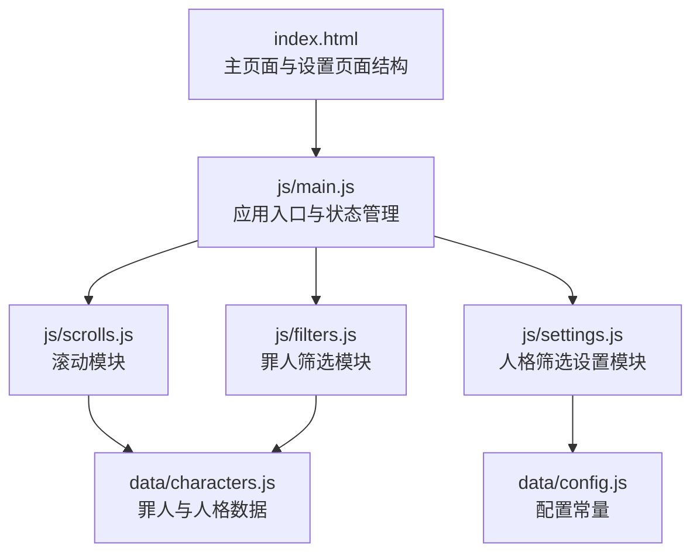
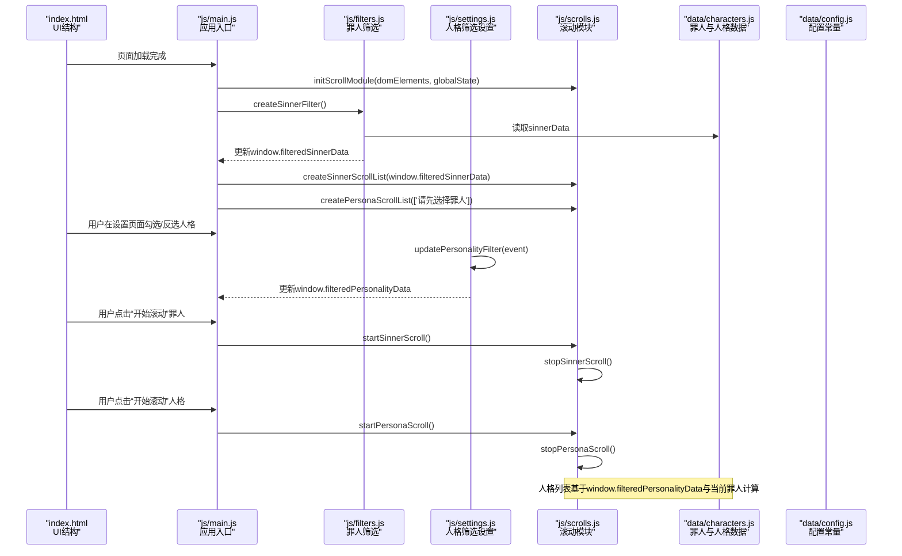
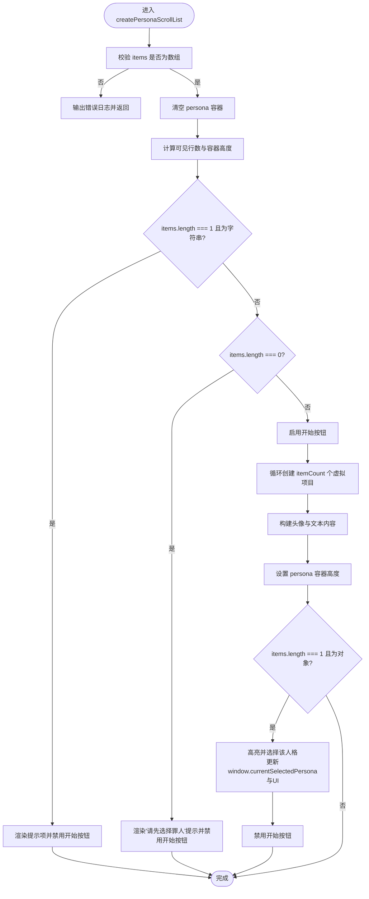
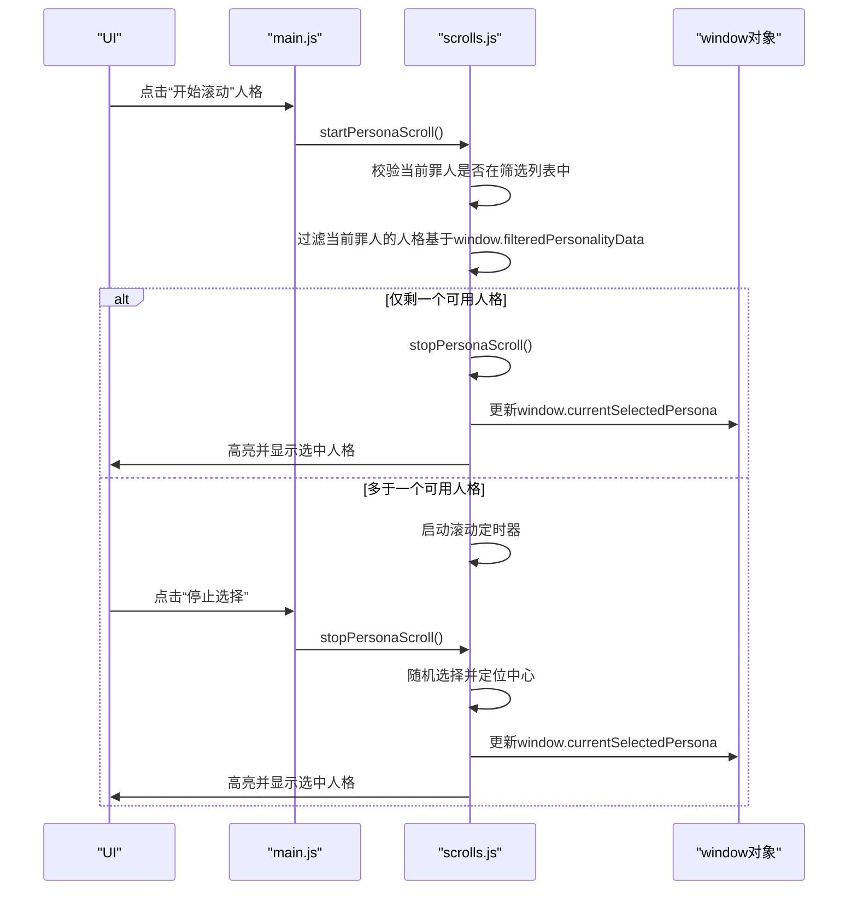
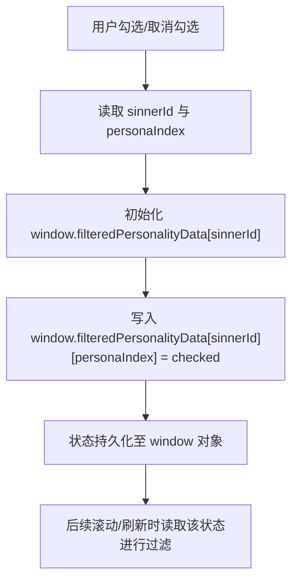
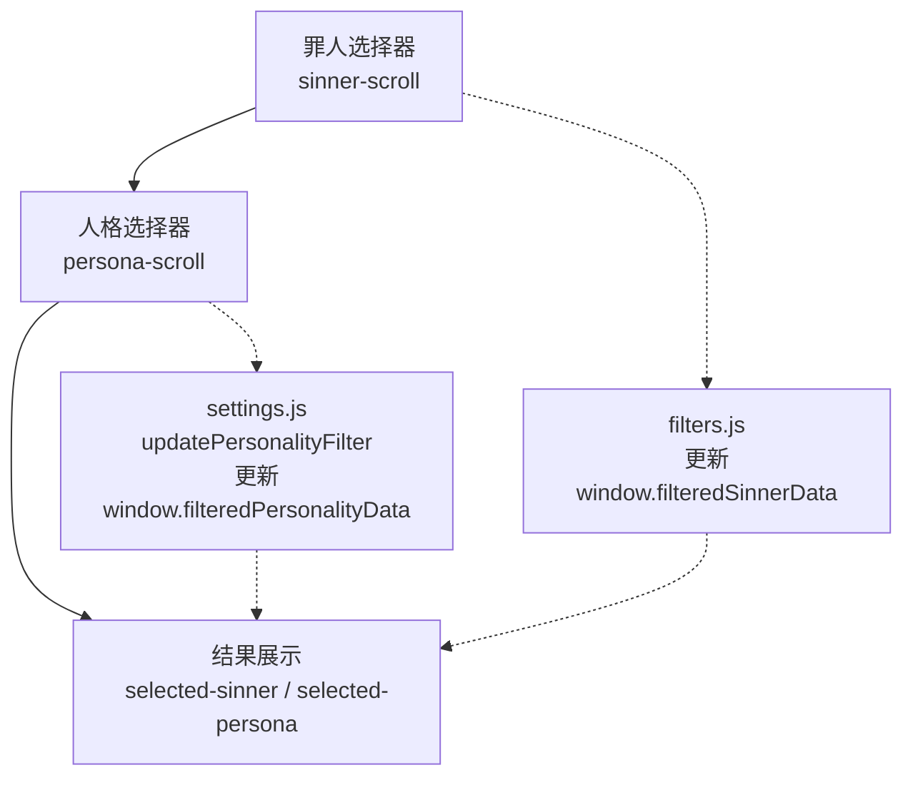
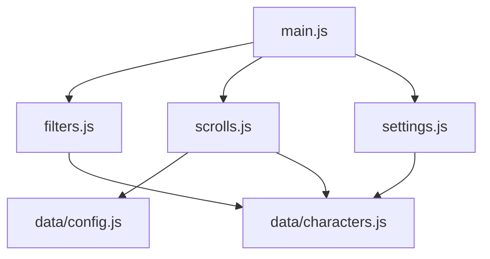

# 人格选择功能

<cite>
**本文引用的文件**
- [index.html](file://index.html)
- [js/main.js](file://js/main.js)
- [js/scrolls.js](file://js/scrolls.js)
- [js/settings.js](file://js/settings.js)
- [js/filters.js](file://js/filters.js)
- [data/characters.js](file://data/characters.js)
- [data/config.js](file://data/config.js)
</cite>

## 目录
1. [简介](#简介)
2. [项目结构](#项目结构)
3. [核心组件](#核心组件)
4. [架构总览](#架构总览)
5. [详细组件分析](#详细组件分析)
6. [依赖分析](#依赖分析)
7. [性能考虑](#性能考虑)
8. [故障排查指南](#故障排查指南)
9. [结论](#结论)

## 简介
本文件围绕“人格选择功能”的完整流程展开，重点说明：
- scrolls.js 中 createPersonaScrollList 如何基于当前选中的罪人与筛选后的人格数据创建二级滚动列表，并处理“无罪人选择”“单一人格”等特殊情况。
- startPersonaScroll 与 stopPersonaScroll 如何实现人格的随机选择，并通过 window.currentSelectedSinner 与 window.filteredPersonalityData 确保数据一致性。
- settings.js 中 updatePersonalityFilter 如何记录用户对人格的筛选偏好，并通过 window.filteredPersonalityData 持久化状态。
- index.html 中二级选择器的 UI 结构与罪人选择器的级联关系，以及罪人变更时如何自动更新人格列表。

## 项目结构
该功能涉及的主要文件与职责如下：
- index.html：提供主页面与设置页面的 UI 结构，包含罪人与人格的二级选择器容器、按钮与结果显示区域。
- js/main.js：应用入口，负责初始化滚动模块、绑定按钮事件、维护全局状态（window.filteredSinnerData、window.filteredPersonalityData、window.currentSelectedSinner、window.currentSelectedPersona），并在页面切换与筛选应用后刷新滚动列表。
- js/scrolls.js：滚动模块，负责罪人与人格的滚动列表创建、开始/停止滚动、高亮与定位、以及针对“单项目”场景的特殊处理。
- js/settings.js：人格筛选设置模块，负责渲染人格设置界面、全选/反选、以及 updatePersonalityFilter 对 window.filteredPersonalityData 的更新。
- js/filters.js：罪人筛选模块，负责罪人筛选复选框的创建与更新，维护 window.filteredSinnerData，并在应用筛选后刷新主页面滚动列表。
- data/characters.js：提供罪人与人格的原始数据结构。
- data/config.js：提供滚动与界面相关的配置常量。

图表来源
- [index.html](file://index.html#L26-L113)
- [js/main.js](file://js/main.js#L1-L261)
- [js/scrolls.js](file://js/scrolls.js#L1-L718)
- [js/settings.js](file://js/settings.js#L1-L263)
- [js/filters.js](file://js/filters.js#L1-L274)
- [data/characters.js](file://data/characters.js#L1-L260)
- [data/config.js](file://data/config.js#L1-L29)

章节来源
- [index.html](file://index.html#L26-L113)
- [js/main.js](file://js/main.js#L1-L261)

## 核心组件
- 滚动模块（scrolls.js）
  - 提供罪人与人格的滚动列表创建、开始/停止滚动、高亮与定位、以及针对“单项目”场景的特殊处理。
- 人格筛选设置模块（settings.js）
  - 负责渲染人格设置界面、全选/反选、以及 updatePersonalityFilter 对 window.filteredPersonalityData 的更新。
- 罪人筛选模块（filters.js）
  - 负责罪人筛选复选框的创建与更新，维护 window.filteredSinnerData，并在应用筛选后刷新主页面滚动列表。
- 应用入口（main.js）
  - 初始化滚动模块、绑定按钮事件、维护全局状态，并在页面切换与筛选应用后刷新滚动列表。

章节来源
- [js/scrolls.js](file://js/scrolls.js#L1-L718)
- [js/settings.js](file://js/settings.js#L1-L263)
- [js/filters.js](file://js/filters.js#L1-L274)
- [js/main.js](file://js/main.js#L1-L261)

## 架构总览
下图展示了“人格选择功能”的端到端流程，包括 UI 结构、状态管理与关键函数调用路径。

图表来源
- [index.html](file://index.html#L26-L113)
- [js/main.js](file://js/main.js#L159-L244)
- [js/filters.js](file://js/filters.js#L16-L115)
- [js/settings.js](file://js/settings.js#L1-L60)
- [js/scrolls.js](file://js/scrolls.js#L281-L718)
- [data/characters.js](file://data/characters.js#L1-L260)
- [data/config.js](file://data/config.js#L1-L29)

## 详细组件分析

### 组件一：二级滚动列表创建（createPersonaScrollList）
- 输入数据
  - items：应为人格对象数组或字符串提示；当 items 为字符串且长度为 1 时，表示“提示信息”，此时禁用开始按钮。
  - 若 items 为空数组，则显示“请先选择罪人”提示并禁用开始按钮。
  - 若 items 长度为 1 且为对象，则直接高亮并选择该人格，同时更新 window.currentSelectedPersona 与 UI 文本。
- 特殊情况处理
  - 无罪人选择：当 window.filteredSinnerData 为空或长度为 0 时，stopSinnerScroll 会阻止继续并提示“请至少选择一个罪人”。
  - 单一人格：当 items.length === 1 且为对象时，直接选择该人格并禁用开始按钮。
- 数据一致性保障
  - 通过 window.filteredPersonalityData[currentSelectedSinner.id] 记录每个罪人的人格筛选状态，createPersonaScrollList 在渲染前会依据该状态过滤出最终显示的人格列表。
- UI 行为
  - 根据 items.length 计算可见行数（最小 1 行，最大 5 行），并设置容器高度。
  - 为实现平滑滚动，会创建 itemCount = items.length × 10 的虚拟项目，使用 dataset.originalIndex 映射回原始索引。

图表来源
- [js/scrolls.js](file://js/scrolls.js#L113-L279)

章节来源
- [js/scrolls.js](file://js/scrolls.js#L113-L279)

### 组件二：人格随机选择（startPersonaScroll 与 stopPersonaScroll）
- 数据一致性
  - startPersonaScroll 会在启动前强制校验 window.currentSelectedSinner 是否仍在 window.filteredSinnerData 中，若不在则清空并尝试从窗口中唯一罪人恢复。
  - stopPersonaScroll 同样进行一致性校验，若当前罪人不在筛选列表中，会尝试从唯一罪人恢复，否则提示“请先选择一个罪人”。
- 过滤逻辑
  - 两个函数都会根据 window.filteredPersonalityData[currentSelectedSinner.id] 对当前罪人的人格进行过滤，仅保留未被显式设为 false 的人格。
- 随机选择
  - stopPersonaScroll 使用安全随机函数从过滤后的列表中随机选择一个，更新 window.currentSelectedPersona 与 UI 文本，并高亮选中项。
- 单项目优化
  - 若过滤后仅剩一个可用人格，直接调用 stopPersonaScroll 以避免不必要的滚动。

图表来源
- [js/scrolls.js](file://js/scrolls.js#L480-L718)

章节来源
- [js/scrolls.js](file://js/scrolls.js#L480-L718)

### 组件三：人格筛选偏好记录（updatePersonalityFilter）
- 触发方式
  - 当用户在设置页面勾选/取消勾选某个人格时，触发 change 事件，调用 updatePersonalityFilter。
- 数据持久化
  - 该函数会初始化 window.filteredPersonalityData[sinnerId]，并将 personaIndex 对应的值设为 checkbox.checked，从而记录用户的筛选偏好。
- 状态联动
  - 由于 window.filteredPersonalityData 是全局共享的状态，后续在罪人停止滚动、人格停止滚动、以及刷新滚动列表时，都会读取该状态进行过滤。

图表来源
- [js/settings.js](file://js/settings.js#L1-L20)

章节来源
- [js/settings.js](file://js/settings.js#L1-L20)

### 组件四：UI 级联关系与自动更新
- UI 结构
  - 主页面包含“一级选择（罪人）”与“二级选择（人格）”两个独立的滚动容器与按钮组，分别由 id 为 sinner-scroll、persona-scroll、sinner-start-btn、persona-start-btn、sinner-stop-btn、persona-stop-btn 控制。
  - 结果展示区域包含 id 为 selected-sinner 与 selected-persona 的文本节点，用于显示当前选中结果。
- 级联关系
  - 罪人选择器与人格选择器为级联关系：只有当罪人被选中后，人格选择器才会解锁并显示对应的人格列表。
  - 当罪人数量为 1 时，系统会自动选中该罪人并创建对应的人格列表；当罪人数量为 0 或筛选后为空时，人格列表显示“请先选择罪人”提示。
- 自动更新
  - 在设置页面应用筛选后，filters.js 会刷新主页面的滚动列表，并根据当前罪人状态决定是否自动选中罪人与更新人格列表。
  - 当从设置页面返回主页面时，若当前罪人仍在筛选列表中，则根据 window.filteredPersonalityData 重新过滤并渲染人格列表；否则重置状态并显示提示。

图表来源
- [index.html](file://index.html#L26-L113)
- [js/filters.js](file://js/filters.js#L194-L271)
- [js/settings.js](file://js/settings.js#L1-L60)

章节来源
- [index.html](file://index.html#L26-L113)
- [js/filters.js](file://js/filters.js#L194-L271)
- [js/settings.js](file://js/settings.js#L1-L60)

## 依赖分析
- 模块耦合
  - main.js 作为入口，同时依赖 filters.js、settings.js、scrolls.js，负责状态初始化与事件绑定。
  - scrolls.js 依赖 data/config.js 与 data/characters.js，用于配置与数据。
  - settings.js 依赖 data/characters.js 与 filters.js 的状态（通过 window 对象共享）。
  - filters.js 依赖 data/characters.js 与 main.js 的状态（通过 window 对象共享）。
- 关键依赖链
  - 罪人筛选链：filters.js 更新 window.filteredSinnerData → main.js 刷新罪人滚动列表 → stopSinnerScroll 创建人格列表。
  - 人格筛选链：settings.js 更新 window.filteredPersonalityData → scrolls.js 在渲染与停止时读取该状态进行过滤。
- 外部依赖
  - data/config.js 提供滚动与界面配置常量，影响滚动速度、可见行数与过渡动画。

图表来源
- [js/main.js](file://js/main.js#L1-L261)
- [js/filters.js](file://js/filters.js#L1-L274)
- [js/scrolls.js](file://js/scrolls.js#L1-L718)
- [js/settings.js](file://js/settings.js#L1-L263)
- [data/config.js](file://data/config.js#L1-L29)
- [data/characters.js](file://data/characters.js#L1-L260)

章节来源
- [js/main.js](file://js/main.js#L1-L261)
- [js/filters.js](file://js/filters.js#L1-L274)
- [js/scrolls.js](file://js/scrolls.js#L1-L718)
- [js/settings.js](file://js/settings.js#L1-L263)
- [data/config.js](file://data/config.js#L1-L29)
- [data/characters.js](file://data/characters.js#L1-L260)

## 性能考虑
- 滚动优化
  - 通过创建 itemCount = items.length × 10 的虚拟项目实现平滑循环滚动，减少卡顿感。
  - 使用 transition 与 transform 实现硬件加速的滚动与定位，提升流畅度。
- 数据过滤
  - 过滤逻辑基于 window.filteredPersonalityData 与 window.filteredSinnerData，避免重复计算，提高响应速度。
- DOM 操作
  - 批量清空与一次性渲染，减少多次重排与重绘。
- 配置参数
  - 通过 data/config.js 调整 scrollSpeed、transitionDuration 等参数，平衡流畅度与性能。

[本节为通用指导，无需具体文件引用]

## 故障排查指南
- 症状：点击“开始滚动（人格）”提示“请先选择一个罪人”
  - 可能原因：当前罪人不在 window.filteredSinnerData 中或未选中任何罪人。
  - 解决方案：先在主页面完成罪人随机选择，或在设置页面应用筛选后返回主页面。
  - 参考实现：startPersonaScroll 与 stopPersonaScroll 的一致性校验逻辑。
- 症状：人格列表显示“请先选择罪人”
  - 可能原因：window.filteredSinnerData 为空或长度为 0。
  - 解决方案：在设置页面勾选至少一个罪人并应用筛选，再返回主页面。
  - 参考实现：createPersonaScrollList 的空列表提示逻辑。
- 症状：人格列表无法滚动或按钮不可用
  - 可能原因：当前罪人的人格全部被设置为 false，导致过滤后为空。
  - 解决方案：在设置页面为该罪人至少勾选一个人格，或使用“全选”功能。
  - 参考实现：filters.js 的 validateFilterSettings 与 filters.js 的应用筛选逻辑。
- 症状：切换设置页面后返回主页面，罪人或人格状态异常
  - 可能原因：返回时未正确刷新滚动列表或未重置人格状态。
  - 解决方案：使用 filters.js 的 refreshScrollsOnReturn，确保罪人与人格列表同步更新。
  - 参考实现：filters.js 的 refreshScrollsOnReturn。

章节来源
- [js/scrolls.js](file://js/scrolls.js#L480-L718)
- [js/filters.js](file://js/filters.js#L117-L170)
- [js/filters.js](file://js/filters.js#L194-L271)

## 结论
- 人格选择功能通过“罪人筛选 + 人格筛选 + 随机滚动 + 状态同步”的机制，实现了稳定、可扩展且用户体验友好的二级选择流程。
- 关键在于：
  - 使用 window.filteredSinnerData 与 window.filteredPersonalityData 作为全局状态，贯穿筛选、渲染与随机选择全过程。
  - 在 createPersonaScrollList、startPersonaScroll、stopPersonaScroll 中严格处理“无罪人选择”“单一人格”等边界情况，保证 UI 与数据一致。
  - 通过 filters.js 与 settings.js 的协作，确保筛选设置的持久化与页面切换时的状态恢复。

[本节为总结性内容，无需具体文件引用]