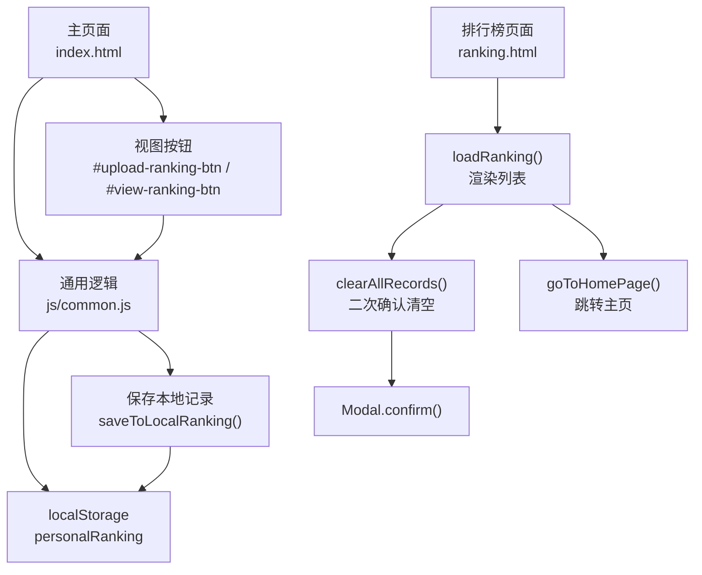
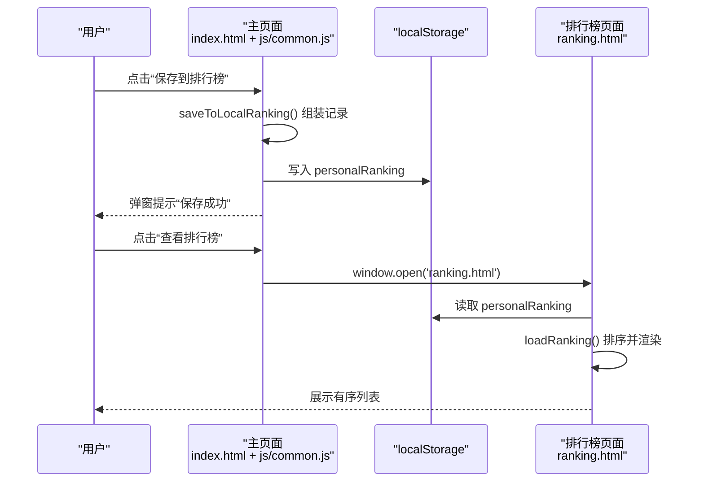
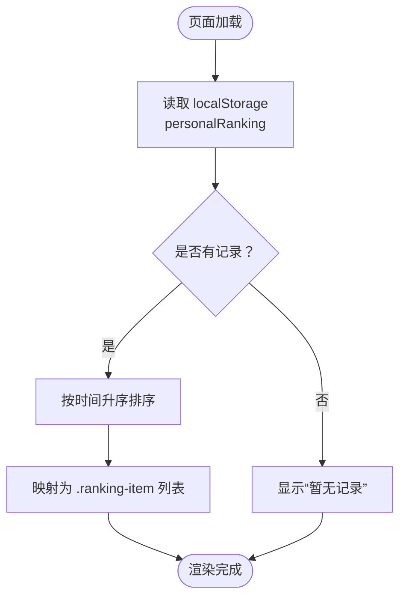
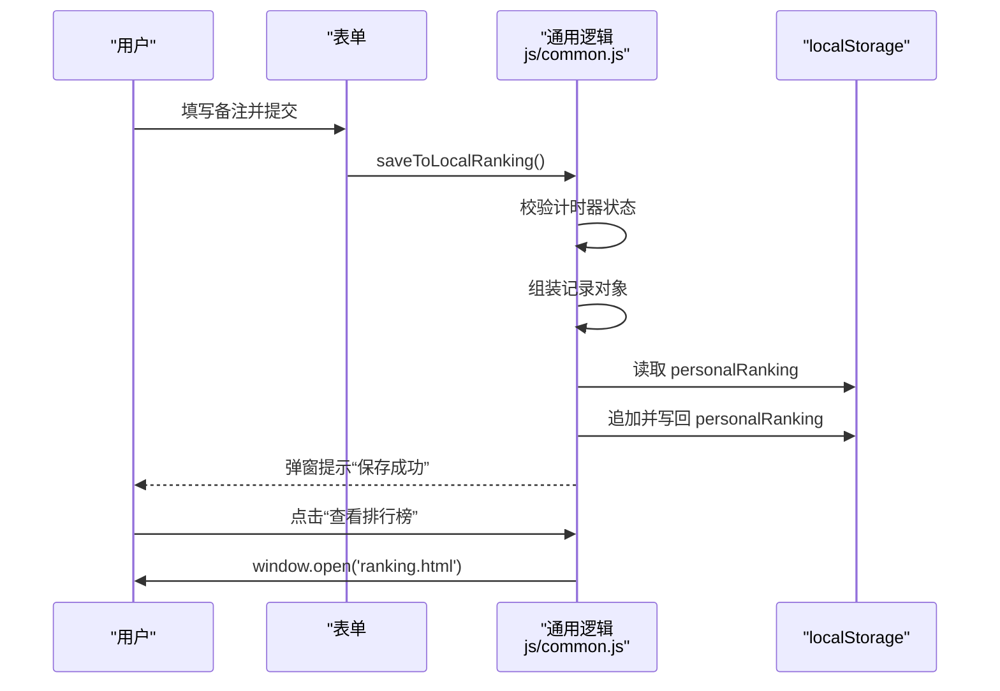
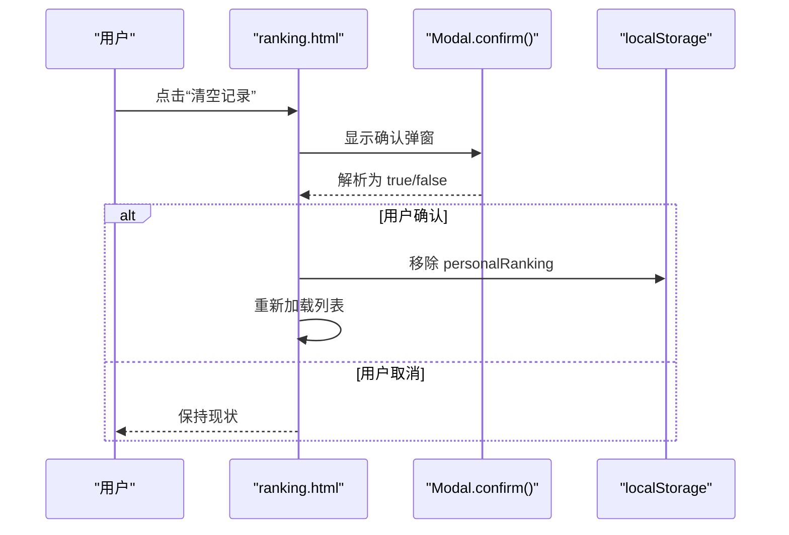
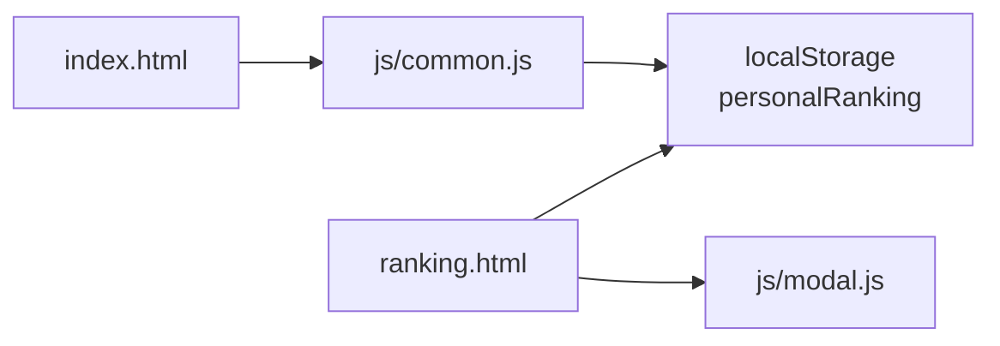

# 排行榜功能

<cite>
**本文引用的文件**
- [ranking.html](file://ranking.html)
- [js/common.js](file://js/common.js)
- [index.html](file://index.html)
- [js/modal.js](file://js/modal.js)
- [css/common.css](file://css/common.css)
</cite>

## 目录
1. [简介](#简介)
2. [项目结构](#项目结构)
3. [核心组件](#核心组件)
4. [架构总览](#架构总览)
5. [详细组件分析](#详细组件分析)
6. [依赖关系分析](#依赖关系分析)
7. [性能考量](#性能考量)
8. [故障排查指南](#故障排查指南)
9. [结论](#结论)

## 简介
本文件围绕“排行榜系统”的数据流与用户界面展开，重点说明以下内容：
- ranking.html 如何通过 JavaScript 动态加载 localStorage 中的 personalRanking 数据，并使用 loadRanking 函数将其渲染为有序列表；
- 排行榜条目（ranking-item）的结构组成，包括排名、角色头像、名称、时间、日期与备注信息；
- clearAllRecords 函数如何借助 Modal.confirm 进行二次确认后清空 localStorage 数据；
- goToHomePage 实现页面跳转的逻辑；
- 结合主页面 index.html 中的 view-ranking-btn 与上传按钮 upload-ranking-btn，解释主页面与排行榜页面之间的导航与数据提交流程；
- 强调排行榜按时间升序排序的规则，以及数据持久化在浏览器端的实现方式。

## 项目结构
排行榜功能涉及三个主要部分：
- 主页面：提供“保存到排行榜”和“查看排行榜”的入口，负责将计时结果写入 localStorage 的 personalRanking 数组。
- 排行榜页面：展示 personalRanking 的本地记录，支持清空与返回主页。
- 弹窗模块：统一提供 confirm/alert 弹窗，用于二次确认与提示。

图表来源
- [index.html](file://index.html#L160-L176)
- [js/common.js](file://js/common.js#L129-L326)
- [ranking.html](file://ranking.html#L36-L91)
- [js/modal.js](file://js/modal.js#L87-L106)

章节来源
- [ranking.html](file://ranking.html#L1-L94)
- [index.html](file://index.html#L160-L176)
- [js/common.js](file://js/common.js#L129-L326)
- [js/modal.js](file://js/modal.js#L1-L109)

## 核心组件
- 排行榜页面（ranking.html）
  - 负责加载 localStorage 中的 personalRanking，按时间升序排序并渲染为列表项。
  - 提供“清空记录”和“返回主页”两个交互按钮。
- 主页面（index.html + js/common.js）
  - 提供“保存到排行榜”表单提交与“查看排行榜”按钮。
  - 保存逻辑将计时结果写入 localStorage 的 personalRanking 数组；查看逻辑在新窗口打开 ranking.html。
- 弹窗模块（js/modal.js）
  - 提供 confirm/alert 弹窗，用于二次确认与提示。

章节来源
- [ranking.html](file://ranking.html#L36-L91)
- [js/common.js](file://js/common.js#L129-L326)
- [js/modal.js](file://js/modal.js#L87-L106)

## 架构总览
下图展示了从主页面到排行榜页面的数据流与交互：

图表来源
- [js/common.js](file://js/common.js#L129-L326)
- [ranking.html](file://ranking.html#L36-L91)

## 详细组件分析

### 排行榜页面（ranking.html）
- 数据加载与渲染
  - 页面加载时触发 loadRanking()，从 localStorage 读取 personalRanking（默认为空数组），若为空则显示“暂无记录”，否则按时间升序排序并映射为 .ranking-item 列表。
  - 条目结构包含：
    - 排名：基于排序后的索引+1。
    - 角色信息：当存在 persona 或 sinner 时，显示头像与名称；若同时存在 persona 与 sinner，额外显示人格名称。
    - 时间信息：右侧显示格式化后的时间（HH:MM:SS）。
    - 日期与备注：左侧下方显示记录时间与备注（无备注时显示“无备注”）。
- 交互行为
  - “清空记录”按钮：调用 clearAllRecords()，通过 Modal.confirm 弹窗进行二次确认，确认后移除 localStorage 中的 personalRanking 并重新加载列表。
  - “返回主页”按钮：调用 goToHomePage()，将窗口跳转至 index.html。

图表来源
- [ranking.html](file://ranking.html#L36-L68)

章节来源
- [ranking.html](file://ranking.html#L36-L91)
- [css/common.css](file://css/common.css#L650-L797)

### 主页面与数据提交流程（index.html + js/common.js）
- 导航与按钮
  - 主页面提供 #upload-ranking-btn（保存到排行榜）与 #view-ranking-btn（查看排行榜）。
- 保存逻辑
  - 表单提交触发 saveToLocalRanking()：校验计时器是否运行过（避免保存零时间）；从全局状态 window.currentSelectedSinner/window.currentSelectedPersona 获取角色信息；组装新记录（包含 time、comment、timestamp、sinner/persona 头像与名称）；将记录 push 至 personalRanking 并写回 localStorage；最后弹窗提示“保存成功”，并重置备注输入框。
- 查看逻辑
  - viewRanking() 使用 window.open 打开 ranking.html，实现跨页面查看本地排行榜。

图表来源
- [index.html](file://index.html#L160-L176)
- [js/common.js](file://js/common.js#L129-L326)

章节来源
- [index.html](file://index.html#L160-L176)
- [js/common.js](file://js/common.js#L129-L326)

### 弹窗确认与二次确认（js/modal.js）
- Modal.confirm(message, title) 返回 Promise，点击“确定”解析为 true，点击“取消”解析为 false。
- 排行榜页面的 clearAllRecords() 使用 Modal.confirm 进行二次确认，只有在用户确认后才移除 localStorage 中的 personalRanking 并刷新列表。

图表来源
- [js/modal.js](file://js/modal.js#L87-L106)
- [ranking.html](file://ranking.html#L70-L77)

章节来源
- [js/modal.js](file://js/modal.js#L1-L109)
- [ranking.html](file://ranking.html#L70-L77)

### 排行榜条目结构与样式
- 结构组成
  - 排名数字：.ranking-number
  - 角色信息：.character-info 包含头像 .character-avatar 与名称 .character-name；当同时存在 sinner 与 persona 时，额外显示 .personality-name
  - 信息区域：.ranking-info 包含 .ranking-date 与 .ranking-comment
  - 时间：.ranking-time
- 样式要点
  - 采用金色主题配色，hover 效果增强交互体验；头像带边框与阴影，名称与时间突出显示；备注采用斜体样式。

章节来源
- [ranking.html](file://ranking.html#L49-L67)
- [css/common.css](file://css/common.css#L650-L797)

## 依赖关系分析
- 主页面依赖
  - js/common.js：提供 saveToLocalRanking()、viewRanking()、计时器与弹窗提示等逻辑。
  - index.html：提供 #upload-ranking-btn 与 #view-ranking-btn。
- 排行榜页面依赖
  - js/modal.js：提供 Modal.confirm() 用于二次确认。
  - ranking.html：负责渲染与交互。
- 数据持久化
  - localStorage 中的 personalRanking 作为唯一数据源，主页面写入，排行榜页面读取与渲染。

图表来源
- [index.html](file://index.html#L160-L176)
- [js/common.js](file://js/common.js#L129-L326)
- [ranking.html](file://ranking.html#L36-L91)
- [js/modal.js](file://js/modal.js#L87-L106)

章节来源
- [index.html](file://index.html#L160-L176)
- [js/common.js](file://js/common.js#L129-L326)
- [ranking.html](file://ranking.html#L36-L91)
- [js/modal.js](file://js/modal.js#L1-L109)

## 性能考量
- 排序复杂度
  - loadRanking() 对 records 进行一次排序，时间复杂度 O(n log n)，空间复杂度 O(1)（原地排序）。对于本地存储规模较小的场景，性能影响可忽略。
- 渲染策略
  - 使用字符串拼接与 join 合并 HTML 片段，避免频繁 DOM 操作，提升渲染效率。
- 交互反馈
  - 使用 Modal.confirm 进行二次确认，减少误操作带来的数据丢失风险。

[本节为通用性能讨论，无需特定文件来源]

## 故障排查指南
- 无法看到任何记录
  - 检查是否已通过主页面“保存到排行榜”按钮提交过记录；确认 localStorage 中 personalRanking 是否存在且非空。
- 清空记录后仍显示旧数据
  - 确认 clearAllRecords() 是否被调用；确认 Modal.confirm 是否被正确解析为 true；再次刷新页面或重新加载列表。
- 保存失败或报错
  - 检查计时器是否已运行过（避免保存零时间）；查看浏览器控制台错误信息；确认 localStorage 可用且未被清理。
- 查看排行榜无法打开
  - 确认 window.open('ranking.html') 是否被浏览器拦截；尝试手动访问 ranking.html。

章节来源
- [js/common.js](file://js/common.js#L129-L326)
- [ranking.html](file://ranking.html#L70-L91)
- [js/modal.js](file://js/modal.js#L87-L106)

## 结论
- 排行榜系统通过主页面与排行榜页面的协作，实现了本地数据持久化与可视化展示。
- 数据流清晰：主页面负责写入 personalRanking，排行榜页面负责读取与渲染。
- 交互体验良好：使用 Modal.confirm 进行二次确认，避免误删；采用时间升序排序，便于快速定位最佳成绩。
- 可扩展性：当前实现完全基于浏览器端 localStorage，便于后续接入远程服务或增加更多筛选/导出功能。