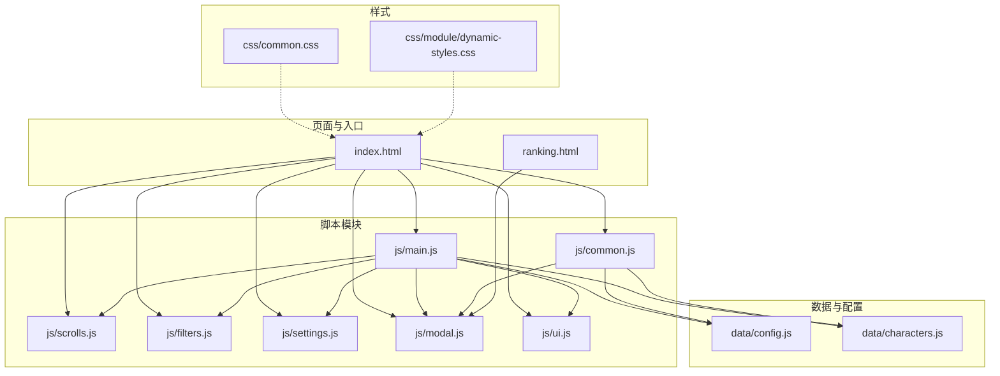
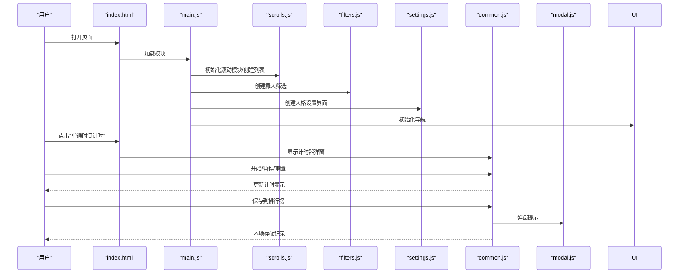
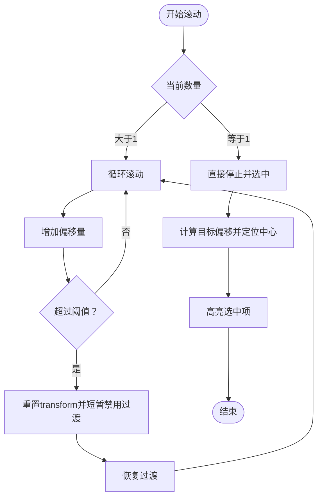
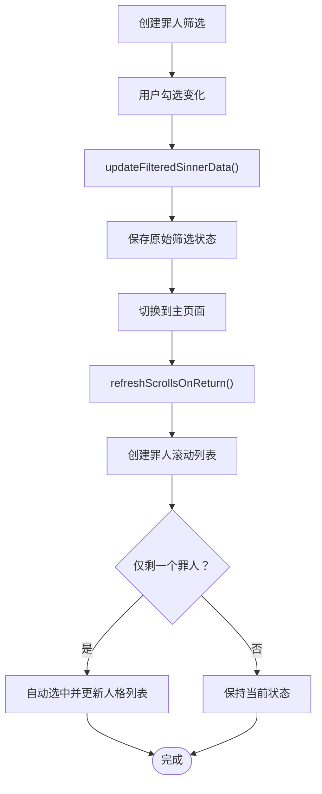
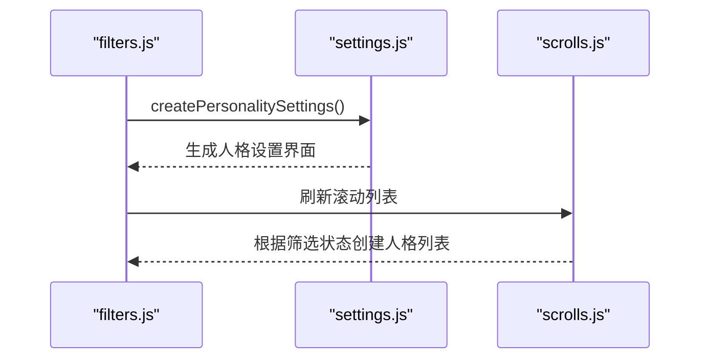
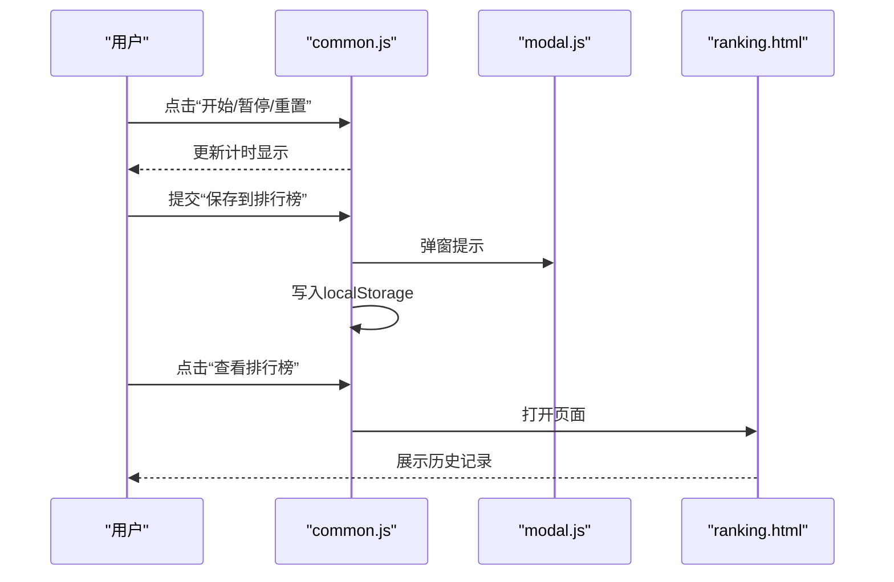
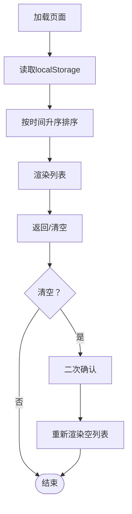
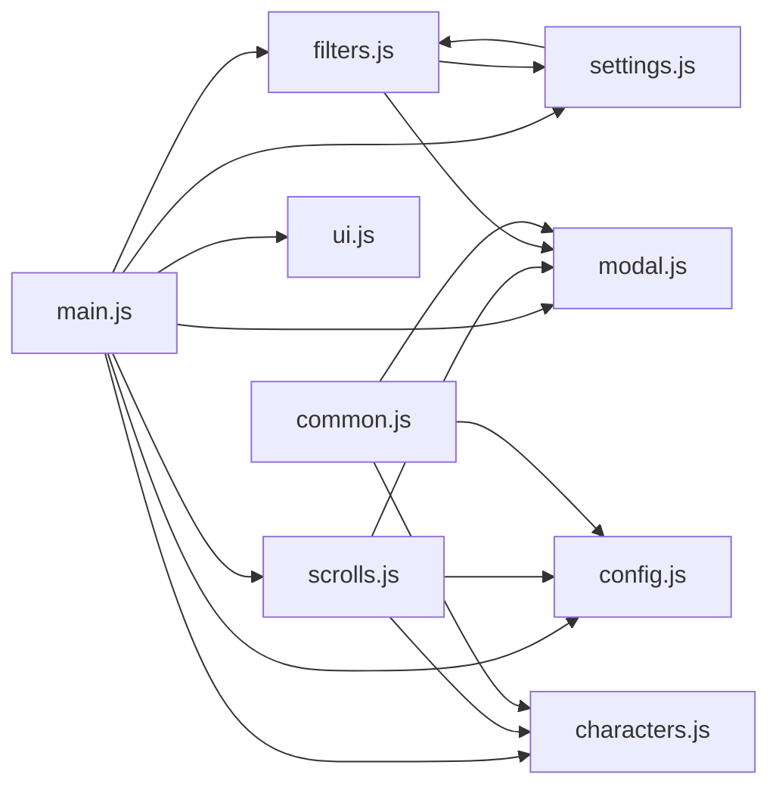

# 核心功能详解

<cite>
**本文引用的文件**
- [index.html](file://index.html)
- [ranking.html](file://ranking.html)
- [js/main.js](file://js/main.js)
- [js/scrolls.js](file://js/scrolls.js)
- [js/filters.js](file://js/filters.js)
- [js/settings.js](file://js/settings.js)
- [js/common.js](file://js/common.js)
- [js/modal.js](file://js/modal.js)
- [js/ui.js](file://js/ui.js)
- [data/config.js](file://data/config.js)
- [data/characters.js](file://data/characters.js)
</cite>

## 目录
1. [简介](#简介)
2. [项目结构](#项目结构)
3. [核心组件](#核心组件)
4. [架构总览](#架构总览)
5. [详细组件分析](#详细组件分析)
6. [依赖关系分析](#依赖关系分析)
7. [性能考量](#性能考量)
8. [故障排查指南](#故障排查指南)
9. [结论](#结论)
10. [附录](#附录)

## 简介
本文件围绕应用的五大核心功能进行深入剖析：
- 罪人选择：基于滚动列表的视觉随机抽取，结合CSS transform动画与安全随机算法。
- 人格选择：在罪人选定后，按筛选规则生成可选人格列表，支持随机抽取与高亮。
- 筛选设置：支持罪人全选/全不选/反选；支持按罪人维度的人格筛选全选/全不选/反选。
- 单通计时：提供弹窗计时器，支持开始、暂停、重置与本地排行榜保存。
- 排行榜系统：本地存储历史最佳记录，支持查看与清空。

文档同时梳理各功能之间的交互关系，并给出可视化图示与排障建议，帮助不同技术背景的读者快速理解与使用。

## 项目结构
应用采用模块化组织，HTML负责页面骨架与导航，JS模块分别承担业务逻辑、滚动与筛选、计时与排行榜、弹窗与UI辅助，CSS提供统一风格与动画效果。数据层通过独立的配置与角色数据文件提供常量与角色/人格元数据。

图表来源
- [index.html](file://index.html#L1-L176)
- [ranking.html](file://ranking.html#L1-L94)
- [js/main.js](file://js/main.js#L1-L261)
- [js/scrolls.js](file://js/scrolls.js#L1-L718)
- [js/filters.js](file://js/filters.js#L1-L274)
- [js/settings.js](file://js/settings.js#L1-L263)
- [js/common.js](file://js/common.js#L1-L326)
- [js/modal.js](file://js/modal.js#L1-L109)
- [js/ui.js](file://js/ui.js#L1-L66)
- [data/config.js](file://data/config.js#L1-L29)
- [data/characters.js](file://data/characters.js#L1-L260)

章节来源
- [index.html](file://index.html#L1-L176)
- [js/main.js](file://js/main.js#L1-L261)
- [data/config.js](file://data/config.js#L1-L29)
- [data/characters.js](file://data/characters.js#L1-L260)

## 核心组件
- 罪人/人格滚动模块：负责滚动列表构建、动画滚动、随机停止定位、高亮显示与状态重置。
- 筛选模块：负责罪人筛选复选框渲染、筛选状态更新、全选/反选、应用与校验。
- 人格设置模块：负责按罪人维度的人格筛选界面生成、全选/反选、状态持久化。
- 计时与排行榜模块：负责计时器弹窗、开始/暂停/重置、本地排行榜保存与查看。
- 弹窗与UI模块：提供统一的自定义弹窗与页面导航辅助。

章节来源
- [js/scrolls.js](file://js/scrolls.js#L1-L718)
- [js/filters.js](file://js/filters.js#L1-L274)
- [js/settings.js](file://js/settings.js#L1-L263)
- [js/common.js](file://js/common.js#L127-L326)
- [js/modal.js](file://js/modal.js#L1-L109)
- [js/ui.js](file://js/ui.js#L1-L66)

## 架构总览
下图展示了主页面与计时器弹窗的交互关系，以及主要模块的职责边界。

图表来源
- [index.html](file://index.html#L1-L176)
- [js/main.js](file://js/main.js#L1-L261)
- [js/scrolls.js](file://js/scrolls.js#L1-L718)
- [js/filters.js](file://js/filters.js#L1-L274)
- [js/settings.js](file://js/settings.js#L1-L263)
- [js/common.js](file://js/common.js#L127-L326)
- [js/modal.js](file://js/modal.js#L1-L109)

## 详细组件分析

### 罪人/人格滚动与随机抽取
- 滚动列表构建
  - 罪人滚动列表：根据筛选后的罪人数组，创建足够数量的虚拟条目以实现平滑循环滚动，容器高度随可见行数动态调整。
  - 人格滚动列表：在罪人选定后，按筛选规则过滤出可选人格，同样通过循环条目实现流畅滚动。
- CSS transform 动画
  - 通过设置滚动容器的 transition 与 transform: translateY 实现平滑滚动与定位。
  - 在循环滚动时，超出阈值后重置 transform 并短暂禁用过渡，随后恢复过渡，形成“加速-减速”的真实感。
- 随机算法与定位
  - 使用安全随机整数函数从筛选后的数据集中随机选择索引。
  - 停止时计算目标偏移，使选中项位于中心行，随后高亮显示。
- 高亮与状态管理
  - 通过 dataset.originalIndex 匹配原始索引，实现精准高亮。
  - 维护当前选中罪人/人格与滚动状态，防止并发冲突。

图表来源
- [js/scrolls.js](file://js/scrolls.js#L281-L478)
- [data/config.js](file://data/config.js#L1-L29)

章节来源
- [js/scrolls.js](file://js/scrolls.js#L1-L718)
- [data/config.js](file://data/config.js#L1-L29)

### 罪人筛选逻辑（filters.js）
- 罪人筛选复选框渲染：遍历角色数据，生成带头像与名称的复选框，图片加载失败时回退为占位符。
- 筛选状态更新：根据勾选状态过滤出筛选后的罪人数组，更新全局 window.filteredSinnerData，并在必要时标记未保存更改。
- 全选/全不选/反选：批量修改复选框状态并触发更新。
- 应用筛选与校验：应用时验证至少选择一个罪人且每个罪人至少选择一个人格；返回主页面时刷新滚动列表与高亮状态。

图表来源
- [js/filters.js](file://js/filters.js#L1-L274)
- [data/characters.js](file://data/characters.js#L1-L260)

章节来源
- [js/filters.js](file://js/filters.js#L1-L274)
- [data/characters.js](file://data/characters.js#L1-L260)

### 人格筛选设置（settings.js）
- 全局与按罪人维度的人格筛选界面：根据当前选中的罪人生成分页卡片，支持全选/全不选/反选。
- 筛选状态持久化：以 window.filteredPersonalityData 为键空间，按罪人ID与人格索引维护布尔状态。
- 与滚动模块协作：当罪人列表变化时，滚动模块会根据该状态过滤出可选人格并创建列表。

图表来源
- [js/settings.js](file://js/settings.js#L1-L263)
- [js/filters.js](file://js/filters.js#L1-L274)
- [js/scrolls.js](file://js/scrolls.js#L1-L718)

章节来源
- [js/settings.js](file://js/settings.js#L1-L263)
- [js/filters.js](file://js/filters.js#L1-L274)
- [js/scrolls.js](file://js/scrolls.js#L1-L718)

### 单通计时与本地排行榜（common.js）
- 计时器弹窗：提供开始、暂停、重置按钮与时间显示，支持点击弹窗外部关闭。
- 本地排行榜保存：表单提交时将当前计时、备注、时间戳与当前选中角色信息写入 localStorage 的 personalRanking 数组。
- 查看排行榜：在新窗口打开 ranking.html，使用本地存储数据渲染历史记录。

图表来源
- [js/common.js](file://js/common.js#L127-L326)
- [js/modal.js](file://js/modal.js#L1-L109)
- [ranking.html](file://ranking.html#L1-L94)

章节来源
- [js/common.js](file://js/common.js#L127-L326)
- [ranking.html](file://ranking.html#L1-L94)
- [js/modal.js](file://js/modal.js#L1-L109)

### 排行榜页面（ranking.html）
- 数据来源：从 localStorage 读取 personalRanking，按时间升序排序展示。
- 功能：返回主页、清空记录（二次确认），无记录时显示提示。

图表来源
- [ranking.html](file://ranking.html#L1-L94)

章节来源
- [ranking.html](file://ranking.html#L1-L94)

## 依赖关系分析
- 模块耦合
  - main.js 作为中枢，导入并协调 scrolls.js、filters.js、settings.js、ui.js、modal.js 与 data/config.js、data/characters.js。
  - scrolls.js 依赖 data/config.js 与 data/characters.js，以及 modal.js。
  - filters.js 与 settings.js 通过 window 对象共享筛选状态，降低跨模块耦合。
  - common.js 独立负责计时器与排行榜，与主页面通过全局变量交互。
- 外部依赖
  - 弹窗依赖自定义 modal.js。
  - 排行榜依赖 localStorage。
  - 页面样式依赖 common.css 与 dynamic-styles.css。

图表来源
- [js/main.js](file://js/main.js#L1-L261)
- [js/scrolls.js](file://js/scrolls.js#L1-L718)
- [js/filters.js](file://js/filters.js#L1-L274)
- [js/settings.js](file://js/settings.js#L1-L263)
- [js/ui.js](file://js/ui.js#L1-L66)
- [js/modal.js](file://js/modal.js#L1-L109)
- [data/config.js](file://data/config.js#L1-L29)
- [data/characters.js](file://data/characters.js#L1-L260)
- [js/common.js](file://js/common.js#L127-L326)

章节来源
- [js/main.js](file://js/main.js#L1-L261)
- [js/scrolls.js](file://js/scrolls.js#L1-L718)
- [js/filters.js](file://js/filters.js#L1-L274)
- [js/settings.js](file://js/settings.js#L1-L263)
- [js/ui.js](file://js/ui.js#L1-L66)
- [js/modal.js](file://js/modal.js#L1-L109)
- [data/config.js](file://data/config.js#L1-L29)
- [data/characters.js](file://data/characters.js#L1-L260)
- [js/common.js](file://js/common.js#L127-L326)

## 性能考量
- 滚动性能
  - 使用 transform: translateY 与硬件加速的 transition，减少重绘。
  - 通过循环条目与阈值重置，避免 DOM 节点过多导致卡顿。
- 随机算法
  - 使用安全随机整数函数，保证公平性与不可预测性。
- 事件与状态
  - 通过 window 对象共享筛选状态，避免频繁跨模块通信。
  - 在应用筛选与返回主页面时，仅在必要时刷新滚动列表，减少不必要的 DOM 操作。
- 计时器
  - 使用单个定时器与秒级更新，避免高频重绘。
  - 本地存储读写在提交时一次性完成，避免阻塞主线程。

[本节为通用指导，无需特定文件来源]

## 故障排查指南
- 罪人/人格无法选择
  - 检查筛选设置：确保至少选择一个罪人与每个罪人至少选择一个人格。
  - 检查滚动状态：开始按钮在仅剩一个罪人/人格时会自动禁用，需先应用筛选。
- 滚动卡顿或跳帧
  - 检查 CSS transition 与 transform 是否被覆盖。
  - 减少可见行数或降低滚动速度配置。
- 排行榜为空
  - 确认已保存记录且未清空 localStorage。
  - 检查浏览器隐私模式或存储限制。
- 计时器无法保存
  - 确认计时器已运行至少1秒。
  - 检查浏览器弹窗拦截与 localStorage 权限。

章节来源
- [js/filters.js](file://js/filters.js#L117-L170)
- [js/scrolls.js](file://js/scrolls.js#L281-L478)
- [js/common.js](file://js/common.js#L160-L217)
- [ranking.html](file://ranking.html#L1-L94)

## 结论
本应用通过模块化的 JS 架构与清晰的职责划分，实现了流畅的滚动随机抽取、灵活的筛选设置、便捷的计时与本地排行榜功能。核心亮点包括：
- 基于 transform 的高性能滚动动画与安全随机定位。
- 以 window 对象为枢纽的状态共享，简化模块间协作。
- 统一的自定义弹窗与页面导航，提升用户体验。
- 本地存储驱动的排行榜，便于离线使用与分享。

建议在后续迭代中：
- 增加筛选状态的持久化（localStorage）以提升体验。
- 优化移动端滚动交互与触摸反馈。
- 提供筛选规则的导出/导入能力，便于团队共享。

[本节为总结性内容，无需特定文件来源]

## 附录
- 关键交互流程（罪人/人格选择到计时保存）
  - 用户在主页面选择罪人与人格，滚动模块完成随机抽取与高亮。
  - 用户打开计时器弹窗，进行开始/暂停/重置操作。
  - 用户提交“保存到排行榜”，common.js 将当前计时与角色信息写入 localStorage。
  - 用户可在 ranking.html 查看历史记录。

章节来源
- [js/main.js](file://js/main.js#L160-L261)
- [js/scrolls.js](file://js/scrolls.js#L1-L718)
- [js/common.js](file://js/common.js#L127-L326)
- [ranking.html](file://ranking.html#L1-L94)