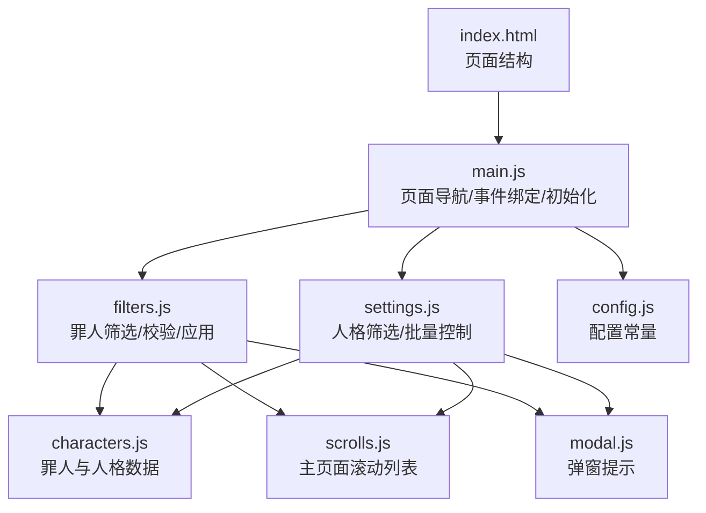
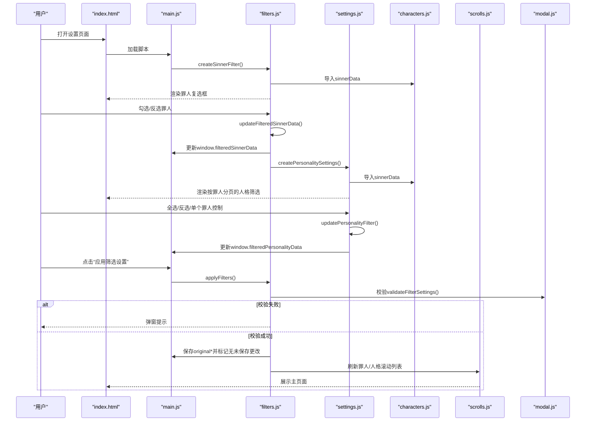
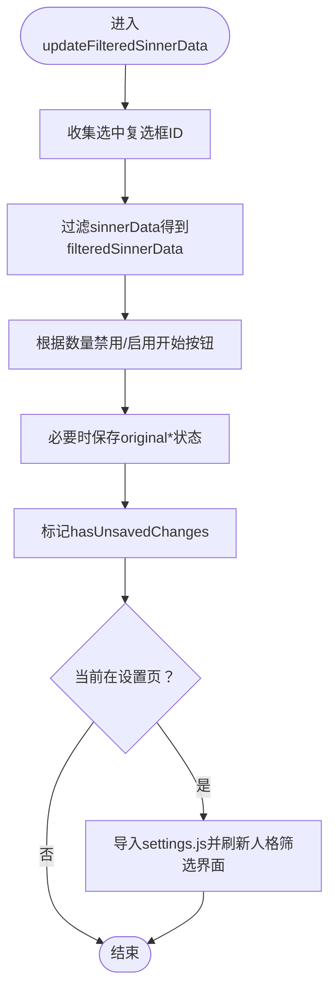
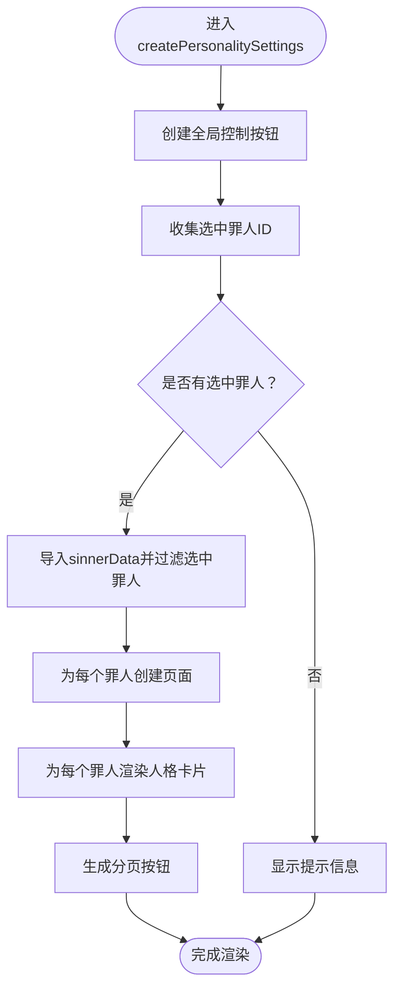
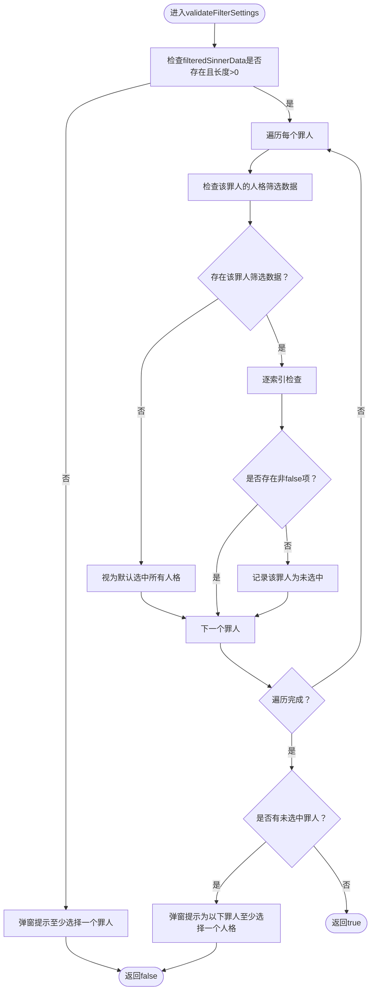
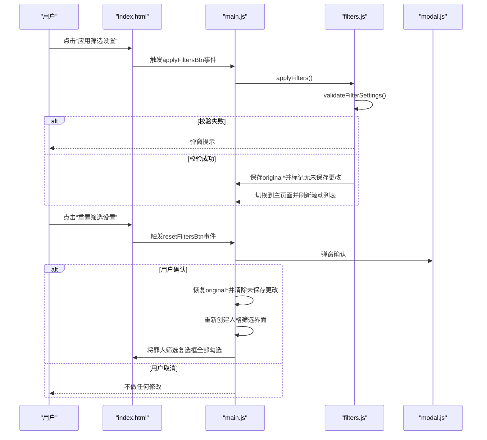
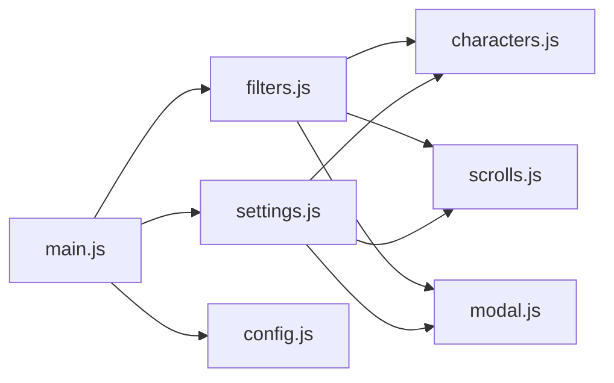

# 筛选设置功能

<cite>
**本文引用的文件**
- [filters.js](file://js/filters.js)
- [settings.js](file://js/settings.js)
- [index.html](file://index.html)
- [main.js](file://js/main.js)
- [scrolls.js](file://js/scrolls.js)
- [characters.js](file://data/characters.js)
- [config.js](file://data/config.js)
- [modal.js](file://js/modal.js)
</cite>

## 目录
1. [简介](#简介)
2. [项目结构](#项目结构)
3. [核心组件](#核心组件)
4. [架构总览](#架构总览)
5. [详细组件分析](#详细组件分析)
6. [依赖关系分析](#依赖关系分析)
7. [性能考量](#性能考量)
8. [故障排查指南](#故障排查指南)
9. [结论](#结论)

## 简介
本文件系统性阐述筛选设置功能的架构与实现，围绕以下目标展开：
- filters.js 中的 createSinnerFilter 如何渲染罪人筛选界面，通过复选框允许用户选择参与随机的罪人，并通过 updateFilteredSinnerData 实时更新 window.filteredSinnerData 状态。
- settings.js 中的 createPersonalitySettings 如何实现按罪人分页的人格筛选界面，包括全局控制（全选/全不选/反选）和单个罪人专属控制；toggleAllPersonalities、invertAllPersonalities 等函数如何批量操作筛选状态。
- Filters.validateFilterSettings 如何确保筛选规则的有效性（至少选择一个罪人，且每个罪人至少有一个可用人格）。
- 结合 index.html 中的设置页面结构，说明应用和重置按钮如何通过 applyFilters 和 resetFiltersBtn 实现筛选状态的持久化与恢复。

## 项目结构
筛选设置功能涉及多个模块协同工作：
- 主入口与页面导航：index.html 定义页面结构；main.js 负责页面切换、事件绑定、初始化与状态管理。
- 罪人筛选：filters.js 负责渲染罪人复选框、更新筛选状态、校验有效性、应用与返回主页面。
- 人格筛选：settings.js 负责渲染按罪人分页的人格筛选界面、批量控制、更新单个人格筛选状态。
- 数据与配置：characters.js 提供罪人与人格数据；config.js 提供滚动与界面配置；modal.js 提供自定义弹窗。
- 滚动交互：scrolls.js 负责滚动列表渲染与滚动行为，配合筛选状态在主页面生效。

图表来源
- [index.html](file://index.html#L1-L176)
- [main.js](file://js/main.js#L1-L261)
- [filters.js](file://js/filters.js#L1-L274)
- [settings.js](file://js/settings.js#L1-L263)
- [characters.js](file://data/characters.js#L1-L260)
- [scrolls.js](file://js/scrolls.js#L1-L718)
- [config.js](file://data/config.js#L1-L29)
- [modal.js](file://js/modal.js#L1-L109)

章节来源
- [index.html](file://index.html#L1-L176)
- [main.js](file://js/main.js#L1-L261)

## 核心组件
- 罪人筛选模块（filters.js）
  - createSinnerFilter：动态创建罪人筛选复选框，支持头像占位与错误回退，绑定 change 事件以更新筛选状态。
  - updateFilteredSinnerData：根据复选框状态计算 window.filteredSinnerData，更新开始按钮可用性，标记未保存更改，并在设置页时刷新人格筛选界面。
  - toggleAllCheckboxes/invertSelection：提供全选/全不选/反选的快捷操作。
  - validateFilterSettings：校验至少选择一个罪人，且每个罪人至少有一个可用人格。
  - applyFilters：在通过校验后持久化筛选状态，切换到主页面并刷新滚动列表。
  - refreshScrollsOnReturn：从设置页返回主页面时，根据当前筛选状态刷新罪人与人格滚动列表。
- 人格筛选模块（settings.js）
  - createPersonalitySettings：按选中的罪人分页渲染人格筛选卡片，提供全局与每页的批量控制。
  - updatePersonalityFilter：更新单个人格的筛选状态（true/false），并标记未保存更改。
  - toggleAllPersonalities/invertAllPersonalities/toggleSinnerPersonalities/invertSinnerPersonalities：批量控制函数，触发 change 事件以联动更新内部状态。
- 主入口（main.js）
  - 初始化窗口全局筛选状态（window.filteredSinnerData、window.filteredPersonalityData、original*、hasUnsavedChanges）。
  - 绑定“应用筛选设置”“重置筛选设置”按钮事件，实现状态持久化与恢复。
  - 页面切换时检查未保存更改并提示保存。
- 数据与配置（characters.js、config.js）
  - 提供罪人与人格数据结构，以及滚动与界面配置常量。
- 弹窗（modal.js）
  - 提供 alert/confirm，用于校验失败与用户确认提示。

章节来源
- [filters.js](file://js/filters.js#L1-L274)
- [settings.js](file://js/settings.js#L1-L263)
- [main.js](file://js/main.js#L1-L261)
- [characters.js](file://data/characters.js#L1-L260)
- [config.js](file://data/config.js#L1-L29)
- [modal.js](file://js/modal.js#L1-L109)

## 架构总览
筛选设置功能采用模块化设计，通过 window 对象共享筛选状态，确保各模块读取一致的数据。页面结构由 index.html 提供，主入口 main.js 负责初始化与事件绑定，filters.js 与 settings.js 分别负责两类筛选界面的渲染与交互，scrolls.js 将筛选结果映射到主页面的滚动列表，modal.js 提供统一的用户提示。

图表来源
- [index.html](file://index.html#L1-L176)
- [main.js](file://js/main.js#L1-L261)
- [filters.js](file://js/filters.js#L1-L274)
- [settings.js](file://js/settings.js#L1-L263)
- [characters.js](file://data/characters.js#L1-L260)
- [scrolls.js](file://js/scrolls.js#L1-L718)
- [modal.js](file://js/modal.js#L1-L109)

## 详细组件分析

### 罪人筛选界面渲染与状态更新（filters.js）
- createSinnerFilter
  - 作用：清空并渲染罪人筛选容器，为每个罪人创建带头像的复选框标签，绑定 change 事件到 updateFilteredSinnerData。
  - 头像回退：若罪人头像加载失败，替换为占位符。
  - 初始化：首次渲染后手动调用 updateFilteredSinnerData，确保初始状态正确。
- updateFilteredSinnerData
  - 作用：收集选中的罪人ID，过滤出 window.filteredSinnerData；根据选中数量禁用/启用开始按钮；更新 window.originalFilteredSinnerData 与 window.originalFilteredPersonalityData（仅在未保存更改时）；标记 hasUnsavedChanges；在设置页时刷新人格筛选界面。
  - 开始按钮逻辑：当选中数量为0或仅剩1个时禁用开始按钮，避免无法继续流程。
- 批量控制
  - toggleAllCheckboxes/selectAll：全选/全不选，随后统一调用 updateFilteredSinnerData。
  - invertSelection：反选，随后统一调用 updateFilteredSinnerData。
- 校验与应用
  - validateFilterSettings：确保至少选择一个罪人；对每个罪人检查其人格筛选状态，只有当某罪人所有人格均被明确设为 false 时才视为未选中任何人格。
  - applyFilters：通过校验后，保存当前筛选状态为 original*，清除未保存更改标记，切换到主页面并刷新滚动列表。

图表来源
- [filters.js](file://js/filters.js#L60-L101)

章节来源
- [filters.js](file://js/filters.js#L16-L101)

### 按罪人分页的人格筛选界面（settings.js）
- createPersonalitySettings
  - 全局控制区：提供“全选所有人格”“取消所有人格”“反选所有人格”按钮，绑定 toggleAllPersonalities/invertAllPersonalities。
  - 分页渲染：基于选中的罪人ID过滤出当前罪人集合，为每个罪人创建独立页面（含标题与专属控制按钮），并在页面内渲染人格网格卡片。
  - 卡片结构：包含头像（加载失败时显示占位）、名称与启用开关（复选框）。
  - 默认状态：若未设置该罪人的人格筛选状态，则默认启用所有人格。
  - 分页按钮：为每个罪人生成分页按钮，点击切换 active 页面。
- 批量控制函数
  - toggleAllPersonalities/invertAllPersonalities：遍历所有复选框，设置 checked 并 dispatchEvent('change') 以更新内部状态。
  - toggleSinnerPersonalities/invertSinnerPersonalities：针对指定罪人的复选框执行相同操作。
- 单个控制
  - updatePersonalityFilter：根据 dataset.sinnerId 与 dataset.personaIndex 更新 window.filteredPersonalityData，并标记未保存更改。

图表来源
- [settings.js](file://js/settings.js#L61-L255)

章节来源
- [settings.js](file://js/settings.js#L1-L263)

### 筛选规则校验（filters.js）
- validateFilterSettings
  - 至少一个罪人：若 window.filteredSinnerData 为空或长度为0，弹窗提示并返回失败。
  - 每个罪人至少一人格：遍历 window.filteredSinnerData，对每个罪人检查 window.filteredPersonalityData 对应项；若存在该罪人筛选数据，则逐索引判断：缺失或非 false 的项视为被选中；若不存在该罪人筛选数据，则视为默认选中所有人格。若发现某罪人所有人格均被明确设为 false，则加入未选中名单并弹窗提示。

图表来源
- [filters.js](file://js/filters.js#L118-L157)

章节来源
- [filters.js](file://js/filters.js#L118-L157)

### 设置页面与应用/重置按钮（index.html + main.js）
- 页面结构（index.html）
  - 设置页包含“罪人筛选设置”区域（含全局控制按钮与 sinner-filter 容器）、“人格整体筛选设置”区域（personality-settings-container）以及“应用筛选设置”“重置筛选设置”操作按钮。
- 应用按钮（applyFilters）
  - 绑定在 main.js 中，点击后调用 Filters.applyFilters。
  - applyFilters 内部先调用 validateFilterSettings 校验，通过后保存当前筛选状态为 original*，清除未保存更改标记，切换到主页面并刷新滚动列表。
- 重置按钮（resetFiltersBtn）
  - 绑定在 main.js 中，点击后弹窗确认，确认后将 window.filteredSinnerData 与 window.filteredPersonalityData 恢复到 original*，清除未保存更改标记，重新创建人格筛选界面，并将罪人筛选复选框全部勾选。
- 未保存更改检测
  - main.js 在返回主页面前检查 window.hasUnsavedChanges，若有未保存更改，弹窗询问是否保存后再离开；若选择保存，则调用 Filters.applyFilters。

图表来源
- [index.html](file://index.html#L80-L113)
- [main.js](file://js/main.js#L117-L146)
- [filters.js](file://js/filters.js#L159-L184)
- [modal.js](file://js/modal.js#L74-L106)

章节来源
- [index.html](file://index.html#L80-L113)
- [main.js](file://js/main.js#L117-L146)
- [filters.js](file://js/filters.js#L159-L184)
- [modal.js](file://js/modal.js#L74-L106)

## 依赖关系分析
- 模块耦合
  - filters.js 与 settings.js 通过 window 对象共享筛选状态，耦合度低但依赖强（需保证状态一致性）。
  - main.js 同时依赖 filters.js 与 settings.js，承担页面导航与事件协调职责。
  - scrolls.js 依赖 window.filteredSinnerData 与 window.filteredPersonalityData 来渲染滚动列表。
  - modal.js 作为通用弹窗服务，被 filters.js 与 scrolls.js 等模块调用。
- 外部数据
  - characters.js 提供罪人与人格数据，filters.js 与 settings.js 在渲染时动态导入。
- 配置
  - config.js 提供滚动与界面配置，影响滚动列表高度、按钮状态等。

图表来源
- [main.js](file://js/main.js#L1-L261)
- [filters.js](file://js/filters.js#L1-L274)
- [settings.js](file://js/settings.js#L1-L263)
- [scrolls.js](file://js/scrolls.js#L1-L718)
- [characters.js](file://data/characters.js#L1-L260)
- [config.js](file://data/config.js#L1-L29)
- [modal.js](file://js/modal.js#L1-L109)

章节来源
- [main.js](file://js/main.js#L1-L261)
- [filters.js](file://js/filters.js#L1-L274)
- [settings.js](file://js/settings.js#L1-L263)
- [scrolls.js](file://js/scrolls.js#L1-L718)
- [characters.js](file://data/characters.js#L1-L260)
- [config.js](file://data/config.js#L1-L29)
- [modal.js](file://js/modal.js#L1-L109)

## 性能考量
- 动态导入数据：filters.js 与 settings.js 在渲染时动态 import characters.js，避免主入口阻塞，提升首屏加载效率。
- 事件驱动更新：罪人与人格筛选均通过 change 事件触发 updateFilteredSinnerData 或 updatePersonalityFilter，减少不必要的全量重绘。
- 滚动优化：scrolls.js 通过循环复制项目与固定可见行数，确保滚动流畅；在只有一个项目时直接高亮，避免多余动画。
- 状态持久化：通过 window 对象共享状态，避免跨模块重复计算，降低内存占用与计算成本。

## 故障排查指南
- 病例1：应用筛选后开始按钮不可用
  - 检查罪人筛选数量：当选中数量为0或仅剩1个时，开始按钮会被禁用。请至少选择两个罪人。
  - 参考路径：[filters.js](file://js/filters.js#L60-L101)
- 病例2：应用筛选时报错“请至少选择一个罪人”
  - 检查 filters.js 的 validateFilterSettings 是否被调用，确保至少有一个罪人被选中。
  - 参考路径：[filters.js](file://js/filters.js#L118-L157)
- 病例3：应用筛选时报错“请为以下罪人至少选择一个人格”
  - 检查该罪人的人格筛选状态：若所有人格均被明确设为 false，则视为未选中任何人格。
  - 参考路径：[filters.js](file://js/filters.js#L118-L157)
- 病例4：重置筛选后未恢复到原始状态
  - 确认 main.js 的 resetFiltersBtn 逻辑是否执行：恢复 original*，清除未保存更改，重新创建人格筛选界面并勾选所有罪人。
  - 参考路径：[main.js](file://js/main.js#L125-L146)
- 病例5：头像加载失败导致空白
  - 罪人与人格头像加载失败时会显示占位符；检查资源路径与网络连接。
  - 参考路径：[filters.js](file://js/filters.js#L37-L47)，[settings.js](file://js/settings.js#L170-L181)

章节来源
- [filters.js](file://js/filters.js#L37-L47)
- [filters.js](file://js/filters.js#L118-L157)
- [main.js](file://js/main.js#L125-L146)
- [settings.js](file://js/settings.js#L170-L181)

## 结论
筛选设置功能通过模块化设计实现了清晰的职责分离：filters.js 负责罪人筛选与状态持久化，settings.js 负责按罪人分页的人格筛选与批量控制，main.js 协调页面导航与事件，scrolls.js 将筛选结果映射到主页面滚动列表。通过 window 对象共享状态与统一的校验机制，系统在易用性与一致性之间取得良好平衡。建议后续可考虑引入更细粒度的状态管理方案以进一步降低模块间耦合。