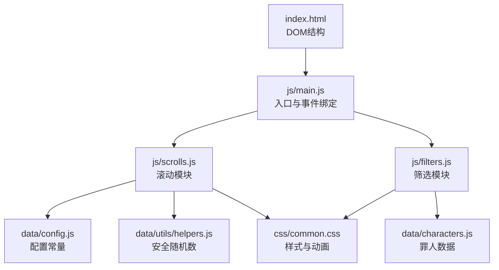
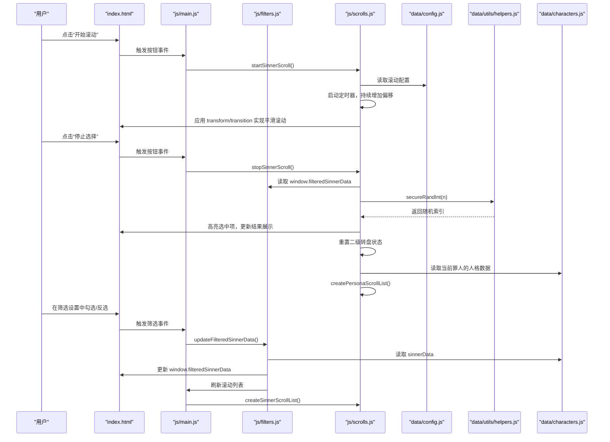
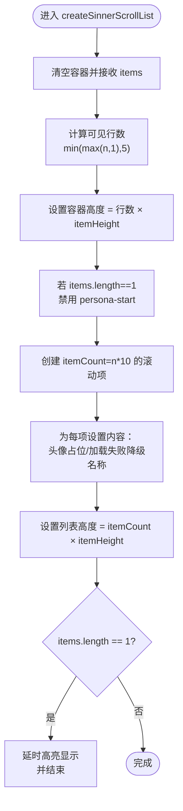
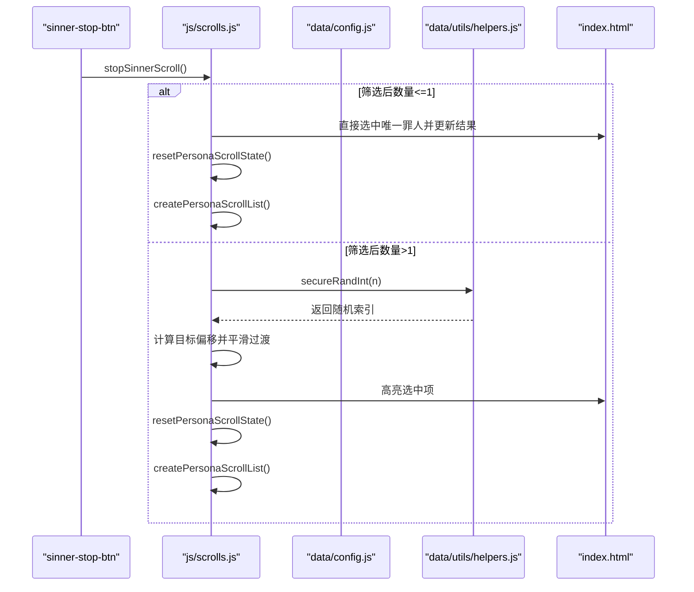
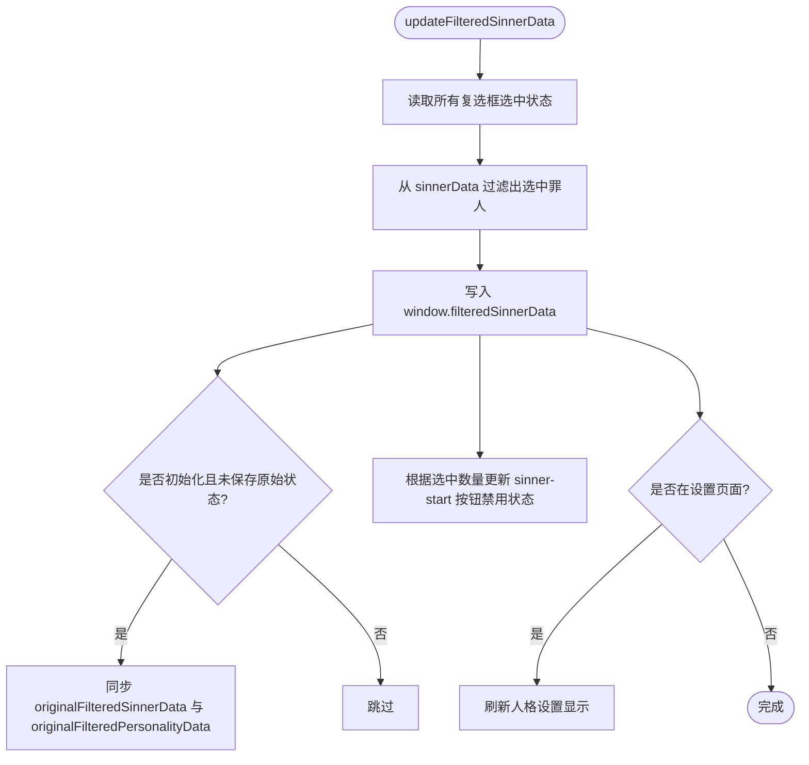
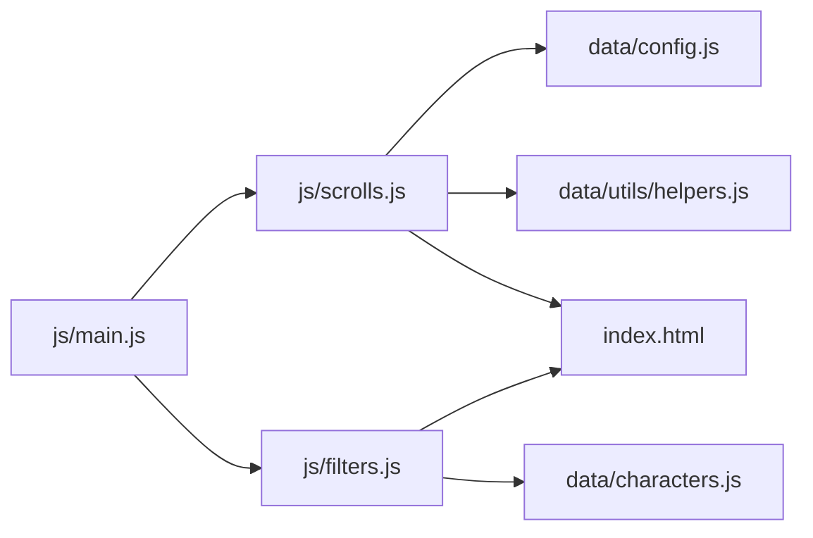

# 罪人选择功能

<cite>
**本文引用的文件**
- [index.html](file://index.html)
- [js/main.js](file://js/main.js)
- [js/scrolls.js](file://js/scrolls.js)
- [js/filters.js](file://js/filters.js)
- [data/config.js](file://data/config.js)
- [data/utils/helpers.js](file://data/utils/helpers.js)
- [data/characters.js](file://data/characters.js)
- [css/common.css](file://css/common.css)
</cite>

## 目录
1. [简介](#简介)
2. [项目结构](#项目结构)
3. [核心组件](#核心组件)
4. [架构总览](#架构总览)
5. [详细组件分析](#详细组件分析)
6. [依赖分析](#依赖分析)
7. [性能考量](#性能考量)
8. [故障排查指南](#故障排查指南)
9. [结论](#结论)

## 简介
本文件深入剖析“罪人选择功能”的实现机制，围绕以下目标展开：
- 解释 scrolls.js 中 createSinnerScrollList 如何基于筛选后的罪人数据动态创建滚动列表，并通过 CSS transform 和 transition 实现平滑滚动动画。
- 说明 startSinnerScroll 与 stopSinnerScroll 如何控制滚动开始与停止，以及 secureRandInt 如何确保随机选择的公平性。
- 阐述 filters.js 中 updateFilteredSinnerData 如何维护 window.filteredSinnerData 全局状态，实现罪人筛选逻辑。
- 结合 index.html 的 DOM 结构，说明滚动容器、按钮控件与结果展示区域的交互关系。
- 提供处理边界情况的示例，包括仅有一个罪人时直接选中，以及无罪人被选中时的错误提示。

## 项目结构
该功能涉及的主要文件与职责如下：
- index.html：定义滚动容器、按钮控件与结果展示区域的 DOM 结构。
- js/main.js：应用入口，负责初始化滚动模块、绑定按钮事件、管理全局状态与页面切换。
- js/scrolls.js：滚动模块，负责创建滚动列表、控制滚动启停、高亮选中项、调用安全随机数。
- js/filters.js：筛选模块，负责构建罪人筛选复选框、维护 window.filteredSinnerData、校验筛选设置。
- data/config.js：配置常量，统一控制滚动速度、过渡时长、可见行数等。
- data/utils/helpers.js：提供安全随机数 secureRandInt，保证随机选择的公平性。
- data/characters.js：罪人与人格数据源。
- css/common.css：滚动列表、按钮、高亮等样式，支撑 transform/transition 动画。

图表来源
- [index.html](file://index.html#L35-L76)
- [js/main.js](file://js/main.js#L160-L206)
- [js/scrolls.js](file://js/scrolls.js#L46-L111)
- [js/filters.js](file://js/filters.js#L16-L101)
- [data/config.js](file://data/config.js#L1-L29)
- [data/utils/helpers.js](file://data/utils/helpers.js#L1-L19)
- [data/characters.js](file://data/characters.js#L1-L260)
- [css/common.css](file://css/common.css#L86-L137)

章节来源
- [index.html](file://index.html#L35-L76)
- [js/main.js](file://js/main.js#L160-L206)

## 核心组件
- 滚动模块（scrolls.js）
  - 负责创建罪人/人格滚动列表、控制滚动启停、计算偏移、高亮选中项、调用安全随机数。
- 筛选模块（filters.js）
  - 负责构建罪人筛选复选框、维护 window.filteredSinnerData、校验筛选设置、应用筛选并刷新滚动列表。
- 配置模块（data/config.js）
  - 统一提供 itemHeight、scrollSpeed、transitionDuration、transitionType、totalHeightMultiplier 等参数。
- 安全随机数（data/utils/helpers.js）
  - 提供 secureRandInt，优先使用 Web Crypto API，回退到 Math.random，确保随机性与公平性。
- 数据源（data/characters.js）
  - 提供罪人与人格的完整数据集，作为筛选与滚动的基础。

章节来源
- [js/scrolls.js](file://js/scrolls.js#L46-L111)
- [js/filters.js](file://js/filters.js#L16-L101)
- [data/config.js](file://data/config.js#L1-L29)
- [data/utils/helpers.js](file://data/utils/helpers.js#L1-L19)
- [data/characters.js](file://data/characters.js#L1-L260)

## 架构总览
下图展示了从 DOM 到滚动模块与筛选模块的交互流程，以及全局状态的流转。

图表来源
- [index.html](file://index.html#L35-L76)
- [js/main.js](file://js/main.js#L196-L202)
- [js/scrolls.js](file://js/scrolls.js#L281-L478)
- [js/filters.js](file://js/filters.js#L59-L101)
- [data/config.js](file://data/config.js#L1-L29)
- [data/utils/helpers.js](file://data/utils/helpers.js#L1-L19)
- [data/characters.js](file://data/characters.js#L1-L260)

## 详细组件分析

### 滚动列表创建：createSinnerScrollList
- 输入：筛选后的罪人数组（window.filteredSinnerData）。
- 输出：在 sinner-scroll 容器中动态生成足够数量的滚动项，使列表可无限循环滚动。
- 关键实现要点：
  - 计算可见行数（最小1行，最大5行），据此设置容器高度。
  - 为每个罪人复制大量滚动项（数量为筛选数的10倍），通过 dataset.originalIndex 映射原始索引，确保定位与高亮准确。
  - 头像加载失败时降级为占位符，名称显示罪人名。
  - 若仅剩一个罪人，直接高亮显示并结束滚动。
  - 为 persona-start 按钮设置禁用/启用状态（仅剩一个罪人时禁用二级转盘）。

图表来源
- [js/scrolls.js](file://js/scrolls.js#L46-L111)

章节来源
- [js/scrolls.js](file://js/scrolls.js#L46-L111)

### 滚动启停控制：startSinnerScroll 与 stopSinnerScroll
- startSinnerScroll：
  - 若筛选后罪人数量为0，弹出提示并返回；为1时直接调用 stopSinnerScroll。
  - 启动定时器，按 Config.scrollSpeed 增加 sinnerOffset，并通过 transform: translateY(-offset) 实现滚动。
  - 使用 totalHeightMultiplier 与循环重置逻辑，确保滚动无缝循环。
  - 在循环重置瞬间临时关闭 transition，再恢复，避免视觉跳变。
- stopSinnerScroll：
  - 若筛选后数量为0或1，直接选中唯一罪人，更新结果展示，重置二级转盘状态，并创建对应的人格列表。
  - 若有多个罪人，调用 secureRandInt 生成随机索引，定位到中心行附近，平滑过渡到目标偏移，随后高亮选中项。
  - 重置按钮状态，清空二级转盘状态，创建人格列表。

图表来源
- [js/scrolls.js](file://js/scrolls.js#L281-L478)
- [data/config.js](file://data/config.js#L1-L29)
- [data/utils/helpers.js](file://data/utils/helpers.js#L1-L19)
- [index.html](file://index.html#L35-L76)

章节来源
- [js/scrolls.js](file://js/scrolls.js#L281-L478)

### 安全随机数：secureRandInt
- 优先使用 window.crypto && crypto.randomInt（现代浏览器）。
- 回退到 window.crypto && crypto.getRandomValues（兼容旧版）。
- 最终回退到 Math.random，确保在极端情况下仍能工作。
- 该函数被 stopSinnerScroll 与 stopPersonaScroll 调用，保障随机选择的公平性。

章节来源
- [data/utils/helpers.js](file://data/utils/helpers.js#L1-L19)
- [js/scrolls.js](file://js/scrolls.js#L406-L415)
- [js/scrolls.js](file://js/scrolls.js#L654-L656)

### 筛选状态维护：updateFilteredSinnerData
- 读取所有罪人复选框的选中状态，计算选中罪人 ID 集合。
- 从 data/characters.js 中过滤出筛选后的罪人数组，写入 window.filteredSinnerData。
- 在初始化阶段，若尚未保存原始筛选状态，则同步保存 originalFilteredSinnerData 与 originalFilteredPersonalityData。
- 根据当前选中数量调整 sinner-start 按钮的禁用状态（0或1时禁用）。
- 触发设置页面的人格设置刷新（如在设置页）。

图表来源
- [js/filters.js](file://js/filters.js#L59-L101)

章节来源
- [js/filters.js](file://js/filters.js#L59-L101)

### DOM 结构与交互关系
- 滚动容器：
  - 罪人滚动容器：id="sinner-scroll-container"，内部为 id="sinner-scroll" 的 scroll-list。
  - 人格滚动容器：id="persona-scroll-container"，内部为 id="persona-scroll" 的 scroll-list。
- 控件：
  - 罪人：sinner-start-btn、sinner-stop-btn。
  - 人格：persona-start-btn、persona-stop-btn。
- 结果展示：
  - 当前选中罪人：id="selected-sinner"。
  - 当前选中人格：id="selected-persona"。

章节来源
- [index.html](file://index.html#L35-L76)

## 依赖分析
- 模块耦合关系：
  - js/main.js 依赖 js/scrolls.js 与 js/filters.js，负责事件绑定与全局状态管理。
  - js/scrolls.js 依赖 data/config.js 与 data/utils/helpers.js，同时读取 window.filteredSinnerData 与 window.filteredPersonalityData。
  - js/filters.js 依赖 data/characters.js，维护 window.filteredSinnerData，并在应用筛选后刷新滚动列表。
- 外部依赖：
  - 浏览器 Web Crypto API（优先）用于安全随机数。
  - CSS transform/transition 用于平滑滚动与高亮动画。

图表来源
- [js/main.js](file://js/main.js#L160-L206)
- [js/scrolls.js](file://js/scrolls.js#L1-L43)
- [js/filters.js](file://js/filters.js#L1-L20)
- [data/config.js](file://data/config.js#L1-L29)
- [data/utils/helpers.js](file://data/utils/helpers.js#L1-L19)
- [data/characters.js](file://data/characters.js#L1-L260)
- [index.html](file://index.html#L35-L76)

章节来源
- [js/main.js](file://js/main.js#L160-L206)
- [js/scrolls.js](file://js/scrolls.js#L1-L43)
- [js/filters.js](file://js/filters.js#L1-L20)

## 性能考量
- 滚动性能：
  - 使用 transform 与 transition 实现滚动，避免频繁重排，提升流畅度。
  - 通过 Config.scrollSpeed 与 Config.scrollInterval 控制滚动速率与节拍，平衡流畅与性能。
- 列表渲染：
  - 为每个罪人复制大量滚动项（n×10），减少定位与高亮时的计算成本。
  - 通过 dataset.originalIndex 映射原始索引，避免复杂查找。
- 随机选择：
  - secureRandInt 优先使用硬件随机源，降低伪随机偏差风险。
- DOM 操作：
  - 批量创建滚动项后一次性插入，减少多次 DOM 操作带来的开销。

[本节为通用性能讨论，无需列出具体文件来源]

## 故障排查指南
- 仅有一个罪人时直接选中
  - 现象：点击“开始滚动”后立即停止并选中唯一罪人。
  - 处理：该行为由 stopSinnerScroll 的边界分支处理，无需额外干预。
  - 参考路径：[js/scrolls.js](file://js/scrolls.js#L350-L398)
- 无罪人被选中时的错误提示
  - 现象：点击“停止选择”或“开始滚动”时，若筛选后罪人数量为0，弹出提示。
  - 处理：确保筛选模块已正确更新 window.filteredSinnerData；必要时在设置页重新应用筛选。
  - 参考路径：[js/scrolls.js](file://js/scrolls.js#L281-L292)，[js/scrolls.js](file://js/scrolls.js#L406-L412)，[js/filters.js](file://js/filters.js#L118-L124)
- 人格列表为空
  - 现象：当前罪人的人格全部被筛选为 false，导致人格列表为空。
  - 处理：在设置页为该罪人至少选择一个人格；或在筛选模块中校验并提示。
  - 参考路径：[js/scrolls.js](file://js/scrolls.js#L475-L478)，[js/filters.js](file://js/filters.js#L118-L157)
- 滚动卡顿或跳变
  - 现象：循环重置瞬间出现跳变。
  - 处理：检查循环重置逻辑中 transition 的临时关闭与恢复时机；确认 Config.totalHeightMultiplier 与 itemHeight 一致。
  - 参考路径：[js/scrolls.js](file://js/scrolls.js#L307-L321)，[data/config.js](file://data/config.js#L1-L29)
- 高亮不生效
  - 现象：选中项未高亮。
  - 处理：确认 dataset.originalIndex 与高亮映射一致；检查 CSS 类 .scroll-item.selected 是否存在。
  - 参考路径：[js/scrolls.js](file://js/scrolls.js#L686-L705)，[css/common.css](file://css/common.css#L129-L137)

章节来源
- [js/scrolls.js](file://js/scrolls.js#L281-L478)
- [js/filters.js](file://js/filters.js#L118-L157)
- [data/config.js](file://data/config.js#L1-L29)
- [css/common.css](file://css/common.css#L129-L137)

## 结论
- 罪人选择功能通过“筛选模块 + 滚动模块 + 安全随机数 + 配置常量”的协作，实现了公平、流畅、可扩展的选择体验。
- createSinnerScrollList 以 n×10 的策略保证滚动连续性；startSinnerScroll/stopSinnerScroll 通过 transform/transition 与安全随机数共同实现平滑动画与公平选择。
- filters.js 的 updateFilteredSinnerData 维护 window.filteredSinnerData，确保全局状态一致性，并在应用筛选后刷新滚动列表。
- index.html 的 DOM 结构清晰划分了滚动容器、按钮与结果展示区域，便于交互与样式控制。