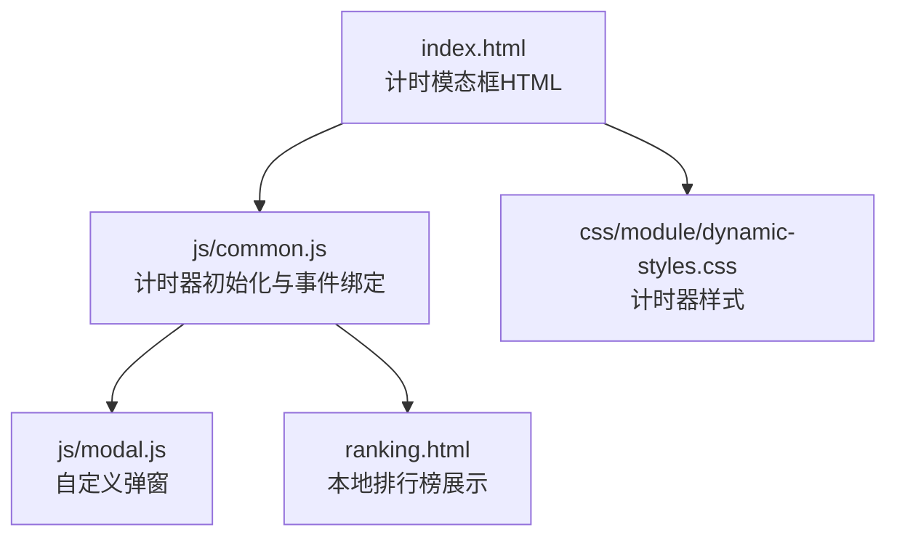
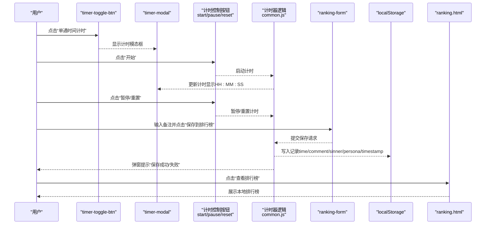
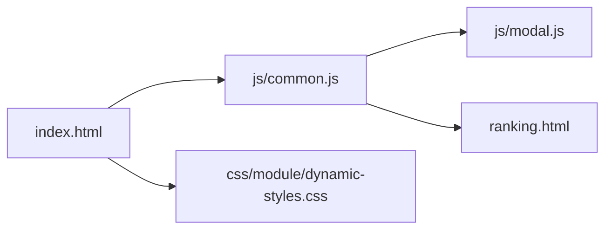

# 计时功能

<cite>
**本文引用的文件**
- [index.html](file://index.html)
- [common.js](file://js/common.js)
- [modal.js](file://js/modal.js)
- [ranking.html](file://ranking.html)
- [dynamic-styles.css](file://css/module/dynamic-styles.css)
</cite>

## 目录
1. [简介](#简介)
2. [项目结构](#项目结构)
3. [核心组件](#核心组件)
4. [架构总览](#架构总览)
5. [详细组件分析](#详细组件分析)
6. [依赖关系分析](#依赖关系分析)
7. [性能考量](#性能考量)
8. [故障排查指南](#故障排查指南)
9. [结论](#结论)

## 简介
本文件聚焦于“单通时间计时”功能的实现细节，围绕 index.html 中的 timer-modal 模态框展开，系统性说明：
- 模态框结构：计时显示区、控制按钮、排行榜提交表单
- main.js 中事件监听器与计时器逻辑的集成方式
- 计时数据的记录与本地排行榜提交流程（含时间格式化 HH:MM:SS、用户备注输入与保存）
- timer-toggle-btn 如何控制模态框的显示与隐藏，以及计时过程中按钮状态的切换逻辑
- 用户从启动计时到保存记录的完整工作流示例

## 项目结构
计时功能涉及的核心文件与职责如下：
- index.html：提供计时模态框的 HTML 结构与入口按钮
- js/common.js：计时器初始化与事件绑定、本地排行榜保存逻辑
- js/modal.js：自定义弹窗模块，供计时器保存失败/成功提示
- ranking.html：本地排行榜展示页面，负责读取 localStorage 并展示
- css/module/dynamic-styles.css：计时器模态框与计时显示的样式

图表来源
- [index.html](file://index.html#L131-L174)
- [common.js](file://js/common.js#L120-L319)
- [modal.js](file://js/modal.js#L1-L109)
- [ranking.html](file://ranking.html#L1-L94)
- [dynamic-styles.css](file://css/module/dynamic-styles.css#L233-L472)

章节来源
- [index.html](file://index.html#L131-L174)
- [common.js](file://js/common.js#L120-L319)
- [dynamic-styles.css](file://css/module/dynamic-styles.css#L233-L472)

## 核心组件
- 计时模态框（timer-modal）：包含计时显示区（timer-display）、控制按钮（开始、暂停、重置）、排行榜提交表单（ranking-form）
- 计时器逻辑（common.js 中的 initTimer）：负责计时器状态管理、显示更新、按钮状态切换、本地排行榜保存
- 自定义弹窗（modal.js）：统一的提示与确认交互，用于保存成功/失败提示
- 排行榜页面（ranking.html）：读取 localStorage 并展示历史记录

章节来源
- [index.html](file://index.html#L131-L174)
- [common.js](file://js/common.js#L120-L319)
- [modal.js](file://js/modal.js#L1-L109)
- [ranking.html](file://ranking.html#L1-L94)

## 架构总览
计时功能的运行时交互流程如下：

图表来源
- [index.html](file://index.html#L131-L174)
- [common.js](file://js/common.js#L120-L319)
- [ranking.html](file://ranking.html#L1-L94)

## 详细组件分析

### 计时模态框结构与样式
- 结构组成
  - 计时显示区：id 为 timer-display，初始值为“00:00:00”，用于展示 HH:MM:SS
  - 控制按钮组：开始（timer-start-btn）、暂停（timer-pause-btn，初始禁用）、重置（timer-reset-btn）
  - 排行榜提交表单：包含备注输入（player-note）与“保存到排行榜”（upload-ranking-btn）和“查看排行榜”（view-ranking-btn）
- 样式要点
  - 计时显示区采用大字号与渐变文字，强调时间展示
  - 控制按钮采用渐变背景与悬停动画，提升交互体验
  - 模态框采用半透明背景与滑入动画，保证良好的视觉反馈

章节来源
- [index.html](file://index.html#L131-L174)
- [dynamic-styles.css](file://css/module/dynamic-styles.css#L233-L472)

### 计时器初始化与事件监听器集成
- 初始化入口
  - 在 common.js 中定义 initTimer 函数，负责：
    - 获取计时模态框、显示区、控制按钮、排行榜表单等 DOM 元素
    - 绑定 timer-toggle-btn、timer-close-btn、模态框点击外部关闭事件
    - 绑定开始/暂停/重置按钮事件
    - 绑定排行榜表单提交与“查看排行榜”按钮事件
- 与 UI 的集成方式
  - timer-toggle-btn 作为入口按钮，点击后显示计时模态框，并锁定背景滚动
  - timer-close-btn 与点击模态框外部区域均可关闭模态框
  - 控制按钮的状态切换（启用/禁用）由计时器逻辑在运行/暂停状态下自动维护

章节来源
- [common.js](file://js/common.js#L120-L319)
- [index.html](file://index.html#L131-L174)

### 时间格式化与计时显示更新
- 时间格式化
  - 将累计秒数转换为 HH:MM:SS 字符串，使用两位数补零
- 显示更新
  - 每秒更新一次显示内容，确保计时器实时可见
- 本地排行榜记录字段
  - time：秒数
  - comment：用户备注
  - timestamp：记录时间
  - sinner/persona：当前选中的罪人与人格信息（若存在）

章节来源
- [common.js](file://js/common.js#L225-L246)
- [ranking.html](file://ranking.html#L27-L34)

### 排行榜提交流程（本地存储）
- 表单提交
  - 阻止默认提交行为，调用保存函数
- 保存逻辑
  - 若计时为 0，提示用户先完成一次计时
  - 读取 localStorage 中的 personalRanking 数组，追加新记录
  - 记录包含：time、comment、timestamp、sinner、persona
  - 成功后弹窗提示并清空备注输入框；失败时弹窗提示错误信息
- 查看排行榜
  - 打开 ranking.html，在新窗口中展示本地记录

章节来源
- [common.js](file://js/common.js#L159-L217)
- [ranking.html](file://ranking.html#L1-L94)

### timer-toggle-btn 的显示/隐藏控制与按钮状态切换
- 显示/隐藏
  - timer-toggle-btn 点击后为计时模态框添加 active 类，同时锁定背景滚动
  - timer-close-btn 与点击模态框外部区域可关闭模态框，恢复背景滚动
- 按钮状态切换
  - 开始：isRunning=false 时启用；启动后禁用“开始”，启用“暂停”
  - 暂停：isRunning=true 时启用；暂停后禁用“暂停”，启用“开始”
  - 重置：无论何时均可重置计时并更新显示

章节来源
- [common.js](file://js/common.js#L281-L319)
- [index.html](file://index.html#L131-L174)

### 用户完整工作流示例
- 启动计时
  - 点击“单通时间计时”按钮，显示计时模态框
  - 点击“开始”，计时器每秒递增，显示 HH:MM:SS
- 暂停/继续
  - 点击“暂停”停止计时；再次点击“开始”继续计时
- 重置
  - 点击“重置”停止计时并将计时归零
- 保存记录
  - 在备注框输入可选备注，点击“保存到排行榜”
  - 成功后弹窗提示并清空备注
- 查看历史
  - 点击“查看排行榜”，在新窗口打开 ranking.html 展示本地记录

章节来源
- [index.html](file://index.html#L131-L174)
- [common.js](file://js/common.js#L120-L319)
- [ranking.html](file://ranking.html#L1-L94)

## 依赖关系分析
- 模态框与样式
  - index.html 提供计时模态框结构
  - dynamic-styles.css 提供计时器样式与动画
- 计时器与弹窗
  - common.js 依赖 modal.js 提供统一提示
- 排行榜页面
  - ranking.html 依赖 localStorage 读取 personalRanking 数据并展示

图表来源
- [index.html](file://index.html#L131-L174)
- [common.js](file://js/common.js#L120-L319)
- [modal.js](file://js/modal.js#L1-L109)
- [ranking.html](file://ranking.html#L1-L94)
- [dynamic-styles.css](file://css/module/dynamic-styles.css#L233-L472)

## 性能考量
- 计时器更新频率
  - 每秒更新一次显示，开销极低，适合长时间运行
- DOM 操作
  - 仅对计时显示区与按钮状态进行必要更新，避免频繁重排
- 本地存储
  - 读写 localStorage 为轻量级操作，建议在批量操作前合并更新
- 样式与动画
  - 使用 transform 与过渡，避免触发布局抖动

## 故障排查指南
- 计时器无法启动
  - 检查 DOM 元素是否正确挂载（timer-display、start/pause/reset 按钮）
  - 确认 initTimer 已在页面加载后执行
- 暂停/重置无效
  - 确认 isRunning 状态与按钮禁用状态一致
  - 检查定时器是否被正确清理与重启
- 保存失败
  - 查看控制台错误信息，确认 localStorage 可用
  - 确认计时非 0，且备注输入框存在
- 排行榜为空
  - 确认 personalRanking 键存在且为数组
  - 检查浏览器隐私模式或存储限制

章节来源
- [common.js](file://js/common.js#L159-L217)
- [ranking.html](file://ranking.html#L36-L68)

## 结论
本功能通过简洁的模态框结构与清晰的事件驱动逻辑，实现了从计时到本地排行榜保存的完整闭环。计时器状态与按钮状态的联动、本地存储的可靠落盘、以及统一的弹窗提示，共同提供了良好的用户体验。后续可在排行榜上传接口、跨设备同步等方面进一步扩展。