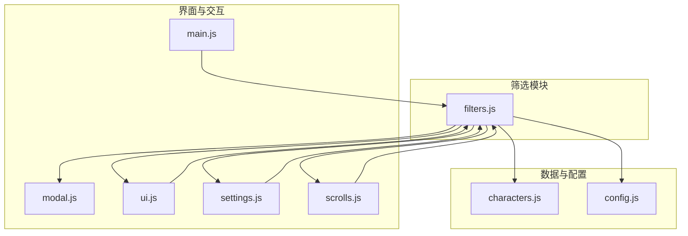
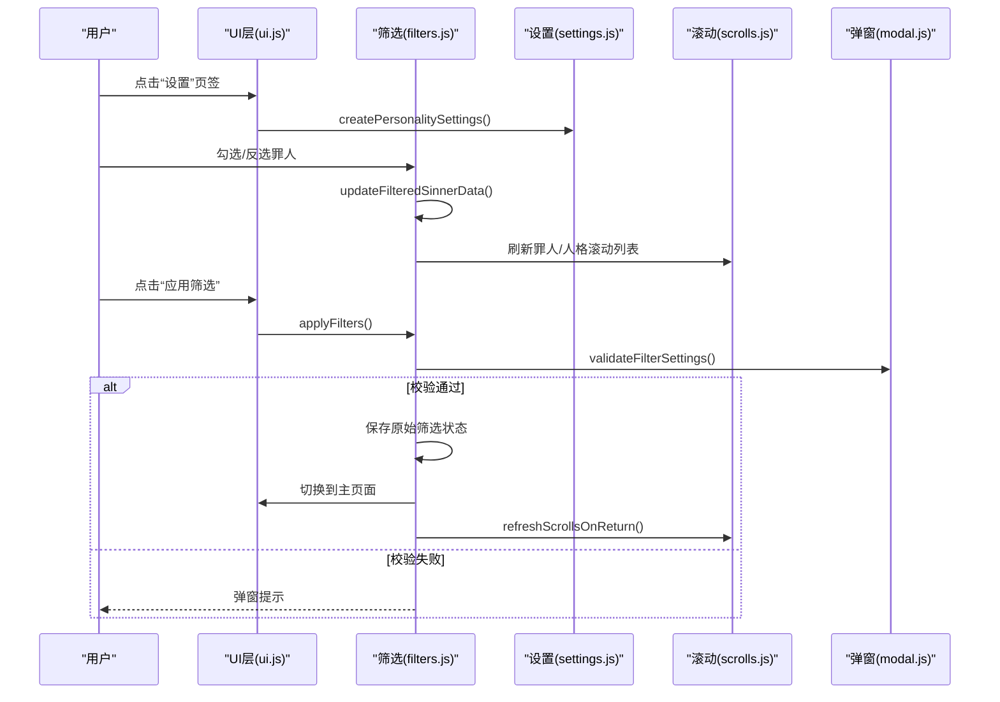
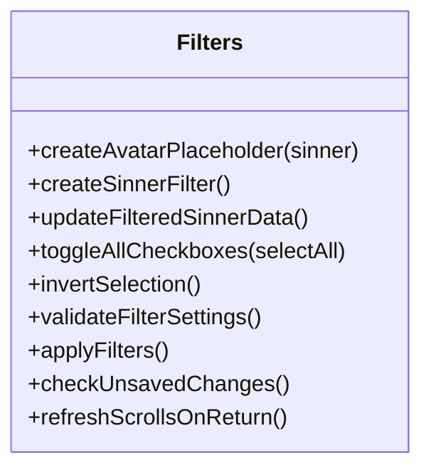
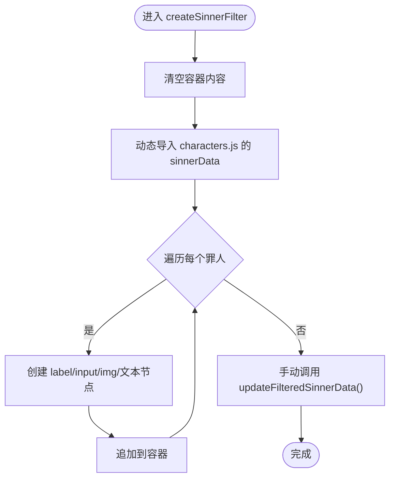
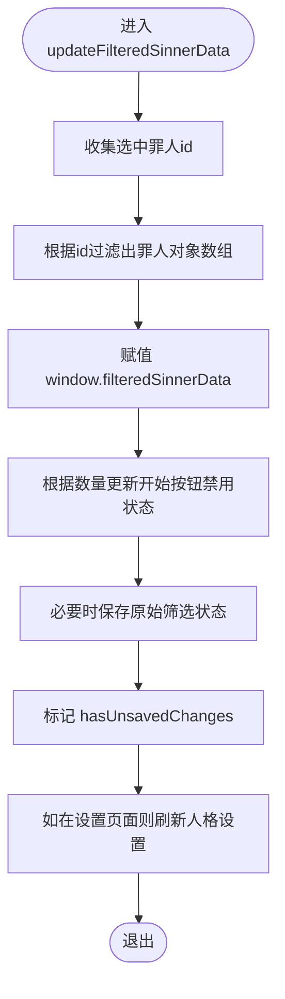
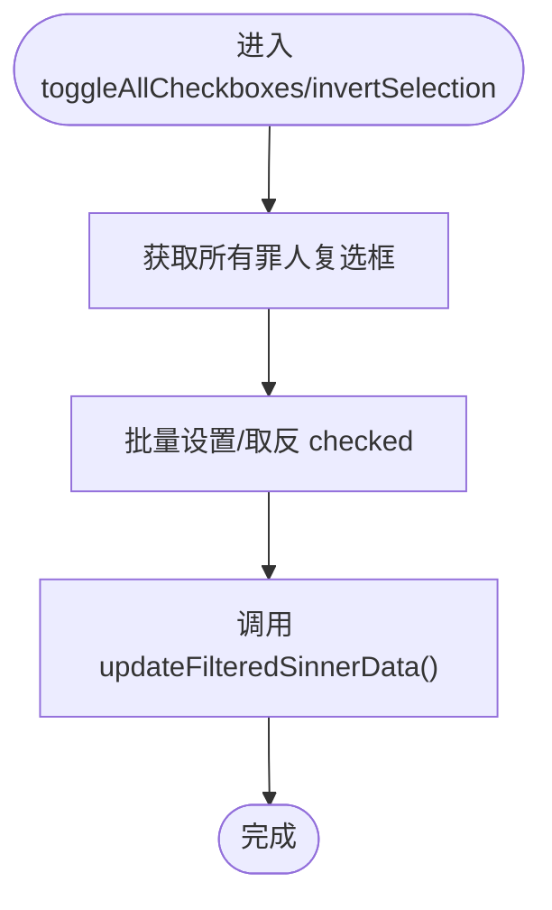
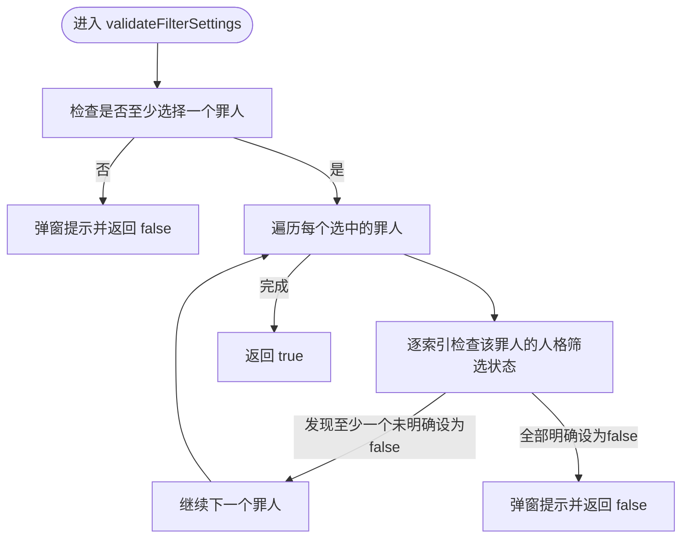
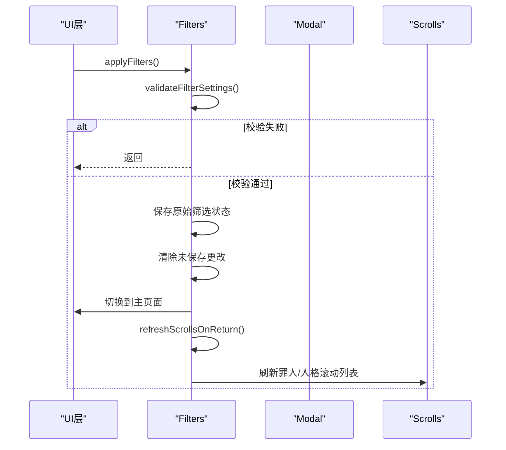
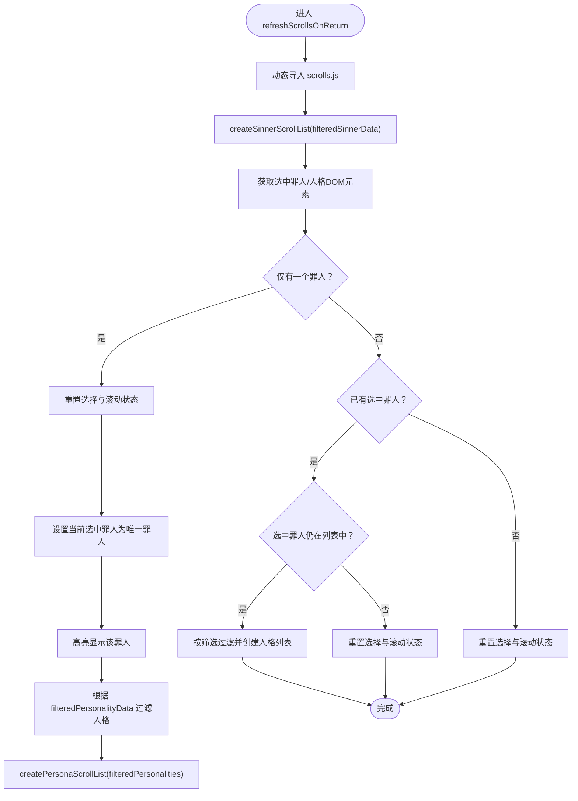
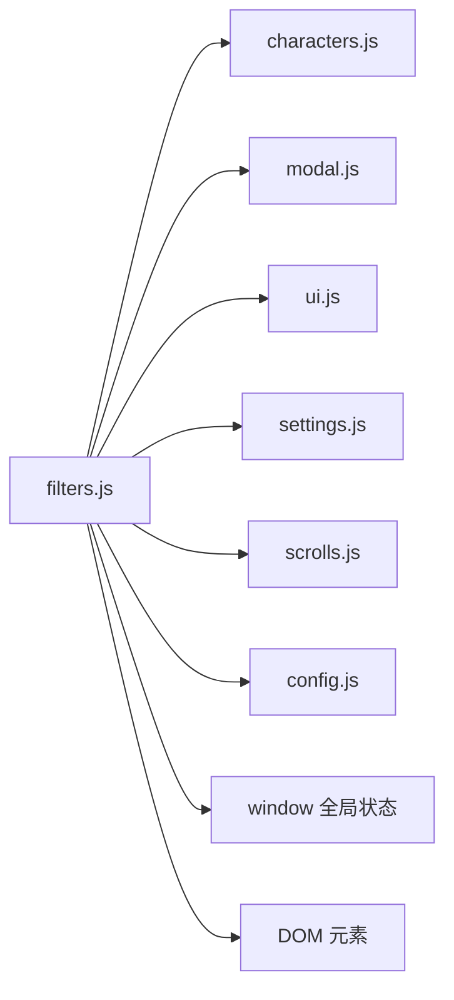

# filters.js模块

<cite>
**本文引用的文件**
- [filters.js](file://js/filters.js)
- [characters.js](file://data/characters.js)
- [modal.js](file://js/modal.js)
- [main.js](file://js/main.js)
- [scrolls.js](file://js/scrolls.js)
- [settings.js](file://js/settings.js)
- [ui.js](file://js/ui.js)
- [config.js](file://data/config.js)
</cite>

## 目录
1. [简介](#简介)
2. [项目结构](#项目结构)
3. [核心组件](#核心组件)
4. [架构总览](#架构总览)
5. [详细组件分析](#详细组件分析)
6. [依赖分析](#依赖分析)
7. [性能考虑](#性能考虑)
8. [故障排查指南](#故障排查指南)
9. [结论](#结论)

## 简介
本文件对 filters.js 模块进行全面、深入的技术文档化，聚焦其作为“罪人筛选核心模块”的职责与实现。该模块以 ES6 对象形式导出，负责：
- 动态生成罪人筛选复选框界面（含头像渲染与错误处理）
- 根据用户选择更新全局筛选状态 window.filteredSinnerData，并同步更新 UI（如开始按钮的禁用状态）
- 提供全选/全不选与反选功能
- 校验筛选设置的有效性（至少选择一个罪人，且每个罪人至少选择一个人格）
- 保存筛选设置并切换回主页面，同时刷新滚动列表与选择状态
- 在返回主页面时，根据当前筛选状态刷新罪人与人格滚动列表，并处理单选/多选场景

此外，该模块与 modal.js 协作提供用户反馈；与 main.js、settings.js、scrolls.js、ui.js、config.js 等模块协同工作，形成完整的筛选与滚动抽取流程。

## 项目结构
filters.js 位于 js 目录下，与数据源 characters.js、弹窗 modal.js、主入口 main.js、滚动 scrolls.js、设置 settings.js、UI 控制 ui.js、配置 config.js 紧密协作。

图表来源
- [filters.js](file://js/filters.js#L1-L274)
- [characters.js](file://data/characters.js#L1-L260)
- [modal.js](file://js/modal.js#L1-L109)
- [ui.js](file://js/ui.js#L1-L66)
- [settings.js](file://js/settings.js#L1-L263)
- [scrolls.js](file://js/scrolls.js#L1-L718)
- [main.js](file://js/main.js#L1-L261)
- [config.js](file://data/config.js#L1-L29)

章节来源
- [filters.js](file://js/filters.js#L1-L274)
- [main.js](file://js/main.js#L1-L261)

## 核心组件
- ES6 对象 Filters：封装筛选界面生成、状态更新、全选/反选、校验与应用、返回刷新等能力
- 与全局状态 window.filteredSinnerData、window.filteredPersonalityData、window.hasUnsavedChanges 紧密耦合
- 与 modal.js 协作进行用户提示与确认
- 与 settings.js、scrolls.js、ui.js、main.js、config.js 协同完成筛选与滚动抽取流程

章节来源
- [filters.js](file://js/filters.js#L1-L274)
- [main.js](file://js/main.js#L69-L115)

## 架构总览
filters.js 在应用生命周期中的关键位置：
- 初始化阶段：由 main.js 调用 createSinnerFilter() 生成筛选界面，并自动初始化筛选数据
- 交互阶段：用户勾选/反选罪人，触发 updateFilteredSinnerData() 更新全局状态与 UI
- 校验阶段：applyFilters() 保存筛选设置并切换页面，随后 refreshScrollsOnReturn() 刷新滚动列表
- 返回阶段：main.js 导航返回主页面时，再次调用 refreshScrollsOnReturn() 以适配筛选变化

图表来源
- [ui.js](file://js/ui.js#L1-L66)
- [filters.js](file://js/filters.js#L117-L184)
- [settings.js](file://js/settings.js#L60-L115)
- [scrolls.js](file://js/scrolls.js#L46-L111)
- [modal.js](file://js/modal.js#L74-L106)

## 详细组件分析

### Filters 类结构与职责
Filters 是一个 ES6 对象，提供以下核心方法：
- createAvatarPlaceholder(sinner)：为无头像或加载失败时创建占位符
- createSinnerFilter()：动态生成罪人筛选复选框界面，绑定 change 事件，支持头像渲染与错误处理
- updateFilteredSinnerData()：根据复选框状态更新 window.filteredSinnerData，同步 UI（开始按钮禁用状态），并初始化原始状态
- toggleAllCheckboxes(selectAll)：全选/全不选
- invertSelection()：反选
- validateFilterSettings()：校验至少选择一个罪人，且每个罪人至少选择一个人格
- applyFilters()：保存筛选设置并切换到主页面，随后刷新滚动列表
- checkUnsavedChanges()：检测未保存更改并提示确认
- refreshScrollsOnReturn()：返回主页面时刷新罪人与人格滚动列表，处理单选/多选与高亮

图表来源
- [filters.js](file://js/filters.js#L1-L274)

章节来源
- [filters.js](file://js/filters.js#L1-L274)

### createSinnerFilter：动态生成罪人筛选复选框界面
- 读取容器 #sinner-filter，清空内容
- 动态导入 data/characters.js 的 sinnerData，遍历生成 label/input/img 文本节点
- 复选框默认全选，change 事件绑定到 updateFilteredSinnerData()
- 头像渲染策略：
  - 若 sinner.avatar 存在，创建 img 节点并设置 src/alt
  - onerror 回退到 createAvatarPlaceholder(sinner)，保证 UI 稳健
- 完成后手动调用 updateFilteredSinnerData() 初始化筛选数据

图表来源
- [filters.js](file://js/filters.js#L16-L57)
- [characters.js](file://data/characters.js#L1-L260)

章节来源
- [filters.js](file://js/filters.js#L16-L57)
- [characters.js](file://data/characters.js#L1-L260)

### updateFilteredSinnerData：更新筛选状态与UI
- 读取 #sinner-filter 中所有复选框，收集选中罪人 id
- 动态导入 characters.js，过滤出对应的罪人对象数组，赋值给 window.filteredSinnerData
- 根据选中数量更新开始按钮禁用状态：
  - 选中数量为 0 或仅剩 1 个时禁用
- 同步更新全局状态：
  - 若尚未初始化原始状态或无未保存更改，则复制当前筛选结果为原始状态
  - 仅在筛选界面已渲染完成（checkboxes.length > 0）时标记 hasUnsavedChanges
- 若当前处于设置页面且可见，异步导入 settings.js 并调用 createPersonalitySettings() 以刷新人格设置显示

图表来源
- [filters.js](file://js/filters.js#L60-L101)

章节来源
- [filters.js](file://js/filters.js#L60-L101)

### toggleAllCheckboxes/invertSelection：全选/全不选与反选
- toggleAllCheckboxes(selectAll)：批量设置复选框 checked，并调用 updateFilteredSinnerData()
- invertSelection()：逐个取反复选框 checked，并调用 updateFilteredSinnerData()

图表来源
- [filters.js](file://js/filters.js#L103-L115)

章节来源
- [filters.js](file://js/filters.js#L103-L115)

### validateFilterSettings：筛选设置有效性校验
- 至少选择一个罪人：若 window.filteredSinnerData 为空或长度为 0，弹窗提示并返回 false
- 每个罪人至少选择一个人格：
  - 遍历 window.filteredSinnerData
  - 对于每个罪人，检查 window.filteredPersonalityData 中的对应项
  - 采用“逐索引检查”策略：只有当该罪人所有人格都被明确设为 false 时，才认为未选中任何人格
  - 若发现未选中的人格集合，弹窗提示并返回 false
- 全部通过则返回 true

图表来源
- [filters.js](file://js/filters.js#L117-L157)
- [modal.js](file://js/modal.js#L74-L106)

章节来源
- [filters.js](file://js/filters.js#L117-L157)
- [modal.js](file://js/modal.js#L74-L106)

### applyFilters：保存筛选设置并返回主页面
- 调用 validateFilterSettings()，若失败则终止
- 将当前筛选状态复制为原始状态（window.originalFilteredSinnerData、window.originalFilteredPersonalityData）
- 清除 hasUnsavedChanges
- 切换页面：
  - 显示主选择页面，隐藏设置页面
  - 切换页签按钮 active 状态
- 调用 refreshScrollsOnReturn() 刷新滚动列表

图表来源
- [filters.js](file://js/filters.js#L159-L184)
- [scrolls.js](file://js/scrolls.js#L46-L111)

章节来源
- [filters.js](file://js/filters.js#L159-L184)

### refreshScrollsOnReturn：返回主页面时刷新滚动列表
- 动态导入 scrolls.js，调用 createSinnerScrollList(window.filteredSinnerData)
- 获取选中罪人/人格 DOM 元素，处理三种情况：
  - 仅有一个罪人：强制清空旧选择状态，重置人格滚动状态，设置当前选中罪人为唯一罪人，高亮显示，计算并创建过滤后的人格列表
  - 已有选中罪人且仍在筛选列表中：根据 filteredPersonalityData 过滤并创建人格列表
  - 无选中罪人或选中罪人不在列表中：重置选择与滚动状态，显示提示
- 通过 highlightSelectedItem 实现高亮显示

图表来源
- [filters.js](file://js/filters.js#L194-L271)
- [scrolls.js](file://js/scrolls.js#L46-L111)

章节来源
- [filters.js](file://js/filters.js#L194-L271)
- [scrolls.js](file://js/scrolls.js#L46-L111)

### 与 modal.js 的交互
- validateFilterSettings() 使用 Modal.alert() 提示用户
- applyFilters() 在 main.js 导航返回时，使用 Modal.confirm() 询问是否保存更改
- scrolls.js 中多处使用 Modal.alert() 进行错误提示

章节来源
- [filters.js](file://js/filters.js#L117-L157)
- [main.js](file://js/main.js#L82-L107)
- [modal.js](file://js/modal.js#L74-L106)
- [scrolls.js](file://js/scrolls.js#L282-L310)

## 依赖分析
- 内部依赖
  - data/characters.js：提供 sinnerData 与罪人/人格数据
  - js/modal.js：提供自定义弹窗 alert/confirm
  - js/scrolls.js：提供滚动列表创建与高亮显示
  - js/settings.js：提供人格设置界面刷新
  - js/ui.js：提供页面导航与按钮事件绑定
  - data/config.js：提供滚动与界面配置常量
- 外部依赖
  - window 全局状态：filteredSinnerData、filteredPersonalityData、originalFilteredSinnerData、originalFilteredPersonalityData、hasUnsavedChanges、currentSelectedSinner、currentSelectedPersona
  - DOM 元素：#sinner-filter、#sinner-start-btn、#settings-page、#main-selector-page、#settings-page-btn、#main-page-btn、#selected-sinner、#selected-persona

图表来源
- [filters.js](file://js/filters.js#L1-L274)
- [characters.js](file://data/characters.js#L1-L260)
- [modal.js](file://js/modal.js#L1-L109)
- [ui.js](file://js/ui.js#L1-L66)
- [settings.js](file://js/settings.js#L1-L263)
- [scrolls.js](file://js/scrolls.js#L1-L718)
- [config.js](file://data/config.js#L1-L29)

章节来源
- [filters.js](file://js/filters.js#L1-L274)
- [main.js](file://js/main.js#L69-L115)

## 性能考虑
- 动态导入 data/characters.js 与 js/scrolls.js、js/settings.js：按需加载，减少初始包体与首屏压力
- updateFilteredSinnerData 中仅在筛选界面渲染完成后才标记 hasUnsavedChanges，避免初始化时误判
- 头像加载失败回退到占位符，避免阻塞渲染
- 刷新滚动列表时，仅在必要时创建人格列表，避免重复渲染
- 单个罪人时直接高亮与选择，减少滚动动画开销

[本节为通用性能建议，无需特定文件引用]

## 故障排查指南
- 头像不显示或闪烁
  - 现象：img onerror 回退到占位符
  - 排查：检查 assets 路径是否正确，网络是否可达
  - 参考路径：[filters.js](file://js/filters.js#L33-L40)
- 开始按钮无法启用
  - 现象：当仅剩 1 个罪人时按钮禁用
  - 排查：确认筛选后仅剩 1 个罪人，或未勾选任何罪人
  - 参考路径：[filters.js](file://js/filters.js#L71-L75)
- 应用筛选后未生效
  - 现象：validateFilterSettings() 校验失败
  - 排查：确保至少选择一个罪人，且每个罪人至少选择一个人格
  - 参考路径：[filters.js](file://js/filters.js#L117-L157)
- 返回主页面后列表未刷新
  - 现象：refreshScrollsOnReturn() 未正确刷新
  - 排查：确认 filteredSinnerData 是否更新，DOM 元素是否存在
  - 参考路径：[filters.js](file://js/filters.js#L194-L271)
- 未保存更改提示
  - 现象：离开设置页面时弹窗确认
  - 排查：检查 window.hasUnsavedChanges 是否被正确标记
  - 参考路径：[filters.js](file://js/filters.js#L186-L192)

章节来源
- [filters.js](file://js/filters.js#L33-L40)
- [filters.js](file://js/filters.js#L71-L75)
- [filters.js](file://js/filters.js#L117-L157)
- [filters.js](file://js/filters.js#L186-L192)
- [filters.js](file://js/filters.js#L194-L271)

## 结论
filters.js 作为筛选核心模块，承担了罪人筛选界面生成、状态更新、全选/反选、校验与应用、返回刷新等关键职责。通过与 modal.js、settings.js、scrolls.js、ui.js、main.js、config.js 的紧密协作，实现了稳定、直观、可扩展的筛选体验。其设计遵循“按需加载、最小化副作用、清晰的状态流转”，并在头像渲染、按钮状态、错误处理等方面体现了良好的工程实践。