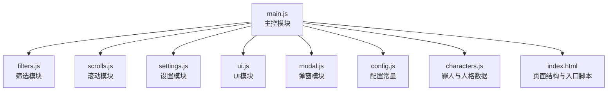
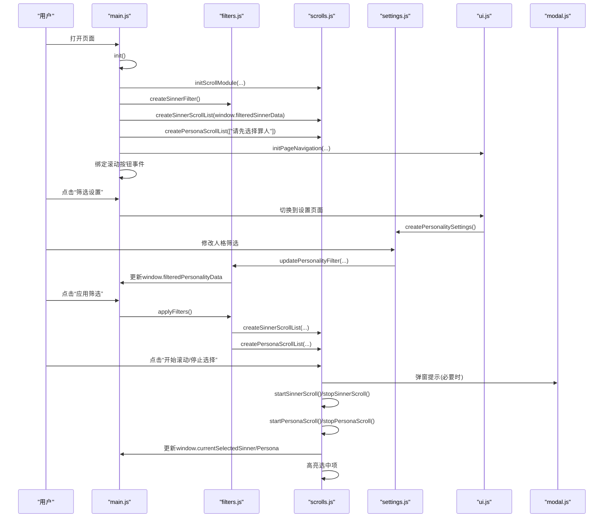
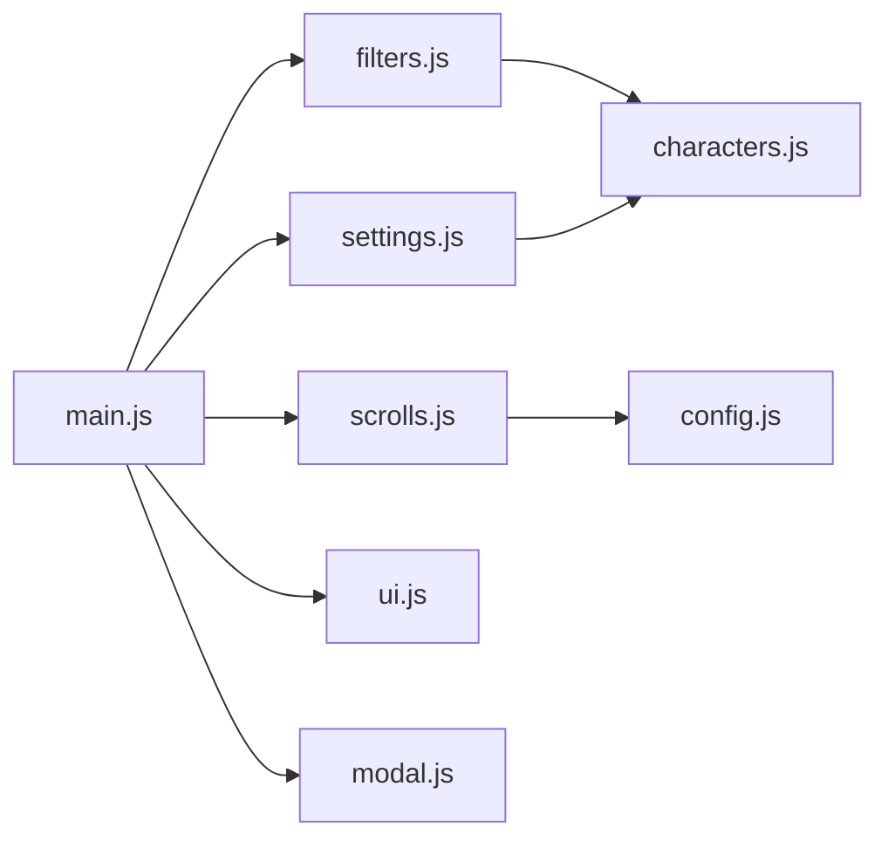
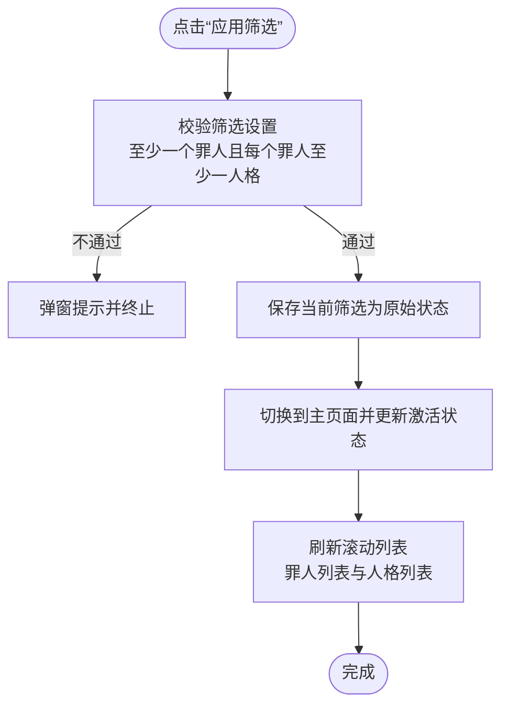
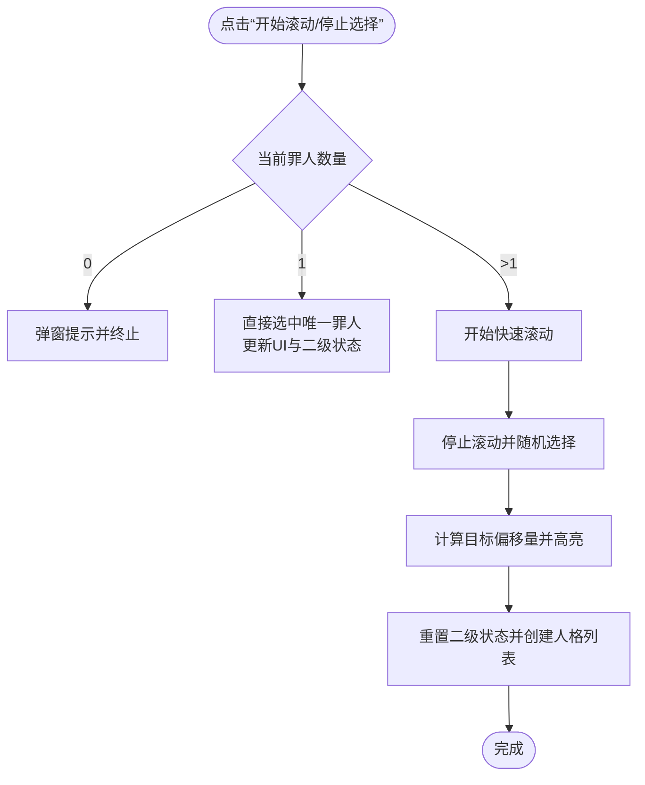
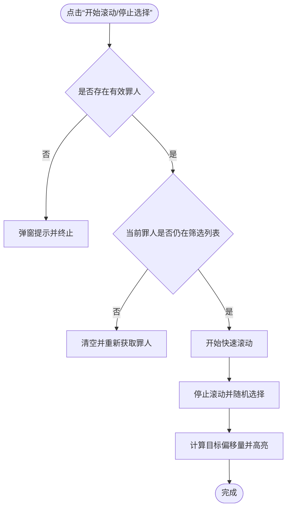

# main.js模块

<cite>
**本文引用的文件**
- [main.js](file://js/main.js)
- [filters.js](file://js/filters.js)
- [scrolls.js](file://js/scrolls.js)
- [settings.js](file://js/settings.js)
- [ui.js](file://js/ui.js)
- [modal.js](file://js/modal.js)
- [config.js](file://data/config.js)
- [characters.js](file://data/characters.js)
- [index.html](file://index.html)
</cite>

## 目录
1. [简介](#简介)
2. [项目结构](#项目结构)
3. [核心组件](#核心组件)
4. [架构总览](#架构总览)
5. [详细组件分析](#详细组件分析)
6. [依赖分析](#依赖分析)
7. [性能考虑](#性能考虑)
8. [故障排查指南](#故障排查指南)
9. [结论](#结论)
10. [附录](#附录)

## 简介
本文件面向main.js模块，系统化梳理其作为主控模块如何通过ES6 import机制协调filters.js、scrolls.js、settings.js、ui.js与modal.js等子模块，完成初始化流程、页面导航、筛选应用与重置、滚动交互、状态管理与事件处理。文档同时解释全局状态变量与window对象共享机制，并提供关键调用关系与数据流图示，帮助读者快速理解模块间协作方式。

## 项目结构
main.js位于前端JavaScript目录，负责：
- 统一导入并协调各功能模块
- 初始化滚动模块、筛选模块、设置模块与UI模块
- 处理页面导航（主页面与设置页面）
- 管理全局状态变量（如滚动状态、当前选中项、筛选数据）
- 通过window对象在模块间共享状态

图表来源
- [main.js](file://js/main.js#L1-L120)
- [filters.js](file://js/filters.js#L1-L60)
- [scrolls.js](file://js/scrolls.js#L1-L40)
- [settings.js](file://js/settings.js#L1-L40)
- [ui.js](file://js/ui.js#L1-L25)
- [modal.js](file://js/modal.js#L1-L40)
- [config.js](file://data/config.js#L1-L29)
- [characters.js](file://data/characters.js#L1-L40)
- [index.html](file://index.html#L120-L132)

章节来源
- [main.js](file://js/main.js#L1-L120)
- [index.html](file://index.html#L120-L132)

## 核心组件
- 初始化流程init()：整合滚动模块、筛选模块、滚动按钮事件绑定、页面导航初始化与UI初始化。
- 全局状态管理：维护滚动状态、当前选中项、筛选数据与未保存变更标志；通过window对象跨模块共享。
- 事件处理：页面导航（主页面/设置页面）、筛选应用与重置、滚动控制按钮事件。
- 数据流：筛选数据经filters.js更新，再由scrolls.js消费；UI与状态通过window对象互通。

章节来源
- [main.js](file://js/main.js#L159-L261)
- [filters.js](file://js/filters.js#L159-L274)
- [scrolls.js](file://js/scrolls.js#L21-L111)

## 架构总览
main.js作为编排层，通过ES6模块导入各子模块，集中注册DOM事件与状态管理，形成“主控-子模块”的解耦架构。滚动模块负责滚动渲染与交互，筛选模块负责罪人与人格筛选，设置模块负责筛选界面与控制，UI模块负责页面导航与按钮事件绑定，弹窗模块提供统一的提示与确认。

图表来源
- [main.js](file://js/main.js#L159-L261)
- [filters.js](file://js/filters.js#L159-L274)
- [scrolls.js](file://js/scrolls.js#L281-L718)
- [settings.js](file://js/settings.js#L60-L263)
- [ui.js](file://js/ui.js#L1-L66)
- [modal.js](file://js/modal.js#L1-L109)

## 详细组件分析

### 初始化流程 init()
- 调用滚动模块初始化：传入DOM元素与全局状态（包含itemHeight、sinnerData、筛选数据）。
- 创建罪人筛选复选框并初始化筛选数据与原始状态。
- 初始化罪人滚动列表与人格滚动列表（初始为空提示）。
- 初始化页面导航（主页面/设置页面）。
- 动态导入滚动模块方法并绑定滚动按钮事件。
- 注释掉的罪人/人格点击事件：根据设计需求，禁止直接点击选择，仅允许随机抽取。

章节来源
- [main.js](file://js/main.js#L159-L258)

### 页面导航与筛选应用/重置
- 主页面按钮点击：若存在未保存更改，弹窗确认后决定是否保存并返回；否则直接返回并刷新滚动列表。
- 设置页面按钮点击：切换到设置页面并创建人格筛选界面。
- 应用筛选按钮：调用filters.js的applyFilters，校验筛选设置，保存当前状态为原始状态，切换回主页面并刷新滚动列表。
- 重置筛选按钮：弹窗确认后，恢复原始筛选数据与UI状态。

章节来源
- [main.js](file://js/main.js#L81-L146)
- [filters.js](file://js/filters.js#L159-L205)

### 滚动交互与状态更新
- 罪人滚动：开始滚动时快速滚动，停止时随机选择一个罪人，计算目标偏移量并高亮；若仅剩一个罪人则直接选中并重置二级状态。
- 人格滚动：开始滚动时快速滚动，停止时随机选择一个符合筛选的人格，计算目标偏移量并高亮；若仅剩一个可用人格则直接选中。
- 高亮与重置：clearHighlight与highlightSelectedItem用于视觉反馈；resetPersonaScrollState用于重置二级滚动状态。
- 通过window对象更新当前选中项，驱动UI展示与后续流程。

章节来源
- [scrolls.js](file://js/scrolls.js#L281-L718)

### 筛选模块与人格设置
- 罪人筛选：动态创建复选框，监听change事件更新window.filteredSinnerData与原始状态，控制开始按钮禁用状态。
- 人格筛选：按罪人分页创建设置卡片，支持全选/全不选/反选；更新window.filteredPersonalityData并在设置页面显示。
- 应用筛选：校验至少选择一个罪人且每个罪人至少选择一个人格；保存原始状态并返回主页面刷新滚动列表。

章节来源
- [filters.js](file://js/filters.js#L1-L158)
- [settings.js](file://js/settings.js#L1-L263)

### UI模块与弹窗模块
- UI模块：负责页面导航切换与按钮事件绑定；在设置页面动态添加“应用筛选”按钮。
- 弹窗模块：提供alert/confirm封装，统一提示与确认交互。

章节来源
- [ui.js](file://js/ui.js#L1-L66)
- [modal.js](file://js/modal.js#L1-L109)

### 全局状态变量与window共享
- 滚动状态：sinnerScrollInterval、personaScrollInterval、isSinnerScrolling、isPersonaScrolling、sinnerOffset、personaOffset。
- 当前选中项：currentSelectedSinner、currentSelectedPersona。
- 筛选数据：window.filteredSinnerData、window.filteredPersonalityData、window.originalFilteredSinnerData、window.originalFilteredPersonalityData。
- 未保存更改：window.hasUnsavedChanges。
- 通过window对象在filters.js、scrolls.js、settings.js与main.js之间共享状态，保证模块间一致性。

章节来源
- [main.js](file://js/main.js#L56-L78)
- [filters.js](file://js/filters.js#L60-L101)
- [scrolls.js](file://js/scrolls.js#L1-L20)

### 事件处理机制
- 页面导航：主页面/设置页面按钮点击事件，切换页面并更新激活状态。
- 筛选控制：全选/全不选/反选按钮事件，委托给filters.js处理。
- 滚动控制：开始/停止按钮事件，动态导入scrolls.js的方法并绑定。
- 罪人/人格点击：注释掉的点击事件，遵循“仅随机抽取”的设计约束。

章节来源
- [main.js](file://js/main.js#L81-L158)
- [ui.js](file://js/ui.js#L23-L57)

## 依赖分析
- main.js对filters.js、scrolls.js、settings.js、ui.js、modal.js、config.js、characters.js均有导入与调用。
- 模块间耦合度低：通过window对象与函数调用传递数据，避免直接互相依赖。
- 关键依赖链：
  - main.js -> filters.js（筛选数据更新与应用）
  - main.js -> scrolls.js（滚动列表创建与滚动控制）
  - main.js -> settings.js（人格设置界面创建）
  - main.js -> ui.js（页面导航与按钮事件）
  - main.js -> modal.js（弹窗提示）
  - scrolls.js -> config.js（滚动参数）
  - filters.js -> characters.js（罪人数据）

图表来源
- [main.js](file://js/main.js#L1-L50)
- [scrolls.js](file://js/scrolls.js#L1-L10)
- [filters.js](file://js/filters.js#L1-L10)
- [settings.js](file://js/settings.js#L1-L20)
- [config.js](file://data/config.js#L1-L29)
- [characters.js](file://data/characters.js#L1-L20)

章节来源
- [main.js](file://js/main.js#L1-L50)
- [scrolls.js](file://js/scrolls.js#L1-L10)
- [filters.js](file://js/filters.js#L1-L10)
- [settings.js](file://js/settings.js#L1-L20)
- [config.js](file://data/config.js#L1-L29)
- [characters.js](file://data/characters.js#L1-L20)

## 性能考虑
- 滚动列表渲染：通过倍数扩展项目数量实现平滑循环滚动，注意在项目数量变化时及时更新容器高度与按钮状态。
- 事件绑定：滚动按钮事件采用动态导入并绑定，减少初始加载压力。
- 筛选更新：复选框change事件触发筛选数据更新，避免不必要的DOM操作。
- 高亮与过渡：使用CSS过渡与定时器控制滚动与高亮，确保流畅体验。

[本节为通用指导，无需特定文件引用]

## 故障排查指南
- 无法选择罪人/人格：检查filters.js的validateFilterSettings是否返回true，确认至少选择一个罪人且每个罪人至少选择一个人格。
- 二级滚动按钮不可用：确认罪人列表长度与按钮禁用逻辑；若仅剩一个罪人，应直接选中并重置二级状态。
- 未保存更改导致无法离开：在main.js的主页面按钮点击事件中，确认弹窗逻辑与applyFilters调用路径。
- 头像加载失败：scrolls.js与settings.js中均有头像降级处理，检查资源路径与网络情况。
- 弹窗不显示：确认modal.js容器初始化与显示逻辑。

章节来源
- [filters.js](file://js/filters.js#L117-L158)
- [scrolls.js](file://js/scrolls.js#L113-L200)
- [main.js](file://js/main.js#L81-L146)
- [modal.js](file://js/modal.js#L1-L73)

## 结论
main.js通过清晰的初始化流程与模块化导入，将筛选、滚动、设置、UI与弹窗等子模块有机整合。其以window对象为桥梁实现跨模块状态共享，结合事件驱动与数据驱动的方式，实现了稳定的页面导航、灵活的筛选应用与流畅的滚动交互。建议在后续迭代中进一步规范化事件命名与状态命名，增强可维护性与可测试性。

[本节为总结，无需特定文件引用]

## 附录

### 关键流程图：筛选应用与返回主页面

图表来源
- [main.js](file://js/main.js#L118-L146)
- [filters.js](file://js/filters.js#L159-L205)

### 关键流程图：罪人滚动与选择

图表来源
- [scrolls.js](file://js/scrolls.js#L281-L478)

### 关键流程图：人格滚动与选择

图表来源
- [scrolls.js](file://js/scrolls.js#L480-L684)