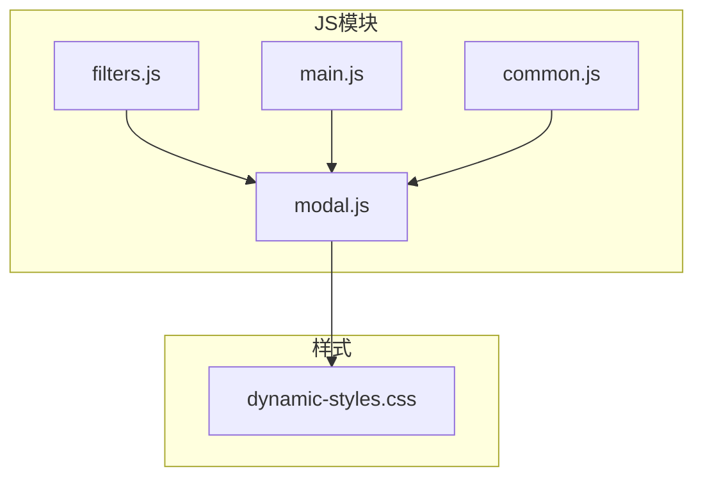
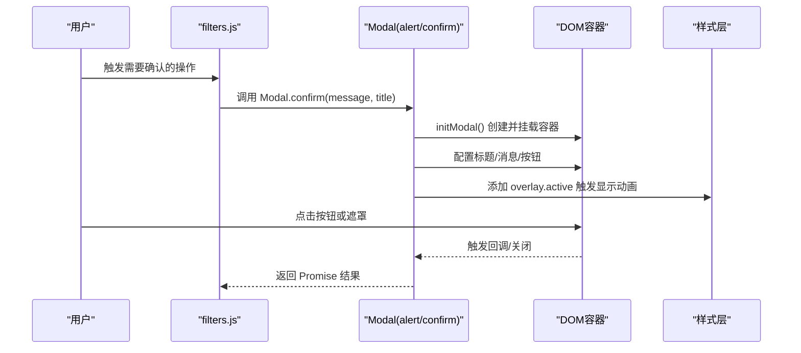
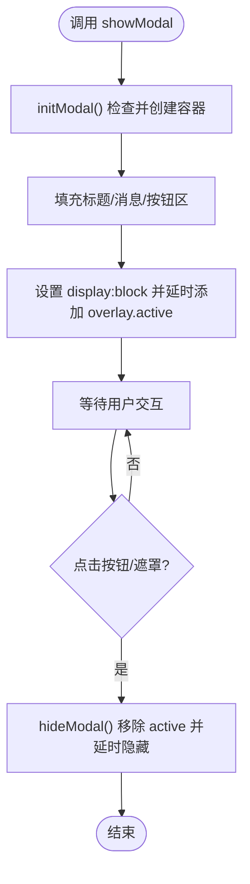
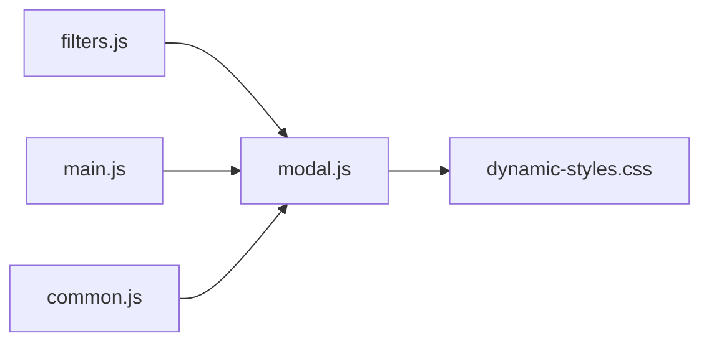

# modal.js模块

<cite>
**本文引用的文件**
- [modal.js](file://js/modal.js)
- [filters.js](file://js/filters.js)
- [main.js](file://js/main.js)
- [dynamic-styles.css](file://css/module/dynamic-styles.css)
- [common.js](file://js/common.js)
- [OPTIMIZATION_GUIDE.md](file://OPTIMIZATION_GUIDE.md)
</cite>

## 目录
1. [简介](#简介)
2. [项目结构](#项目结构)
3. [核心组件](#核心组件)
4. [架构总览](#架构总览)
5. [详细组件分析](#详细组件分析)
6. [依赖关系分析](#依赖关系分析)
7. [性能考量](#性能考量)
8. [故障排查指南](#故障排查指南)
9. [结论](#结论)
10. [附录](#附录)

## 简介
本文件系统性地解析 modal.js 模块，该模块以 IIFE（立即执行函数表达式）实现单例模式，提供统一的自定义弹窗服务，替代浏览器原生的 alert/confirm。其职责包括：
- 单例弹窗容器的惰性初始化与管理
- 动态构建弹窗 DOM 结构（遮罩层、弹窗框、标题、消息体、按钮区）
- 配置并显示弹窗，支持多按钮与回调
- 通过 CSS 类切换实现平滑的显示/隐藏动画
- 基于 Promise 的 alert/confirm 封装，提供非阻塞异步交互
- 被 filters.js、main.js 等模块广泛调用，用于用户提示与确认对话

## 项目结构
modal.js 位于 js 目录下，配合 css/module/dynamic-styles.css 中的弹窗样式共同工作；同时在 filters.js、main.js 中被导入并使用；common.js 通过动态 import 适配 IIFE 环境，保证 Modal 模块在不同入口下的可用性。

图表来源
- [modal.js](file://js/modal.js#L1-L108)
- [filters.js](file://js/filters.js#L1-L20)
- [main.js](file://js/main.js#L1-L20)
- [common.js](file://js/common.js#L1-L34)
- [dynamic-styles.css](file://css/module/dynamic-styles.css#L860-L984)

章节来源
- [modal.js](file://js/modal.js#L1-L108)
- [filters.js](file://js/filters.js#L1-L20)
- [main.js](file://js/main.js#L1-L20)
- [common.js](file://js/common.js#L1-L34)
- [dynamic-styles.css](file://css/module/dynamic-styles.css#L860-L984)

## 核心组件
- 单例容器与初始化
  - 通过 IIFE 创建闭包，内部维护唯一 modalContainer 实例，initModal 负责首次创建并挂载到 document.body。
- 显示与隐藏流程
  - showModal 负责配置标题、消息、按钮，并触发显示动画；hideModal 负责移除 active 类并延迟隐藏容器。
- 弹窗类型
  - alert：单按钮“确定”，返回 Promise 解析值
  - confirm：双按钮“取消/确定”，返回 Promise 布尔值
- 事件与回调
  - 点击遮罩层可关闭弹窗并触发 onClose 回调
  - 各按钮点击后会先隐藏弹窗再执行各自回调

章节来源
- [modal.js](file://js/modal.js#L1-L108)

## 架构总览
modal.js 采用 ES 模块导出，其他模块通过 import 引入。filters.js 与 main.js 在关键交互处调用 Modal.alert/Modal.confirm，从而实现统一的用户提示与确认体验。

图表来源
- [modal.js](file://js/modal.js#L1-L108)
- [filters.js](file://js/filters.js#L186-L192)
- [main.js](file://js/main.js#L80-L107)

## 详细组件分析

### IIFE 单例模式与容器生命周期
- 单例保障
  - 通过闭包变量 modalContainer 保存唯一实例，initModal 内部进行幂等检查，避免重复创建。
- 容器结构
  - initModal 动态创建包含遮罩层、弹窗框、头部、消息体、底部按钮区的结构，并追加到 body。
- 生命周期
  - 显示：showModal 设置 display 并延时添加 active 类，触发动画
  - 隐藏：hideModal 移除 active 类，延时后设置 display:none

图表来源
- [modal.js](file://js/modal.js#L6-L25)
- [modal.js](file://js/modal.js#L28-L61)
- [modal.js](file://js/modal.js#L63-L72)

章节来源
- [modal.js](file://js/modal.js#L1-L72)

### showModal 的参数与行为
- 参数
  - title：弹窗标题文本
  - message：弹窗消息文本
  - buttons：按钮数组，每项包含 text、className、callback
  - onClose：遮罩关闭时的回调
- 行为
  - 清空并重建底部按钮区
  - 为每个按钮创建元素，绑定点击事件（先隐藏弹窗再执行回调）
  - 点击遮罩且目标为 overlay 时，隐藏弹窗并调用 onClose

章节来源
- [modal.js](file://js/modal.js#L28-L61)

### hideModal 的动画与状态管理
- 动画策略
  - 通过移除 overlay.active 触发 CSS 过渡，随后延时将容器 display 设为 none，形成平滑隐藏
- 状态清理
  - 仅当存在容器时执行，避免重复调用导致的异常

章节来源
- [modal.js](file://js/modal.js#L63-L72)

### alert 与 confirm 的 Promise 封装
- alert
  - 默认按钮为“确定”，回调同时作为 Promise 的 resolve
- confirm
  - 默认按钮为“取消/确定”，分别对应 resolve(false)/resolve(true)，onClose 对应 resolve(false)
- 优势
  - 非阻塞异步交互，可与 async/await 协作，避免阻塞主线程

章节来源
- [modal.js](file://js/modal.js#L74-L103)

### 样式与动画
- 遮罩层与弹窗框
  - overlay 控制透明度与模糊背景，active 类控制可见性
  - modal-box 控制尺寸、边框、渐变背景与缩放过渡
- 按钮样式
  - 主要/次要按钮提供不同的渐变与悬停效果
- 响应式
  - 在小屏设备上按钮区改为纵向布局，按钮宽度自适应

章节来源
- [dynamic-styles.css](file://css/module/dynamic-styles.css#L860-L984)

### 在 filters.js 中的应用
- 调用场景
  - validateFilterSettings：当筛选条件不满足时，调用 Modal.alert 提示用户
  - checkUnsavedChanges：离开设置页面前，调用 Modal.confirm 确认是否保存
- 交互流程
  - 通过 await Modal.confirm 获取布尔结果，决定后续流程

章节来源
- [filters.js](file://js/filters.js#L118-L157)
- [filters.js](file://js/filters.js#L186-L192)

### 在 main.js 中的应用
- 调用场景
  - 页面切换：当存在未保存更改时，调用 Modal.confirm 询问是否保存后再离开
- 交互流程
  - 使用 async/await 处理 confirm 返回值，分支执行保存或直接返回

章节来源
- [main.js](file://js/main.js#L80-L107)
- [main.js](file://js/main.js#L126-L146)

### 在 common.js 中的兼容性处理
- 特殊情况
  - common.js 使用 IIFE 模式，无法直接 import Modal，因此通过动态 import 加载并挂载到 window，再通过可选链安全调用
- 保障机制
  - 使用 setTimeout 确保 Modal 加载完成后再调用
  - 使用 window.Modal?.alert(...) 防止未加载时报错

章节来源
- [common.js](file://js/common.js#L1-L34)
- [OPTIMIZATION_GUIDE.md](file://OPTIMIZATION_GUIDE.md#L294-L315)

## 依赖关系分析
- 模块间依赖
  - filters.js 与 main.js 依赖 modal.js 提供的 alert/confirm
  - common.js 通过动态 import 间接依赖 modal.js
- 样式依赖
  - modal.js 的 DOM 结构与类名需与 dynamic-styles.css 中的 .modal-overlay/.modal-box/.modal-btn 等保持一致

图表来源
- [filters.js](file://js/filters.js#L1-L20)
- [main.js](file://js/main.js#L1-L20)
- [common.js](file://js/common.js#L1-L34)
- [modal.js](file://js/modal.js#L1-L108)
- [dynamic-styles.css](file://css/module/dynamic-styles.css#L860-L984)

章节来源
- [filters.js](file://js/filters.js#L1-L20)
- [main.js](file://js/main.js#L1-L20)
- [common.js](file://js/common.js#L1-L34)
- [modal.js](file://js/modal.js#L1-L108)
- [dynamic-styles.css](file://css/module/dynamic-styles.css#L860-L984)

## 性能考量
- DOM 操作最小化
  - initModal 仅在首次调用时创建容器，后续复用，避免重复创建节点
- 动画与过渡
  - 通过 CSS 过渡实现显示/隐藏动画，减少 JS 动画开销
- 事件绑定
  - 按钮与遮罩事件在每次 show 时重新绑定，确保上下文正确；如需进一步优化，可在容器内复用事件委托
- Promise 非阻塞
  - 使用 Promise 包装 confirm/alert，避免阻塞主线程，提升交互流畅度

## 故障排查指南
- 弹窗不显示
  - 检查 initModal 是否成功创建容器并挂载到 body
  - 确认 overlay.active 类是否被正确添加
- 遮罩点击无效
  - 确认事件绑定 target 是否为 overlay 元素
  - 检查 onClose 回调是否正确传入
- 按钮点击无响应
  - 确认按钮回调是否在 hideModal 之前执行
  - 检查按钮 className 与样式是否正确
- 样式异常
  - 确认 dynamic-styles.css 中的 .modal-overlay/.modal-box/.modal-btn 等类名与 modal.js 生成的 DOM 结构一致
- IIFE 环境调用失败
  - common.js 已通过动态 import 适配，确保在 window.Modal 可用后再调用

章节来源
- [modal.js](file://js/modal.js#L6-L25)
- [modal.js](file://js/modal.js#L28-L61)
- [modal.js](file://js/modal.js#L63-L72)
- [dynamic-styles.css](file://css/module/dynamic-styles.css#L860-L984)
- [common.js](file://js/common.js#L1-L34)

## 结论
modal.js 通过 IIFE 单例模式与清晰的 DOM/样式分离，提供了稳定、可复用的弹窗服务。其基于 Promise 的 alert/confirm 封装，使交互更符合现代前端开发范式；在 filters.js 与 main.js 中的成功实践证明了其良好的模块化与可维护性。配合 dynamic-styles.css 的样式体系，实现了美观且响应式的用户体验。

## 附录
- 关键实现路径参考
  - 容器初始化与挂载：[modal.js](file://js/modal.js#L6-L25)
  - 显示与遮罩关闭：[modal.js](file://js/modal.js#L28-L61)
  - 隐藏动画与状态：[modal.js](file://js/modal.js#L63-L72)
  - alert/confirm 封装：[modal.js](file://js/modal.js#L74-L103)
  - filters.js 中的调用点：[filters.js](file://js/filters.js#L118-L157), [filters.js](file://js/filters.js#L186-L192)
  - main.js 中的调用点：[main.js](file://js/main.js#L80-L107), [main.js](file://js/main.js#L126-L146)
  - common.js 的兼容性处理：[common.js](file://js/common.js#L1-L34)
  - 样式定义位置：[dynamic-styles.css](file://css/module/dynamic-styles.css#L860-L984)