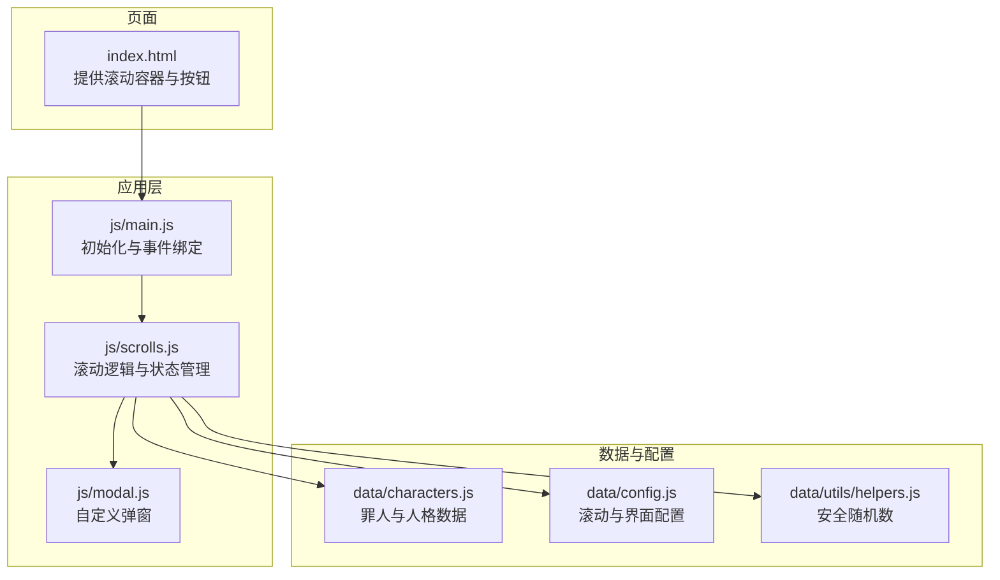
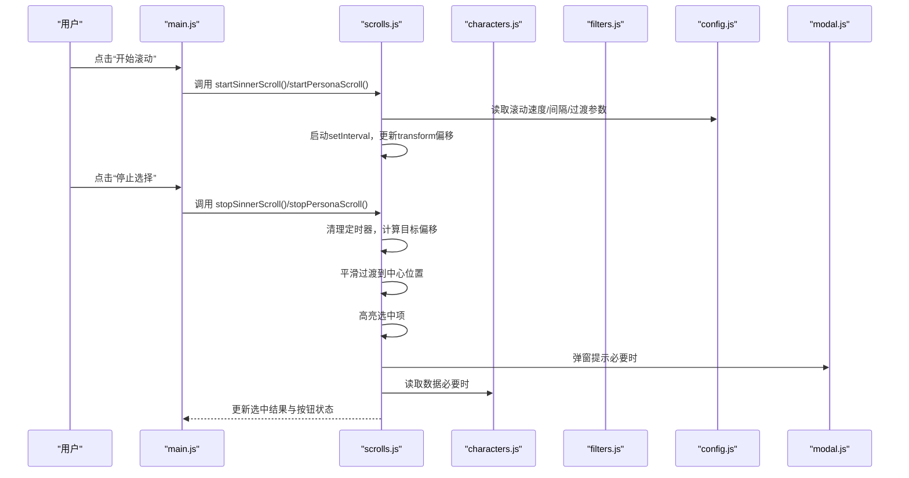
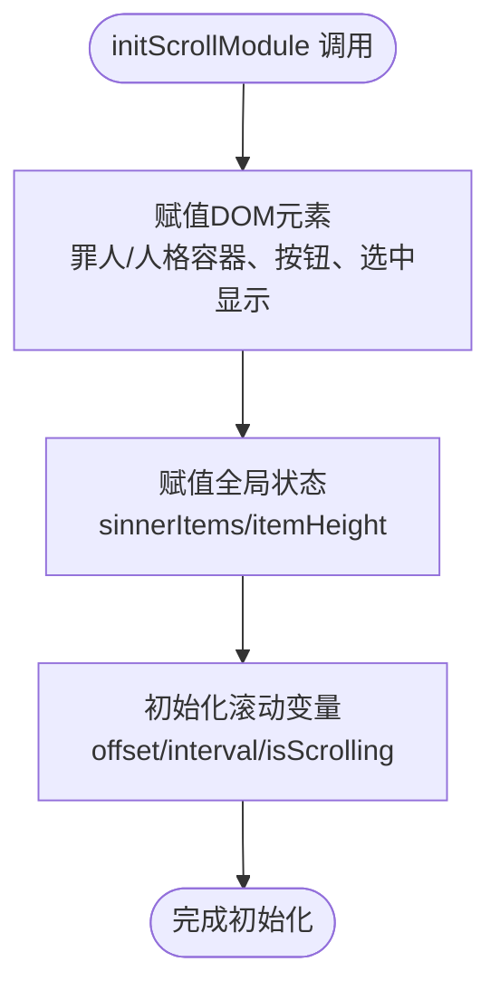
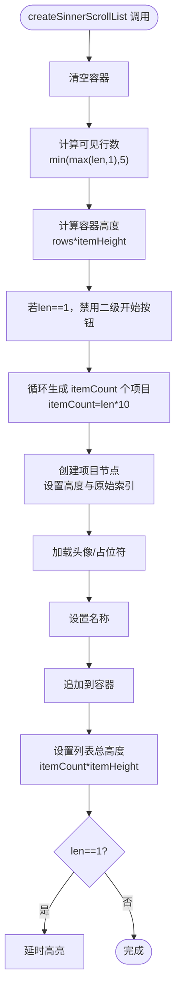
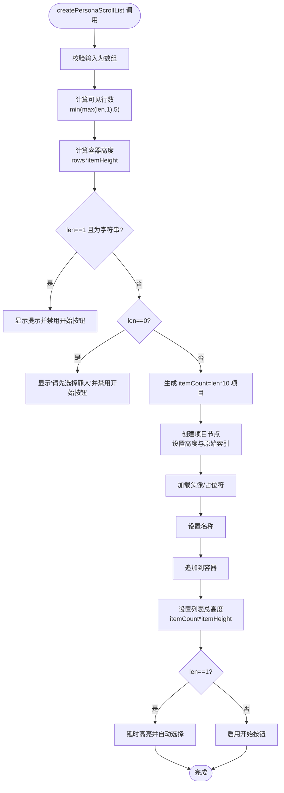
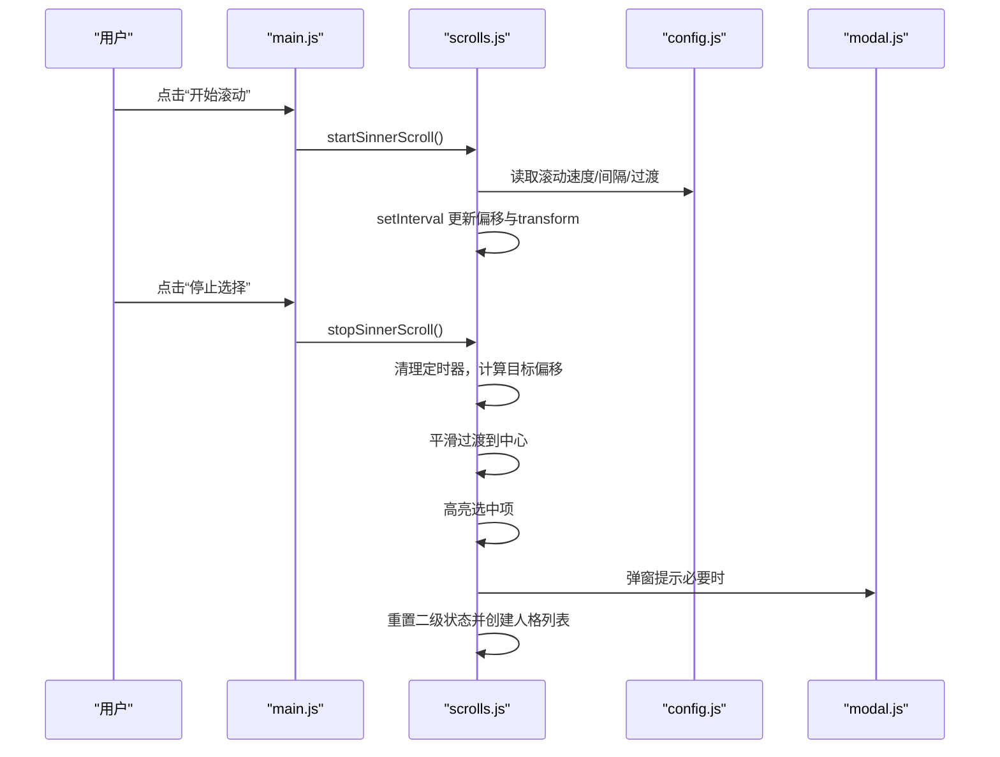
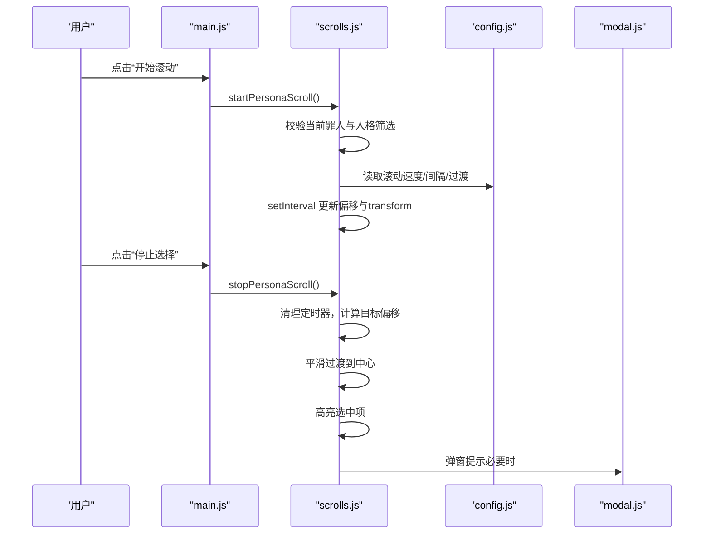
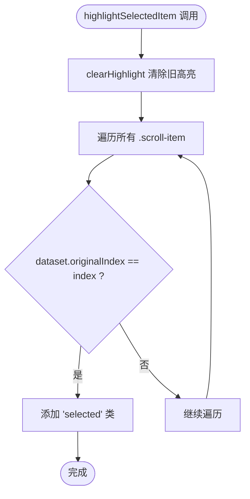
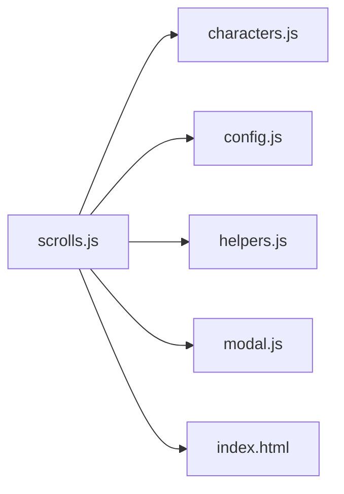
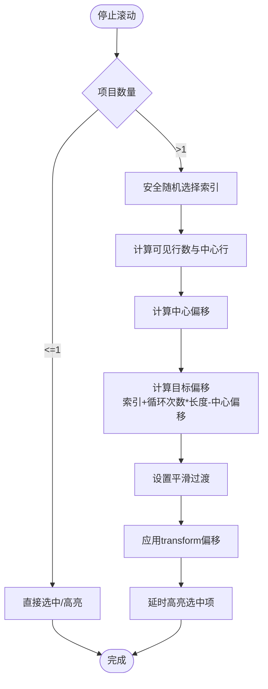

# scrolls.js模块

<cite>
**本文引用的文件**
- [js/scrolls.js](file://js/scrolls.js)
- [js/main.js](file://js/main.js)
- [data/characters.js](file://data/characters.js)
- [data/config.js](file://data/config.js)
- [js/modal.js](file://js/modal.js)
- [data/utils/helpers.js](file://data/utils/helpers.js)
- [index.html](file://index.html)
</cite>

## 目录
1. [简介](#简介)
2. [项目结构](#项目结构)
3. [核心组件](#核心组件)
4. [架构总览](#架构总览)
5. [详细组件分析](#详细组件分析)
6. [依赖关系分析](#依赖关系分析)
7. [性能考量](#性能考量)
8. [故障排查指南](#故障排查指南)
9. [结论](#结论)
10. [附录](#附录)

## 简介
本文件系统化梳理 scrolls.js 模块，作为滚动功能的核心实现，负责：
- 接收来自 main.js 的 DOM 元素与全局状态，完成初始化
- 动态创建罪人与人格滚动列表的 DOM 结构，渲染头像与名称，并计算容器高度
- 通过定时器与 CSS transform 实现平滑滚动动画
- 在停止滚动时进行随机选择、平滑定位至中心并高亮选中项
- 统一管理选中状态的清除与高亮逻辑
- 依赖 characters.js 提供数据、config.js 提供配置、modal.js 提供用户提示

## 项目结构
scrolls.js 位于 js/scrolls.js，与 main.js、data/characters.js、data/config.js、js/modal.js、data/utils/helpers.js 等模块协同工作。index.html 提供滚动容器与按钮的 DOM 结构。

图表来源
- [index.html](file://index.html#L35-L76)
- [js/main.js](file://js/main.js#L160-L203)
- [js/scrolls.js](file://js/scrolls.js#L1-L718)
- [data/characters.js](file://data/characters.js#L1-L260)
- [data/config.js](file://data/config.js#L1-L29)
- [js/modal.js](file://js/modal.js#L1-L109)
- [data/utils/helpers.js](file://data/utils/helpers.js#L1-L20)

章节来源
- [js/scrolls.js](file://js/scrolls.js#L1-L718)
- [js/main.js](file://js/main.js#L160-L203)
- [index.html](file://index.html#L35-L76)

## 核心组件
- 初始化与状态
  - initScrollModule(domElements, globalState)：接收 DOM 元素与全局状态，初始化滚动容器、按钮、选中项、滚动偏移与状态标志
- 列表创建
  - createSinnerScrollList(items)：根据筛选后的罪人数据创建滚动列表，计算容器高度，渲染头像与名称，支持单项目直接高亮
  - createPersonaScrollList(items)：根据筛选后的人格数据创建滚动列表，处理提示字符串、无项目、单项目等边界情况
- 滚动控制
  - startSinnerScroll() / startPersonaScroll()：启动滚动，基于 setInteval 与 CSS transform 快速滚动；实现循环重置与过渡切换
  - stopSinnerScroll() / stopPersonaScroll()：停止滚动，随机选择、平滑定位到中心、高亮选中项；同时联动二级转盘状态重置与列表重建
- 选中管理
  - clearHighlight(scrollContainer)：清除所有高亮
  - highlightSelectedItem(scrollContainer, index)：按原始索引匹配，高亮对应项

章节来源
- [js/scrolls.js](file://js/scrolls.js#L21-L718)

## 架构总览
scrolls.js 采用“模块化职责分离”的设计：
- 数据来源：characters.js 提供罪人与人格数据
- 配置来源：config.js 提供滚动速度、容器高度倍数、过渡参数等
- 用户交互：main.js 负责 DOM 获取、事件绑定与全局状态维护；modal.js 提供提示与确认
- 安全随机：helpers.js 提供安全随机数生成

图表来源
- [js/main.js](file://js/main.js#L196-L202)
- [js/scrolls.js](file://js/scrolls.js#L281-L718)
- [data/config.js](file://data/config.js#L1-L29)
- [data/characters.js](file://data/characters.js#L1-L260)
- [js/modal.js](file://js/modal.js#L75-L106)

## 详细组件分析

### 初始化流程：initScrollModule
- 输入
  - domElements：包含罪人/人格滚动容器、开始/停止按钮、选中结果显示元素
  - globalState：包含 sinnerItems、itemHeight、sinnerData、筛选后的罪人数据与人格筛选状态
- 处理
  - 将传入的 DOM 元素赋值到模块内变量
  - 初始化滚动偏移、定时器与滚动状态标志
- 输出
  - 模块具备操作 DOM 与状态的能力，后续创建列表与控制滚动

图表来源
- [js/scrolls.js](file://js/scrolls.js#L21-L43)

章节来源
- [js/scrolls.js](file://js/scrolls.js#L21-L43)

### 罪人滚动列表：createSinnerScrollList
- 输入：筛选后的罪人数组
- 处理
  - 清空容器，设置可见行数（1~5 行），计算容器高度并设置父容器高度
  - 若仅有一个项目，禁用二级转盘开始按钮
  - 生成 itemCount = items.length × 10 的虚拟项目，每个项目包含头像与名称
  - 为每个项目存储原始索引，便于后续定位
  - 设置滚动列表总高度，确保能完整滚动
  - 单项目场景下延时高亮
- 输出：罪人滚动列表 DOM 结构完成，容器高度与项目高度按配置计算

图表来源
- [js/scrolls.js](file://js/scrolls.js#L46-L111)
- [data/config.js](file://data/config.js#L1-L29)

章节来源
- [js/scrolls.js](file://js/scrolls.js#L46-L111)

### 人格滚动列表：createPersonaScrollList
- 输入：筛选后的人格数组（支持字符串提示）
- 处理
  - 校验输入为数组
  - 计算可见行数与容器高度
  - 特殊处理：当数组长度为 1 且为字符串时，显示提示并禁用开始按钮
  - 无项目时显示“请先选择罪人”提示并禁用开始按钮
  - 否则生成 itemCount = items.length × 10 的项目，渲染头像与名称
  - 单项目场景下延时高亮并自动选择，更新选中显示与按钮状态
- 输出：人格滚动列表 DOM 结构完成，按钮状态与选中显示按规则更新

图表来源
- [js/scrolls.js](file://js/scrolls.js#L113-L279)
- [data/config.js](file://data/config.js#L1-L29)

章节来源
- [js/scrolls.js](file://js/scrolls.js#L113-L279)

### 罪人滚动动画：startSinnerScroll 与 stopSinnerScroll
- startSinnerScroll
  - 若筛选后罪人数量为 0，弹窗提示并返回
  - 若为 1，直接调用 stopSinnerScroll，避免启动滚动
  - 启动定时器，按配置的滚动速度与间隔更新 transform 偏移
  - 实现循环重置：超过总高度后重置偏移并短暂禁用过渡，再恢复过渡
  - 更新按钮状态与滚动标志
- stopSinnerScroll
  - 若筛选后数量为 0 或 1，直接选中并更新选中显示
  - 否则使用安全随机数随机选择，计算目标偏移使选中项居中
  - 平滑过渡到目标位置，等待动画完成后高亮选中项
  - 重置二级转盘状态，创建对应罪人的人格列表

图表来源
- [js/scrolls.js](file://js/scrolls.js#L281-L478)
- [data/config.js](file://data/config.js#L1-L29)
- [js/modal.js](file://js/modal.js#L75-L106)

章节来源
- [js/scrolls.js](file://js/scrolls.js#L281-L478)

### 人格滚动动画：startPersonaScroll 与 stopPersonaScroll
- startPersonaScroll
  - 强制校验当前选中的罪人仍在筛选列表中，否则清空并提示
  - 若无选中罪人且筛选后仅剩一个，直接选中并高亮
  - 过滤出当前罪人的人格（尊重筛选状态），若为空则提示
  - 若仅剩一个可用人格，直接调用 stopPersonaScroll
  - 启动定时器，快速滚动并实现循环重置
- stopPersonaScroll
  - 强制校验当前选中的罪人与人格列表有效性
  - 若仅剩一个可用人格，直接选中并高亮，启用开始按钮
  - 否则使用安全随机数随机选择，计算目标偏移使选中项居中
  - 平滑过渡到目标位置，等待动画完成后高亮选中项
  - 更新按钮状态

图表来源
- [js/scrolls.js](file://js/scrolls.js#L480-L684)
- [data/config.js](file://data/config.js#L1-L29)
- [js/modal.js](file://js/modal.js#L75-L106)

章节来源
- [js/scrolls.js](file://js/scrolls.js#L480-L684)

### 选中状态管理：clearHighlight 与 highlightSelectedItem
- clearHighlight(scrollContainer)：移除所有项目上的“选中”类
- highlightSelectedItem(scrollContainer, index)：根据 dataset.originalIndex 匹配，对对应项目添加“选中”类

图表来源
- [js/scrolls.js](file://js/scrolls.js#L686-L705)

章节来源
- [js/scrolls.js](file://js/scrolls.js#L686-L705)

## 依赖关系分析
- 数据依赖
  - characters.js：提供罪人与人格数据，用于渲染头像与名称
- 配置依赖
  - config.js：提供 itemHeight、scrollSpeed、scrollInterval、transitionDuration、transitionType、totalHeightMultiplier 等关键参数
- 工具依赖
  - helpers.js：提供 secureRandInt，保证随机选择的均匀性
- 交互依赖
  - modal.js：统一弹窗提示与确认，提升用户体验
- DOM 依赖
  - index.html：提供滚动容器、按钮与选中显示元素的结构

图表来源
- [js/scrolls.js](file://js/scrolls.js#L1-L20)
- [data/characters.js](file://data/characters.js#L1-L260)
- [data/config.js](file://data/config.js#L1-L29)
- [data/utils/helpers.js](file://data/utils/helpers.js#L1-L20)
- [js/modal.js](file://js/modal.js#L1-L109)
- [index.html](file://index.html#L35-L76)

章节来源
- [js/scrolls.js](file://js/scrolls.js#L1-L20)
- [data/characters.js](file://data/characters.js#L1-L260)
- [data/config.js](file://data/config.js#L1-L29)
- [data/utils/helpers.js](file://data/utils/helpers.js#L1-L20)
- [js/modal.js](file://js/modal.js#L1-L109)
- [index.html](file://index.html#L35-L76)

## 性能考量
- 列表渲染
  - 通过 itemCount = len × 10 实现无缝循环滚动，减少视觉断层
  - 项目高度与容器高度按 itemHeight 线性计算，避免复杂布局重排
- 动画性能
  - 使用 transform 与 transition，避免触发布局与重绘
  - 通过禁用过渡与快速重置偏移，减少循环过程中的闪烁
- 随机选择
  - 使用安全随机数生成器，保证公平性与一致性
- 事件绑定
  - 通过 main.js 统一绑定按钮事件，避免重复绑定导致的性能问题

[本节为通用指导，无需特定文件引用]

## 故障排查指南
- “请至少选择一个罪人！”
  - 触发条件：罪人筛选后为空或仅剩一个但未正确处理
  - 排查要点：检查筛选逻辑与 stopSinnerScroll 的分支处理
  - 参考路径
    - [js/scrolls.js](file://js/scrolls.js#L283-L292)
    - [js/scrolls.js](file://js/scrolls.js#L352-L370)
- “请至少选择一个人格！”
  - 触发条件：人格筛选后为空或仅剩一个但未正确处理
  - 排查要点：检查当前罪人的人格筛选状态与 stopPersonaScroll 的分支处理
  - 参考路径
    - [js/scrolls.js](file://js/scrolls.js#L530-L534)
    - [js/scrolls.js](file://js/scrolls.js#L647-L652)
- 滚动按钮状态异常
  - 触发条件：单项目时按钮应禁用/启用不一致
  - 排查要点：检查 createSinnerScrollList 与 createPersonaScrollList 的按钮状态设置
  - 参考路径
    - [js/scrolls.js](file://js/scrolls.js#L55-L57)
    - [js/scrolls.js](file://js/scrolls.js#L130-L161)
    - [js/scrolls.js](file://js/scrolls.js#L196-L198)
    - [js/scrolls.js](file://js/scrolls.js#L276-L279)
- 高亮不生效
  - 触发条件：原始索引不匹配或类名未正确添加
  - 排查要点：确认 dataset.originalIndex 是否正确写入与读取
  - 参考路径
    - [js/scrolls.js](file://js/scrolls.js#L61-L65)
    - [js/scrolls.js](file://js/scrolls.js#L695-L705)

章节来源
- [js/scrolls.js](file://js/scrolls.js#L281-L478)
- [js/scrolls.js](file://js/scrolls.js#L480-L684)

## 结论
scrolls.js 通过清晰的职责划分与稳健的状态管理，实现了流畅的两级滚动选择体验。其依赖关系简洁明确，配置参数集中可控，配合安全随机数与统一弹窗提示，确保了公平性与易用性。建议在后续迭代中进一步抽象动画参数与容器高度计算，以增强可扩展性与可测试性。

[本节为总结，无需特定文件引用]

## 附录

### 关键流程图：随机选择与居中定位

图表来源
- [js/scrolls.js](file://js/scrolls.js#L406-L442)
- [js/scrolls.js](file://js/scrolls.js#L654-L680)
- [data/config.js](file://data/config.js#L1-L29)
- [data/utils/helpers.js](file://data/utils/helpers.js#L1-L20)

### 代码示例路径（不展示具体代码内容）
- 初始化滚动模块
  - [js/scrolls.js](file://js/scrolls.js#L21-L43)
- 创建罪人滚动列表
  - [js/scrolls.js](file://js/scrolls.js#L46-L111)
- 创建人格滚动列表
  - [js/scrolls.js](file://js/scrolls.js#L113-L279)
- 启动/停止罪人滚动
  - [js/scrolls.js](file://js/scrolls.js#L281-L322)
  - [js/scrolls.js](file://js/scrolls.js#L349-L478)
- 启动/停止人格滚动
  - [js/scrolls.js](file://js/scrolls.js#L480-L570)
  - [js/scrolls.js](file://js/scrolls.js#L572-L684)
- 选中状态管理
  - [js/scrolls.js](file://js/scrolls.js#L686-L705)
- 数据与配置依赖
  - [data/characters.js](file://data/characters.js#L1-L260)
  - [data/config.js](file://data/config.js#L1-L29)
- 安全随机数
  - [data/utils/helpers.js](file://data/utils/helpers.js#L1-L20)
- 用户提示
  - [js/modal.js](file://js/modal.js#L75-L106)
- DOM 结构
  - [index.html](file://index.html#L35-L76)