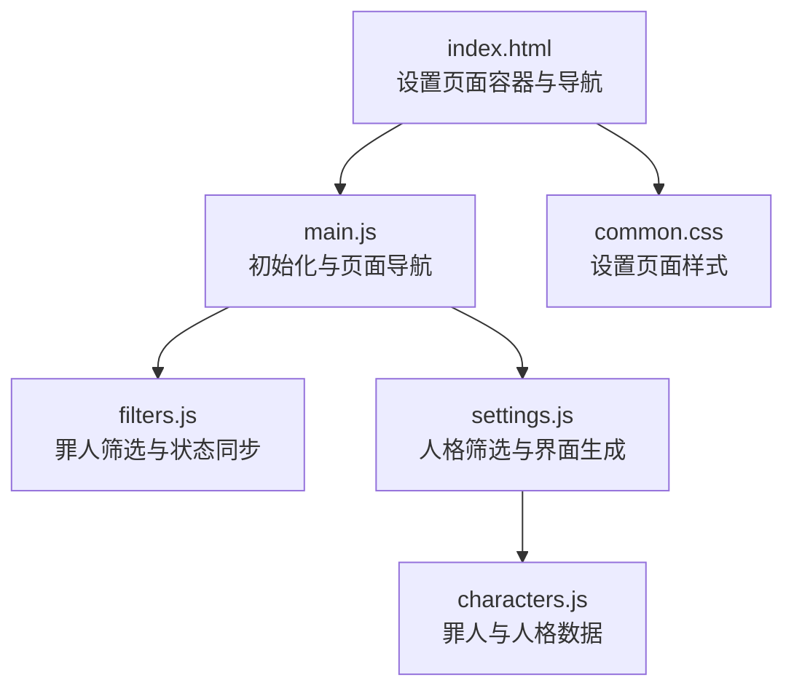
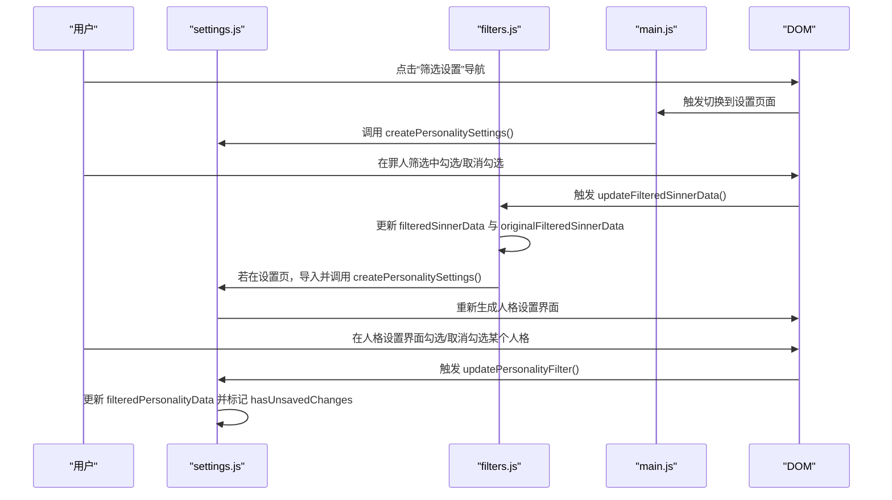
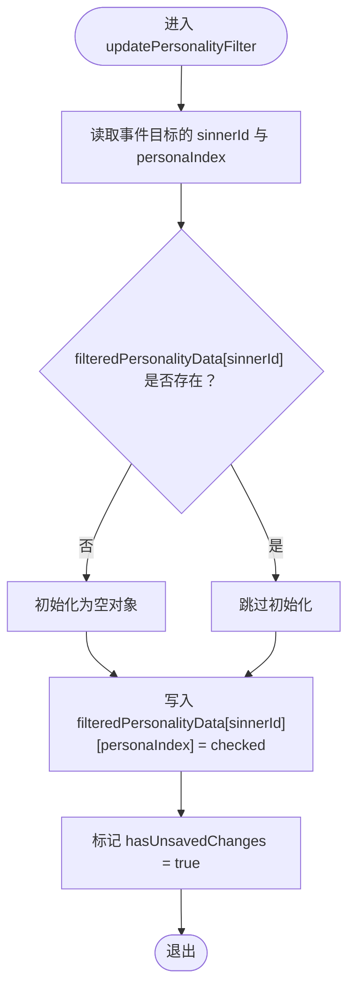
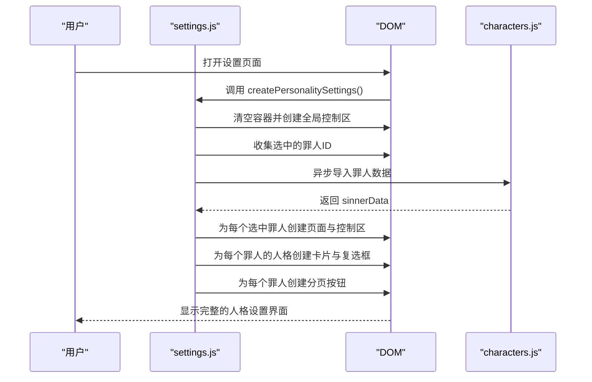
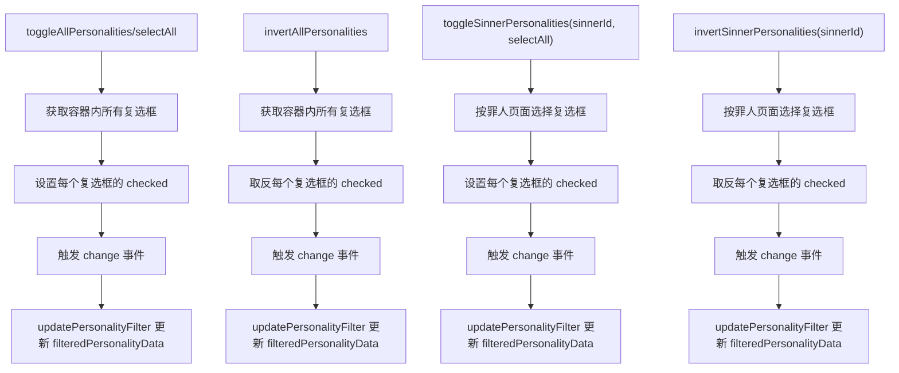
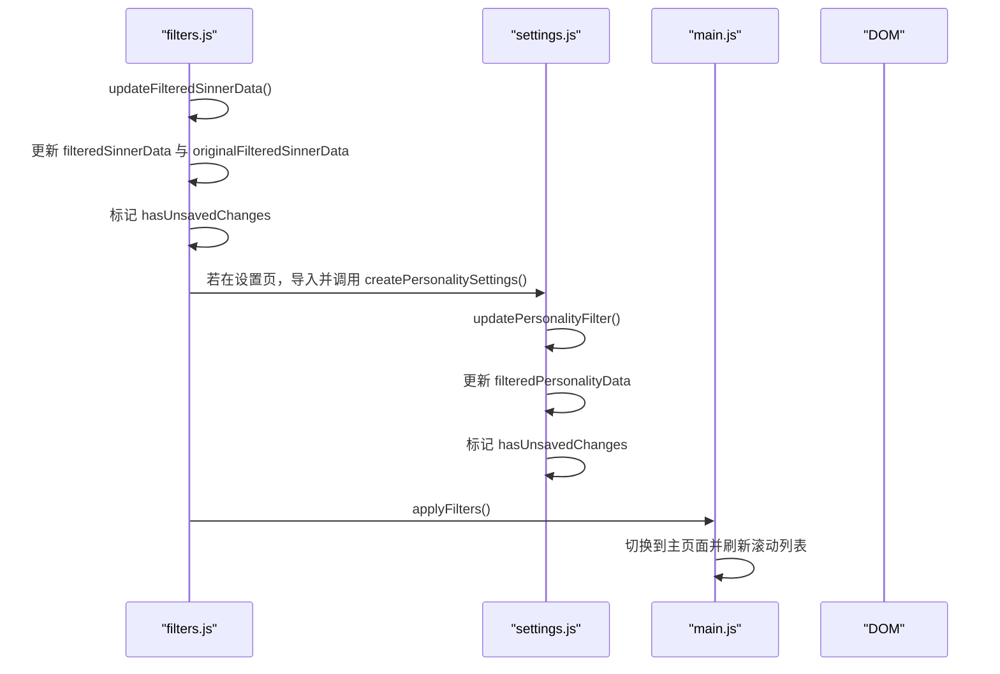
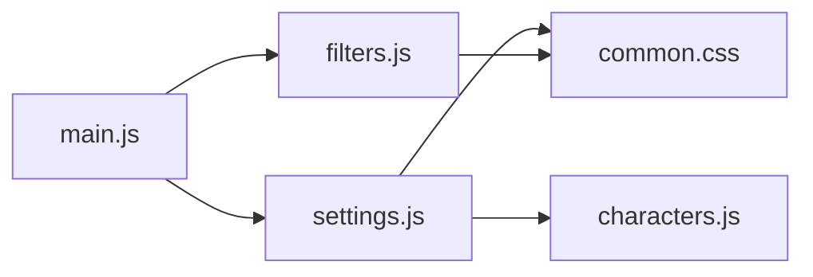

# settings.js模块

<cite>
**本文引用的文件**
- [settings.js](file://js/settings.js)
- [filters.js](file://js/filters.js)
- [main.js](file://js/main.js)
- [characters.js](file://data/characters.js)
- [common.css](file://css/common.css)
- [index.html](file://index.html)
</cite>

## 目录
1. [简介](#简介)
2. [项目结构](#项目结构)
3. [核心组件](#核心组件)
4. [架构总览](#架构总览)
5. [详细组件分析](#详细组件分析)
6. [依赖关系分析](#依赖关系分析)
7. [性能考量](#性能考量)
8. [故障排查指南](#故障排查指南)
9. [结论](#结论)
10. [附录](#附录)

## 简介
本文件系统化梳理 settings.js 模块作为“人格筛选设置模块”的实现，重点说明其如何管理 window.filteredPersonalityData 全局状态对象（以罪人ID为键，存储每个人格的启用/禁用状态），以及如何与 filters.js 协同工作，共同维护筛选状态并通过 dispatchEvent 触发状态更新。文档还详细解释 updatePersonalityFilter 如何响应人格复选框的 change 事件，createPersonalitySettings 如何根据当前选中的罪人动态生成人格设置界面（含分页、控制按钮与人格卡片网格），并阐述 toggleAllPersonalities、invertAllPersonalities、toggleSinnerPersonalities、invertSinnerPersonalities 的全局与特定罪人筛选控制逻辑。

## 项目结构
settings.js 位于 js 目录，与 filters.js、main.js 紧密协作；数据源来自 data/characters.js；UI 结构由 index.html 提供，样式由 common.css 定义。

图表来源
- [index.html](file://index.html#L81-L113)
- [main.js](file://js/main.js#L108-L115)
- [filters.js](file://js/filters.js#L93-L101)
- [settings.js](file://js/settings.js#L60-L110)
- [characters.js](file://data/characters.js#L1-L20)
- [common.css](file://css/common.css#L303-L393)

章节来源
- [index.html](file://index.html#L81-L113)
- [main.js](file://js/main.js#L108-L115)
- [settings.js](file://js/settings.js#L60-L110)
- [filters.js](file://js/filters.js#L93-L101)
- [characters.js](file://data/characters.js#L1-L20)
- [common.css](file://css/common.css#L303-L393)

## 核心组件
- 全局状态管理
  - window.filteredPersonalityData：以罪人ID为键的对象，值为按索引映射的人格启用/禁用布尔值；未设置时默认视为启用。
  - window.hasUnsavedChanges：标记是否存在未保存的筛选更改。
- 人格筛选事件处理
  - updatePersonalityFilter：响应复选框 change 事件，更新对应罪人与人格索引的筛选状态，并标记未保存更改。
- 全局与特定罪人筛选控制
  - toggleAllPersonalities/invertAllPersonalities：对设置页面容器内所有复选框执行全选/全不选/反选。
  - toggleSinnerPersonalities/invertSinnerPersonalities：针对指定罪人ID的页面进行全选/全不选/反选。
- 动态界面生成
  - createPersonalitySettings：基于当前选中的罪人动态生成人格设置界面，包含全局控制区、分页容器、每页的罪人控制区与人格网格，以及分页按钮。

章节来源
- [settings.js](file://js/settings.js#L1-L263)
- [main.js](file://js/main.js#L69-L78)

## 架构总览
settings.js 与 filters.js 共同维护筛选状态：
- filters.js 负责罪人筛选（更新 window.filteredSinnerData、originalFilteredSinnerData、hasUnsavedChanges），并在必要时触发 settings.js 重新生成人格设置界面。
- settings.js 负责人格筛选（更新 window.filteredPersonalityData、hasUnsavedChanges），并生成动态界面。

图表来源
- [main.js](file://js/main.js#L108-L115)
- [filters.js](file://js/filters.js#L93-L101)
- [settings.js](file://js/settings.js#L60-L110)

## 详细组件分析

### 全局状态对象 filteredPersonalityData 的管理
- 数据结构
  - 键：罪人ID（整数）
  - 值：对象，键为“人格索引”，值为布尔（true表示启用，false表示禁用）
  - 未设置时默认视为启用（即未显式设置为false的人格被视为启用）
- 初始化位置
  - main.js 在窗口对象上初始化 filteredPersonalityData 为空对象，供各模块共享
- 更新路径
  - updatePersonalityFilter 根据复选框的 dataset.sinnerId 与 dataset.personaIndex 写入 filteredPersonalityData 对应位置
  - filters.js 在应用筛选或重置时同步 originalFilteredPersonalityData 与 hasUnsavedChanges

章节来源
- [main.js](file://js/main.js#L69-L78)
- [settings.js](file://js/settings.js#L1-L20)
- [filters.js](file://js/filters.js#L160-L170)

### updatePersonalityFilter：响应人格复选框 change 事件
- 输入参数
  - event：复选框的 change 事件对象
- 关键行为
  - 从事件目标读取 dataset.sinnerId 与 dataset.personaIndex
  - 若该罪人尚未在 filteredPersonalityData 中初始化，则创建空对象
  - 将该人格的筛选状态写入 filteredPersonalityData[sinnerId][personaIndex]
  - 标记 window.hasUnsavedChanges 为 true
- 复杂度
  - 时间复杂度 O(1)，空间复杂度 O(1)

图表来源
- [settings.js](file://js/settings.js#L1-L18)

章节来源
- [settings.js](file://js/settings.js#L1-L18)

### createPersonalitySettings：动态生成人格设置界面
- 生成内容
  - 全局控制区：全选所有人格、取消所有人格、反选所有人格
  - 分页容器：为每个选中的罪人生成独立页面，页面标题为罪人名称
  - 每页控制区：全选、全不选、反选该罪人的人格
  - 人格网格：每个卡片包含头像、姓名与启用/禁用开关
  - 分页按钮：底部导航，点击切换活跃页面
- 数据来源
  - 从 filters 页面的复选框中收集选中的罪人ID
  - 异步导入 characters.js 获取罪人与人格数据
  - 使用 window.filteredPersonalityData 决定复选框初始状态（未设置则默认启用）
- 交互细节
  - 每个复选框绑定 change 事件，触发 updatePersonalityFilter
  - 分页按钮切换 .personality-page.active 与 .page-btn.active 类
  - 若无选中的罪人，显示提示信息

图表来源
- [settings.js](file://js/settings.js#L60-L254)
- [characters.js](file://data/characters.js#L1-L20)
- [index.html](file://index.html#L81-L113)

章节来源
- [settings.js](file://js/settings.js#L60-L254)
- [index.html](file://index.html#L81-L113)

### 全局与特定罪人筛选控制函数
- toggleAllPersonalities(selectAll)
  - 作用：对设置容器内所有复选框执行全选/全不选
  - 实现：遍历所有复选框，设置 checked 并 dispatchEvent('change')
- invertAllPersonalities()
  - 作用：对设置容器内所有复选框执行反选
  - 实现：遍历所有复选框，取反 checked 并 dispatchEvent('change')
- toggleSinnerPersonalities(sinnerId, selectAll)
  - 作用：对指定罪人页面内的所有复选框执行全选/全不选
  - 实现：通过选择器选取对应页面内的复选框，设置 checked 并 dispatchEvent('change')
- invertSinnerPersonalities(sinnerId)
  - 作用：对指定罪人页面内的所有复选框执行反选
  - 实现：通过选择器选取对应页面内的复选框，取反 checked 并 dispatchEvent('change')

图表来源
- [settings.js](file://js/settings.js#L21-L58)

章节来源
- [settings.js](file://js/settings.js#L21-L58)

### 与 filters.js 的协同工作
- filters.js 在罪人筛选变化时：
  - 更新 window.filteredSinnerData 与 originalFilteredSinnerData
  - 标记 window.hasUnsavedChanges
  - 若当前处于设置页面，导入并调用 settings.js 的 createPersonalitySettings 以同步更新界面
- settings.js 在人格筛选变化时：
  - 更新 window.filteredPersonalityData
  - 标记 window.hasUnsavedChanges
- 应用筛选时：
  - filters.js 将当前状态复制到 originalFilteredSinnerData/originalFilteredPersonalityData，并清除 hasUnsavedChanges
  - 切换回主页面并刷新滚动列表

图表来源
- [filters.js](file://js/filters.js#L93-L101)
- [settings.js](file://js/settings.js#L1-L18)
- [filters.js](file://js/filters.js#L160-L184)

章节来源
- [filters.js](file://js/filters.js#L93-L101)
- [filters.js](file://js/filters.js#L160-L184)
- [settings.js](file://js/settings.js#L1-L18)

### 代码示例：动态生成过程（路径引用）
- 全局控制区与分页容器创建
  - [创建全局控制区与按钮](file://js/settings.js#L66-L87)
  - [创建分页容器与页面](file://js/settings.js#L105-L120)
- 每页控制区与人格网格
  - [每页控制按钮（全选/全不选/反选）](file://js/settings.js#L132-L159)
  - [人格网格与卡片结构](file://js/settings.js#L162-L211)
- 复选框与事件绑定
  - [复选框初始状态与 change 事件](file://js/settings.js#L190-L205)
- 分页按钮与切换逻辑
  - [分页按钮创建与切换](file://js/settings.js#L217-L241)
- 无选中罪人时的提示
  - [提示信息渲染](file://js/settings.js#L247-L253)

章节来源
- [settings.js](file://js/settings.js#L66-L253)

## 依赖关系分析
- 模块间依赖
  - settings.js 依赖 filters.js 的筛选状态更新流程（通过 filters.js 的 updateFilteredSinnerData 触发 settings.js 的界面重建）
  - settings.js 依赖 characters.js 的罪人与人格数据
  - main.js 负责页面导航与初始化，间接驱动 settings.js 的界面生成
- 样式依赖
  - common.css 提供设置页面的布局、卡片、分页与按钮样式

图表来源
- [main.js](file://js/main.js#L108-L115)
- [filters.js](file://js/filters.js#L93-L101)
- [settings.js](file://js/settings.js#L60-L110)
- [common.css](file://css/common.css#L303-L393)

章节来源
- [main.js](file://js/main.js#L108-L115)
- [filters.js](file://js/filters.js#L93-L101)
- [settings.js](file://js/settings.js#L60-L110)
- [common.css](file://css/common.css#L303-L393)

## 性能考量
- DOM 操作优化
  - createPersonalitySettings 在生成界面前清空容器，避免重复渲染导致的累积开销
  - 分页切换仅切换 .active 类，避免频繁重建节点
- 事件处理
  - 复选框 change 事件仅更新 filteredPersonalityData 与 hasUnsavedChanges，避免不必要的重绘
- 数据访问
  - 通过 window.filteredPersonalityData 与 window.filteredSinnerData 共享状态，减少跨模块数据拷贝
- 异步加载
  - 罪人数据异步导入，避免阻塞主线程

[本节为通用性能讨论，无需具体文件引用]

## 故障排查指南
- 症状：切换到设置页面后界面未更新
  - 排查：确认 filters.js 的 updateFilteredSinnerData 是否在设置页面时调用 settings.js 的 createPersonalitySettings
  - 参考路径：[filters.js 更新后触发界面重建](file://js/filters.js#L93-L101)
- 症状：人格筛选状态未持久化
  - 排查：确认 updatePersonalityFilter 是否被触发，以及 filteredPersonalityData 是否被正确写入
  - 参考路径：[updatePersonalityFilter 写入状态](file://js/settings.js#L1-L18)
- 症状：应用筛选后未回到主页面或滚动列表未刷新
  - 排查：确认 filters.js 的 applyFilters 是否被调用，以及主页面切换与滚动列表刷新逻辑
  - 参考路径：[filters.js 应用筛选与返回主页面](file://js/filters.js#L160-L184)
- 症状：重置筛选后界面未恢复
  - 排查：确认 main.js 的重置逻辑是否正确恢复 filteredPersonalityData 与 filteredSinnerData，并重新生成界面
  - 参考路径：[main.js 重置筛选](file://js/main.js#L126-L146)

章节来源
- [filters.js](file://js/filters.js#L93-L101)
- [settings.js](file://js/settings.js#L1-L18)
- [filters.js](file://js/filters.js#L160-L184)
- [main.js](file://js/main.js#L126-L146)

## 结论
settings.js 模块通过 window.filteredPersonalityData 统一管理人格筛选状态，结合 filters.js 的罪人筛选状态，实现了“罪人-人格”两级筛选体系。其动态界面生成与批量控制函数提供了良好的用户体验，配合 filters.js 的状态同步与应用流程，保证了筛选设置的一致性与可追溯性。通过事件驱动与最小化 DOM 操作，模块在功能与性能之间取得平衡。

[本节为总结性内容，无需具体文件引用]

## 附录
- 关键函数与职责速览
  - updatePersonalityFilter：响应人格复选框 change 事件，更新 filteredPersonalityData 并标记未保存更改
  - toggleAllPersonalities/invertAllPersonalities：全局批量控制
  - toggleSinnerPersonalities/invertSinnerPersonalities：特定罪人批量控制
  - createPersonalitySettings：动态生成人格设置界面（全局控制区、分页、每页控制区、人格网格、分页按钮）

[本节为概览性内容，无需具体文件引用]