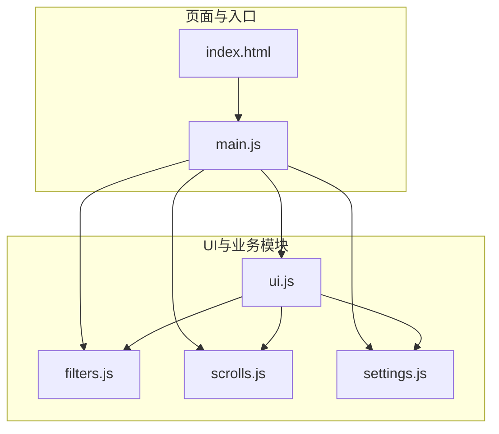
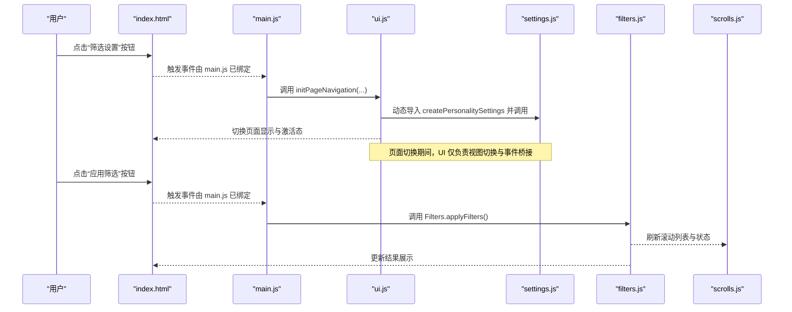
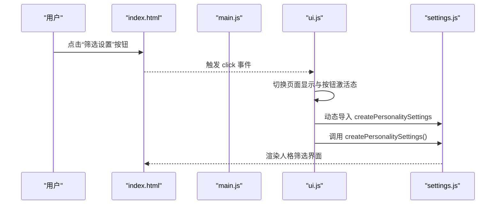
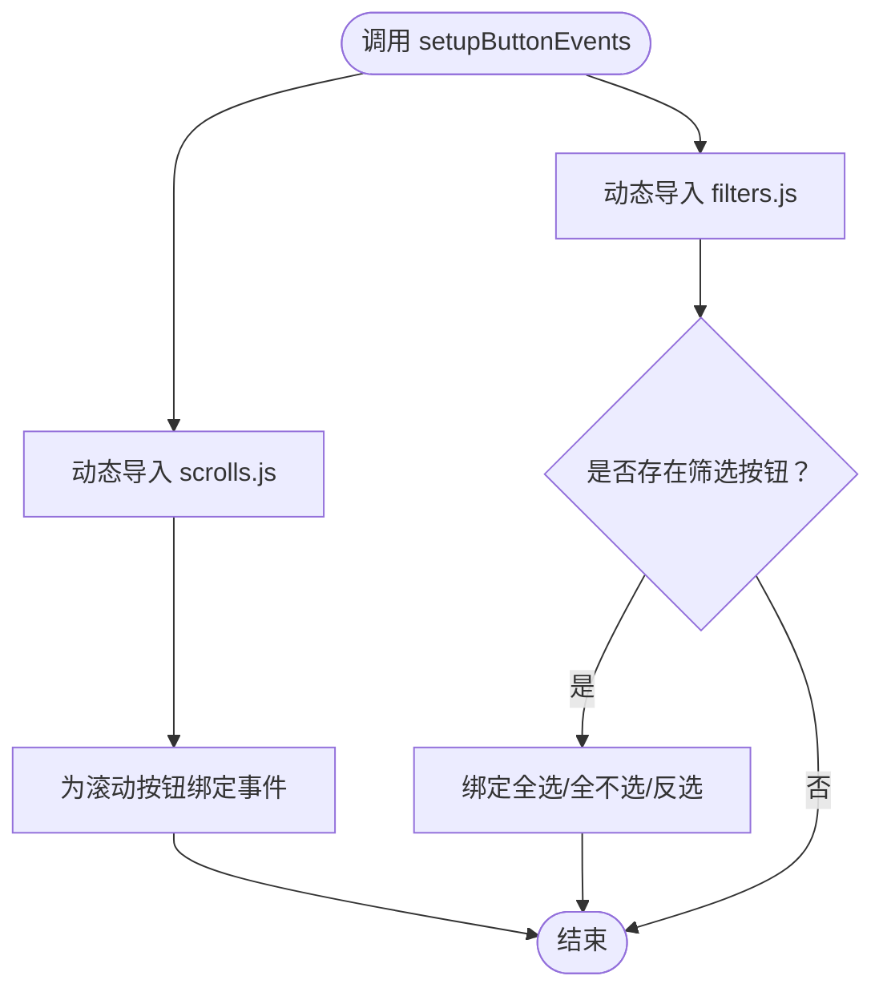
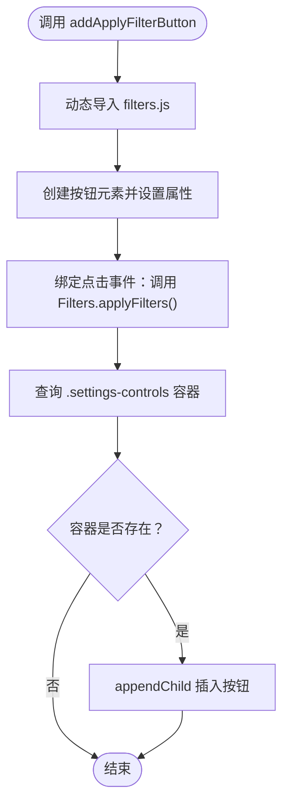
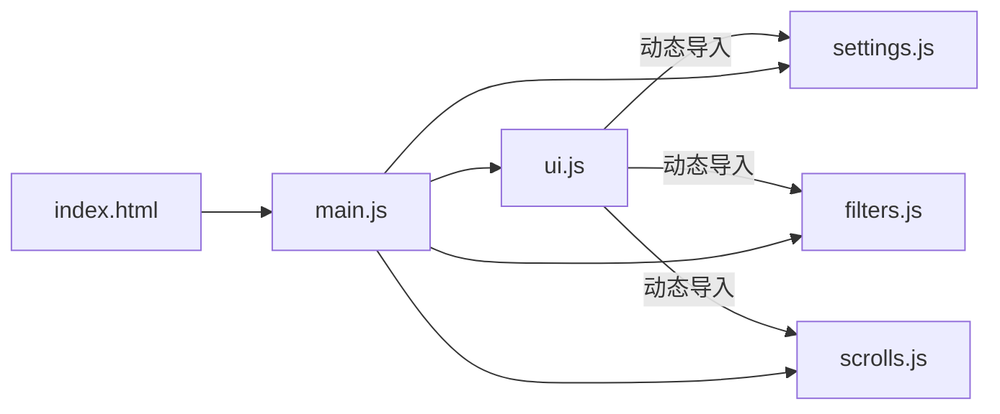

# ui.js模块

<cite>
**本文引用的文件**
- [ui.js](file://js/ui.js)
- [main.js](file://js/main.js)
- [settings.js](file://js/settings.js)
- [filters.js](file://js/filters.js)
- [scrolls.js](file://js/scrolls.js)
- [index.html](file://index.html)
</cite>

## 目录
1. [简介](#简介)
2. [项目结构](#项目结构)
3. [核心组件](#核心组件)
4. [架构总览](#架构总览)
5. [详细组件分析](#详细组件分析)
6. [依赖关系分析](#依赖关系分析)
7. [性能考量](#性能考量)
8. [故障排查指南](#故障排查指南)
9. [结论](#结论)

## 简介
本文件系统性梳理 ui.js 模块作为“UI管理模块”的职责与实现方式，重点围绕以下目标展开：
- 解释 ui.js 作为单例对象 const UI 的结构与职责边界
- 分析 initPageNavigation 如何设置页面导航事件监听器，实现主页面与设置页面之间的切换
- 解释 setupButtonEvents 如何为滚动控制按钮和筛选控制按钮绑定事件处理函数，并采用动态 import 避免循环依赖
- 说明 addApplyFilterButton 如何动态创建“应用筛选”按钮并插入到设置页面的 DOM 中
- 描述 init 函数如何在应用启动时调用 addApplyFilterButton 完成 UI 初始化
- 总结该模块如何作为其他模块（main.js、settings.js）与 DOM 交互的桥梁，实现关注点分离

## 项目结构
ui.js 位于前端模块化目录 js/ 下，与 filters.js、scrolls.js、settings.js 等模块共同构成应用的业务层；index.html 提供页面骨架与初始 DOM 结构。main.js 作为入口模块，负责协调各子模块并调用 UI 模块完成 UI 初始化。

图表来源
- [index.html](file://index.html#L1-L176)
- [main.js](file://js/main.js#L1-L261)
- [ui.js](file://js/ui.js#L1-L66)
- [filters.js](file://js/filters.js#L1-L274)
- [scrolls.js](file://js/scrolls.js#L1-L718)
- [settings.js](file://js/settings.js#L1-L263)

章节来源
- [index.html](file://index.html#L1-L176)
- [main.js](file://js/main.js#L1-L261)
- [ui.js](file://js/ui.js#L1-L66)

## 核心组件
ui.js 暴露一个常量单例对象 UI，提供以下关键方法：
- initPageNavigation：为页面导航按钮绑定事件，实现主页面与设置页面的切换
- setupButtonEvents：为滚动控制按钮与筛选控制按钮绑定事件，采用动态 import 避免循环依赖
- addApplyFilterButton：动态创建“应用筛选”按钮并插入到设置页面的 DOM 中
- init：应用启动时的 UI 初始化入口，目前委托 addApplyFilterButton 完成按钮注入

这些方法共同承担“UI层协调者”的职责，将 DOM 交互与业务逻辑解耦，使 main.js、filters.js、scrolls.js、settings.js 等模块专注于各自领域逻辑。

章节来源
- [ui.js](file://js/ui.js#L1-L66)

## 架构总览
UI 模块在应用中的定位如下：
- 作为入口模块 main.js 的协作方，负责页面导航与部分 UI 控件的动态注入
- 通过动态 import 与业务模块（filters、scrolls、settings）建立松耦合联系
- 通过 index.html 的 DOM 结构与事件绑定，形成“视图层”的统一入口

图表来源
- [index.html](file://index.html#L1-L176)
- [main.js](file://js/main.js#L80-L124)
- [ui.js](file://js/ui.js#L6-L21)
- [settings.js](file://js/settings.js#L61-L100)
- [filters.js](file://js/filters.js#L160-L184)
- [scrolls.js](file://js/scrolls.js#L194-L206)

## 详细组件分析

### 单例对象 UI 的结构与职责
- 结构特征
  - 以常量单例暴露一组 UI 相关的方法，避免全局污染
  - 方法职责清晰：页面导航、按钮事件、动态控件注入、初始化入口
- 设计要点
  - 通过动态 import 实现按需加载，降低初始包体与避免循环依赖
  - 将 UI 层与业务层解耦，UI 仅做“桥接”，不承载业务逻辑

章节来源
- [ui.js](file://js/ui.js#L1-L66)

### initPageNavigation：页面导航事件监听器
- 目标
  - 为“筛选设置”按钮绑定点击事件，实现主页面与设置页面之间的切换
- 行为流程
  - 点击“筛选设置”按钮时，隐藏主选择器页面，显示设置页面
  - 切换按钮激活态（active）
  - 动态导入 settings.js 的 createPersonalitySettings 并调用，以渲染人格筛选界面
- 关键点
  - 主页面按钮点击事件由 main.js 处理，避免重复绑定
  - 通过动态 import 仅在需要时加载 settings.js，减少初始开销

图表来源
- [ui.js](file://js/ui.js#L6-L21)
- [settings.js](file://js/settings.js#L61-L100)
- [index.html](file://index.html#L80-L113)

章节来源
- [ui.js](file://js/ui.js#L6-L21)
- [index.html](file://index.html#L80-L113)

### setupButtonEvents：滚动与筛选控制按钮事件绑定
- 目标
  - 为滚动控制按钮（罪人/人格开始/停止）与筛选控制按钮（全选/全不选/反选）绑定事件
- 实现策略
  - 对滚动控制按钮：动态导入 scrolls.js 的滚动函数，避免循环依赖
  - 对筛选控制按钮：动态导入 filters.js 的 Filters 类型，绑定全选/全不选/反选行为
- 注意事项
  - 仅在按钮存在时绑定事件，避免空引用
  - 通过动态 import，确保在调用时才解析依赖，降低耦合度

图表来源
- [ui.js](file://js/ui.js#L23-L39)
- [scrolls.js](file://js/scrolls.js#L1-L718)
- [filters.js](file://js/filters.js#L103-L115)

章节来源
- [ui.js](file://js/ui.js#L23-L39)

### addApplyFilterButton：动态创建“应用筛选”按钮
- 目标
  - 在设置页面的“.settings-controls”区域动态创建“应用筛选”按钮
- 行为流程
  - 动态导入 filters.js 的 Filters 类型
  - 创建 button 元素，设置 id、className、文本内容
  - 绑定点击事件：调用 Filters.applyFilters()
  - 将按钮追加到 .settings-controls 容器中
- 关键点
  - 采用动态 import，避免与 filters.js 的直接静态依赖
  - 通过 DOM 查询 .settings-controls 确保插入位置正确

图表来源
- [ui.js](file://js/ui.js#L41-L57)
- [filters.js](file://js/filters.js#L160-L184)
- [index.html](file://index.html#L100-L113)

章节来源
- [ui.js](file://js/ui.js#L41-L57)
- [index.html](file://index.html#L100-L113)

### init：应用启动时的 UI 初始化
- 目标
  - 在应用启动时完成 UI 的初始化工作
- 行为
  - 调用 addApplyFilterButton，确保“应用筛选”按钮在设置页面可用
- 与 main.js 的配合
  - main.js 在页面加载完成后调用 UI.init()，保证 DOM 已就绪
  - 同时 main.js 也在设置页面按钮点击事件中直接调用 createPersonalitySettings，形成互补

章节来源
- [ui.js](file://js/ui.js#L59-L66)
- [main.js](file://js/main.js#L255-L261)

## 依赖关系分析
- UI 模块对业务模块的依赖均为动态导入，避免静态循环依赖
- UI 与 main.js 的耦合点集中在页面导航与按钮事件绑定的触发时机
- UI 与 settings.js、filters.js、scrolls.js 的交互通过动态 import 实现弱耦合

图表来源
- [ui.js](file://js/ui.js#L6-L21)
- [ui.js](file://js/ui.js#L23-L39)
- [ui.js](file://js/ui.js#L41-L57)
- [main.js](file://js/main.js#L1-L261)
- [index.html](file://index.html#L1-L176)

章节来源
- [ui.js](file://js/ui.js#L6-L21)
- [ui.js](file://js/ui.js#L23-L39)
- [ui.js](file://js/ui.js#L41-L57)
- [main.js](file://js/main.js#L1-L261)

## 性能考量
- 动态 import 的优势
  - 按需加载：仅在需要时解析依赖，降低初始包体与首屏加载压力
  - 避免循环依赖：UI 与业务模块之间通过动态导入建立松耦合
- 事件绑定策略
  - 仅在按钮存在时绑定，避免不必要的事件监听器
  - 将页面切换与控件注入拆分为独立职责，便于维护与优化
- DOM 操作
  - 通过查询容器并追加按钮的方式，避免重复渲染整个设置区域

[本节为通用性能讨论，无需列出具体文件来源]

## 故障排查指南
- “应用筛选”按钮未出现
  - 检查是否调用了 UI.init()，确保 addApplyFilterButton 执行
  - 确认 .settings-controls 容器存在且可查询
  - 确认 filters.js 的 Filters 类型导出正常
- 页面切换无效
  - 确认“筛选设置”按钮的 click 事件已绑定（由 UI.initPageNavigation 完成）
  - 确认 main.js 中未重复绑定导致冲突
- 滚动按钮无效
  - 确认 setupButtonEvents 是否在 UI.init() 或页面加载后调用
  - 确认 scrolls.js 的滚动函数导出正常
- 筛选控制按钮无效
  - 确认 filters.js 的 Filters 类型导出正常
  - 确认按钮存在且未被其他逻辑覆盖

章节来源
- [ui.js](file://js/ui.js#L41-L57)
- [ui.js](file://js/ui.js#L23-L39)
- [ui.js](file://js/ui.js#L6-L21)
- [main.js](file://js/main.js#L193-L203)
- [index.html](file://index.html#L80-L113)

## 结论
ui.js 作为 UI 管理模块，通过单例对象封装页面导航、按钮事件与动态控件注入，有效实现了 UI 层与业务层的关注点分离。其采用动态 import 的策略，既降低了模块间的耦合度，又提升了运行时的灵活性。结合 main.js 的入口协调，UI 模块在不承载业务逻辑的前提下，成为连接 DOM 与业务模块的关键桥梁，为项目的可维护性与扩展性提供了良好基础。