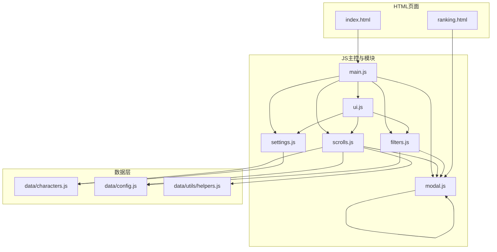
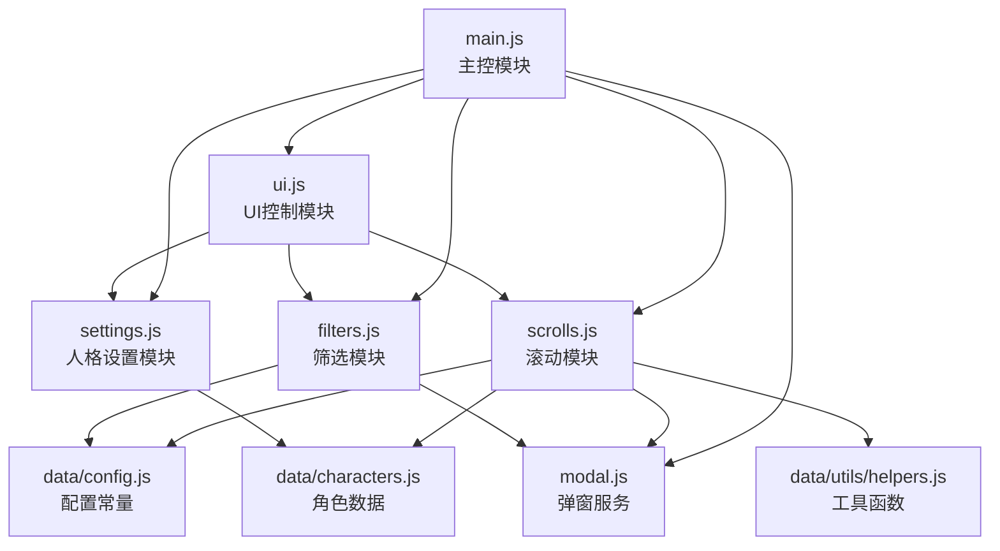
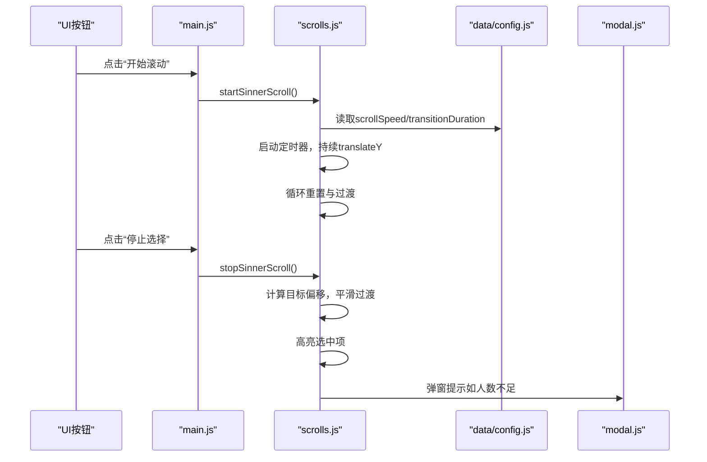
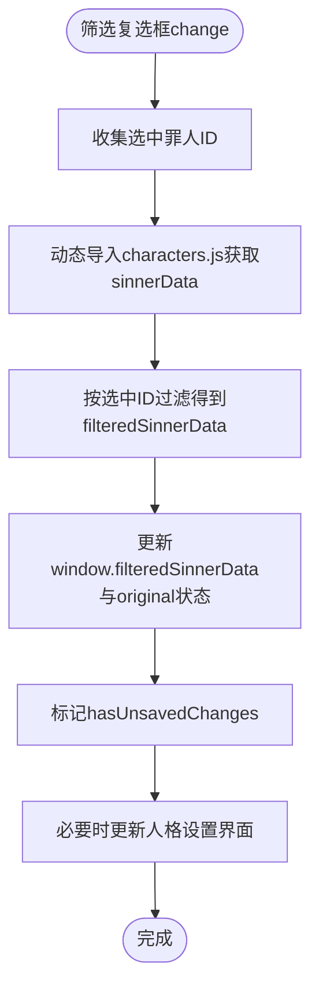
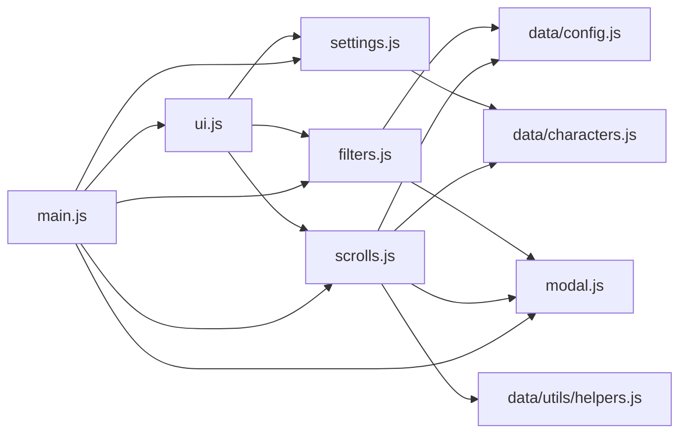

# 模块架构

<cite>
**本文引用的文件**
- [main.js](file://js/main.js)
- [scrolls.js](file://js/scrolls.js)
- [filters.js](file://js/filters.js)
- [settings.js](file://js/settings.js)
- [ui.js](file://js/ui.js)
- [modal.js](file://js/modal.js)
- [characters.js](file://data/characters.js)
- [config.js](file://data/config.js)
- [helpers.js](file://data/utils/helpers.js)
- [index.html](file://index.html)
- [ranking.html](file://ranking.html)
</cite>

## 目录
1. [简介](#简介)
2. [项目结构](#项目结构)
3. [核心组件](#核心组件)
4. [架构总览](#架构总览)
5. [详细组件分析](#详细组件分析)
6. [依赖关系分析](#依赖关系分析)
7. [性能考量](#性能考量)
8. [故障排查指南](#故障排查指南)
9. [结论](#结论)
10. [附录](#附录)

## 简介
本文件系统性梳理本项目的模块化架构，重点说明：
- main.js 作为主控模块，通过 ES6 import 机制协调各功能模块；
- scrolls.js 如何依赖 characters.js 和 config.js 实现滚动逻辑，并与 UI 事件绑定；
- filters.js 与 settings.js 如何维护全局筛选状态（window.filteredSinnerData 等），并响应用户交互；
- ui.js 如何管理页面跳转（如进入 ranking.html）和 DOM 状态更新；
- modal.js 作为通用弹窗服务被各模块调用的模式；
- 绘制模块间依赖关系图谱，解释事件驱动通信机制和全局状态共享策略，突出模块化设计带来的可维护性优势。

## 项目结构
项目采用“按功能域划分”的模块组织方式，前端入口在 index.html，主控脚本为 js/main.js；数据层位于 data/ 目录，包含角色与配置、工具函数；UI 交互与页面跳转由 js/ 下的模块负责。

图表来源
- [index.html](file://index.html#L1-L176)
- [ranking.html](file://ranking.html#L1-L94)
- [main.js](file://js/main.js#L1-L261)
- [scrolls.js](file://js/scrolls.js#L1-L718)
- [filters.js](file://js/filters.js#L1-L274)
- [settings.js](file://js/settings.js#L1-L263)
- [ui.js](file://js/ui.js#L1-L66)
- [modal.js](file://js/modal.js#L1-L109)
- [characters.js](file://data/characters.js#L1-L260)
- [config.js](file://data/config.js#L1-L29)
- [helpers.js](file://data/utils/helpers.js#L1-L45)

章节来源
- [index.html](file://index.html#L1-L176)
- [ranking.html](file://ranking.html#L1-L94)

## 核心组件
- main.js：应用入口与编排器，负责导入并协调 filters、scrolls、settings、ui、modal 等模块，初始化滚动模块、筛选模块、页面导航与事件绑定，维护全局状态（window.filteredSinnerData、window.filteredPersonalityData 等）。
- scrolls.js：滚动功能模块，封装罪人与人格滚动列表的创建、滚动控制、停止定位、高亮显示、状态重置等逻辑，依赖 config.js、helpers.js、characters.js 与 modal.js。
- filters.js：筛选模块，负责罪人筛选复选框的创建与更新、全局筛选状态维护、应用筛选、返回主页面时的滚动列表刷新、未保存更改检测与验证。
- settings.js：人格筛选设置模块，提供全局与按罪人的人格筛选控制、界面创建、状态更新与变更追踪。
- ui.js：UI 控制模块，负责页面导航切换、按钮事件绑定、应用筛选按钮的动态添加与初始化。
- modal.js：通用弹窗服务，提供 alert/confirm 弹窗，统一用户交互体验。
- data/characters.js：角色与人格数据源。
- data/config.js：应用配置常量（滚动、界面、消息等）。
- data/utils/helpers.js：工具函数（安全随机数、防抖、节流）。

章节来源
- [main.js](file://js/main.js#L1-L261)
- [scrolls.js](file://js/scrolls.js#L1-L718)
- [filters.js](file://js/filters.js#L1-L274)
- [settings.js](file://js/settings.js#L1-L263)
- [ui.js](file://js/ui.js#L1-L66)
- [modal.js](file://js/modal.js#L1-L109)
- [characters.js](file://data/characters.js#L1-L260)
- [config.js](file://data/config.js#L1-L29)
- [helpers.js](file://data/utils/helpers.js#L1-L45)

## 架构总览
本项目采用“主控模块 + 功能模块 + 数据/配置/工具层”的分层架构：
- 主控模块（main.js）集中管理全局状态与跨模块协作，通过 ES6 模块导入各功能模块；
- 功能模块（scrolls/filters/settings/ui）各自职责清晰，通过导出函数/类与主控模块解耦；
- 数据/配置/工具层提供稳定的数据与配置，供功能模块按需导入；
- UI 事件通过主控模块与功能模块协作，形成事件驱动的交互闭环；
- 全局状态通过 window 对象共享，保证多模块一致性与可观察性。

图表来源
- [main.js](file://js/main.js#L1-L261)
- [scrolls.js](file://js/scrolls.js#L1-L718)
- [filters.js](file://js/filters.js#L1-L274)
- [settings.js](file://js/settings.js#L1-L263)
- [ui.js](file://js/ui.js#L1-L66)
- [modal.js](file://js/modal.js#L1-L109)
- [characters.js](file://data/characters.js#L1-L260)
- [config.js](file://data/config.js#L1-L29)
- [helpers.js](file://data/utils/helpers.js#L1-L45)

## 详细组件分析

### 主控模块 main.js
- 导入与编排
  - 导入角色数据、工具函数、配置、筛选、弹窗、滚动、设置、UI 模块；
  - 通过 initScrollModule 将 DOM 元素与全局状态注入滚动模块；
  - 动态绑定滚动按钮事件（使用 import('./scrolls.js') 按需加载）；
  - 初始化页面导航与 UI。
- 全局状态
  - 在 window 上定义 window.filteredSinnerData、window.filteredPersonalityData、window.originalFilteredSinnerData、window.originalFilteredPersonalityData、window.hasUnsavedChanges、window.currentSelectedSinner、window.currentSelectedPersona 等，确保多模块共享同一份筛选与选择状态。
- 事件驱动
  - 主页面与设置页面按钮事件；
  - 应用筛选与重置筛选事件；
  - 筛选控制按钮事件（全选/全不选/反选）。

章节来源
- [main.js](file://js/main.js#L1-L261)

### 滚动模块 scrolls.js
- 依赖关系
  - 导入 Config、secureRandInt、sinnerData、Modal；
  - 通过 window.filteredSinnerData、window.filteredPersonalityData 读取筛选状态；
  - 通过 Config 控制滚动参数（itemHeight、scrollSpeed、transitionDuration 等）。
- 核心职责
  - 初始化滚动容器与状态；
  - 创建罪人/人格滚动列表（支持字符串与对象数组，头像占位与错误回退）；
  - 启动/停止滚动、循环重置、定位到中心、高亮选中项；
  - 重置二级转盘状态（清空人格选择与按钮状态）。
- 事件绑定
  - 通过主控模块动态绑定按钮事件，触发 startSinnerScroll、stopSinnerScroll、startPersonaScroll、stopPersonaScroll。

图表来源
- [scrolls.js](file://js/scrolls.js#L281-L478)
- [config.js](file://data/config.js#L1-L29)
- [modal.js](file://js/modal.js#L74-L103)
- [main.js](file://js/main.js#L196-L202)

章节来源
- [scrolls.js](file://js/scrolls.js#L1-L718)
- [config.js](file://data/config.js#L1-L29)
- [modal.js](file://js/modal.js#L1-L109)
- [main.js](file://js/main.js#L196-L202)

### 筛选模块 filters.js
- 依赖关系
  - 导入 Config、Modal；
  - 动态导入 characters.js 以获取 sinnerData；
  - 与 settings.js 交互以更新人格设置界面。
- 核心职责
  - 创建罪人筛选复选框（含头像占位与错误回退）；
  - 更新 window.filteredSinnerData，维护原始筛选状态与未保存更改标志；
  - 提供全选/全不选/反选操作；
  - 验证筛选设置（至少一个罪人、每个罪人至少一个人格）；
  - 应用筛选并切换页面，刷新滚动列表；
  - 返回主页面时根据当前选择与筛选状态刷新 UI。
- 事件绑定
  - 复选框 change 事件驱动筛选状态更新；
  - 主页面按钮事件触发应用筛选与页面切换。

图表来源
- [filters.js](file://js/filters.js#L1-L274)
- [characters.js](file://data/characters.js#L1-L260)

章节来源
- [filters.js](file://js/filters.js#L1-L274)

### 人格设置模块 settings.js
- 依赖关系
  - 通过 window.filteredPersonalityData 维护按罪人的人格筛选状态；
  - 动态导入 characters.js 以生成人格设置界面。
- 核心职责
  - 全局与按罪人的人格筛选控制（全选/全不选/反选）；
  - 创建人格设置界面（分页展示、头像占位、启用开关）；
  - 更新 window.filteredPersonalityData 并标记未保存更改。
- 事件绑定
  - 人格开关 change 事件更新筛选状态；
  - 分页按钮切换不同罪人的人格设置页。

章节来源
- [settings.js](file://js/settings.js#L1-L263)
- [characters.js](file://data/characters.js#L1-L260)

### UI 控制模块 ui.js
- 依赖关系
  - 动态导入 settings.js、filters.js、scrolls.js 以实现页面切换与事件绑定。
- 核心职责
  - 初始化页面导航（主页面/设置页面）；
  - 为设置页面添加“应用筛选”按钮；
  - 统一绑定滚动控制按钮与筛选控制按钮事件。
- 与页面跳转
  - 通过设置页面按钮事件切换到设置页并创建人格设置界面；
  - 与主控模块共同维护页面显示状态。

章节来源
- [ui.js](file://js/ui.js#L1-L66)

### 弹窗服务 modal.js
- 依赖关系
  - 无外部依赖，仅操作 DOM；
  - 被 filters.js、scrolls.js、ui.js 等模块调用。
- 核心职责
  - 初始化自定义弹窗容器；
  - 提供 alert/confirm 两种弹窗，返回 Promise；
  - 统一遮罩层与按钮布局，支持点击遮罩关闭。

章节来源
- [modal.js](file://js/modal.js#L1-L109)

### 数据与配置层
- data/characters.js：提供 sinnerData（包含 id、name、avatar、color、personalities）。
- data/config.js：提供滚动、界面、动画、消息等配置常量。
- data/utils/helpers.js：提供 secureRandInt、debounce、throttle 等工具函数。

章节来源
- [characters.js](file://data/characters.js#L1-L260)
- [config.js](file://data/config.js#L1-L29)
- [helpers.js](file://data/utils/helpers.js#L1-L45)

## 依赖关系分析
- 模块间导入关系
  - main.js 导入 filters、scrolls、settings、ui、modal、config、characters、helpers；
  - scrolls.js 导入 config、helpers、characters、modal；
  - filters.js 导入 config、modal；
  - settings.js 导入 characters；
  - ui.js 导入 settings、filters、scrolls；
  - modal.js 为通用服务，被多模块调用。
- 解耦与耦合
  - 主控模块承担编排职责，降低功能模块之间的直接耦合；
  - 通过 window 对象共享全局状态，避免深层参数传递；
  - 使用动态 import 实现按需加载，减少初始包体与首屏阻塞。
- 循环依赖
  - 未发现循环依赖迹象；若后续扩展需注意避免 main.js 与 ui.js 的相互依赖。

图表来源
- [main.js](file://js/main.js#L1-L261)
- [scrolls.js](file://js/scrolls.js#L1-L718)
- [filters.js](file://js/filters.js#L1-L274)
- [settings.js](file://js/settings.js#L1-L263)
- [ui.js](file://js/ui.js#L1-L66)
- [modal.js](file://js/modal.js#L1-L109)
- [characters.js](file://data/characters.js#L1-L260)
- [config.js](file://data/config.js#L1-L29)
- [helpers.js](file://data/utils/helpers.js#L1-L45)

## 性能考量
- 滚动性能
  - 使用 transform 与 transition 实现平滑滚动，避免频繁重排；
  - 通过 Config.scrollInterval 控制滚动频率，平衡流畅度与性能；
  - 通过 Config.totalHeightMultiplier 与循环重置减少 DOM 更新次数。
- 按需加载
  - 使用动态 import 加载滚动与筛选模块的事件绑定，降低初始加载压力；
  - 在设置页面才创建人格设置界面，避免不必要的 DOM 构建。
- 随机数安全
  - 使用 secureRandInt 提供安全随机数，确保公平性与可重复性。
- 事件绑定优化
  - 通过 UI 模块统一绑定按钮事件，避免重复绑定与内存泄漏风险。

[本节为通用指导，无需列出具体文件来源]

## 故障排查指南
- 无法选择罪人或人格
  - 检查 window.filteredSinnerData 是否为空；若为空，滚动模块会弹窗提示；
  - 检查 filters.validateFilterSettings 是否通过（每个罪人至少一个人格）。
- 二级转盘按钮不可用
  - 当罪人列表长度为 1 时，二级转盘开始按钮会被禁用；
  - 当人格列表为空或仅提示字符串时，二级转盘开始按钮也会被禁用。
- 未保存更改导致离开页面确认
  - main.js 在返回主页面前会检测 window.hasUnsavedChanges 并弹窗确认；
  - filters.applyFilters 会清除未保存更改标记。
- 头像加载失败
  - 滚动列表与筛选界面均提供头像占位与错误回退逻辑；
  - 人格设置界面同样提供占位与错误回退。
- 页面跳转问题
  - ui.js 负责设置页面按钮事件与“应用筛选”按钮添加；
  - ranking.html 通过 window.location.href 返回主页。

章节来源
- [scrolls.js](file://js/scrolls.js#L281-L478)
- [filters.js](file://js/filters.js#L117-L184)
- [main.js](file://js/main.js#L80-L146)
- [ui.js](file://js/ui.js#L1-L66)
- [ranking.html](file://ranking.html#L79-L91)

## 结论
本项目通过清晰的模块划分与 ES6 模块导入机制，实现了主控模块对各功能模块的协调与全局状态共享。滚动、筛选、设置、UI 控制与弹窗服务各司其职，配合数据与配置层，形成了高内聚、低耦合的前端架构。事件驱动与动态导入进一步提升了用户体验与性能表现。模块化设计使得功能扩展与维护更加便捷，具备良好的可演进性。

[本节为总结性内容，无需列出具体文件来源]

## 附录
- 页面跳转与导航
  - 主页面与设置页面按钮事件由 main.js 与 ui.js 共同处理；
  - ranking.html 提供排行榜查看与清空记录功能，返回主页通过 window.location.href 实现。
- 全局状态清单
  - window.filteredSinnerData：筛选后的罪人数据；
  - window.filteredPersonalityData：按罪人的人格筛选状态；
  - window.originalFilteredSinnerData / window.originalFilteredPersonalityData：原始筛选状态备份；
  - window.hasUnsavedChanges：未保存更改标记；
  - window.currentSelectedSinner / window.currentSelectedPersona：当前选中结果。

章节来源
- [main.js](file://js/main.js#L69-L78)
- [ranking.html](file://ranking.html#L79-L91)