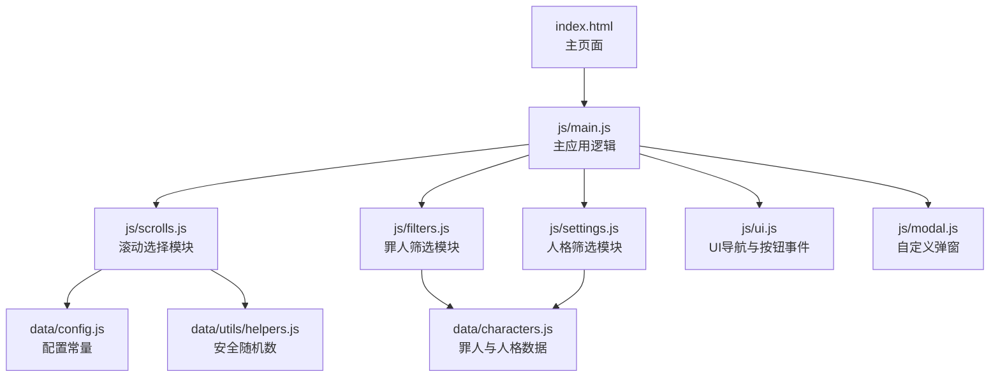
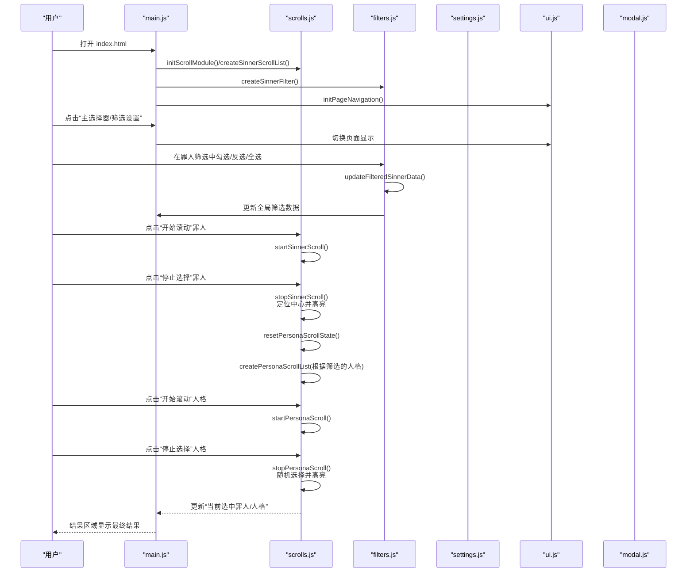
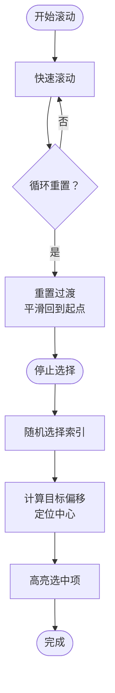
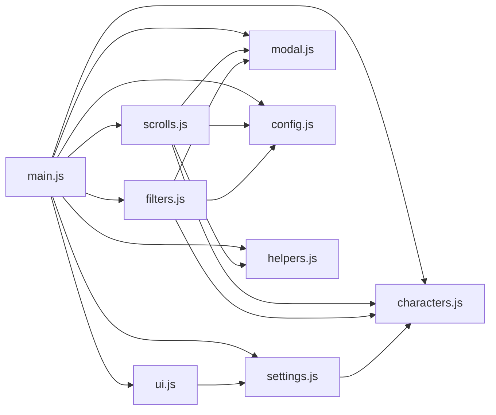

# 基本使用

<cite>
**本文引用的文件**
- [index.html](file://index.html)
- [README.md](file://README.md)
- [js/main.js](file://js/main.js)
- [js/scrolls.js](file://js/scrolls.js)
- [js/filters.js](file://js/filters.js)
- [js/settings.js](file://js/settings.js)
- [js/ui.js](file://js/ui.js)
- [js/modal.js](file://js/modal.js)
- [data/characters.js](file://data/characters.js)
- [data/config.js](file://data/config.js)
- [data/utils/helpers.js](file://data/utils/helpers.js)
- [ranking.html](file://ranking.html)
</cite>

## 目录
1. [简介](#简介)
2. [项目结构](#项目结构)
3. [核心组件](#核心组件)
4. [架构总览](#架构总览)
5. [详细组件解析](#详细组件解析)
6. [依赖关系分析](#依赖关系分析)
7. [性能与体验要点](#性能与体验要点)
8. [故障排查指南](#故障排查指南)
9. [结论](#结论)
10. [附录：常见使用场景示例](#附录常见使用场景示例)

## 简介
本指南面向初学者，带你从零开始使用“边狱公司 - 今天蛋筒什么？”应用。你只需在浏览器中打开 index.html 即可启动应用，通过两级滚动选择器（罪人 → 人格）完成每日角色决定，并查看最终结果。应用还内置计时与排行榜功能，方便记录你的通关用时。

## 项目结构
- 主页面：index.html
- 核心逻辑：js/main.js
- 滚动选择：js/scrolls.js
- 筛选设置：js/filters.js、js/settings.js
- UI导航与按钮事件：js/ui.js
- 弹窗提示：js/modal.js
- 数据与配置：data/characters.js、data/config.js、data/utils/helpers.js
- 排行榜页面：ranking.html

图表来源
- [index.html](file://index.html#L1-L176)
- [js/main.js](file://js/main.js#L1-L261)
- [js/scrolls.js](file://js/scrolls.js#L1-L718)
- [js/filters.js](file://js/filters.js#L1-L274)
- [js/settings.js](file://js/settings.js#L1-L263)
- [js/ui.js](file://js/ui.js#L1-L66)
- [js/modal.js](file://js/modal.js#L1-L109)
- [data/config.js](file://data/config.js#L1-L29)
- [data/utils/helpers.js](file://data/utils/helpers.js#L1-L45)
- [data/characters.js](file://data/characters.js#L1-L260)

章节来源
- [README.md](file://README.md#L1-L121)
- [index.html](file://index.html#L1-L176)

## 核心组件
- 主页面与布局：包含导航按钮、两个选择器区域、结果展示区、使用说明与计时弹窗。
- 主应用逻辑：负责初始化滚动模块、创建筛选界面、绑定按钮事件、切换页面。
- 滚动模块：负责罪人与人格的滚动、停止、高亮、定位中心。
- 筛选模块：负责罪人与人格的勾选、反选、全选、应用与重置。
- UI模块：负责页面切换、按钮事件绑定。
- 弹窗模块：统一的提示与确认对话框。
- 数据与配置：罪人与人格数据、滚动配置、安全随机数工具。

章节来源
- [index.html](file://index.html#L1-L176)
- [js/main.js](file://js/main.js#L1-L261)
- [js/scrolls.js](file://js/scrolls.js#L1-L718)
- [js/filters.js](file://js/filters.js#L1-L274)
- [js/settings.js](file://js/settings.js#L1-L263)
- [js/ui.js](file://js/ui.js#L1-L66)
- [js/modal.js](file://js/modal.js#L1-L109)
- [data/characters.js](file://data/characters.js#L1-L260)
- [data/config.js](file://data/config.js#L1-L29)
- [data/utils/helpers.js](file://data/utils/helpers.js#L1-L45)

## 架构总览
应用采用模块化设计，主页面通过 ES 模块导入各功能模块，形成清晰的职责分离：
- index.html 提供 UI 结构与静态资源链接
- js/main.js 作为入口，协调各模块初始化与交互
- js/scrolls.js 独立处理滚动动画与随机选择
- js/filters.js 与 js/settings.js 负责筛选逻辑
- js/ui.js 统一处理页面导航与按钮事件
- js/modal.js 提供一致的用户提示
- data/* 提供数据与配置

图表来源
- [index.html](file://index.html#L1-L176)
- [js/main.js](file://js/main.js#L1-L261)
- [js/scrolls.js](file://js/scrolls.js#L1-L718)
- [js/filters.js](file://js/filters.js#L1-L274)
- [js/settings.js](file://js/settings.js#L1-L263)
- [js/ui.js](file://js/ui.js#L1-L66)
- [js/modal.js](file://js/modal.js#L1-L109)

## 详细组件解析

### 主页面与布局
- 导航按钮：主选择器、筛选设置
- 一级选择器（罪人）：滚动列表、开始滚动、停止选择
- 二级选择器（人格）：滚动列表、开始滚动、停止选择
- 结果区域：显示当前选中的罪人与人格
- 使用说明：简要步骤与注意事项
- 计时弹窗：单通时间计时与排行榜入口

章节来源
- [index.html](file://index.html#L1-L176)

### 主应用逻辑（main.js）
- 初始化滚动模块、创建罪人与人格滚动列表
- 绑定滚动按钮事件（罪人/人格）
- 页面导航（主页面与筛选设置）
- 同步全局筛选数据与当前选中状态

章节来源
- [js/main.js](file://js/main.js#L1-L261)

### 滚动模块（scrolls.js）
- 初始化滚动容器与状态
- 创建罪人/人格滚动列表（含头像占位与循环滚动）
- 开始/停止滚动：快速滚动、定位中心、高亮选中项
- 安全随机选择：使用安全随机数工具
- 二级转盘状态重置：停止后清空状态并更新结果区域

图表来源
- [js/scrolls.js](file://js/scrolls.js#L1-L718)
- [data/config.js](file://data/config.js#L1-L29)
- [data/utils/helpers.js](file://data/utils/helpers.js#L1-L45)

章节来源
- [js/scrolls.js](file://js/scrolls.js#L1-L718)
- [data/config.js](file://data/config.js#L1-L29)
- [data/utils/helpers.js](file://data/utils/helpers.js#L1-L45)

### 筛选模块（filters.js 与 settings.js）
- 罪人筛选：创建复选框、全选/全不选/反选、更新筛选数据
- 人格筛选：全局与按罪人维度的全选/反选；动态生成人格设置页
- 应用筛选：校验合法性、保存原始筛选状态、返回主页面并刷新滚动列表
- 重置筛选：恢复到原始筛选状态

章节来源
- [js/filters.js](file://js/filters.js#L1-L274)
- [js/settings.js](file://js/settings.js#L1-L263)
- [data/characters.js](file://data/characters.js#L1-L260)

### UI 模块（ui.js）
- 页面导航：主页面与筛选设置之间的切换
- 按钮事件：滚动控制按钮与筛选控制按钮的事件绑定
- 初始化：为设置页面动态添加“应用筛选”按钮

章节来源
- [js/ui.js](file://js/ui.js#L1-L66)

### 弹窗模块（modal.js）
- 统一的 alert/confirm 对话框，避免原生弹窗影响体验
- 通过 Promise 化的 confirm 支持异步流程控制

章节来源
- [js/modal.js](file://js/modal.js#L1-L109)

## 依赖关系分析
- main.js 依赖 scrolls.js、filters.js、settings.js、ui.js、modal.js、config.js、helpers.js、characters.js
- scrolls.js 依赖 config.js、helpers.js、characters.js、modal.js
- filters.js 依赖 config.js、modal.js、characters.js
- settings.js 依赖 characters.js
- ui.js 依赖 settings.js
- modal.js 为通用弹窗
- config.js 与 helpers.js 为通用配置与工具

图表来源
- [js/main.js](file://js/main.js#L1-L261)
- [js/scrolls.js](file://js/scrolls.js#L1-L718)
- [js/filters.js](file://js/filters.js#L1-L274)
- [js/settings.js](file://js/settings.js#L1-L263)
- [js/ui.js](file://js/ui.js#L1-L66)
- [js/modal.js](file://js/modal.js#L1-L109)
- [data/config.js](file://data/config.js#L1-L29)
- [data/utils/helpers.js](file://data/utils/helpers.js#L1-L45)
- [data/characters.js](file://data/characters.js#L1-L260)

## 性能与体验要点
- 滚动配置：通过配置常量控制滚动速度、过渡时长与可见行数，保证流畅体验。
- 安全随机数：优先使用加密安全的随机数生成，提升公平性。
- 头像占位：图片加载失败时自动降级为占位符，避免空白。
- 一键操作：全选/全不选/反选，快速定制筛选范围。
- 无障碍提示：统一弹窗，避免打断用户流程。

章节来源
- [data/config.js](file://data/config.js#L1-L29)
- [data/utils/helpers.js](file://data/utils/helpers.js#L1-L45)
- [js/scrolls.js](file://js/scrolls.js#L1-L718)
- [js/filters.js](file://js/filters.js#L1-L274)
- [js/settings.js](file://js/settings.js#L1-L263)

## 故障排查指南
- “开始滚动”按钮不可用
  - 症状：罪人选择器的开始按钮被禁用
  - 可能原因：未选择任何罪人或仅剩一个罪人（此时直接选中，无需滚动）
  - 解决：在筛选设置中至少勾选两个罪人
  - 参考路径：[js/filters.js](file://js/filters.js#L60-L101)、[js/scrolls.js](file://js/scrolls.js#L281-L322)

- “停止选择”后未显示结果
  - 症状：点击停止后结果区域仍为空
  - 可能原因：未正确选择罪人或人格，或筛选导致无可用选项
  - 解决：检查筛选设置，确保至少有一个罪人且该罪人至少有一个被选中的人格
  - 参考路径：[js/scrolls.js](file://js/scrolls.js#L350-L478)、[js/filters.js](file://js/filters.js#L117-L158)

- 人格选择器无法启用
  - 症状：人格选择器的开始按钮一直禁用
  - 可能原因：罪人选择器尚未完成或筛选后无人格可选
  - 解决：先完成罪人选择，再检查该罪人的人格筛选状态
  - 参考路径：[js/scrolls.js](file://js/scrolls.js#L113-L161)、[js/scrolls.js](file://js/scrolls.js#L480-L571)

- 图片加载失败
  - 症状：头像显示为占位符
  - 解决：检查图片路径与格式，或等待占位符显示
  - 参考路径：[js/scrolls.js](file://js/scrolls.js#L80-L92)、[js/scrolls.js](file://js/scrolls.js#L210-L242)

- 弹窗提示频繁出现
  - 症状：总是弹出“请至少选择一个罪人/人格”的提示
  - 解决：在筛选设置中调整勾选，确保合法组合
  - 参考路径：[js/modal.js](file://js/modal.js#L74-L106)、[js/filters.js](file://js/filters.js#L117-L158)

章节来源
- [js/scrolls.js](file://js/scrolls.js#L1-L718)
- [js/filters.js](file://js/filters.js#L1-L274)
- [js/modal.js](file://js/modal.js#L1-L109)

## 结论
本应用通过模块化设计实现了清晰的两级滚动选择流程：先从 12 名罪人中随机挑选，再从该罪人的人格池中随机挑选。配合筛选设置、统一弹窗与流畅动画，能够帮助你在日常游戏中快速做出决策。排行榜与计时功能进一步提升了可玩性与记录体验。

## 附录：常见使用场景示例

### 场景一：每日角色决定
- 步骤
  1) 打开 index.html
  2) 点击“筛选设置”，勾选你希望参与随机的角色（至少两个）
  3) 点击“应用筛选”返回主页面
  4) 点击“开始滚动”（罪人），等待滚动结束后点击“停止选择”
  5) 点击“开始滚动”（人格），等待滚动结束后点击“停止选择”
  6) 查看结果区域的最终选择
- 参考路径
  - [index.html](file://index.html#L1-L176)
  - [js/main.js](file://js/main.js#L1-L261)
  - [js/scrolls.js](file://js/scrolls.js#L1-L718)
  - [js/filters.js](file://js/filters.js#L1-L274)

### 场景二：记录通关用时
- 步骤
  1) 在主页面点击“单通时间计时”
  2) 开始计时后完成一次通关
  3) 点击“保存到排行榜”，填写备注（可选）
  4) 点击“查看排行榜”查看历史记录
- 参考路径
  - [index.html](file://index.html#L130-L176)
  - [ranking.html](file://ranking.html#L1-L94)