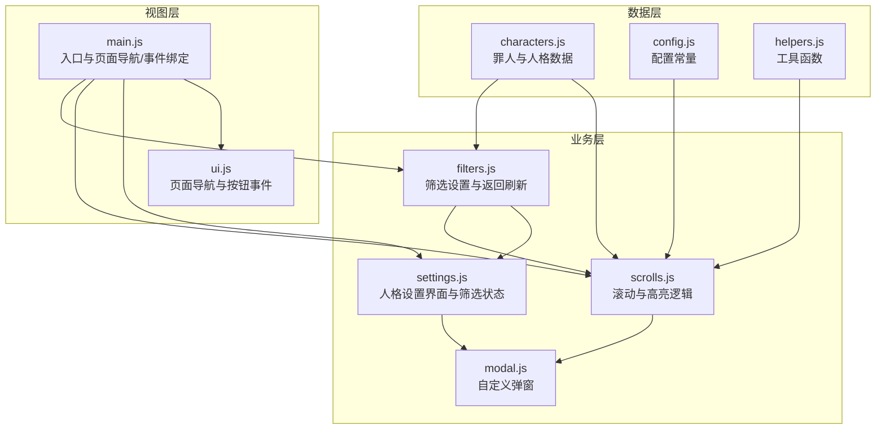
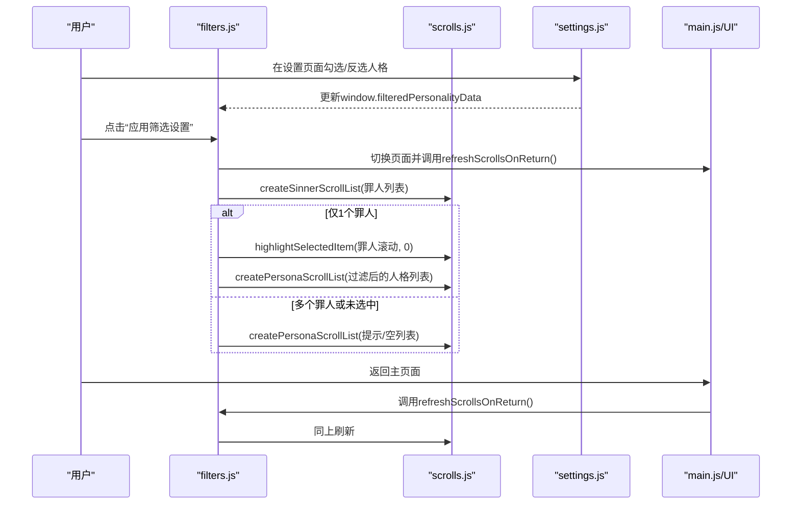
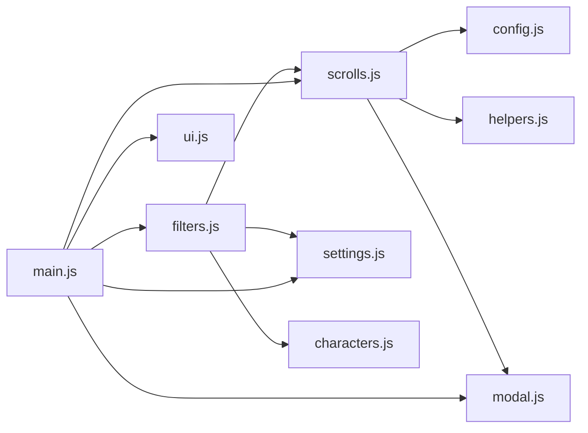
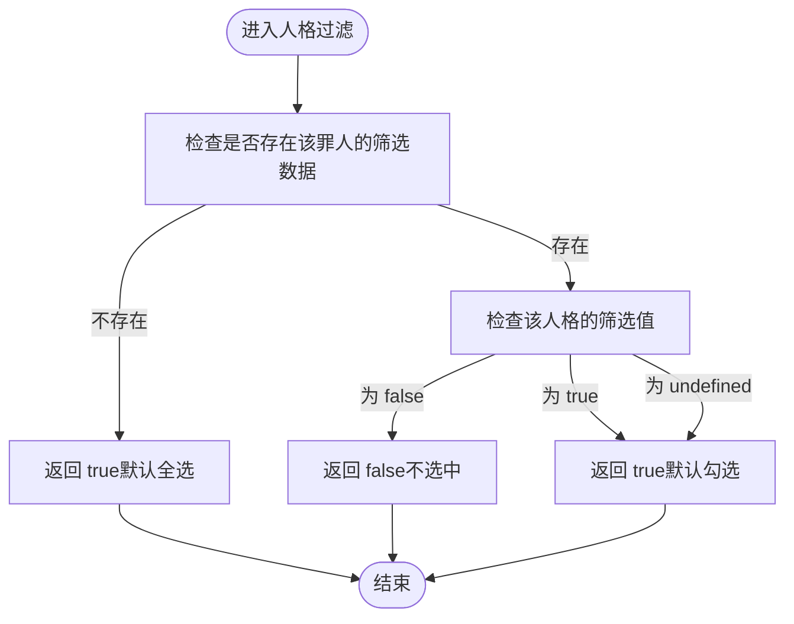
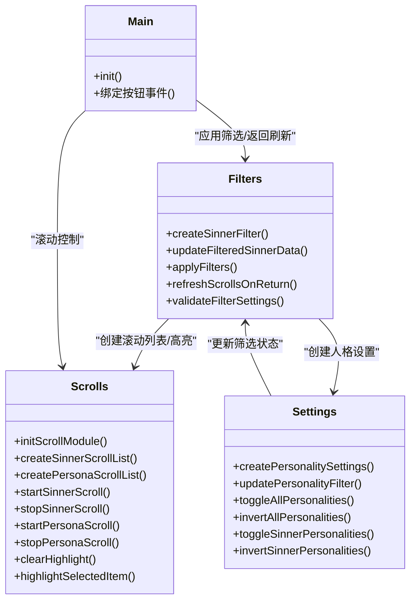

# 故障排除

<cite>
**本文引用的文件**
- [BUG_FIX_REPORT.md](file://BUG_FIX_REPORT.md)
- [filters.js](file://js/filters.js)
- [scrolls.js](file://js/scrolls.js)
- [settings.js](file://js/settings.js)
- [main.js](file://js/main.js)
- [ui.js](file://js/ui.js)
- [characters.js](file://data/characters.js)
- [config.js](file://data/config.js)
- [helpers.js](file://data/utils/helpers.js)
- [modal.js](file://js/modal.js)
</cite>

## 目录
1. [简介](#简介)
2. [项目结构](#项目结构)
3. [核心组件](#核心组件)
4. [架构总览](#架构总览)
5. [详细组件分析](#详细组件分析)
6. [依赖关系分析](#依赖关系分析)
7. [性能考量](#性能考量)
8. [故障排查指南](#故障排查指南)
9. [结论](#结论)
10. [附录](#附录)

## 简介
本文件基于仓库中的“筛选功能Bug修复报告”，系统化整理常见问题与解决方案，重点覆盖：
- 当仅选择一个罪人时，一级筛选池未显示头像和名字的成因与修复（确保调用高亮函数）
- 人格筛选逻辑异常导致抽取未勾选人格的问题根因（错误的过滤条件判断），并给出正确的筛选逻辑
- 图片加载失败时的占位符机制（显示带背景色的问号）
- 用户在筛选设置不生效或计时器异常时的排查步骤（检查浏览器控制台错误、清除localStorage等）
- 联系开发者反馈问题的渠道

## 项目结构
本项目采用模块化组织，前端主要分为：
- 数据层：人物与配置数据
- 业务层：筛选、滚动、设置、UI、主流程
- 视图层：HTML页面与样式

图表来源
- [main.js](file://js/main.js#L1-L261)
- [filters.js](file://js/filters.js#L1-L274)
- [scrolls.js](file://js/scrolls.js#L1-L718)
- [settings.js](file://js/settings.js#L1-L263)
- [characters.js](file://data/characters.js#L1-L260)
- [config.js](file://data/config.js#L1-L29)
- [helpers.js](file://data/utils/helpers.js#L1-L45)
- [modal.js](file://js/modal.js#L1-L109)

章节来源
- [main.js](file://js/main.js#L1-L261)
- [filters.js](file://js/filters.js#L1-L274)
- [scrolls.js](file://js/scrolls.js#L1-L718)
- [settings.js](file://js/settings.js#L1-L263)
- [characters.js](file://data/characters.js#L1-L260)
- [config.js](file://data/config.js#L1-L29)
- [helpers.js](file://data/utils/helpers.js#L1-L45)
- [modal.js](file://js/modal.js#L1-L109)

## 核心组件
- 筛选模块（filters.js）：负责罪人筛选复选框创建、筛选状态更新、应用筛选、返回主页面时刷新滚动列表与高亮显示
- 滚动模块（scrolls.js）：负责罪人/人格滚动列表创建、滚动控制、停止定位、高亮显示、占位符与图片加载失败处理
- 设置模块（settings.js）：负责人格设置界面创建、全选/反选、筛选状态持久化
- 主入口（main.js）：初始化滚动模块、绑定按钮事件、页面导航、调用筛选模块
- UI模块（ui.js）：页面导航与按钮事件绑定
- 数据与配置（characters.js、config.js、helpers.js）
- 弹窗（modal.js）

章节来源
- [filters.js](file://js/filters.js#L1-L274)
- [scrolls.js](file://js/scrolls.js#L1-L718)
- [settings.js](file://js/settings.js#L1-L263)
- [main.js](file://js/main.js#L1-L261)
- [ui.js](file://js/ui.js#L1-L66)
- [characters.js](file://data/characters.js#L1-L260)
- [config.js](file://data/config.js#L1-L29)
- [helpers.js](file://data/utils/helpers.js#L1-L45)
- [modal.js](file://js/modal.js#L1-L109)

## 架构总览
下图展示从“应用筛选设置”到“返回主页面刷新滚动列表”的关键交互路径，以及“开始/停止滚动”到“最终抽取结果”的流程。

图表来源
- [filters.js](file://js/filters.js#L160-L271)
- [scrolls.js](file://js/scrolls.js#L46-L111)
- [settings.js](file://js/settings.js#L1-L263)
- [main.js](file://js/main.js#L80-L115)

## 详细组件分析

### 一、仅选择一个罪人时，一级筛选池未显示头像和名字
- 症状：仅勾选1个罪人并保存筛选设置后返回主界面，一级筛选池内容框为空，未显示该罪人的名字和头像
- 根因：在返回主页面刷新滚动列表时，虽然设置了当前选中罪人并更新显示文本，但缺少调用高亮函数将头像与名字渲染到滚动列表中
- 修复要点：
  - 在仅1个罪人的情况下，调用高亮函数确保头像与名字显示
  - 对应修复位置：filters.js 中的刷新函数在仅1个罪人时，增加对高亮函数的调用
- 修复后行为：
  - 一级筛选池显示该罪人的头像与名字
  - 二级人格列表根据筛选状态动态更新

章节来源
- [BUG_FIX_REPORT.md](file://BUG_FIX_REPORT.md#L8-L21)
- [filters.js](file://js/filters.js#L195-L271)
- [scrolls.js](file://js/scrolls.js#L694-L705)

### 二、人格筛选逻辑异常导致抽取未勾选人格
- 症状：在筛选设置中勾选某罪人的人格后，返回主界面点击“开始筛选”，最终抽取结果显示的是未勾选的人格
- 根因（错误的过滤条件判断）：
  - 使用“且”逻辑时，当筛选对象不存在或索引值为 undefined 时，会导致错误的过滤结果
  - 具体表现为：筛选对象不存在时返回 undefined/false；索引值为 undefined 时，比较表达式返回 true，从而误选未勾选的人格
- 修复要点（统一修正）：
  - 若未设置该罪人的筛选数据：默认选中所有人格
  - 若设置了筛选数据：仅当明确为 false 时不选中，其余情况（true/undefined）均视为选中
- 修复位置：
  - filters.js：刷新滚动列表时的人格过滤
  - scrolls.js：开始/停止人格滚动时的人格过滤（多处）

章节来源
- [BUG_FIX_REPORT.md](file://BUG_FIX_REPORT.md#L23-L38)
- [BUG_FIX_REPORT.md](file://BUG_FIX_REPORT.md#L41-L107)
- [filters.js](file://js/filters.js#L204-L236)
- [scrolls.js](file://js/scrolls.js#L520-L530)
- [scrolls.js](file://js/scrolls.js#L594-L602)
- [scrolls.js](file://js/scrolls.js#L635-L642)

### 三、图片加载失败时的占位符机制
- 行为说明：
  - 罪人/人格/设置页头像在加载失败时，统一显示带背景色的“?”占位符
  - 占位符具备居中显示、圆角、背景色等样式，便于识别
- 实现位置：
  - 罪人筛选复选框与滚动列表：头像 onerror 回调替换为占位符
  - 人格设置界面：头像 onerror 回调替换为占位符
  - 人格滚动列表：头像 onerror 回调设置背景色与“?”文本

章节来源
- [filters.js](file://js/filters.js#L37-L40)
- [scrolls.js](file://js/scrolls.js#L80-L91)
- [scrolls.js](file://js/scrolls.js#L221-L233)
- [settings.js](file://js/settings.js#L170-L181)

### 四、计时器异常与按钮状态问题
- 现象：开始/停止按钮状态异常、滚动无法停止或重复滚动
- 根因与修复：
  - 滚动前需清理之前的滚动间隔，避免重复定时器
  - 停止滚动时需重置滚动容器样式与偏移量，防止视觉残留
  - 针对“仅1个罪人/人格”的快速选择路径，直接调用停止函数并跳过滚动
- 修复位置：
  - 滚动模块在开始/停止函数中统一处理定时器与样式重置

章节来源
- [scrolls.js](file://js/scrolls.js#L282-L322)
- [scrolls.js](file://js/scrolls.js#L324-L347)
- [scrolls.js](file://js/scrolls.js#L480-L570)
- [scrolls.js](file://js/scrolls.js#L572-L684)

### 五、默认全选与未设置行为
- 设计原则：若从未设置过某罪人的人格筛选，则默认选中所有人格
- 实现方式：在多个过滤点（设置界面、开始/停止滚动、返回刷新）均采用“未设置则默认全选”的策略

章节来源
- [settings.js](file://js/settings.js#L192-L196)
- [scrolls.js](file://js/scrolls.js#L374-L381)
- [scrolls.js](file://js/scrolls.js#L458-L464)
- [filters.js](file://js/filters.js#L227-L236)

## 依赖关系分析
- filters.js 依赖：
  - settings.js：创建人格设置界面与更新筛选状态
  - scrolls.js：创建滚动列表、高亮显示、重置状态
  - characters.js：罪人数据与人格数据
- scrolls.js 依赖：
  - config.js：滚动参数与消息配置
  - helpers.js：安全随机数
  - modal.js：弹窗提示
- main.js 依赖：
  - filters.js、scrolls.js、settings.js、ui.js、modal.js
  - 初始化滚动模块、绑定按钮事件、页面导航

图表来源
- [filters.js](file://js/filters.js#L1-L274)
- [scrolls.js](file://js/scrolls.js#L1-L718)
- [settings.js](file://js/settings.js#L1-L263)
- [main.js](file://js/main.js#L1-L261)
- [ui.js](file://js/ui.js#L1-L66)
- [characters.js](file://data/characters.js#L1-L260)
- [config.js](file://data/config.js#L1-L29)
- [helpers.js](file://data/utils/helpers.js#L1-L45)
- [modal.js](file://js/modal.js#L1-L109)

## 性能考量
- 滚动列表采用“循环复制项目”策略，通过大量重复项目实现平滑滚动，避免频繁DOM操作
- 高亮显示采用类名切换，开销极低
- 图片加载失败时统一走占位符逻辑，减少异常分支处理成本
- 仅1个选项时直接选择，避免不必要的滚动动画与定时器

[本节为通用性能讨论，无需列出具体文件来源]

## 故障排查指南

### 一、常见问题与解决步骤
- 仅选择一个罪人时，一级筛选池未显示头像与名字
  - 检查：返回主页面后是否调用了高亮函数
  - 解决：确保在仅1个罪人时调用高亮函数，并等待DOM更新后再执行
  - 参考位置：filters.js 中的刷新函数与高亮调用
- 抽取结果显示未勾选的人格
  - 检查：人格筛选逻辑是否使用了“未设置即默认全选”的正确判断
  - 解决：修正过滤条件，仅当明确为 false 时不选中
  - 参考位置：filters.js 与 scrolls.js 中的人格过滤逻辑
- 图片加载失败后显示空白或异常
  - 检查：头像 onerror 回调是否正确替换为带背景色的“?”占位符
  - 解决：确认占位符样式与文本设置逻辑
  - 参考位置：filters.js、settings.js、scrolls.js 的 onerror 处理
- 筛选设置不生效或计时器异常
  - 检查：浏览器控制台是否有错误日志
  - 检查：是否正确初始化滚动模块与按钮事件
  - 检查：是否存在重复定时器或样式未重置
  - 解决：清理滚动间隔、重置样式与偏移量；必要时重启页面
  - 参考位置：scrolls.js 的开始/停止函数与重置状态

章节来源
- [filters.js](file://js/filters.js#L195-L271)
- [scrolls.js](file://js/scrolls.js#L282-L347)
- [scrolls.js](file://js/scrolls.js#L480-L684)
- [settings.js](file://js/settings.js#L170-L181)
- [filters.js](file://js/filters.js#L37-L40)

### 二、排查清单
- 打开浏览器开发者工具，查看 Console 是否有报错
- 在设置页面确认人格勾选状态是否正确写入 window.filteredPersonalityData
- 返回主页面后，确认是否调用了高亮函数并显示头像与名字
- 点击“开始滚动”后，观察按钮状态与滚动容器样式是否正确
- 如出现异常，尝试刷新页面或清除本地存储（见下一节）

### 三、清除本地存储
- 若筛选设置异常或计时器状态混乱，可尝试清除浏览器本地存储（localStorage）后重试
- 清除后页面将恢复默认筛选状态，重新应用筛选设置即可

[本节为通用操作指引，无需列出具体文件来源]

### 四、联系开发者反馈问题
- 请在提交问题时附带：
  - 浏览器版本与操作系统
  - 复现步骤截图或录屏
  - 控制台错误日志
  - 当前筛选设置（罪人与人格勾选情况）
- 提交渠道：通过项目仓库的 Issue 页面提交问题反馈

[本节为通用联系方式说明，无需列出具体文件来源]

## 结论
本次修复围绕“仅1个罪人时的高亮显示缺失”和“人格筛选逻辑错误”两大核心问题展开，通过：
- 在返回主页面时确保调用高亮函数
- 统一修正人格筛选的过滤条件，采用“未设置即默认全选”的设计
- 完善图片加载失败的占位符机制
- 规范滚动模块的定时器与样式重置
实现了筛选功能的稳定与一致性。建议在后续迭代中持续关注跨模块状态一致性与边界条件处理。

[本节为总结性内容，无需列出具体文件来源]

## 附录

### A. 人格筛选逻辑流程图（修复后）

图表来源
- [filters.js](file://js/filters.js#L227-L236)
- [scrolls.js](file://js/scrolls.js#L520-L530)
- [scrolls.js](file://js/scrolls.js#L594-L602)
- [scrolls.js](file://js/scrolls.js#L635-L642)

### B. 关键函数与调用关系（代码级）

图表来源
- [filters.js](file://js/filters.js#L1-L274)
- [scrolls.js](file://js/scrolls.js#L1-L718)
- [settings.js](file://js/settings.js#L1-L263)
- [main.js](file://js/main.js#L1-L261)