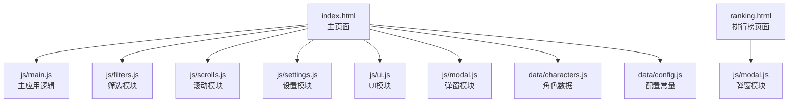
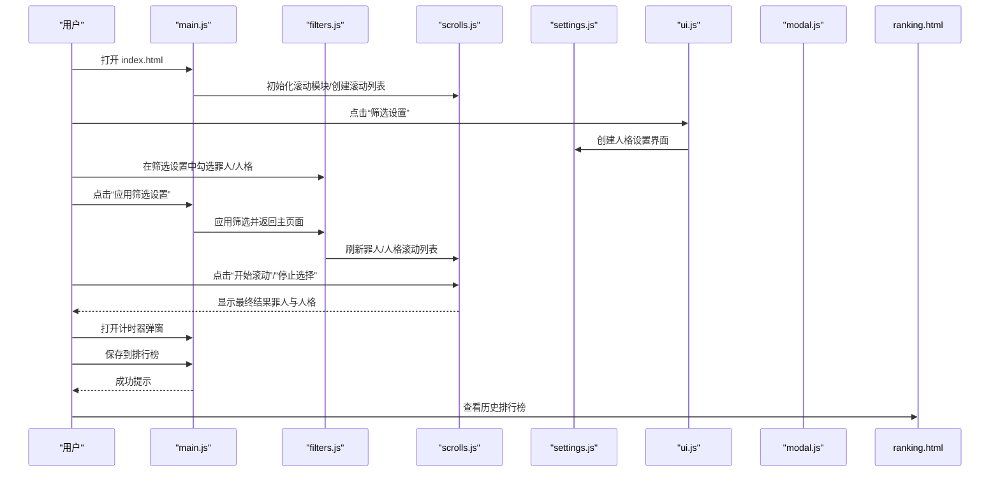
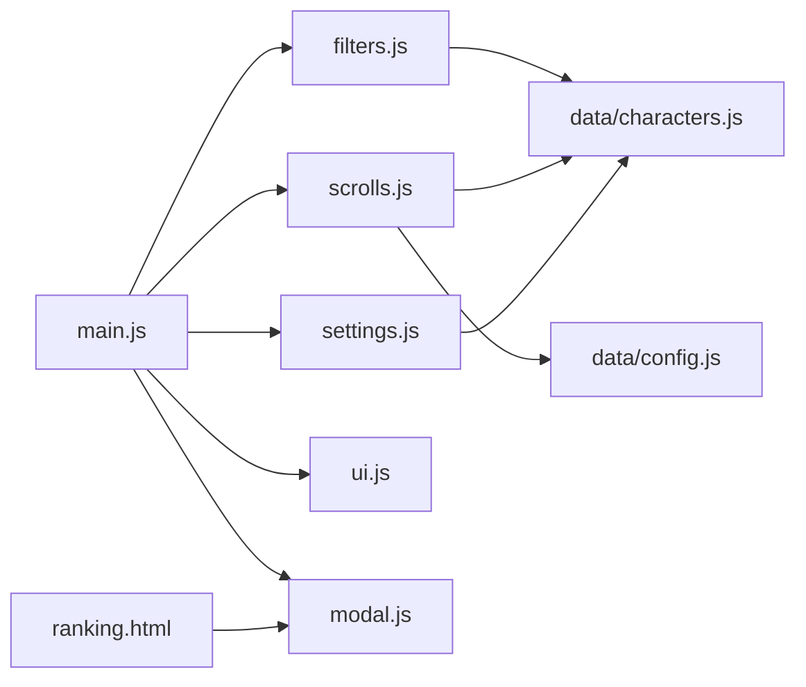

# 用户指南

<cite>
**本文引用的文件**
- [README.md](file://README.md)
- [index.html](file://index.html)
- [ranking.html](file://ranking.html)
- [js/main.js](file://js/main.js)
- [js/filters.js](file://js/filters.js)
- [js/scrolls.js](file://js/scrolls.js)
- [js/settings.js](file://js/settings.js)
- [js/ui.js](file://js/ui.js)
- [js/modal.js](file://js/modal.js)
- [data/characters.js](file://data/characters.js)
- [data/config.js](file://data/config.js)
- [BUG_FIX_REPORT.md](file://BUG_FIX_REPORT.md)
</cite>

## 目录
1. [简介](#简介)
2. [项目结构](#项目结构)
3. [核心组件](#核心组件)
4. [架构总览](#架构总览)
5. [详细使用说明](#详细使用说明)
6. [依赖关系分析](#依赖关系分析)
7. [性能与可用性建议](#性能与可用性建议)
8. [故障排除](#故障排除)
9. [结语](#结语)

## 简介
本指南面向终端用户，帮助你快速上手“边狱公司 - 今天蛋筒什么？”应用。你可以通过主页面进行罪人与人格的随机选择，使用筛选设置自定义可选范围，借助计时器记录单通时长并保存到个人排行榜，最后在独立的排名页面查看历史成绩。

## 项目结构
- 主页面 index.html 提供随机选择与筛选设置入口
- 排行榜页面 ranking.html 展示并管理个人单通时间记录
- js 目录包含模块化功能：主流程、筛选、滚动、设置、UI、弹窗
- data 目录包含角色数据与配置常量
- README.md 提供功能概览、运行方式与技术栈说明

图表来源
- [index.html](file://index.html#L1-L176)
- [js/main.js](file://js/main.js#L1-L261)
- [js/filters.js](file://js/filters.js#L1-L274)
- [js/scrolls.js](file://js/scrolls.js#L1-L718)
- [js/settings.js](file://js/settings.js#L1-L263)
- [js/ui.js](file://js/ui.js#L1-L66)
- [js/modal.js](file://js/modal.js#L1-L109)
- [data/characters.js](file://data/characters.js#L1-L260)
- [data/config.js](file://data/config.js#L1-L29)
- [ranking.html](file://ranking.html#L1-L94)

章节来源
- [README.md](file://README.md#L1-L121)

## 核心组件
- 主应用逻辑（main.js）
  - 负责初始化滚动模块、创建罪人/人格滚动列表、绑定按钮事件、页面导航与返回时刷新滚动状态
- 筛选模块（filters.js）
  - 负责罪人筛选复选框渲染、筛选状态更新、应用/重置筛选、返回主页面时的滚动列表刷新与高亮
- 滚动模块（scrolls.js）
  - 负责罪人/人格滚动列表的创建、开始/停止滚动、定位中心、高亮选中项、重置二级滚动状态
- 设置模块（settings.js）
  - 负责人格筛选设置界面的创建、全选/全不选/反选、按罪人维度的筛选控制
- UI模块（ui.js）
  - 负责页面导航按钮、筛选控制按钮事件绑定、应用筛选按钮的动态添加
- 弹窗模块（modal.js）
  - 提供统一的提示与确认弹窗，替代浏览器原生 alert/confirm
- 数据与配置（data/characters.js、data/config.js）
  - 提供罪人与人格数据、滚动配置常量

章节来源
- [js/main.js](file://js/main.js#L1-L261)
- [js/filters.js](file://js/filters.js#L1-L274)
- [js/scrolls.js](file://js/scrolls.js#L1-L718)
- [js/settings.js](file://js/settings.js#L1-L263)
- [js/ui.js](file://js/ui.js#L1-L66)
- [js/modal.js](file://js/modal.js#L1-L109)
- [data/characters.js](file://data/characters.js#L1-L260)
- [data/config.js](file://data/config.js#L1-L29)

## 架构总览
下图展示了从用户操作到最终结果的关键交互流程。

图表来源
- [js/main.js](file://js/main.js#L160-L261)
- [js/filters.js](file://js/filters.js#L117-L184)
- [js/scrolls.js](file://js/scrolls.js#L281-L478)
- [js/settings.js](file://js/settings.js#L60-L254)
- [js/ui.js](file://js/ui.js#L1-L66)
- [js/modal.js](file://js/modal.js#L1-L109)
- [index.html](file://index.html#L1-L176)
- [ranking.html](file://ranking.html#L1-L94)

## 详细使用说明

### 基本使用
- 打开主页面
  - 使用浏览器打开 index.html 文件，或通过本地HTTP服务访问
  - 页面包含“主选择器”和“筛选设置”两个导航按钮
- 选择罪人
  - 点击“主选择器”进入主页面
  - 在“一级选择 - 12名罪人”区域，点击“开始滚动”启动滚动
  - 点击“停止选择”确定当前选中罪人
  - 选中后，二级选择器（人格）将自动解锁
- 选择人格
  - 在“二级选择 - 罪人人格”区域，点击“开始滚动”启动滚动
  - 点击“停止选择”确定当前选中人格
- 查看结果
  - 结果区域会显示当前选中的罪人与人格

章节来源
- [index.html](file://index.html#L21-L128)
- [js/main.js](file://js/main.js#L160-L261)
- [js/scrolls.js](file://js/scrolls.js#L281-L478)

### 高级功能

#### 通过筛选设置自定义可选范围
- 进入“筛选设置”
  - 点击“筛选设置”按钮，进入筛选页面
- 罪人筛选
  - 使用“全选/全不选/反选”按钮快速调整
  - 勾选/取消勾选罪人复选框，影响一级滚动列表
- 人格筛选
  - 在“人格整体筛选设置”区域，按罪人分页查看
  - 对每个罪人的人格进行勾选/取消勾选
  - 支持“全选所有人格/取消所有人格/反选所有人格”，以及按罪人维度的全选/全不选/反选
- 应用与重置
  - 点击“应用筛选设置”保存当前设置并返回主页面
  - 点击“重置筛选设置”可一键恢复到初始状态

章节来源
- [index.html](file://index.html#L81-L113)
- [js/filters.js](file://js/filters.js#L16-L116)
- [js/settings.js](file://js/settings.js#L1-L263)

#### 使用单通时间计时器记录游戏时长并保存成绩
- 打开计时器
  - 在主页面点击“单通时间计时”按钮，打开计时器弹窗
- 计时操作
  - 点击“开始”启动计时；点击“暂停”暂停；点击“重置”清零
- 保存到排行榜
  - 在备注栏填写可选信息（如使用角色、难度等）
  - 点击“保存到排行榜”，成功后可在排行榜页面查看
- 查看排行榜
  - 点击“查看排行榜”按钮，跳转至 ranking.html 页面
  - 页面按时间升序排列，支持清空记录与返回主页

章节来源
- [index.html](file://index.html#L131-L175)
- [ranking.html](file://ranking.html#L1-L94)

### 访问历史排行榜
- 在主页面点击“查看排行榜”按钮，或直接打开 ranking.html
- 页面会从本地存储加载记录并按时间升序显示
- 支持清空所有记录与返回主页

章节来源
- [ranking.html](file://ranking.html#L1-L94)

## 依赖关系分析
- 模块耦合
  - main.js 作为中枢，导入 filters、scrolls、settings、ui、modal，并负责页面导航与事件绑定
  - filters 与 settings 共同维护筛选状态（罪人与人格），并通过刷新滚动列表联动
  - scrolls 负责滚动与高亮，依赖 config 中的配置常量
  - modal 统一提供提示与确认弹窗
- 数据流
  - data/characters.js 提供罪人与人格数据，供 filters、scrolls、settings 使用
  - 本地存储用于保存排行榜记录（ranking.html）

图表来源
- [js/main.js](file://js/main.js#L1-L159)
- [js/filters.js](file://js/filters.js#L1-L116)
- [js/scrolls.js](file://js/scrolls.js#L1-L111)
- [js/settings.js](file://js/settings.js#L1-L100)
- [js/ui.js](file://js/ui.js#L1-L66)
- [js/modal.js](file://js/modal.js#L1-L109)
- [data/characters.js](file://data/characters.js#L1-L260)
- [data/config.js](file://data/config.js#L1-L29)
- [ranking.html](file://ranking.html#L1-L94)

## 性能与可用性建议
- 图片加载优化
  - 若图片加载失败，系统会显示带背景色的问号占位符，保证界面稳定
- 滚动体验
  - 滚动速度与过渡时长由配置常量控制，确保顺滑体验
- 筛选效率
  - 仅在筛选设置发生变更时标记“未保存更改”，减少不必要的刷新

章节来源
- [js/filters.js](file://js/filters.js#L32-L57)
- [js/scrolls.js](file://js/scrolls.js#L70-L111)
- [data/config.js](file://data/config.js#L1-L29)

## 故障排除

### 常见问题与解决方案
- 图片加载失败
  - 现象：头像无法显示
  - 解决：系统会自动显示带背景色的问号占位符，不影响选择流程
  - 参考：筛选设置与滚动列表中均有占位符逻辑
- 仅勾选1个罪人后返回主页面，一级筛选池未显示头像与名字
  - 现象：内容框为空
  - 解决：应用已修复，返回主页面时会自动高亮显示该罪人
  - 参考：filters.js 的刷新逻辑已补充高亮显示
- 勾选了某罪人的人格，但最终抽取结果显示未勾选的人格
  - 现象：抽到的不是筛选设置中勾选的人格
  - 解决：已修复人格筛选逻辑，采用显式判断，确保仅从勾选的人格中随机抽取
  - 参考：scrolls.js 与 filters.js 的筛选逻辑已修正
- 未选择任何罪人或人格
  - 现象：点击开始滚动时报错或按钮不可用
  - 解决：系统会弹出提示，请至少选择一个罪人与至少一个人格
  - 参考：filters.js 的校验逻辑与 scrolls.js 的错误提示

章节来源
- [js/filters.js](file://js/filters.js#L32-L57)
- [js/scrolls.js](file://js/scrolls.js#L70-L111)
- [js/filters.js](file://js/filters.js#L117-L184)
- [js/scrolls.js](file://js/scrolls.js#L281-L478)
- [BUG_FIX_REPORT.md](file://BUG_FIX_REPORT.md#L1-L205)

### 错误应对策略
- 筛选设置未保存
  - 策略：在离开筛选设置前点击“应用筛选设置”保存，或点击“重置筛选设置”恢复默认
- 返回主页面后按钮不可用
  - 策略：检查筛选设置中是否至少勾选1个罪人；若仅勾选1个罪人，系统会自动高亮显示并解锁二级选择
- 人格列表为空
  - 策略：确保为选中的罪人至少勾选1个人格；若未勾选，系统会在二级列表中显示提示

章节来源
- [js/filters.js](file://js/filters.js#L117-L184)
- [js/scrolls.js](file://js/scrolls.js#L113-L200)

## 结语
感谢你使用“边狱公司 - 今天蛋筒什么？”应用。希望本指南能帮助你顺利完成随机选择、自定义筛选、计时与记录，并在排行榜中见证你的进步。如有更多使用问题，欢迎参考页面内的使用说明与提示。