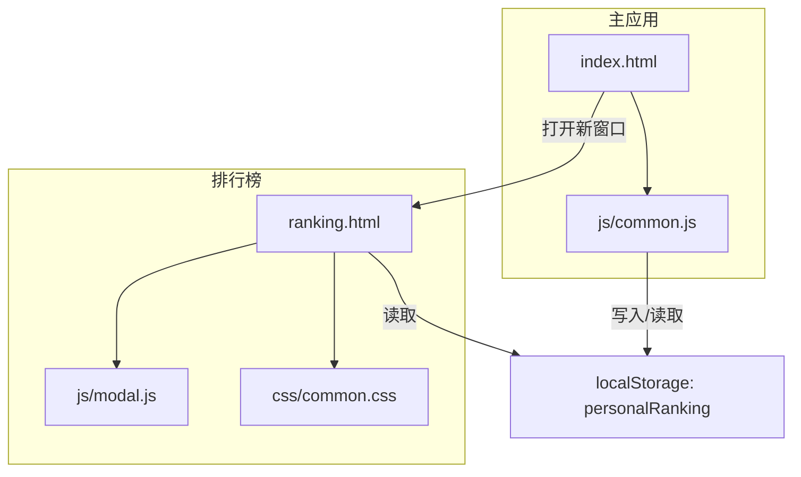
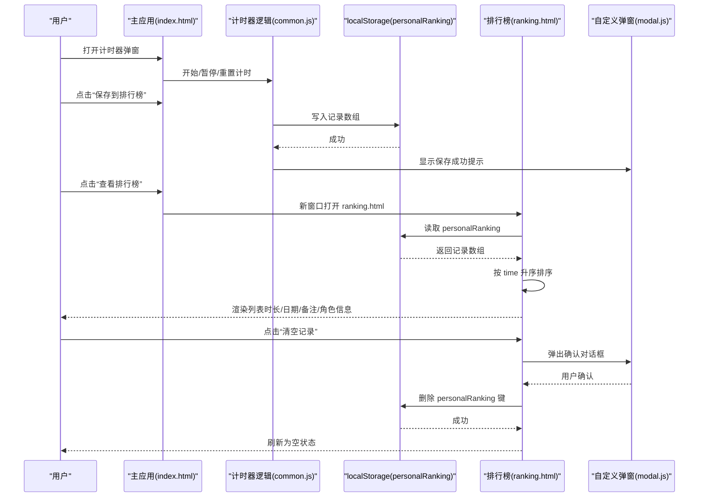
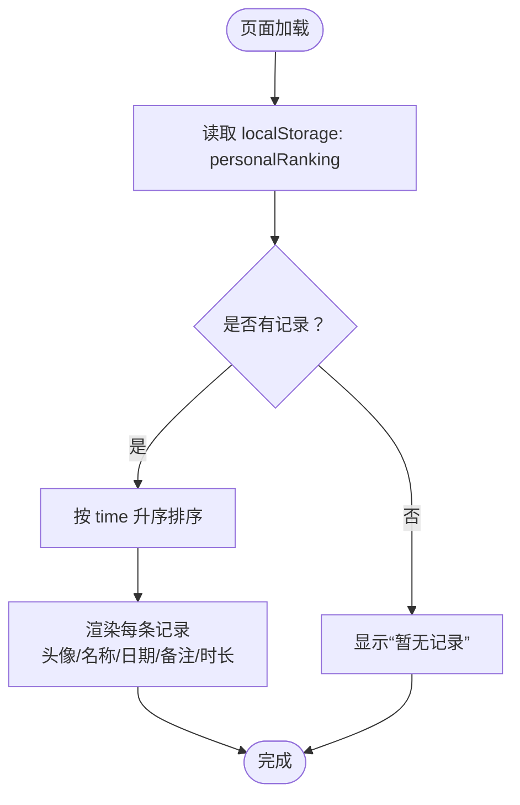
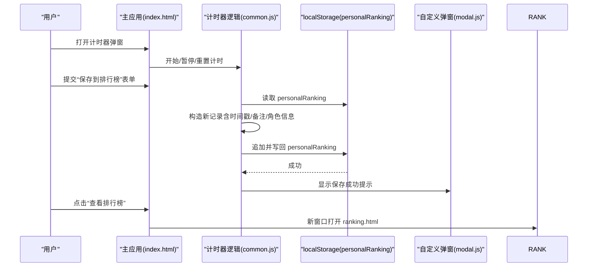
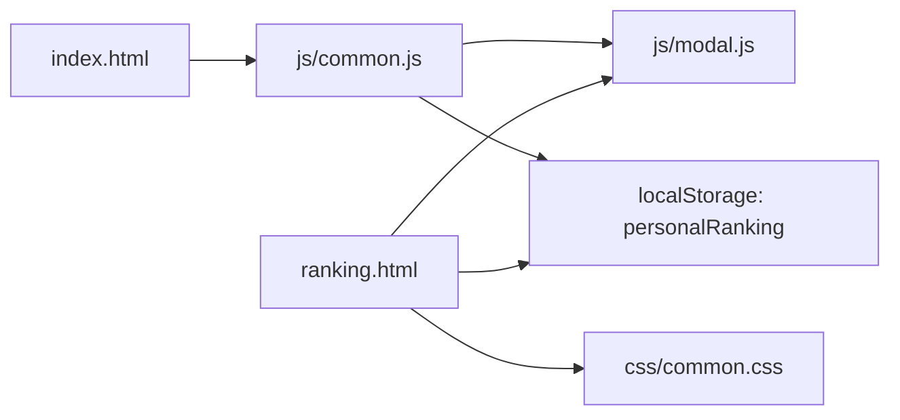

# 排行榜

<cite>
**本文引用的文件**
- [ranking.html](file://ranking.html)
- [index.html](file://index.html)
- [common.js](file://js/common.js)
- [modal.js](file://js/modal.js)
- [common.css](file://css/common.css)
</cite>

## 目录
1. [简介](#简介)
2. [项目结构](#项目结构)
3. [核心组件](#核心组件)
4. [架构总览](#架构总览)
5. [组件详解](#组件详解)
6. [依赖关系分析](#依赖关系分析)
7. [性能考量](#性能考量)
8. [故障排查指南](#故障排查指南)
9. [结论](#结论)

## 简介
本文件系统性梳理“排行榜”功能的架构与实现，重点覆盖：
- ranking.html 页面如何独立于主应用展示历史记录，并从 localStorage 读取与渲染；
- 排行榜数据的排序算法（按时间从短到长）；
- 用户查看详细记录的方式（游戏时长、完成日期、自定义备注）；
- 清除排行榜的实现机制（确认对话框与 localStorage 数据清理策略）；
- 排行榜页面与主应用之间的数据共享机制（计时记录实时同步更新）。

## 项目结构
排行榜功能由两个页面协同完成：
- 主应用页面 index.html：提供计时器与“保存到排行榜”的入口，负责将计时记录写入 localStorage；
- 独立排行榜页面 ranking.html：从 localStorage 读取记录并渲染，支持排序、查看与清空。

图表来源
- [ranking.html](file://ranking.html#L1-L94)
- [index.html](file://index.html#L131-L176)
- [common.js](file://js/common.js#L129-L326)
- [modal.js](file://js/modal.js#L1-L109)
- [common.css](file://css/common.css#L657-L797)

章节来源
- [ranking.html](file://ranking.html#L1-L94)
- [index.html](file://index.html#L131-L176)

## 核心组件
- 排行榜页面（ranking.html）
  - 从 localStorage 读取 personalRanking 列表；
  - 按 time 字段升序排序；
  - 渲染每个记录的游戏时长、完成日期、自定义备注，以及可选的角色/人格头像与名称；
  - 提供“返回主页”“清空记录”按钮，其中清空记录使用自定义确认对话框。
- 主应用计时器（index.html + js/common.js）
  - 提供计时器弹窗与“保存到排行榜”表单；
  - 将计时记录写入 localStorage 的 personalRanking 数组；
  - 支持“查看排行榜”在新窗口打开 ranking.html。
- 自定义弹窗（js/modal.js）
  - 提供 alert/confirm 弹窗能力，用于确认清空与保存提示。

章节来源
- [ranking.html](file://ranking.html#L36-L91)
- [common.js](file://js/common.js#L160-L217)
- [modal.js](file://js/modal.js#L74-L103)

## 架构总览
下图展示了从计时结束到排行榜展示的关键流程，以及数据在 localStorage 中的持久化位置。

图表来源
- [index.html](file://index.html#L131-L176)
- [common.js](file://js/common.js#L160-L217)
- [ranking.html](file://ranking.html#L36-L91)
- [modal.js](file://js/modal.js#L74-L103)

## 组件详解

### 排行榜页面（ranking.html）
- 数据来源与渲染
  - 从 localStorage 读取 personalRanking，若为空则显示“暂无记录”；
  - 对记录按 time 升序排序；
  - 渲染字段：排名序号、角色/人格头像与名称（若存在）、完成日期、自定义备注、游戏时长。
- 交互行为
  - “返回主页”跳转至 index.html；
  - “清空记录”调用自定义确认对话框，确认后删除 personalRanking 并重新加载。
- 样式要点
  - 排行榜项包含排名数字、角色信息区、日期/备注区、时长区；
  - 时长采用金色高亮，日期为浅灰，备注为斜体白色。

图表来源
- [ranking.html](file://ranking.html#L36-L68)

章节来源
- [ranking.html](file://ranking.html#L36-L91)
- [common.css](file://css/common.css#L657-L797)

### 主应用计时器与排行榜写入（index.html + js/common.js）
- 计时器弹窗与控件
  - 提供开始/暂停/重置计时器；
  - 展示计时显示与“保存到排行榜”表单。
- 保存到本地排行榜
  - 表单提交触发保存逻辑；
  - 从 localStorage 读取 personalRanking，构造新记录（time、comment、timestamp、sinner/persona），追加后写回；
  - 使用自定义弹窗提示保存成功或失败；
  - 保存成功后清空备注输入框。
- 查看排行榜
  - 点击“查看排行榜”在新窗口打开 ranking.html。

图表来源
- [index.html](file://index.html#L131-L176)
- [common.js](file://js/common.js#L160-L217)
- [modal.js](file://js/modal.js#L74-L103)

章节来源
- [index.html](file://index.html#L131-L176)
- [common.js](file://js/common.js#L160-L217)

### 自定义弹窗（js/modal.js）
- 能力
  - alert：显示消息并等待用户确认；
  - confirm：显示确认/取消按钮，返回布尔值；
  - 通过 Promise 化支持异步确认（如清空排行榜）。
- 在排行榜中的应用
  - 清空记录前弹出确认对话框，避免误删；
  - 保存成功/失败时弹出提示。

章节来源
- [modal.js](file://js/modal.js#L74-L103)
- [ranking.html](file://ranking.html#L70-L77)
- [common.js](file://js/common.js#L202-L213)

### 数据模型与排序算法
- 数据模型（localStorage 中的记录）
  - 字段：time（秒）、comment（备注）、timestamp（ISO字符串）、sinner/persona（可选，含 name、avatar）。
- 排序算法
  - 按 time 升序排序，即用时越短越靠前；
  - 排序发生在渲染前，确保用户看到最优成绩在前。

章节来源
- [ranking.html](file://ranking.html#L36-L68)
- [common.js](file://js/common.js#L182-L194)

### 视觉与交互细节（ranking.html）
- 排行榜项布局
  - 排名数字、角色信息（头像+名称，若同时有罪人与人格则显示人格名称）、日期/备注、时长；
  - 时长采用高亮金色，日期为浅灰，备注为斜体白色。
- 操作按钮
  - 返回主页与清空记录，样式采用渐变色与阴影，悬停有位移与阴影增强。

章节来源
- [ranking.html](file://ranking.html#L49-L67)
- [common.css](file://css/common.css#L657-L797)

## 依赖关系分析
- ranking.html
  - 依赖自定义弹窗模块（import Modal）；
  - 依赖 localStorage 存储 personalRanking；
  - 依赖 common.css 的样式类。
- index.html + js/common.js
  - 依赖计时器弹窗与表单；
  - 依赖 localStorage 写入 personalRanking；
  - 依赖自定义弹窗进行提示与确认。
- js/modal.js
  - 作为通用弹窗工具被其他模块调用。

图表来源
- [ranking.html](file://ranking.html#L23-L26)
- [index.html](file://index.html#L131-L176)
- [common.js](file://js/common.js#L129-L326)
- [modal.js](file://js/modal.js#L1-L109)

章节来源
- [ranking.html](file://ranking.html#L23-L26)
- [index.html](file://index.html#L131-L176)
- [common.js](file://js/common.js#L129-L326)
- [modal.js](file://js/modal.js#L1-L109)

## 性能考量
- 排行榜渲染
  - 仅在 DOMContentLoaded 时一次性读取与排序，复杂度 O(n log n)，n 为记录数量；
  - 若记录量较大，可考虑虚拟滚动或分页以降低首屏渲染压力。
- localStorage 访问
  - 读写为 O(1) 操作，但频繁序列化/反序列化可能带来开销；
  - 建议避免在高频事件中重复写入，可在保存时合并多次变更。
- 弹窗与窗口切换
  - 新窗口打开 ranking.html，避免主应用重载；
  - 确认对话框采用异步 Promise，避免阻塞主线程。

[本节为通用建议，无需特定文件来源]

## 故障排查指南
- 无法看到任何记录
  - 检查是否已通过“保存到排行榜”写入 personalRanking；
  - 确认 localStorage 中存在 personalRanking 键值。
- 保存失败
  - 查看控制台错误信息；
  - 确认计时器已运行过（time 不为 0）。
- 清空记录后仍显示旧数据
  - 确认已刷新 ranking.html 页面；
  - 检查是否被浏览器缓存导致未重新读取。
- 角色/人格信息缺失
  - 保存时未选择对应角色/人格，记录中相应字段为空；
  - 重新保存并确保选择了角色/人格。

章节来源
- [common.js](file://js/common.js#L202-L213)
- [ranking.html](file://ranking.html#L36-L44)

## 结论
排行榜功能通过“主应用计时器 + 独立排行榜页面 + localStorage”的轻量架构实现：
- 主应用负责计时与持久化，ranking 页面负责展示与交互；
- 数据模型简洁，排序直观，便于用户快速识别最佳成绩；
- 通过自定义弹窗提升交互体验与安全性；
- 当前实现完全基于浏览器端存储，无需网络依赖，适合离线使用与快速迭代。