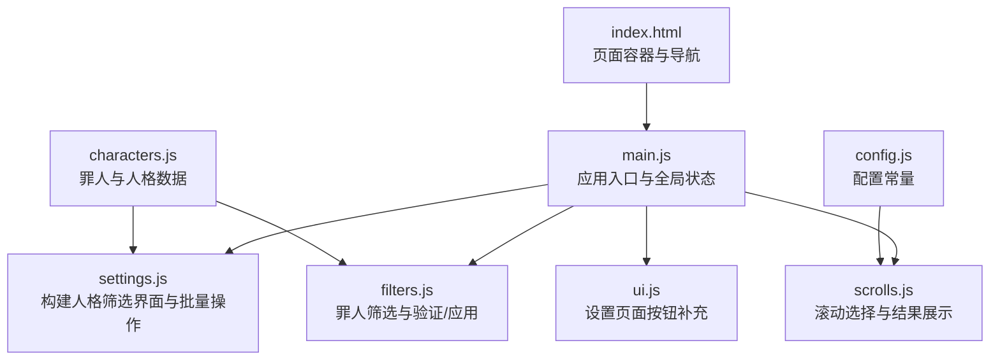
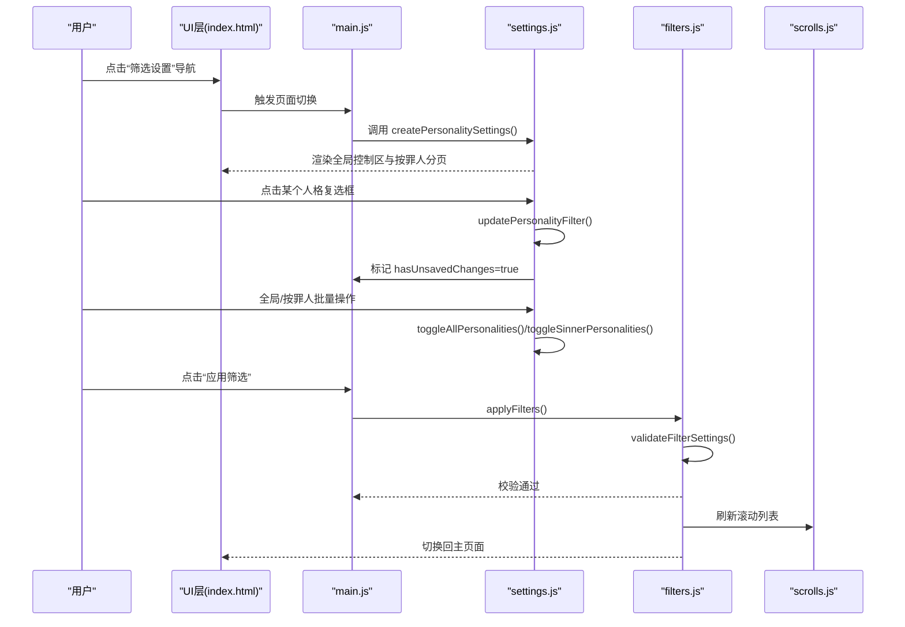
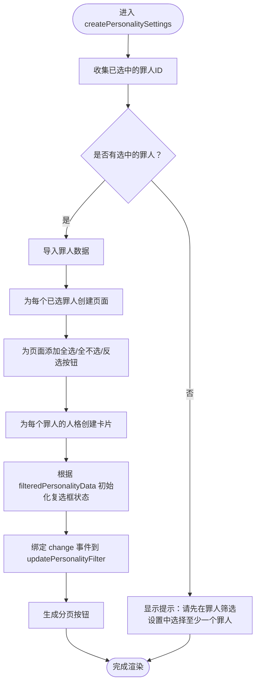
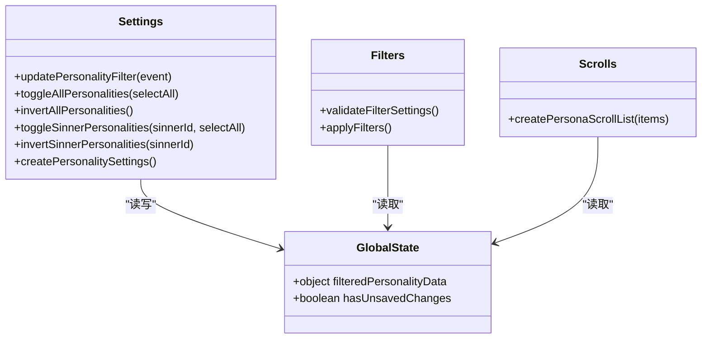
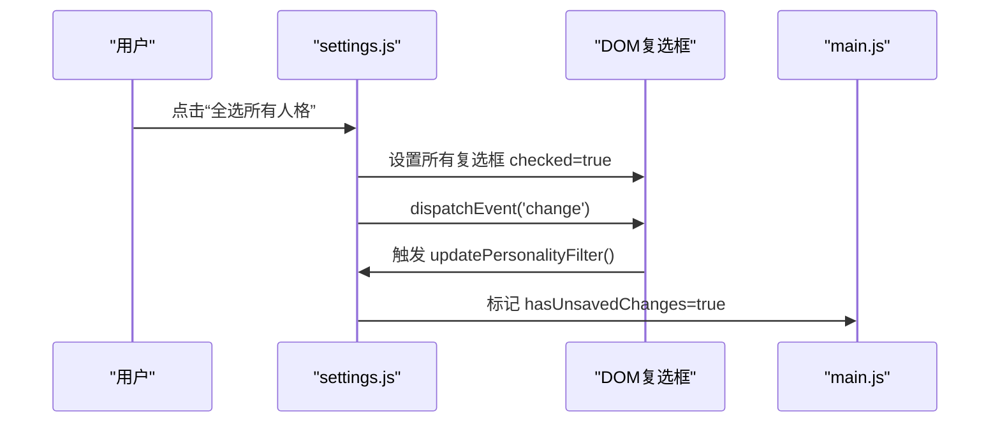
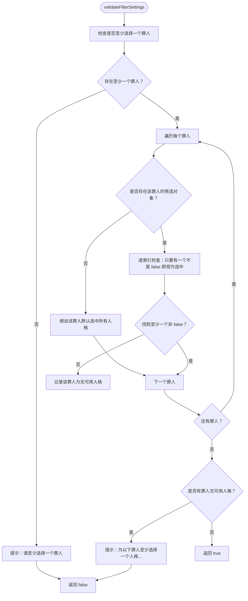
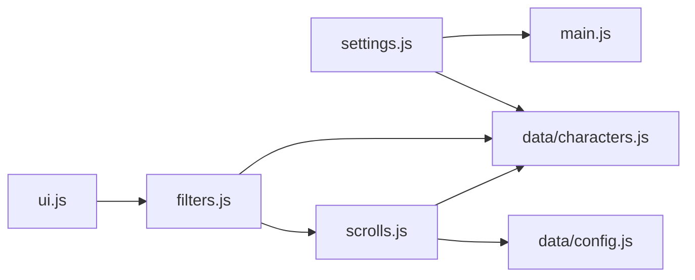

# 人格筛选

<cite>
**本文引用的文件**
- [index.html](file://index.html)
- [main.js](file://js/main.js)
- [settings.js](file://js/settings.js)
- [filters.js](file://js/filters.js)
- [scrolls.js](file://js/scrolls.js)
- [ui.js](file://js/ui.js)
- [characters.js](file://data/characters.js)
- [config.js](file://data/config.js)
</cite>

## 目录
1. [简介](#简介)
2. [项目结构](#项目结构)
3. [核心组件](#核心组件)
4. [架构总览](#架构总览)
5. [详细组件分析](#详细组件分析)
6. [依赖关系分析](#依赖关系分析)
7. [性能考量](#性能考量)
8. [故障排查指南](#故障排查指南)
9. [结论](#结论)

## 简介
本文件围绕“人格筛选”功能进行全面解析，重点说明：
- settings.js 中 createPersonalitySettings 如何根据已选罪人动态生成分页式人格筛选界面，包含全局控制区与按罪人分页的布局结构。
- 人格筛选状态的存储机制：通过 window.filteredPersonalityData 对象以罪人ID为键、人格索引为属性的嵌套结构进行管理。
- updatePersonalityFilter 如何响应复选框变化并更新全局筛选状态，同时标记 hasUnsavedChanges 为 true。
- 全局操作（全选/全不选/反选）与按罪人操作（toggleSinnerPersonalities/invertSinnerPersonalities）的实现差异及其事件传播机制。
- 结合 filters.js 的 validateFilterSettings，说明在应用筛选前如何验证每个罪人至少有一个可选人格的业务规则。

## 项目结构
本功能涉及的主要文件与职责如下：
- index.html：提供页面骨架与容器，包含“筛选设置”页面与“主选择器”页面。
- main.js：应用入口，初始化全局状态（含 filteredPersonalityData），负责页面切换、应用筛选、重置筛选等。
- settings.js：负责构建“人格筛选设置”界面，处理复选框变更与批量操作。
- filters.js：负责“罪人筛选设置”，并提供 validateFilterSettings 与 applyFilters。
- scrolls.js：负责滚动选择与结果展示，读取 filteredPersonalityData 实现筛选。
- ui.js：补充设置页面的“应用筛选”按钮等交互。
- characters.js：提供罪人与人格数据源。
- config.js：提供滚动与界面配置常量。

图表来源
- [index.html](file://index.html#L80-L113)
- [main.js](file://js/main.js#L69-L78)
- [settings.js](file://js/settings.js#L60-L263)
- [filters.js](file://js/filters.js#L1-L274)
- [scrolls.js](file://js/scrolls.js#L1-L718)
- [ui.js](file://js/ui.js#L1-L66)
- [characters.js](file://data/characters.js#L1-L260)
- [config.js](file://data/config.js#L1-L29)

章节来源
- [index.html](file://index.html#L80-L113)
- [main.js](file://js/main.js#L69-L78)

## 核心组件
- 全局状态
  - window.filteredPersonalityData：以罪人ID为键、以人格索引为键的布尔映射；未设置时视为“默认选中”。
  - window.hasUnsavedChanges：标记是否存在未保存的筛选更改。
- settings.js
  - createPersonalitySettings：动态生成“人格筛选设置”界面，包含全局控制区与按罪人分页。
  - updatePersonalityFilter：响应复选框变更，更新 filteredPersonalityData，并标记 hasUnsavedChanges。
  - toggleAllPersonalities/invertAllPersonalities：对所有复选框执行全选/全不选/反选。
  - toggleSinnerPersonalities/invertSinnerPersonalities：对指定罪人页面内的复选框执行全选/反选。
- filters.js
  - validateFilterSettings：校验每个罪人至少有一个可选人格；若不满足则弹窗提示并阻止应用。
  - applyFilters：保存当前筛选状态为原始状态，切换页面并刷新滚动列表。
- scrolls.js
  - 读取 filteredPersonalityData 对当前罪人的人格进行过滤，生成滚动列表。
- ui.js
  - 在设置页面动态添加“应用筛选”按钮。

章节来源
- [main.js](file://js/main.js#L69-L78)
- [settings.js](file://js/settings.js#L1-L263)
- [filters.js](file://js/filters.js#L117-L157)
- [scrolls.js](file://js/scrolls.js#L480-L579)
- [ui.js](file://js/ui.js#L41-L57)

## 架构总览
下图展示了“人格筛选”在页面中的交互流程与数据流。

图表来源
- [index.html](file://index.html#L80-L113)
- [main.js](file://js/main.js#L82-L115)
- [settings.js](file://js/settings.js#L60-L263)
- [filters.js](file://js/filters.js#L117-L184)
- [scrolls.js](file://js/scrolls.js#L195-L271)

## 详细组件分析

### 组件A：人格筛选界面构建（settings.js）
- 全局控制区
  - 提供“全选所有人格”“取消所有人格”“反选所有人格”三个按钮，绑定到 toggleAllPersonalities/invertAllPersonalities。
- 分页式布局
  - 仅当“罪人筛选设置”中有至少一个罪人被选中时，才为每个已选罪人创建一个“人格页面”，并生成对应的分页按钮。
  - 每个“人格页面”包含：
    - 页面标题（罪人名称）
    - 页面级控制按钮（全选/全不选/反选）
    - 人格网格（每张卡片包含头像、名称与启用开关）
- 复选框行为
  - 复选框的 dataset.sinnerId 与 dataset.personaIndex 用于定位罪人ID与人格索引。
  - 初始状态：若该罪人未设置过筛选，则默认启用；否则使用已保存状态。
  - change 事件触发 updatePersonalityFilter，更新 window.filteredPersonalityData 并标记 hasUnsavedChanges。

图表来源
- [settings.js](file://js/settings.js#L60-L263)

章节来源
- [settings.js](file://js/settings.js#L60-L263)

### 组件B：状态存储与更新（window.filteredPersonalityData）
- 存储结构
  - 键：罪人ID（整数）
  - 值：对象，键为人格索引（整数），值为布尔（true/false）
  - 未设置的键值对视为“默认选中”（即未显式设为 false）
- 初始化与默认值
  - 若某罪人从未设置过筛选，进入“主选择器”时会自动为其所有人格设置为 true。
- 更新策略
  - updatePersonalityFilter 将 checkbox.checked 写入 filteredPersonalityData[sinnerId][personaIndex]。
  - 每次更新都会将 window.hasUnsavedChanges 设为 true。

图表来源
- [main.js](file://js/main.js#L69-L78)
- [settings.js](file://js/settings.js#L1-L263)
- [filters.js](file://js/filters.js#L117-L157)
- [scrolls.js](file://js/scrolls.js#L480-L579)

章节来源
- [main.js](file://js/main.js#L69-L78)
- [settings.js](file://js/settings.js#L1-L263)

### 组件C：批量操作与事件传播（全局 vs 按罪人）
- 全局批量操作
  - toggleAllPersonalities/selectAll：遍历容器内所有复选框，统一设置 checked 并 dispatchEvent('change')，从而触发 updatePersonalityFilter。
  - invertAllPersonalities：同理，逐个反向设置并触发事件。
- 按罪人批量操作
  - toggleSinnerPersonalities/sinnerId/selectAll：仅针对特定罪人页面内的复选框执行相同逻辑。
  - invertSinnerPersonalities：同理，逐个反向设置并触发事件。
- 事件传播机制
  - 通过 dispatchEvent(new Event('change')) 显式触发 change 事件，确保 updatePersonalityFilter 正常更新状态与标记未保存更改。

图表来源
- [settings.js](file://js/settings.js#L20-L58)
- [main.js](file://js/main.js#L82-L115)

章节来源
- [settings.js](file://js/settings.js#L20-L58)
- [main.js](file://js/main.js#L82-L115)

### 组件D：筛选验证（filters.js validateFilterSettings）
- 核心规则
  - 至少选择一个罪人。
  - 每个罪人至少有一个可选人格。
- 关键逻辑
  - 遍历 window.filteredSinnerData 中的每个罪人。
  - 对于每个罪人，检查其在 window.filteredPersonalityData 中的映射：
    - 若未设置该罪人的筛选对象，则视为“默认选中所有人格”。
    - 若存在该罪人的筛选对象，则逐索引检查：只有当某索引明确为 false 时才视为未选中；只要有一个索引不是 false，就认为该罪人至少有一个可选人格。
  - 若发现任何一个罪人没有任何可选人格，弹窗提示并返回 false，阻止应用筛选。

图表来源
- [filters.js](file://js/filters.js#L117-L157)

章节来源
- [filters.js](file://js/filters.js#L117-L157)

### 组件E：应用筛选与返回主页面（filters.js applyFilters）
- 行为
  - 调用 validateFilterSettings，若通过则：
    - 将当前筛选状态复制到 originalFilteredPersonalityData/originalFilteredSinnerData。
    - 将 hasUnsavedChanges 设为 false。
    - 切换页面至主选择器，刷新滚动列表。
- 返回主页面时的处理
  - 若只有一个罪人，自动选中该罪人并重置人格滚动状态，再根据 filteredPersonalityData 生成对应的人格列表。
  - 若当前选中的罪人仍在筛选列表中，则按 filteredPersonalityData 过滤后生成人格列表；否则重置选择并提示“请先选择罪人”。

章节来源
- [filters.js](file://js/filters.js#L159-L184)
- [filters.js](file://js/filters.js#L194-L271)

### 组件F：滚动选择与筛选生效（scrolls.js）
- 在“主选择器”页面，滚动选择罪人与人格时，会读取 filteredPersonalityData：
  - 若某罪人未设置筛选数据，则默认选中所有人格。
  - 否则仅保留 filteredPersonalityData[sinnerId][index] !== false 的人格。
- 当只有一个罪人时，会自动初始化该罪人的筛选数据（默认全选），并在停止滚动后生成相应的人格列表。

章节来源
- [scrolls.js](file://js/scrolls.js#L324-L398)
- [scrolls.js](file://js/scrolls.js#L480-L579)
- [scrolls.js](file://js/scrolls.js#L572-L684)

## 依赖关系分析
- settings.js 依赖
  - data/characters.js：获取罪人与人格数据，用于构建页面。
  - main.js：通过 window 对象共享 filteredPersonalityData 与 hasUnsavedChanges。
- filters.js 依赖
  - data/characters.js：用于罪人筛选的初始数据与验证。
  - js/modal.js：用于弹窗提示。
  - js/scrolls.js：应用筛选后刷新滚动列表。
- scrolls.js 依赖
  - data/config.js：滚动与界面配置。
  - data/characters.js：罪人与人格数据。
- ui.js 依赖
  - js/filters.js：提供“应用筛选”按钮的事件绑定。

图表来源
- [settings.js](file://js/settings.js#L60-L263)
- [filters.js](file://js/filters.js#L1-L274)
- [scrolls.js](file://js/scrolls.js#L1-L718)
- [ui.js](file://js/ui.js#L1-L66)
- [characters.js](file://data/characters.js#L1-L260)
- [config.js](file://data/config.js#L1-L29)

章节来源
- [settings.js](file://js/settings.js#L60-L263)
- [filters.js](file://js/filters.js#L1-L274)
- [scrolls.js](file://js/scrolls.js#L1-L718)
- [ui.js](file://js/ui.js#L1-L66)
- [characters.js](file://data/characters.js#L1-L260)
- [config.js](file://data/config.js#L1-L29)

## 性能考量
- DOM 操作
  - createPersonalitySettings 在渲染时会批量创建大量 DOM 元素（卡片、按钮、分页）。建议在大数据量场景下考虑虚拟滚动或分批渲染。
- 事件传播
  - 批量操作通过 dispatchEvent('change') 触发，确保 updatePersonalityFilter 与 hasUnsavedChanges 的一致性，但会多次触发事件。可通过节流或合并更新优化。
- 数据访问
  - validateFilterSettings 需要遍历每个罪人与其人格索引，时间复杂度为 O(S×P)，其中 S 为已选罪人数，P 为平均每人格数。当前实现已较高效，无需额外优化。
- 滚动刷新
  - applyFilters 后刷新滚动列表，建议在页面切换时避免不必要的重绘。

## 故障排查指南
- 症状：应用筛选时报错“请至少选择一个罪人”
  - 排查：确认 filters.js 的 validateFilterSettings 是否被调用；检查 window.filteredSinnerData 是否为空。
- 症状：应用筛选时报错“请为以下罪人至少选择一个人格”
  - 排查：检查 window.filteredPersonalityData 中该罪人是否所有索引都为 false；或确认该罪人是否未设置筛选对象（应视为默认全选）。
- 症状：批量操作后未更新状态
  - 排查：确认 toggleAllPersonalities/toggleSinnerPersonalities 是否正确 dispatchEvent('change')；检查 updatePersonalityFilter 是否被调用。
- 症状：主页面返回后未显示人格列表
  - 排查：确认 filters.js 的 refreshScrollsOnReturn 是否成功调用 createPersonaScrollList；检查 filteredPersonalityData 是否正确初始化。

章节来源
- [filters.js](file://js/filters.js#L117-L157)
- [settings.js](file://js/settings.js#L1-L263)
- [filters.js](file://js/filters.js#L194-L271)

## 结论
- 人格筛选功能通过 settings.js 的 createPersonalitySettings 与 updatePersonalityFilter 实现了灵活的分页式界面与状态管理。
- window.filteredPersonalityData 采用“未设置即默认选中”的策略，简化了用户体验，同时在 filters.js 的 validateFilterSettings 中保证业务规则的一致性。
- 批量操作通过事件传播确保状态更新与未保存标记的准确性，配合 filters.js 的 applyFilters 完成最终应用。
- scrolls.js 在主页面读取 filteredPersonalityData 实时过滤，确保滚动选择与筛选设置保持一致。