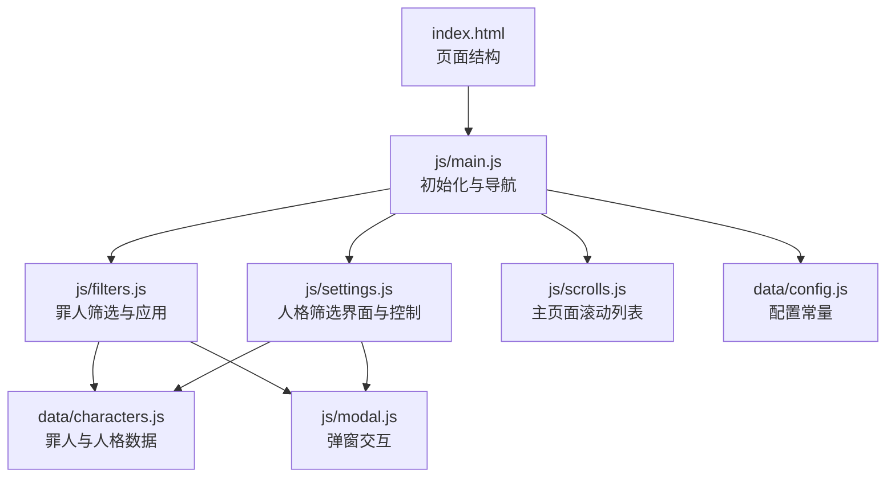
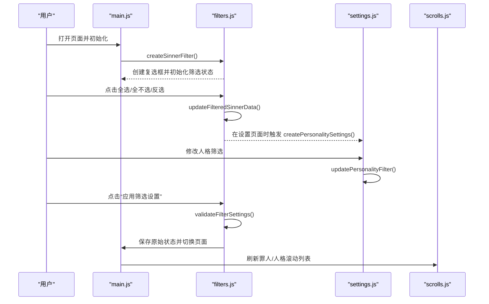
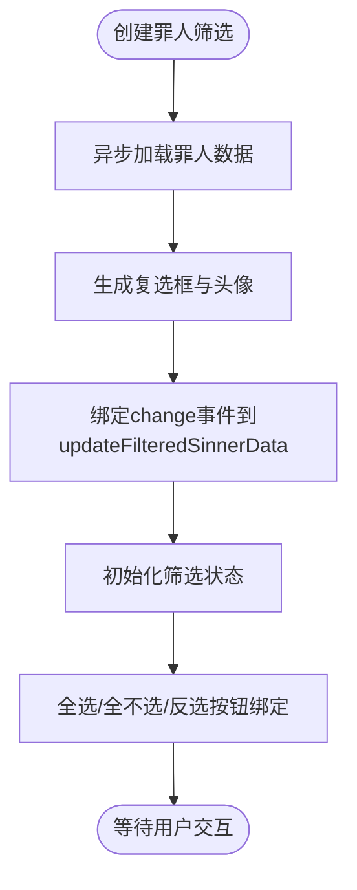
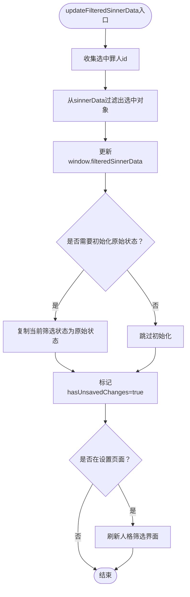
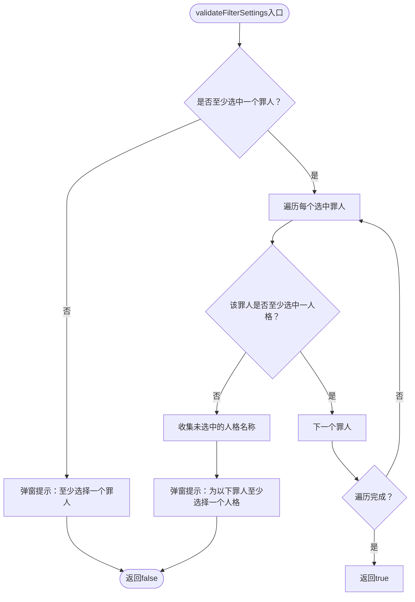
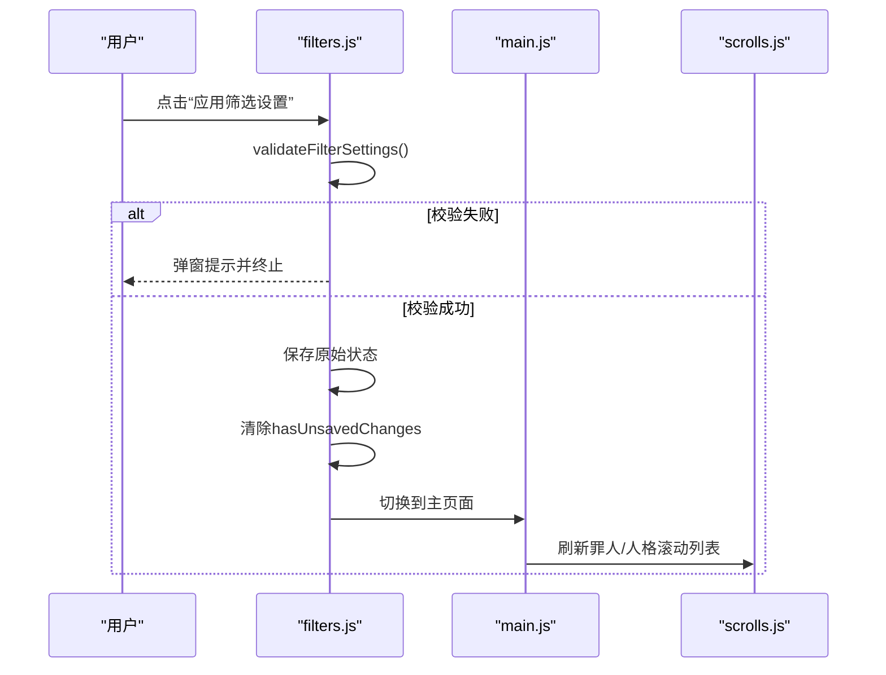
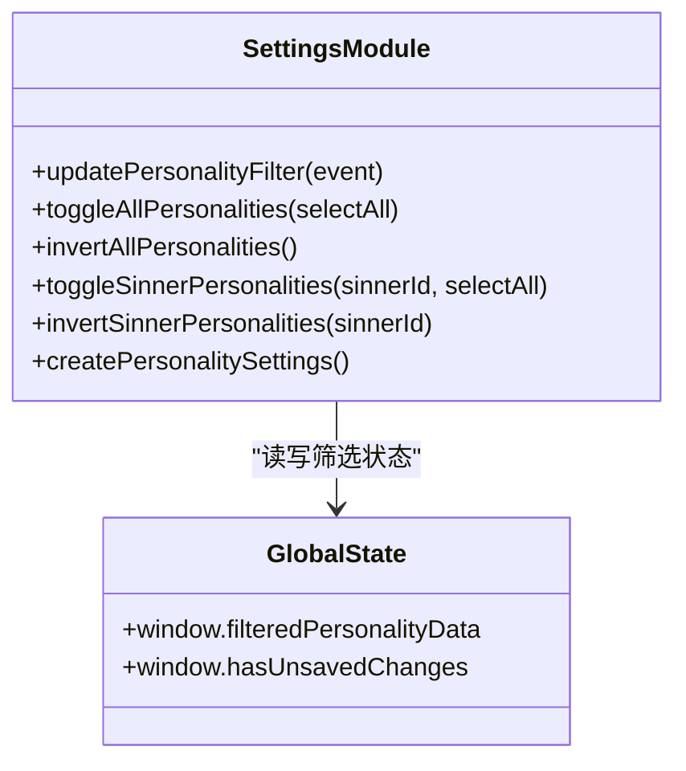
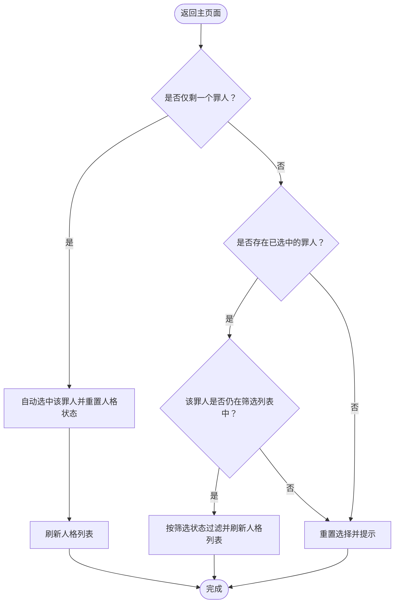
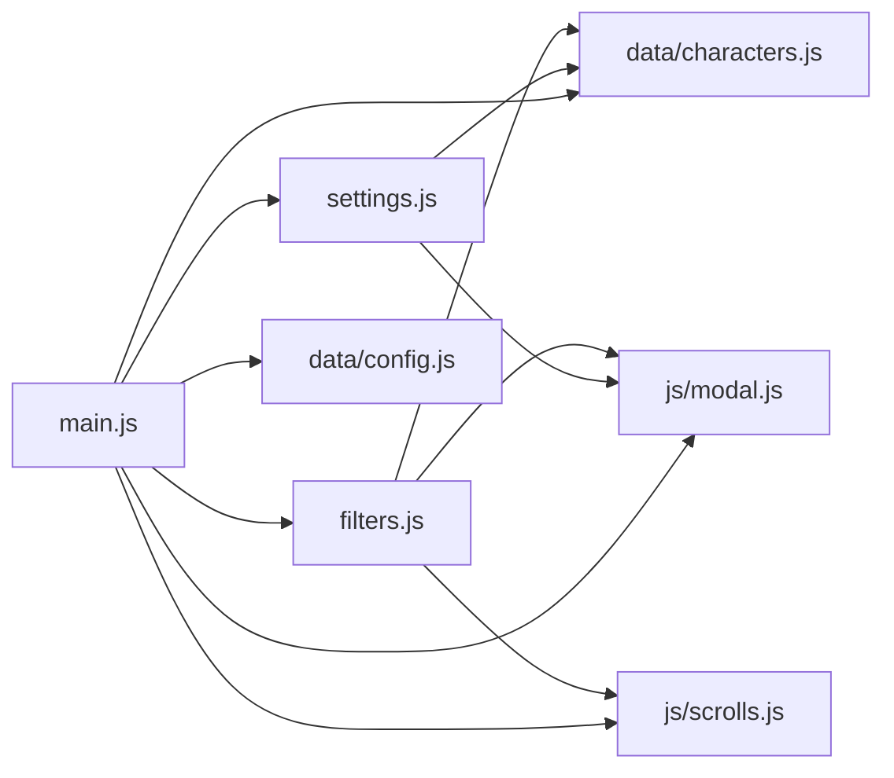

# 筛选设置

<cite>
**本文引用的文件**
- [filters.js](file://js/filters.js)
- [settings.js](file://js/settings.js)
- [main.js](file://js/main.js)
- [scrolls.js](file://js/scrolls.js)
- [characters.js](file://data/characters.js)
- [config.js](file://data/config.js)
- [modal.js](file://js/modal.js)
- [index.html](file://index.html)
</cite>

## 目录
1. [简介](#简介)
2. [项目结构](#项目结构)
3. [核心组件](#核心组件)
4. [架构概览](#架构概览)
5. [详细组件分析](#详细组件分析)
6. [依赖关系分析](#依赖关系分析)
7. [性能考量](#性能考量)
8. [故障排查指南](#故障排查指南)
9. [结论](#结论)

## 简介
本文件深入解析筛选设置功能的实现机制，涵盖：
- 如何通过 filters.js 模块创建罪人筛选复选框，含全选、全不选、反选逻辑
- updateFilteredSinnerData 如何根据用户选择更新全局筛选状态 window.filteredSinnerData，并通过 validateFilterSettings 验证筛选条件有效性
- applyFilters 如何保存筛选状态并返回主页面
- settings.js 中人格筛选的分页式界面如何根据已选罪人动态生成，updatePersonalityFilter 如何维护 window.filteredPersonalityData
- 全局筛选控制与按罪人控制的双重机制
- hasUnsavedChanges 标志在防止数据丢失中的作用

## 项目结构
筛选设置涉及的主要文件与职责：
- js/filters.js：负责罪人筛选复选框的创建与更新、全选/全不选/反选、筛选校验与应用
- js/settings.js：负责人格筛选的分页界面生成、全选/全不选/反选、按罪人控制
- js/main.js：初始化全局筛选状态、页面导航、按钮事件绑定、调用筛选模块
- js/scrolls.js：主页面滚动列表的创建与刷新，配合筛选状态更新
- data/characters.js：提供罪人与人格数据源
- data/config.js：提供滚动与界面配置常量
- js/modal.js：统一的弹窗交互
- index.html：筛选设置页面结构与入口

图表来源
- [index.html](file://index.html#L81-L113)
- [main.js](file://js/main.js#L1-L120)
- [filters.js](file://js/filters.js#L1-L120)
- [settings.js](file://js/settings.js#L1-L120)
- [scrolls.js](file://js/scrolls.js#L1-L60)
- [characters.js](file://data/characters.js#L1-L40)
- [config.js](file://data/config.js#L1-L29)
- [modal.js](file://js/modal.js#L1-L40)

章节来源
- [index.html](file://index.html#L81-L113)
- [main.js](file://js/main.js#L1-L120)

## 核心组件
- 罪人筛选模块（filters.js）
  - 创建罪人筛选复选框，绑定 change 事件，实时更新 window.filteredSinnerData
  - 提供全选/全不选/反选方法
  - 校验筛选设置有效性（至少选一个罪人；每个罪人至少选一个人格）
  - 应用筛选设置，保存原始状态，切换回主页面并刷新滚动列表
- 人格筛选模块（settings.js）
  - 根据已选罪人动态生成分页式人格筛选界面
  - 维护 window.filteredPersonalityData，支持全局与按罪人全选/全不选/反选
  - updatePersonalityFilter 事件处理器更新按罪人维度的筛选状态
- 主页面与全局状态（main.js）
  - 在 window 对象上初始化全局筛选状态（filteredSinnerData、filteredPersonalityData、original*、hasUnsavedChanges）
  - 页面导航与按钮事件绑定，调用筛选模块
- 滚动模块（scrolls.js）
  - 根据筛选状态创建罪人/人格滚动列表，支持返回主页面时的刷新与高亮

章节来源
- [filters.js](file://js/filters.js#L1-L120)
- [settings.js](file://js/settings.js#L1-L120)
- [main.js](file://js/main.js#L60-L120)
- [scrolls.js](file://js/scrolls.js#L45-L120)

## 架构概览
筛选设置的运行流程：
- 初始化阶段：main.js 在 window 上设置初始筛选状态，创建罪人筛选复选框，初始化滚动列表
- 罪人筛选阶段：filters.js 监听复选框变化，更新 window.filteredSinnerData，并在设置页面时动态刷新人格筛选界面
- 人格筛选阶段：settings.js 根据已选罪人生成分页界面，updatePersonalityFilter 维护按罪人维度的筛选状态
- 应用阶段：filters.js.validateFilterSettings 校验有效性，filters.js.applyFilters 保存原始状态并返回主页面，scrolls.js 刷新滚动列表

图表来源
- [main.js](file://js/main.js#L160-L206)
- [filters.js](file://js/filters.js#L15-L120)
- [settings.js](file://js/settings.js#L60-L120)
- [scrolls.js](file://js/scrolls.js#L45-L120)

## 详细组件分析

### 罪人筛选复选框与全选/全不选/反选
- 复选框创建
  - 通过异步导入 data/characters.js 的 sinnerData，遍历生成每个罪人的 label+checkbox+头像
  - 头像加载失败时回退为占位符
  - change 事件绑定到 updateFilteredSinnerData，用于实时更新筛选状态
- 全选/全不选/反选
  - toggleAllCheckboxes：批量设置 checked 并触发更新
  - invertSelection：逐个取反并触发更新
- 初始化与按钮联动
  - 初始化时默认全选，按钮事件绑定到上述三个方法

图表来源
- [filters.js](file://js/filters.js#L15-L60)
- [filters.js](file://js/filters.js#L103-L116)
- [main.js](file://js/main.js#L245-L253)

章节来源
- [filters.js](file://js/filters.js#L15-L60)
- [filters.js](file://js/filters.js#L103-L116)
- [main.js](file://js/main.js#L245-L253)

### updateFilteredSinnerData：更新全局筛选状态与原始状态
- 读取当前所有罪人复选框，收集选中 id
- 从 sinnerData 中过滤出对应的罪人对象数组，赋值给 window.filteredSinnerData
- 根据选中数量禁用/启用“开始滚动”按钮
- 初始化/更新原始筛选状态（originalFilteredSinnerData、originalFilteredPersonalityData），避免初始化时误判
- 标记 hasUnsavedChanges，避免初始化时误报
- 若在设置页面，动态刷新人格筛选界面

图表来源
- [filters.js](file://js/filters.js#L60-L101)

章节来源
- [filters.js](file://js/filters.js#L60-L101)

### validateFilterSettings：筛选条件有效性校验
- 至少选择一个罪人
- 每个罪人至少选择一个人格
  - “未显式设置人格筛选”视为“所有人格均被选中”，仅当某罪人所有人格都明确设为 false 时才判定为未选中任何人格
- 通过 Modal 弹窗提示具体未选中的人格

图表来源
- [filters.js](file://js/filters.js#L118-L157)
- [modal.js](file://js/modal.js#L74-L106)

章节来源
- [filters.js](file://js/filters.js#L118-L157)
- [modal.js](file://js/modal.js#L74-L106)

### applyFilters：保存筛选状态并返回主页面
- 调用 validateFilterSettings 校验
- 将当前筛选状态复制为原始状态（originalFilteredSinnerData、originalFilteredPersonalityData）
- 清除 hasUnsavedChanges
- 切换到主页面，更新导航按钮状态
- 调用 refreshScrollsOnReturn 刷新滚动列表

图表来源
- [filters.js](file://js/filters.js#L159-L184)
- [main.js](file://js/main.js#L82-L116)
- [scrolls.js](file://js/scrolls.js#L45-L120)

章节来源
- [filters.js](file://js/filters.js#L159-L184)
- [main.js](file://js/main.js#L82-L116)

### 人格筛选的分页式界面与按罪人控制
- 分页界面生成
  - settings.js 根据已选罪人 id 过滤 sinnerData，为每个罪人创建独立页面
  - 每页包含“全选/全不选/反选”按钮与人格网格
  - 人格网格包含头像、名称与启用开关（checkbox）
- 按罪人控制
  - 全局：toggleAllPersonalities/invertAllPersonalities
  - 按罪人：toggleSinnerPersonalities/invertSinnerPersonalities
- 状态维护
  - updatePersonalityFilter 事件处理器：按 sinnerId 与 personaIndex 更新 window.filteredPersonalityData
  - 默认行为：未设置时视为“启用”，即“所有人格均被选中”

图表来源
- [settings.js](file://js/settings.js#L1-L120)
- [settings.js](file://js/settings.js#L120-L263)

章节来源
- [settings.js](file://js/settings.js#L1-L120)
- [settings.js](file://js/settings.js#L120-L263)

### 双重筛选机制与返回主页面刷新
- 全局筛选控制：罪人筛选复选框与按钮
- 按罪人筛选控制：人格筛选界面的每页控制与全局控制
- 返回主页面刷新：
  - 若仅剩一个罪人，自动选中并重置人格状态，高亮显示该罪人
  - 若当前选中的罪人仍在筛选列表中，按筛选状态更新人格列表
  - 否则重置选择并提示“请先选择罪人”

图表来源
- [filters.js](file://js/filters.js#L194-L271)
- [scrolls.js](file://js/scrolls.js#L324-L397)

章节来源
- [filters.js](file://js/filters.js#L194-L271)
- [scrolls.js](file://js/scrolls.js#L324-L397)

### hasUnsavedChanges 标志的作用
- 初始化时默认 false，避免首次渲染误判
- 用户修改筛选设置后置为 true
- main.js 在切换页面前检测该标志，若为 true 则弹窗询问是否保存再离开
- 保存成功后切换页面并刷新滚动列表；取消则仍需通过 validateFilterSettings 校验后方可返回

章节来源
- [main.js](file://js/main.js#L82-L116)
- [filters.js](file://js/filters.js#L186-L193)

## 依赖关系分析
- filters.js 依赖
  - data/characters.js：罪人与人格数据
  - js/modal.js：弹窗交互
  - js/scrolls.js：返回主页面时刷新滚动列表
- settings.js 依赖
  - data/characters.js：罪人与人格数据
  - js/modal.js：弹窗交互
- main.js 依赖
  - js/filters.js、js/settings.js、js/scrolls.js、js/modal.js
  - data/config.js：配置常量
  - data/characters.js：罪人数据

图表来源
- [filters.js](file://js/filters.js#L1-L20)
- [settings.js](file://js/settings.js#L1-L20)
- [main.js](file://js/main.js#L1-L40)
- [config.js](file://data/config.js#L1-L29)
- [characters.js](file://data/characters.js#L1-L40)

章节来源
- [filters.js](file://js/filters.js#L1-L20)
- [settings.js](file://js/settings.js#L1-L20)
- [main.js](file://js/main.js#L1-L40)

## 性能考量
- 复选框渲染采用异步导入数据，避免阻塞首屏
- 过滤操作基于数组查找与映射，复杂度 O(n)，在罪人数量有限的情况下开销可忽略
- 仅在设置页面且筛选界面渲染完成后才标记 hasUnsavedChanges，避免初始化误判
- 返回主页面时按需刷新滚动列表，减少不必要的 DOM 操作

## 故障排查指南
- 问题：切换页面时提示未保存更改
  - 检查 hasUnsavedChanges 是否被正确置位与清除
  - 确认 main.js 的导航逻辑是否调用 Filters.checkUnsavedChanges 或 Filters.applyFilters
- 问题：应用筛选后无法返回主页面
  - 检查 validateFilterSettings 是否返回 true
  - 确认 applyFilters 是否执行了保存原始状态与切换页面的步骤
- 问题：人格筛选无效或未生效
  - 检查 updatePersonalityFilter 是否正确写入 window.filteredPersonalityData
  - 确认返回主页面时刷新逻辑是否按筛选状态过滤人格
- 问题：头像加载失败
  - 检查 filters.js 与 settings.js 中的头像回退逻辑
  - 确认占位符样式与错误回调是否正常工作

章节来源
- [main.js](file://js/main.js#L82-L116)
- [filters.js](file://js/filters.js#L159-L184)
- [filters.js](file://js/filters.js#L186-L193)
- [settings.js](file://js/settings.js#L1-L120)

## 结论
筛选设置功能通过“全局筛选控制 + 按罪人筛选控制”的双重机制，实现了灵活而直观的罪人与人格筛选体验。filters.js 与 settings.js 分别承担罪人与人格层面的筛选逻辑，main.js 负责全局状态管理与页面导航，scrolls.js 负责主页面滚动列表的刷新与高亮。hasUnsavedChanges 标志有效防止了误操作导致的数据丢失风险。整体架构清晰、职责分离，具备良好的扩展性与可维护性。