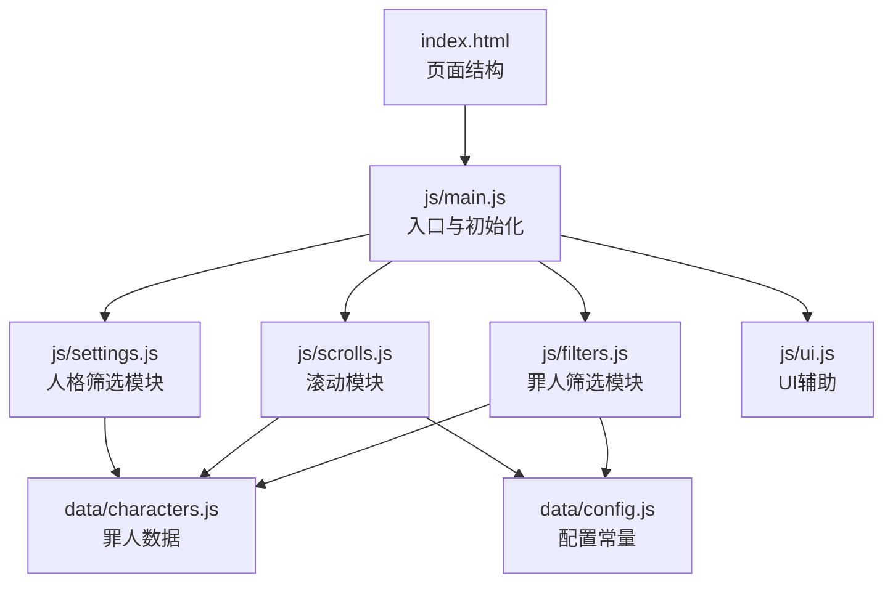
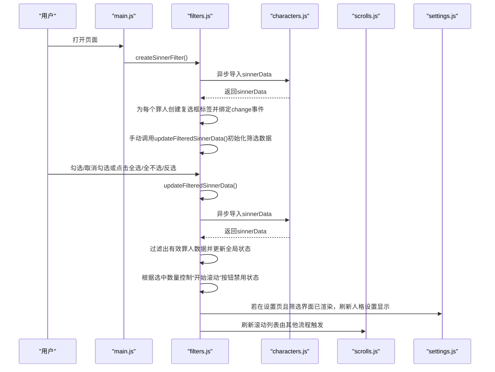
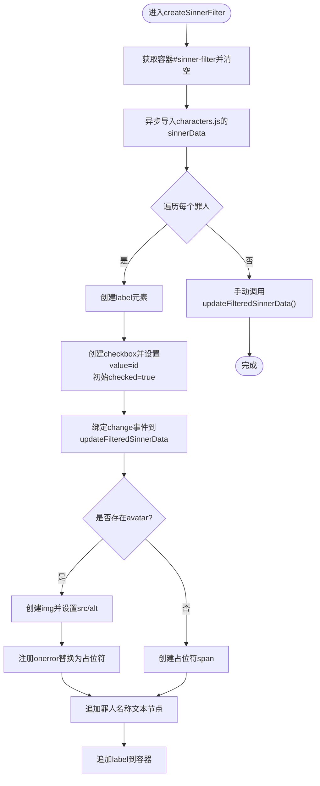
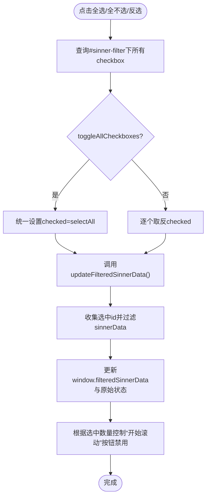
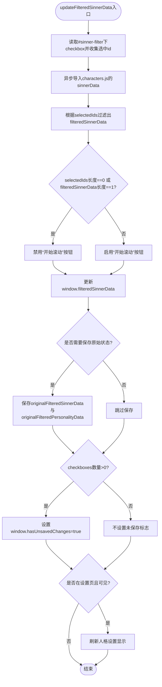
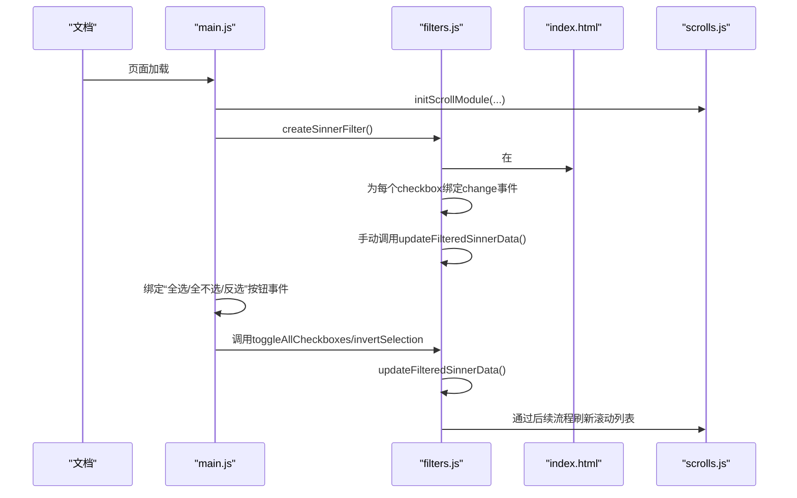
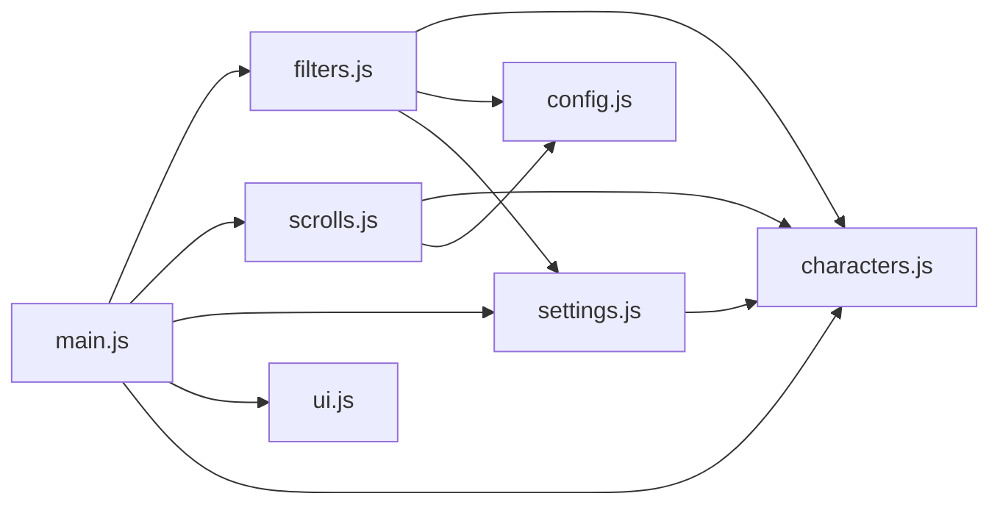

# 罪人筛选

<cite>
**本文引用的文件**
- [filters.js](file://js/filters.js)
- [characters.js](file://data/characters.js)
- [main.js](file://js/main.js)
- [index.html](file://index.html)
- [settings.js](file://js/settings.js)
- [scrolls.js](file://js/scrolls.js)
- [ui.js](file://js/ui.js)
- [config.js](file://data/config.js)
</cite>

## 目录
1. [简介](#简介)
2. [项目结构](#项目结构)
3. [核心组件](#核心组件)
4. [架构总览](#架构总览)
5. [详细组件分析](#详细组件分析)
6. [依赖关系分析](#依赖关系分析)
7. [性能考量](#性能考量)
8. [故障排查指南](#故障排查指南)
9. [结论](#结论)

## 简介
本文件深入解析“罪人筛选”功能的实现机制，围绕 filters.js 模块中的 createSinnerFilter 函数展开，说明如何动态生成罪人筛选复选框列表（含头像、名称与选中状态），并解释全选、全不选与反选操作如何批量更新 DOM 并触发 updateFilteredSinnerData 完成状态更新。同时阐明 updateFilteredSinnerData 如何基于用户选择从 characters.js 中过滤有效罪人数据，更新全局 window.filteredSinnerData，并联动控制“开始滚动”按钮的禁用状态；最后说明 hasUnsavedChanges 标志如何追踪未保存更改，以及筛选界面的初始化流程与事件绑定机制。

## 项目结构
- 罪人数据集中于 data/characters.js，提供罪人 id、名称、头像、颜色与人格列表等信息。
- 筛选界面与交互逻辑集中在 js/filters.js，负责构建筛选复选框、批量操作与状态更新。
- 应用入口与全局状态初始化位于 js/main.js，负责页面导航、按钮事件绑定与滚动模块初始化。
- HTML 结构由 index.html 提供，包含筛选设置页、罪人筛选区域与“开始滚动”按钮等关键节点。
- 人格筛选与设置由 js/settings.js 负责，配合 filters.js 的状态共同影响滚动列表与按钮可用性。
- 滚动模块 js/scrolls.js 负责罪人/人格滚动列表的渲染与按钮状态联动。
- UI 模块 js/ui.js 提供页面切换与按钮事件绑定辅助能力。
- 配置常量 data/config.js 提供滚动与界面参数。

图表来源
- [index.html](file://index.html#L80-L113)
- [main.js](file://js/main.js#L160-L258)
- [filters.js](file://js/filters.js#L16-L57)
- [characters.js](file://data/characters.js#L1-L260)
- [settings.js](file://js/settings.js#L61-L254)
- [scrolls.js](file://js/scrolls.js#L1-L111)
- [ui.js](file://js/ui.js#L1-L66)
- [config.js](file://data/config.js#L1-L29)

章节来源
- [index.html](file://index.html#L80-L113)
- [main.js](file://js/main.js#L160-L258)

## 核心组件
- 罪人筛选模块（filters.js）
  - createSinnerFilter：动态生成筛选复选框列表，包含头像、名称与默认选中状态，绑定 change 事件以触发 updateFilteredSinnerData。
  - updateFilteredSinnerData：根据复选框选中状态过滤罪人数据，更新全局 window.filteredSinnerData，维护原始状态与未保存更改标志，并在设置页时刷新人格设置显示。
  - toggleAllCheckboxes/invertSelection：批量操作复选框并触发状态更新。
  - validateFilterSettings/applyFilters/checkUnsavedChanges：筛选校验、应用与离开确认。
  - refreshScrollsOnReturn：从设置页返回主页面时刷新滚动列表与高亮状态。
- 全局状态与入口（main.js）
  - 初始化 window.filteredSinnerData、window.filteredPersonalityData、window.originalFilteredSinnerData、window.hasUnsavedChanges。
  - 绑定“筛选设置”页面按钮事件，调用 createSinnerFilter 初始化筛选界面。
  - 绑定“全选/全不选/反选”按钮事件，委托给 filters.js。
- 数据源（characters.js）
  - 提供罪人 id、名称、头像、颜色与人格数组，作为筛选与滚动渲染的数据基础。
- 人格筛选模块（settings.js）
  - 维护 window.filteredPersonalityData，提供全局与按罪人粒度的人格筛选批量操作。
- 滚动模块（scrolls.js）
  - 根据 window.filteredSinnerData 渲染罪人滚动列表，联动“开始滚动”按钮可用性。
- UI 模块（ui.js）
  - 提供页面切换与按钮事件绑定辅助方法，补充应用筛选按钮。

章节来源
- [filters.js](file://js/filters.js#L16-L115)
- [main.js](file://js/main.js#L69-L115)
- [characters.js](file://data/characters.js#L1-L260)
- [settings.js](file://js/settings.js#L1-L263)
- [scrolls.js](file://js/scrolls.js#L46-L111)
- [ui.js](file://js/ui.js#L1-L66)

## 架构总览
罪人筛选功能围绕“筛选界面构建—批量操作—状态更新—滚动联动—按钮可用性控制”的闭环展开。核心流程如下：
- 初始化阶段：main.js 在页面加载后调用 Filters.createSinnerFilter，后者异步导入 characters.js 并为每个罪人创建复选框标签，绑定 change 事件。
- 用户交互阶段：用户勾选/取消勾选或使用“全选/全不选/反选”，触发 updateFilteredSinnerData，该函数再次异步导入 characters.js，基于选中 id 过滤出有效罪人数据，更新全局状态并维护原始状态与未保存更改标志。
- 联动控制阶段：updateFilteredSinnerData 根据选中数量控制“开始滚动”按钮的禁用状态；当处于设置页且筛选界面已渲染完成时，刷新人格设置显示。
- 返回主页面阶段：applyFilters 将当前筛选状态保存为原始状态并清除未保存更改标志；refreshScrollsOnReturn 刷新滚动列表与高亮状态。

图表来源
- [main.js](file://js/main.js#L184-L195)
- [filters.js](file://js/filters.js#L16-L57)
- [filters.js](file://js/filters.js#L60-L101)
- [characters.js](file://data/characters.js#L1-L260)
- [settings.js](file://js/settings.js#L61-L100)
- [scrolls.js](file://js/scrolls.js#L46-L111)

## 详细组件分析

### 罪人筛选复选框生成与渲染
- 复选框生成逻辑
  - createSinnerFilter 通过查询 id 为 sinner-filter 的容器，清空其内容后，异步导入 characters.js 的 sinnerData，遍历每个罪人创建 label 元素，内部包含：
    - input[type="checkbox"]：值为罪人 id，初始 checked 为 true，绑定 change 事件至 updateFilteredSinnerData。
    - 头像元素：优先使用 sinner.avatar 作为 img.src；若加载失败则替换为占位符（颜色来自 sinner.color，文本为“?”）。
    - 文本节点：罪人名称。
  - 完成所有标签创建后，手动调用 updateFilteredSinnerData() 初始化筛选数据。
- 头像与占位符
  - 图片加载失败时，通过 onerror 回调将原 img 节点替换为 createAvatarPlaceholder 创建的占位符，保证界面一致性。
- 名称与选中状态
  - 名称直接从 sinner.name 渲染；默认全选（checked=true）以确保初始化时允许转动。

图表来源
- [filters.js](file://js/filters.js#L16-L57)
- [characters.js](file://data/characters.js#L1-L260)

章节来源
- [filters.js](file://js/filters.js#L16-L57)
- [characters.js](file://data/characters.js#L1-L260)

### 全选/全不选/反选批量操作
- 全选/全不选
  - toggleAllCheckboxes 接收布尔参数 selectAll，查询所有 #sinner-filter 下的 checkbox，统一设置 checked 值，随后调用 updateFilteredSinnerData 完成状态更新。
- 反选
  - invertSelection 查询所有 #sinner-filter 下的 checkbox，逐个取反 checked 值，再调用 updateFilteredSinnerData。
- 触发链路
  - 两个函数均通过批量修改 DOM 状态，最终由 updateFilteredSinnerData 统一收集选中 id 并过滤数据，更新全局状态与按钮可用性。

图表来源
- [filters.js](file://js/filters.js#L103-L115)
- [filters.js](file://js/filters.js#L60-L101)

章节来源
- [filters.js](file://js/filters.js#L103-L115)
- [filters.js](file://js/filters.js#L60-L101)

### updateFilteredSinnerData 状态更新与按钮联动
- 数据过滤
  - 读取 #sinner-filter 下所有 checkbox，筛选 checked 为 true 的项，提取其 value（罪人 id）组成 selectedIds。
  - 再次异步导入 characters.js 的 sinnerData，使用 includes 判断过滤出有效罪人数据 filteredSinnerData。
- 按钮禁用控制
  - 获取“开始滚动”按钮，仅当 selectedIds 长度为 0 或 filteredSinnerData 长度为 1 时禁用，否则启用。
- 全局状态维护
  - 更新 window.filteredSinnerData。
  - 若尚未初始化 window.originalFilteredSinnerData 或当前无未保存更改，则同步保存原始状态（连同人格筛选状态）。
  - 仅当 checkboxes 数量大于 0（即筛选界面已渲染）时，标记 window.hasUnsavedChanges 为 true，避免初始化时误判。
- 设置页联动
  - 若当前处于设置页且设置页可见，则异步导入 settings.js 的 createPersonalitySettings 并刷新人格设置显示。
- 与滚动模块的关系
  - 该函数本身不直接刷新滚动列表；但其更新的 window.filteredSinnerData 会被滚动模块在后续流程中使用（例如 main.js 初始化时传入滚动模块的全局状态）。

图表来源
- [filters.js](file://js/filters.js#L60-L101)
- [characters.js](file://data/characters.js#L1-L260)
- [settings.js](file://js/settings.js#L61-L100)

章节来源
- [filters.js](file://js/filters.js#L60-L101)

### 初始化流程与事件绑定
- 页面加载与入口
  - main.js 在 DOMContentLoaded 后执行 init：
    - 初始化滚动模块，传入 DOM 元素与全局状态（包含 window.filteredSinnerData 与 window.filteredPersonalityData）。
    - 调用 Filters.createSinnerFilter 创建筛选界面，并立即初始化筛选数据。
    - 初始化罪人与人格滚动列表。
    - 绑定滚动按钮事件。
    - 绑定筛选控制按钮事件（全选/全不选/反选），委托给 filters.js。
- 筛选界面结构
  - index.html 中的“筛选设置”页包含：
    - 控制区：全选、全不选、反选按钮。
    - 容器：id 为 sinner-filter 的网格容器，用于承载罪人筛选复选框。
    - 应用/重置按钮（由 settings.js 或 ui.js 动态添加）。
- 事件绑定机制
  - main.js 直接绑定“筛选设置”页按钮事件，切换页面并创建人格设置。
  - main.js 通过 import('./filters.js') 获取 Filters 并绑定“全选/全不选/反选”按钮事件。
  - filters.js 的 createSinnerFilter 内部为每个 checkbox 绑定 change 事件，直接调用 updateFilteredSinnerData。

图表来源
- [main.js](file://js/main.js#L160-L258)
- [filters.js](file://js/filters.js#L16-L57)
- [filters.js](file://js/filters.js#L103-L115)
- [index.html](file://index.html#L80-L113)
- [scrolls.js](file://js/scrolls.js#L46-L111)

章节来源
- [main.js](file://js/main.js#L160-L258)
- [index.html](file://index.html#L80-L113)

## 依赖关系分析
- filters.js 依赖
  - data/characters.js：提供罪人数据用于渲染与过滤。
  - data/config.js：提供滚动配置常量（间接影响滚动行为）。
  - js/settings.js：在设置页可见时刷新人格设置显示。
  - js/modal.js：用于弹窗提示与确认（在 filters.js 的校验与离开确认中使用）。
- main.js 依赖
  - js/filters.js：创建筛选界面与批量操作。
  - js/scrolls.js：初始化滚动模块与绑定滚动按钮事件。
  - js/settings.js：创建人格设置界面。
  - js/ui.js：补充应用筛选按钮与页面切换。
  - data/characters.js：初始化全局状态。
- settings.js 依赖
  - data/characters.js：按选中罪人渲染人格设置。
  - main.js 中的全局状态：window.filteredPersonalityData。
- scrolls.js 依赖
  - data/characters.js：滚动列表渲染与高亮。
  - data/config.js：滚动参数。
- index.html
  - 提供筛选界面结构与关键节点（按钮、容器）。

图表来源
- [filters.js](file://js/filters.js#L1-L20)
- [main.js](file://js/main.js#L1-L37)
- [settings.js](file://js/settings.js#L1-L20)
- [scrolls.js](file://js/scrolls.js#L1-L20)
- [config.js](file://data/config.js#L1-L29)
- [characters.js](file://data/characters.js#L1-L20)

章节来源
- [filters.js](file://js/filters.js#L1-L20)
- [main.js](file://js/main.js#L1-L37)
- [settings.js](file://js/settings.js#L1-L20)
- [scrolls.js](file://js/scrolls.js#L1-L20)
- [config.js](file://data/config.js#L1-L29)
- [characters.js](file://data/characters.js#L1-L20)

## 性能考量
- 异步导入数据
  - createSinnerFilter 与 updateFilteredSinnerData 均采用动态 import 导入 characters.js，避免在模块加载时阻塞主线程，提升首屏渲染性能。
- DOM 批量操作
  - toggleAllCheckboxes 与 invertSelection 对所有 checkbox 进行批量设置，减少多次 DOM 查询与重排。
- 事件绑定策略
  - 复选框 change 事件直接绑定到 updateFilteredSinnerData，避免额外中间层，降低事件传播成本。
- 按钮禁用策略
  - updateFilteredSinnerData 在每次变更时即时计算并更新“开始滚动”按钮状态，避免无效滚动尝试带来的资源浪费。
- 滚动模块优化
  - scrolls.js 通过循环复制项目数量实现平滑滚动，避免频繁 DOM 操作；同时根据项目数量动态调整容器高度与按钮可用性。

[本节为通用性能讨论，无需特定文件分析]

## 故障排查指南
- 症状：筛选界面未显示或按钮不可用
  - 检查 index.html 中是否存在 id 为 sinner-filter 的容器与“开始滚动”按钮。
  - 确认 main.js 已在 init 中调用 Filters.createSinnerFilter 并绑定筛选控制按钮事件。
  - 关注 filters.js 的 updateFilteredSinnerData 是否被正确调用（手动初始化与 change 事件）。
- 症状：头像加载失败导致空白
  - 检查 filters.js 中的图片 onerror 替换逻辑是否生效，确认占位符创建与替换流程。
- 症状：应用筛选后按钮仍禁用
  - 检查 updateFilteredSinnerData 中的禁用条件：当 selectedIds 长度为 0 或 filteredSinnerData 长度为 1 时会禁用“开始滚动”按钮。
- 症状：离开设置页提示未保存更改
  - 检查 window.hasUnsavedChanges 标志是否被正确设置（仅在筛选界面渲染完成后才标记为 true）。
- 症状：返回主页面后滚动列表未刷新
  - 确认 filters.js 的 applyFilters 与 refreshScrollsOnReturn 是否被调用，以及 window.filteredSinnerData 是否已更新。

章节来源
- [filters.js](file://js/filters.js#L60-L101)
- [main.js](file://js/main.js#L184-L195)
- [index.html](file://index.html#L80-L113)

## 结论
罪人筛选功能通过 filters.js 的 createSinnerFilter 与 updateFilteredSinnerData 实现了动态构建、批量操作与状态更新的完整闭环。其核心优势在于：
- 使用异步导入与事件驱动更新，保证首屏性能与交互响应。
- 通过 hasUnsavedChanges 与 originalFilteredSinnerData 管理筛选状态的持久化与回滚。
- 与滚动模块和人格筛选模块协同，形成“筛选—滚动—展示”的一体化体验。
- 通过严格的按钮可用性控制与校验流程，确保用户体验的一致性与安全性。