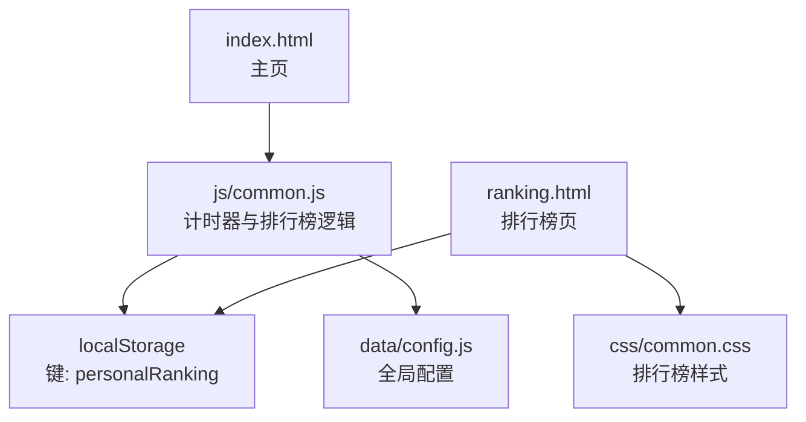
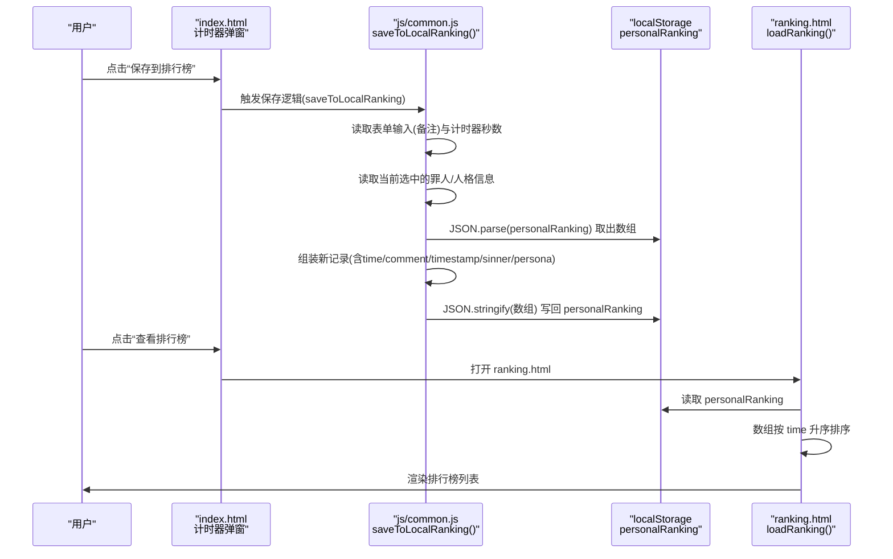
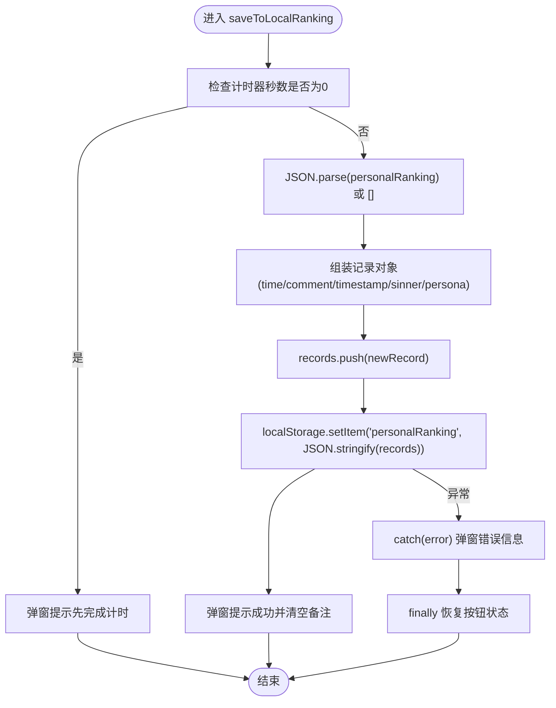
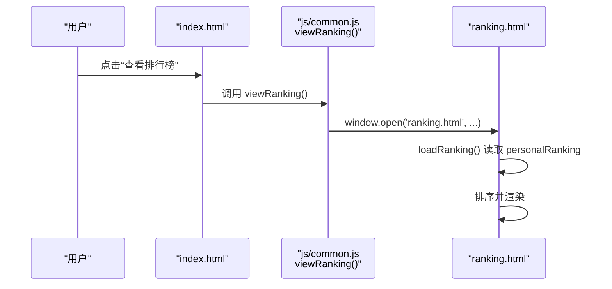
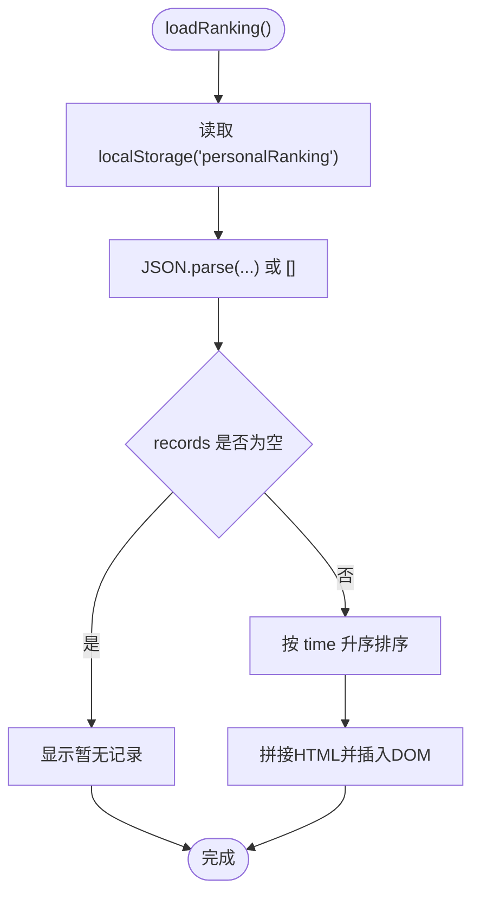
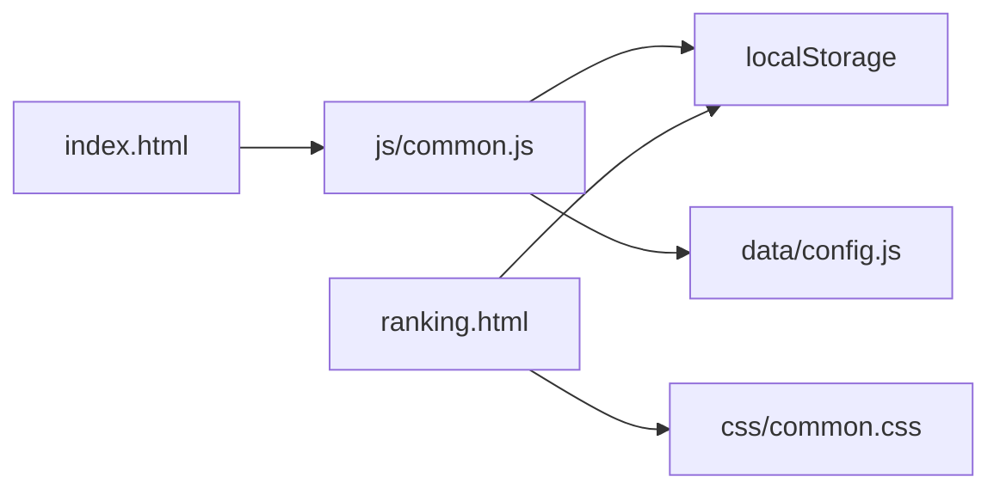

# 排行榜数据管理

<cite>
**本文引用的文件**
- [index.html](file://index.html)
- [js/common.js](file://js/common.js)
- [ranking.html](file://ranking.html)
- [css/common.css](file://css/common.css)
- [data/config.js](file://data/config.js)
</cite>

## 目录
1. [简介](#简介)
2. [项目结构](#项目结构)
3. [核心组件](#核心组件)
4. [架构总览](#架构总览)
5. [详细组件分析](#详细组件分析)
6. [依赖关系分析](#依赖关系分析)
7. [性能考量](#性能考量)
8. [故障排查指南](#故障排查指南)
9. [结论](#结论)

## 简介
本文件围绕“排行榜数据的存储结构设计与管理机制”展开，重点说明：
- 如何利用 localStorage 持久化保存用户的历史计时记录，包括时间值、时间戳和用户备注等字段的组织方式；
- saveToLocalRanking 函数如何从表单获取用户输入，生成记录并写入 localStorage；
- viewRanking 函数如何打开 ranking.html 页面以展示排行榜数据，以及该页面如何读取并渲染 localStorage 中的记录；
- 数据模型的设计原则，如数据格式标准化、时间戳记录和防止重复提交的机制；
- 实际代码示例展示数据序列化与反序列化过程，并说明异常处理策略，如 localStorage 写满或读取失败时的容错方案。

## 项目结构
该项目采用前端单页应用结构，排行榜功能由主页计时器弹窗触发保存，由独立的排名页负责展示与清理。主要涉及以下文件：
- index.html：主页，包含计时器弹窗与“保存到排行榜/查看排行榜”按钮；
- js/common.js：计时器与排行榜逻辑（保存、查看、格式化时间等）；
- ranking.html：排行榜展示页，负责读取 localStorage 并渲染；
- css/common.css：排行榜项样式与交互；
- data/config.js：全局配置常量（与排行榜无直接耦合，但影响滚动与界面行为）。

图表来源
- [index.html](file://index.html#L130-L176)
- [js/common.js](file://js/common.js#L124-L326)
- [ranking.html](file://ranking.html#L1-L94)
- [css/common.css](file://css/common.css#L650-L797)
- [data/config.js](file://data/config.js#L1-L29)

章节来源
- [index.html](file://index.html#L130-L176)
- [js/common.js](file://js/common.js#L124-L326)
- [ranking.html](file://ranking.html#L1-L94)
- [css/common.css](file://css/common.css#L650-L797)
- [data/config.js](file://data/config.js#L1-L29)

## 核心组件
- 主页计时器与排行榜入口：在 index.html 的计时器弹窗中提供“保存到排行榜”和“查看排行榜”两个动作，分别触发保存与跳转。
- 本地存储键位：统一使用 personalRanking 作为 localStorage 的键，值为数组，数组元素为记录对象。
- 排行榜展示页：ranking.html 读取 personalRanking，按时间升序排序并渲染，支持清空与返回主页。

章节来源
- [index.html](file://index.html#L130-L176)
- [js/common.js](file://js/common.js#L159-L217)
- [ranking.html](file://ranking.html#L36-L68)

## 架构总览
下图展示了从用户点击“保存到排行榜”到数据落盘与从“查看排行榜”到页面渲染的关键流程。

图表来源
- [index.html](file://index.html#L130-L176)
- [js/common.js](file://js/common.js#L159-L217)
- [ranking.html](file://ranking.html#L36-L68)

## 详细组件分析

### 数据模型与存储结构
- 存储键位：personalRanking（字符串键），值为数组，数组元素为记录对象。
- 记录对象字段：
  - time：数字，单位秒；
  - comment：字符串，用户备注；
  - timestamp：ISO 字符串，记录保存的时间戳；
  - sinner：对象或 null，包含 name 与 avatar；
  - persona：对象或 null，包含 name 与 avatar。
- 数据格式标准化：
  - 时间统一以秒存储；
  - 时间戳统一以 ISO 字符串存储；
  - 备注为空时允许省略或显示默认文案；
  - 角色信息仅在有效时写入，避免冗余。
- 防重复提交机制：
  - 保存前校验计时器秒数是否为 0，若为 0 则提示用户先完成一次计时；
  - 表单提交被阻止默认行为，改为调用保存逻辑；
  - 保存过程中禁用按钮并恢复文案，避免并发重复提交。

章节来源
- [js/common.js](file://js/common.js#L159-L217)
- [ranking.html](file://ranking.html#L36-L68)

### saveToLocalRanking：从表单获取输入并写入 localStorage
- 输入来源：
  - 计时器秒数：来自计时器状态；
  - 备注：来自表单输入框；
  - 角色信息：来自全局选中状态（currentSelectedSinner/currentSelectedPersona）。
- 写入流程：
  - 读取 personalRanking（默认空数组）；
  - 组装新记录对象；
  - 追加到数组；
  - JSON.stringify 后写回 personalRanking；
  - 成功后弹窗提示并清空备注输入框。
- 异常处理：
  - try/catch 包裹，捕获错误并弹窗提示；
  - finally 恢复按钮状态与文案。

图表来源
- [js/common.js](file://js/common.js#L159-L217)

章节来源
- [js/common.js](file://js/common.js#L159-L217)

### viewRanking：打开 ranking.html 展示排行榜
- 触发方式：点击“查看排行榜”按钮；
- 打开方式：window.open('ranking.html', ...)；
- 页面职责：加载 personalRanking，按时间升序排序，渲染列表项，提供清空与返回主页功能。

图表来源
- [index.html](file://index.html#L161-L176)
- [js/common.js](file://js/common.js#L219-L223)
- [ranking.html](file://ranking.html#L36-L68)

章节来源
- [index.html](file://index.html#L161-L176)
- [js/common.js](file://js/common.js#L219-L223)
- [ranking.html](file://ranking.html#L36-L68)

### ranking.html：读取与渲染 localStorage 记录
- 读取：JSON.parse(localStorage.getItem('personalRanking') || '[]')；
- 排序：按 time 升序；
- 渲染：动态拼接 HTML 片段，包含角色头像、名称、时间、日期与备注；
- 清空：删除 personalRanking 键并重新加载；
- 返回主页：跳转 index.html。

图表来源
- [ranking.html](file://ranking.html#L36-L68)

章节来源
- [ranking.html](file://ranking.html#L36-L68)

### 数据序列化与反序列化
- 反序列化：从 localStorage 读取字符串并 JSON.parse，得到数组；
- 序列化：将数组 JSON.stringify 后写回 localStorage；
- 注意事项：
  - 若 localStorage 中无键，则默认空数组；
  - 若解析失败，应保证不会中断后续流程（当前实现以空数组兜底）。

章节来源
- [js/common.js](file://js/common.js#L174-L200)
- [ranking.html](file://ranking.html#L36-L44)

### 异常处理策略
- 写入失败：
  - try/catch 捕获错误并弹窗提示；
  - finally 恢复按钮状态与文案，避免 UI 锁定；
- 读取失败：
  - JSON.parse 失败时以空数组兜底，避免崩溃；
- 用户体验：
  - 保存中禁用按钮并显示加载文案；
  - 未完成计时禁止保存；
  - 清空记录前二次确认。

章节来源
- [js/common.js](file://js/common.js#L160-L217)
- [ranking.html](file://ranking.html#L70-L77)

## 依赖关系分析
- index.html 依赖 js/common.js 提供的计时器与排行榜逻辑；
- js/common.js 依赖 window 对象的全局状态（currentSelectedSinner/currentSelectedPersona）与 Modal 弹窗模块；
- ranking.html 依赖 localStorage 与 Modal 弹窗模块；
- css/common.css 为排行榜项提供样式支持；
- data/config.js 提供全局配置，与排行榜无直接耦合。

图表来源
- [index.html](file://index.html#L130-L176)
- [js/common.js](file://js/common.js#L124-L326)
- [ranking.html](file://ranking.html#L1-L94)
- [css/common.css](file://css/common.css#L650-L797)
- [data/config.js](file://data/config.js#L1-L29)

章节来源
- [index.html](file://index.html#L130-L176)
- [js/common.js](file://js/common.js#L124-L326)
- [ranking.html](file://ranking.html#L1-L94)
- [css/common.css](file://css/common.css#L650-L797)
- [data/config.js](file://data/config.js#L1-L29)

## 性能考量
- 本地存储读写：
  - 读写均为 O(1)，但数组追加与 JSON 序列化/反序列化在大量记录时可能带来开销；
  - 排序按 time 升序，数组长度增长时排序成本上升，建议在记录较多时考虑分页或限制条数。
- DOM 渲染：
  - 一次性拼接 HTML 并插入，适合中小规模数据；大规模数据建议虚拟滚动或分页。
- UI 交互：
  - 保存中禁用按钮与恢复文案，避免重复提交，提升稳定性。

[本节为通用指导，无需列出具体文件来源]

## 故障排查指南
- 无法保存到排行榜：
  - 检查计时器秒数是否为 0（应先完成一次计时）；
  - 检查 localStorage 是否可用（部分隐私模式或受限环境可能禁用）；
  - 查看控制台错误信息，确认 JSON.parse/JSON.stringify 是否抛错。
- 排行榜为空：
  - 确认 personalRanking 键是否存在且为合法数组；
  - 确认未误删或清空。
- 清空无效：
  - 确认二次确认弹窗是否被拒绝；
  - 确认 localStorage.removeItem 是否执行。
- 样式异常：
  - 检查 css/common.css 中的 .ranking-item、.ranking-time 等样式是否被覆盖。

章节来源
- [js/common.js](file://js/common.js#L160-L217)
- [ranking.html](file://ranking.html#L36-L68)
- [css/common.css](file://css/common.css#L650-L797)

## 结论
本项目通过统一的 personalRanking 键位与标准化的记录对象结构，实现了本地排行榜的可靠存储与展示。保存逻辑在表单层与计时器状态之间建立清晰边界，渲染逻辑在展示页集中处理，配合防重复提交与异常处理，保障了用户体验与数据一致性。对于大规模数据场景，建议在渲染与排序层面引入分页或限制策略，以进一步优化性能与交互流畅度。