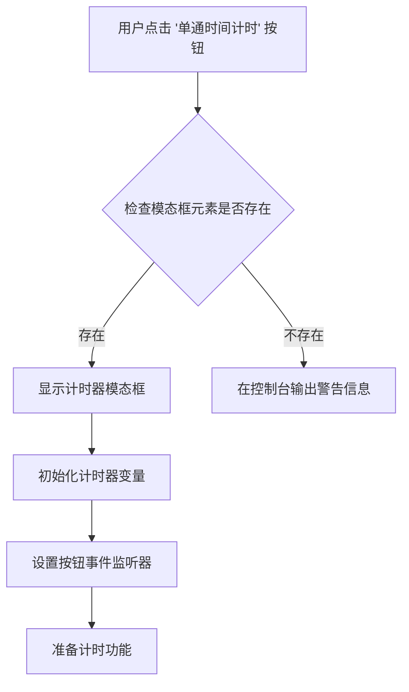
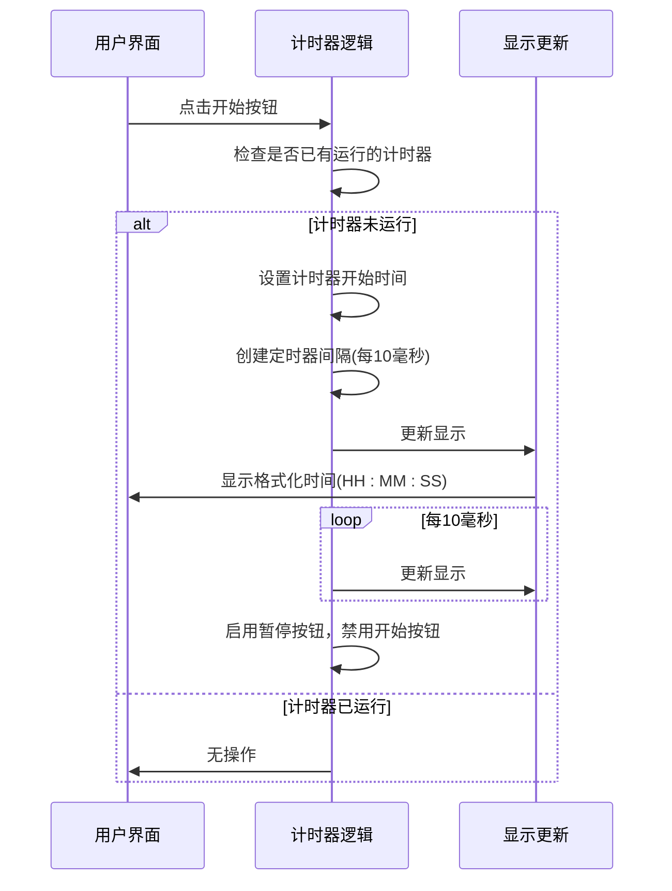
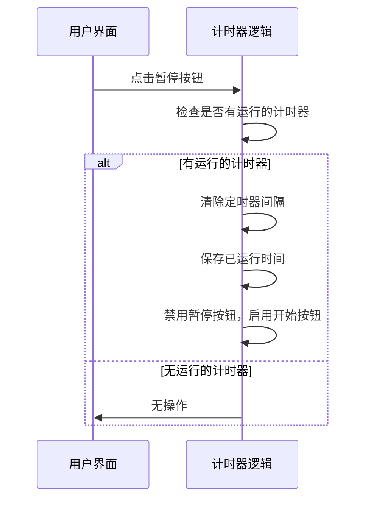
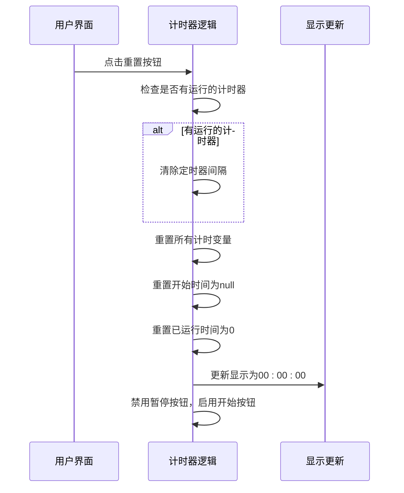
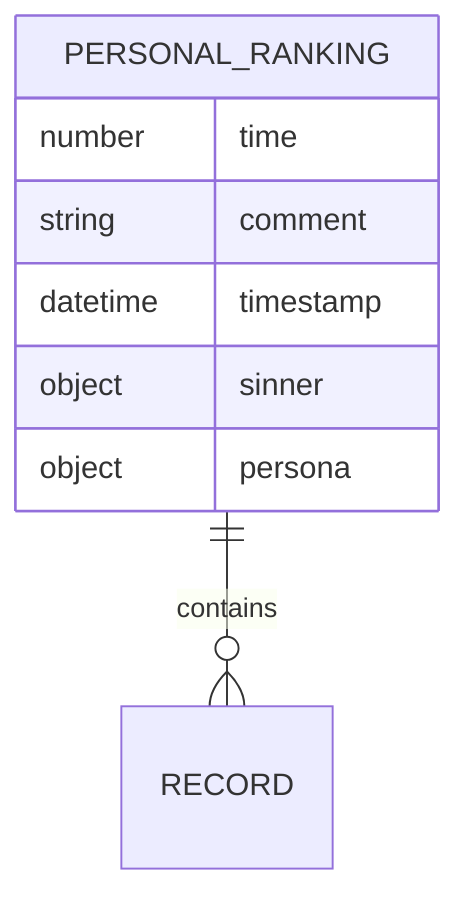
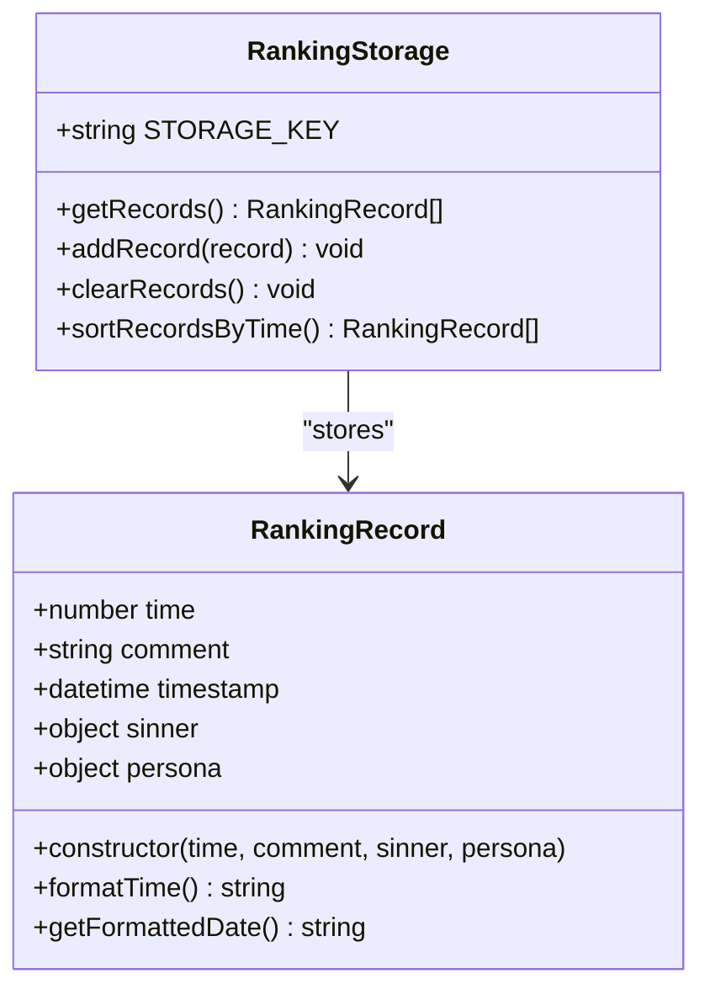
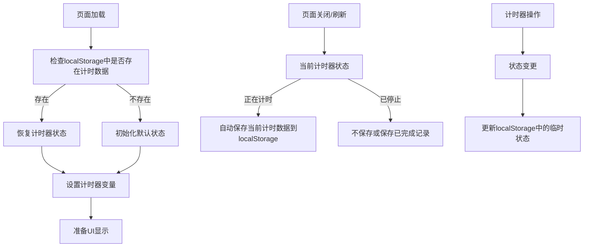
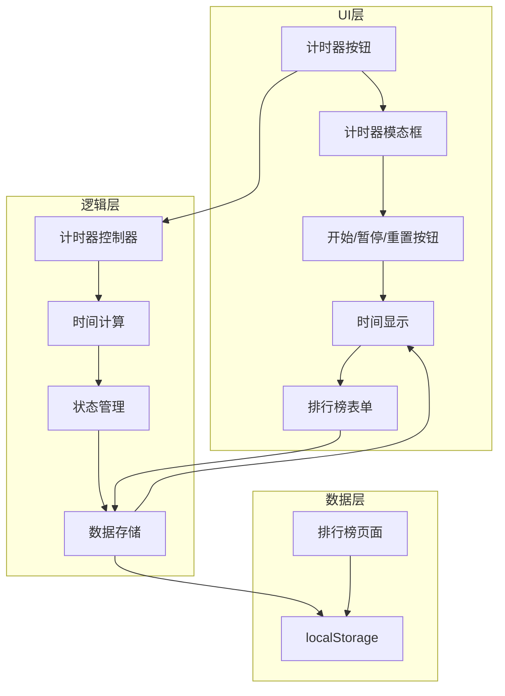

# 计时系统

<cite>
**本文档引用的文件**
- [index.html](file://index.html)
- [js/common.js](file://js/common.js)
- [js/modal.js](file://js/modal.js)
- [ranking.html](file://ranking.html)
- [data/config.js](file://data/config.js)
</cite>

## 目录
1. [简介](#简介)
2. [UI交互与模态框显示](#ui交互与模态框显示)
3. 核心计时函数工作机制
4. 计时数据存储与排行榜设计
5. 计时器状态管理机制
6. 系统集成与用户体验

## 简介
本系统实现了单通时间计时功能，允许用户记录游戏通关时间并保存到排行榜。计时器通过一个模态框界面提供开始、暂停和重置功能，并支持将完成的时间记录与备注信息一起保存到本地存储中。系统还提供了独立的排行榜页面，用于查看历史记录。

## UI交互与模态框显示
单通时间计时功能通过主界面上的"单通时间计时"按钮触发。当用户点击该按钮时，系统会显示一个计时器模态框，提供完整的计时控制界面。

**Diagram sources**
- [index.html](file://index.html#L29-L32)
- [js/common.js](file://js/common.js#L126-L146)

**Section sources**
- [index.html](file://index.html#L29-L32)
- [js/common.js](file://js/common.js#L126-L146)

## 核心计时函数工作机制
计时器的核心功能由`startTimer`、`pauseTimer`和`resetTimer`三个函数实现，它们共同管理计时器的状态和显示。

### startTimer函数
`startTimer`函数负责启动计时器，开始时间计算和显示更新。

**Diagram sources**
- [js/common.js](file://js/common.js#L165-L175)

### pauseTimer函数
`pauseTimer`函数用于暂停正在运行的计时器，保存当前计时状态。

**Diagram sources**
- [js/common.js](file://js/common.js#L177-L184)

### resetTimer函数
`resetTimer`函数将计时器重置到初始状态，清除所有计时数据。

**Diagram sources**
- [js/common.js](file://js/common.js#L186-L200)

**Section sources**
- [js/common.js](file://js/common.js#L165-L200)

## 计时数据存储与排行榜设计
系统使用localStorage实现计时数据的持久化存储，并设计了完整的排行榜数据模型。

### 计时数据存储结构
计时数据采用JSON格式存储在localStorage中，具有清晰的结构设计。

**Diagram sources**
- [js/common.js](file://js/common.js#L202-L231)
- [ranking.html](file://ranking.html#L39-L40)

### 排行榜数据模型
排行榜数据模型包含时间记录、日期戳和备注信息，组织方式如下：

**Diagram sources**
- [js/common.js](file://js/common.js#L202-L231)
- [ranking.html](file://ranking.html#L28-L34)

**Section sources**
- [js/common.js](file://js/common.js#L202-L231)
- [ranking.html](file://ranking.html#L27-L67)

## 计时器状态管理机制
系统实现了完整的计时器状态管理机制，确保在页面刷新和关闭时数据的安全保存。

### 状态管理流程

**Diagram sources**
- [js/common.js](file://js/common.js#L146-L163)
- [js/common.js](file://js/common.js#L202-L231)

### 数据持久化策略
系统采用以下策略确保数据的持久化和一致性：

1. **实时保存**：每次计时器状态变更时，立即更新localStorage
2. **格式化存储**：将时间数据转换为标准格式存储
3. **异常处理**：对localStorage操作进行错误处理
4. **数据验证**：在读取数据时进行格式验证

**Section sources**
- [js/common.js](file://js/common.js#L146-L231)

## 系统集成与用户体验
计时功能与主应用逻辑紧密集成，确保了计时精度和用户体验的一致性。

### 系统集成架构

**Diagram sources**
- [index.html](file://index.html#L133-L170)
- [js/common.js](file://js/common.js#L126-L244)
- [ranking.html](file://ranking.html#L23-L92)

### 用户体验优化
系统通过以下方式优化用户体验：

- **即时反馈**：计时器启动后立即显示变化
- **直观界面**：清晰的按钮标识和时间显示
- **数据持久**：页面刷新后仍保留计时状态
- **错误提示**：使用模态框提供友好的错误信息
- **排行榜集成**：一键保存到排行榜功能

**Section sources**
- [index.html](file://index.html#L133-L170)
- [js/common.js](file://js/common.js#L126-L244)
- [ranking.html](file://ranking.html#L23-L92)