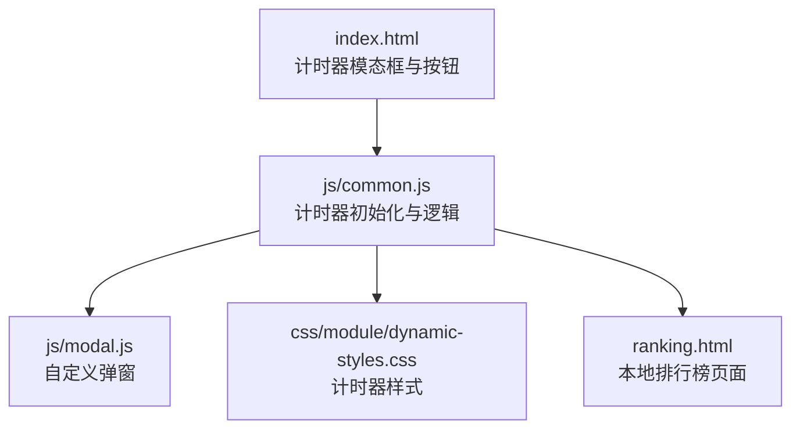
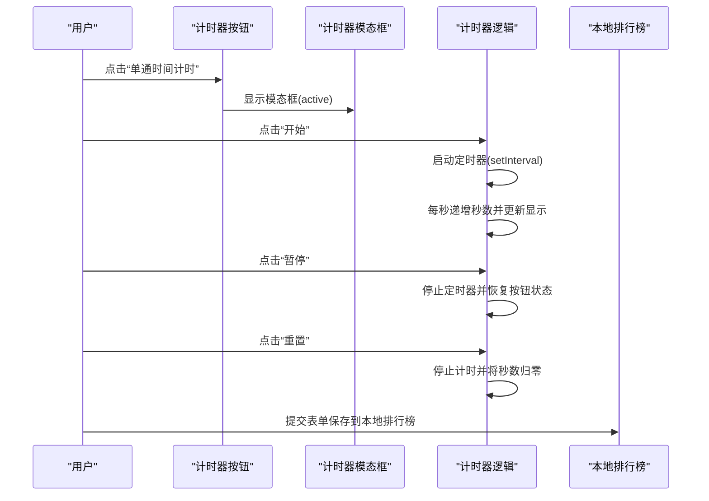
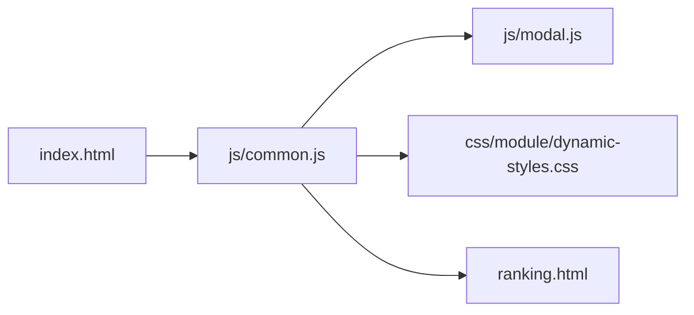

# 计时逻辑

<cite>
**本文引用的文件**
- [index.html](file://index.html)
- [js/common.js](file://js/common.js)
- [js/main.js](file://js/main.js)
- [js/modal.js](file://js/modal.js)
- [ranking.html](file://ranking.html)
- [css/module/dynamic-styles.css](file://css/module/dynamic-styles.css)
</cite>

## 目录
1. [简介](#简介)
2. [项目结构](#项目结构)
3. [核心组件](#核心组件)
4. [架构总览](#架构总览)
5. [详细组件分析](#详细组件分析)
6. [依赖关系分析](#依赖关系分析)
7. [性能考量](#性能考量)
8. [故障排查指南](#故障排查指南)
9. [结论](#结论)

## 简介
本文聚焦于“单通时间计时器”的核心逻辑实现，围绕 startTimer、pauseTimer、resetTimer 三个函数的工作机制展开，解释如何通过每秒递增计时并调用 updateTimerDisplay 更新显示，以及如何通过 isRunning 标志与 timerInterval 句柄控制计时状态。同时结合 index.html 的 UI 结构，说明按钮交互逻辑（开始按钮禁用、暂停按钮启用），并阐述计时器模态框的显示与隐藏机制。最后给出代码片段路径，说明计时逻辑与 DOM 元素的关联方式，并说明页面加载时如何通过 initTimer 初始化整个计时系统。

## 项目结构
计时器功能位于 js/common.js 中，HTML 页面由 index.html 提供，样式由 css/module/dynamic-styles.css 提供，弹窗由 js/modal.js 提供，排行榜页面由 ranking.html 提供。

图表来源
- [index.html](file://index.html#L131-L174)
- [js/common.js](file://js/common.js#L124-L326)
- [js/modal.js](file://js/modal.js#L1-L109)
- [css/module/dynamic-styles.css](file://css/module/dynamic-styles.css#L233-L429)
- [ranking.html](file://ranking.html#L1-L94)

章节来源
- [index.html](file://index.html#L131-L174)
- [js/common.js](file://js/common.js#L124-L326)
- [css/module/dynamic-styles.css](file://css/module/dynamic-styles.css#L233-L429)

## 核心组件
- 计时器初始化与逻辑：在 js/common.js 中定义 initTimer，负责：
  - 绑定计时器模态框显示/隐藏事件
  - 绑定开始、暂停、重置按钮事件
  - 维护计时状态（seconds、isRunning、timerInterval）
  - 每秒递增并更新显示
- 按钮交互逻辑：开始按钮禁用、暂停按钮启用，确保状态切换正确
- 模态框显示/隐藏：通过 active 类控制显示，点击遮罩层关闭
- 排行榜功能：本地存储记录，支持保存与查看

章节来源
- [js/common.js](file://js/common.js#L124-L326)

## 架构总览
计时器系统由 HTML 模板、JS 初始化逻辑、样式与弹窗模块组成，形成“模态框 + 控制按钮 + 计时逻辑 + 排行榜”的闭环。

图表来源
- [index.html](file://index.html#L131-L174)
- [js/common.js](file://js/common.js#L248-L322)
- [ranking.html](file://ranking.html#L36-L68)

## 详细组件分析

### 计时器初始化与状态管理
- 初始化入口：window.addEventListener('DOMContentLoaded', initTimer) 在页面加载完成后执行计时器初始化
- 关键状态：
  - seconds：累计秒数
  - isRunning：计时器运行状态标志
  - timerInterval：setInterval 句柄，用于暂停/重置时清理
- DOM 元素引用：通过 getElementById 获取计时器模态框、显示区域、开始/暂停/重置按钮等

章节来源
- [js/common.js](file://js/common.js#L124-L146)
- [js/common.js](file://js/common.js#L324-L326)

### startTimer：启动计时
- 防重复启动：若 isRunning 为真则直接返回
- 状态切换：isRunning = true；开始按钮禁用；暂停按钮启用
- 定时任务：每秒执行一次，秒数 +1 并更新显示
- 注意：首次调用前会先执行 updateTimerDisplay 初始化显示

章节来源
- [js/common.js](file://js/common.js#L248-L260)

### pauseTimer：暂停计时
- 防重复暂停：若 isRunning 为假则直接返回
- 状态切换：isRunning = false；清理定时器；将 timerInterval 置空
- 按钮状态恢复：开始按钮启用；暂停按钮禁用

章节来源
- [js/common.js](file://js/common.js#L262-L272)

### resetTimer：重置计时
- 行为：先调用 pauseTimer 停止计时
- 重置：seconds = 0；再次调用 updateTimerDisplay 更新显示

章节来源
- [js/common.js](file://js/common.js#L274-L279)

### updateTimerDisplay：更新显示
- 时间格式化：将秒数转换为 HH:MM:SS
- DOM 更新：将格式化后的文本写入计时器显示区域

章节来源
- [js/common.js](file://js/common.js#L234-L246)

### 模态框显示与隐藏
- 显示：showTimerModal 为计时器模态框添加 active 类，并禁止背景滚动
- 隐藏：hideTimerModal 移除 active 类，并恢复背景滚动
- 外部点击：handleModalClick 当点击遮罩层时触发隐藏

章节来源
- [js/common.js](file://js/common.js#L281-L299)

### 按钮交互逻辑与状态切换
- 开始按钮：点击后启动计时，同时禁用自身、启用暂停按钮
- 暂停按钮：点击后停止计时，同时启用开始按钮、禁用自身
- 重置按钮：点击后停止计时并将秒数归零

章节来源
- [js/common.js](file://js/common.js#L253-L272)

### 与 index.html 的 UI 关联
- 计时器模态框：id="timer-modal"，包含标题、关闭按钮、计时显示区与控制按钮
- 控制按钮：id="timer-start-btn"、"timer-pause-btn"、"timer-reset-btn"
- 切换按钮：id="timer-toggle-btn" 用于打开计时器模态框
- 关闭按钮：id="timer-close-btn" 用于关闭计时器模态框

章节来源
- [index.html](file://index.html#L131-L174)

### 页面加载初始化流程
- 页面加载完成后，window.addEventListener('DOMContentLoaded', initTimer) 触发计时器初始化
- initTimer 内部：
  - 引用 DOM 元素
  - 绑定事件监听器（打开/关闭模态框、开始/暂停/重置按钮）
  - 绑定排行榜表单提交事件
  - 调用 updateTimerDisplay 初始化显示

章节来源
- [js/common.js](file://js/common.js#L324-L326)
- [js/common.js](file://js/common.js#L300-L322)

### 排行榜功能（本地存储）
- 保存到本地：saveToLocalRanking 将当前计时记录与选中角色信息写入 localStorage
- 查看排行榜：viewRanking 打开 ranking.html 页面
- 表单提交：阻止默认提交，调用保存逻辑

章节来源
- [js/common.js](file://js/common.js#L159-L217)
- [js/common.js](file://js/common.js#L219-L224)
- [js/common.js](file://js/common.js#L309-L318)
- [ranking.html](file://ranking.html#L36-L68)

### 与弹窗模块的协作
- 通过 import('./modal.js') 将 Modal 注册为全局 window.Modal
- 在保存失败或提示时使用 window.Modal.alert 显示提示

章节来源
- [js/common.js](file://js/common.js#L1-L10)
- [js/modal.js](file://js/modal.js#L74-L103)

## 依赖关系分析
- js/common.js 依赖：
  - DOM 元素（index.html）
  - 弹窗模块 js/modal.js
  - 样式 css/module/dynamic-styles.css
  - 排行榜页面 ranking.html
- index.html 依赖：
  - js/common.js（计时器初始化）
  - 样式文件（计时器样式）

图表来源
- [index.html](file://index.html#L131-L174)
- [js/common.js](file://js/common.js#L124-L326)
- [js/modal.js](file://js/modal.js#L1-L109)
- [css/module/dynamic-styles.css](file://css/module/dynamic-styles.css#L233-L429)
- [ranking.html](file://ranking.html#L1-L94)

## 性能考量
- 定时器粒度：每秒触发一次，开销极小
- 状态切换：通过 isRunning 与 timerInterval 句柄避免重复启动与泄漏
- DOM 更新：仅更新计时显示区域，避免不必要的重排重绘
- 模态框：通过 active 类控制显示，减少复杂动画开销

## 故障排查指南
- 按钮状态异常
  - 症状：开始/暂停按钮无法切换
  - 排查：确认 isRunning 状态与按钮 disabled 属性是否一致
  - 参考路径：[startTimer/pauseTimer](file://js/common.js#L248-L272)
- 计时器不更新
  - 症状：点击开始后计时器不递增
  - 排查：确认 timerInterval 是否被正确赋值与清理；检查 updateTimerDisplay 是否被调用
  - 参考路径：[startTimer/updateTimerDisplay](file://js/common.js#L248-L260)
- 模态框无法关闭
  - 症状：点击遮罩层不关闭
  - 排查：确认 handleModalClick 是否绑定；active 类是否正确切换
  - 参考路径：[handleModalClick](file://js/common.js#L293-L299)
- 排行榜保存失败
  - 症状：保存时报错或无提示
  - 排查：确认 seconds 是否为 0；检查 localStorage 可用性；查看弹窗提示
  - 参考路径：[saveToLocalRanking](file://js/common.js#L159-L217)

章节来源
- [js/common.js](file://js/common.js#L159-L217)
- [js/common.js](file://js/common.js#L248-L272)
- [js/common.js](file://js/common.js#L293-L299)

## 结论
计时器系统通过简洁的状态标志与定时器句柄实现了稳定的计时逻辑，配合模态框与按钮交互，提供了良好的用户体验。startTimer、pauseTimer、resetTimer 三者职责清晰，状态切换正确，且与 DOM 元素紧密耦合。结合本地排行榜功能，形成了从计时到记录的完整闭环。建议在后续迭代中进一步封装计时器状态机，提升可测试性与可维护性。