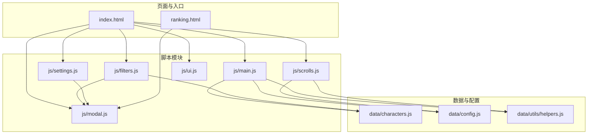
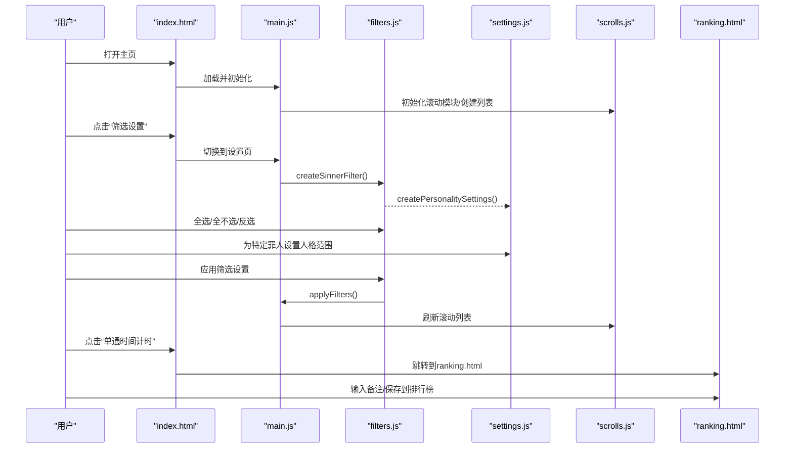
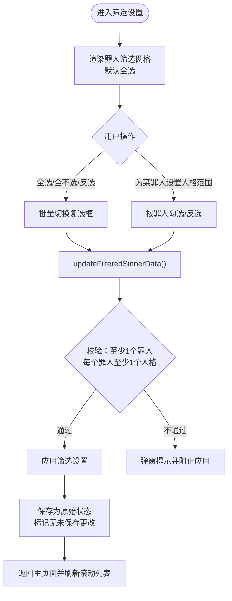
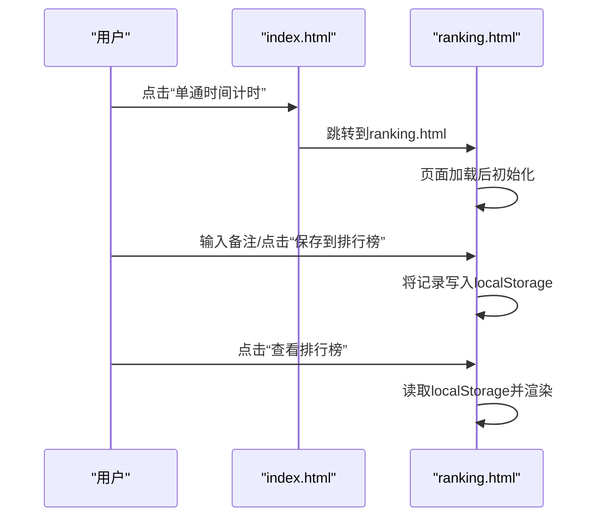
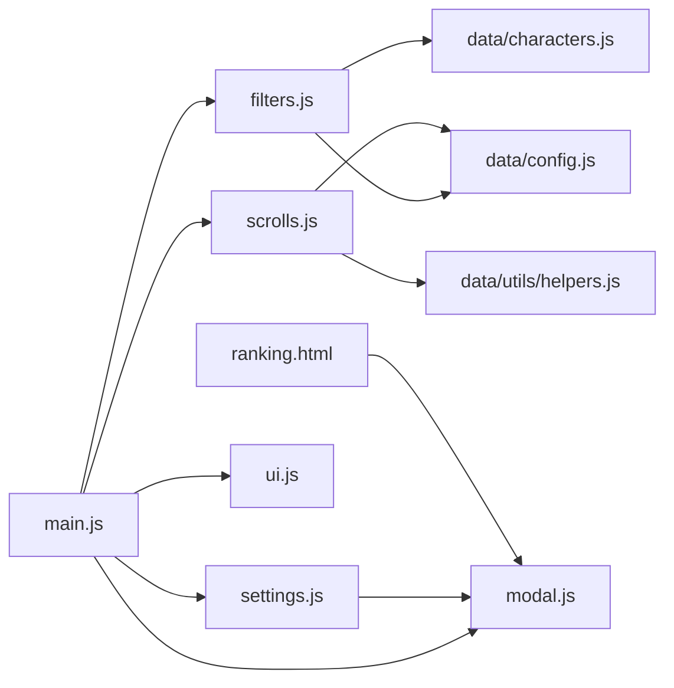

# 高级功能

<cite>
**本文引用的文件**
- [index.html](file://index.html)
- [ranking.html](file://ranking.html)
- [js/main.js](file://js/main.js)
- [js/filters.js](file://js/filters.js)
- [js/settings.js](file://js/settings.js)
- [js/scrolls.js](file://js/scrolls.js)
- [js/modal.js](file://js/modal.js)
- [js/ui.js](file://js/ui.js)
- [data/characters.js](file://data/characters.js)
- [data/config.js](file://data/config.js)
- [data/utils/helpers.js](file://data/utils/helpers.js)
</cite>

## 目录
1. [简介](#简介)
2. [项目结构](#项目结构)
3. [核心组件](#核心组件)
4. [架构总览](#架构总览)
5. [详细组件分析](#详细组件分析)
6. [依赖关系分析](#依赖关系分析)
7. [性能考量](#性能考量)
8. [故障排查指南](#故障排查指南)
9. [结论](#结论)
10. [附录](#附录)

## 简介
本章节面向希望深度使用本应用高级功能的用户与维护者，系统讲解“筛选设置”页面的自定义罪人选池能力、单通时间计时器的交互流程、排行榜记录与备注、以及筛选状态的持久化机制。内容基于仓库源码进行逐层解析，帮助读者理解各模块职责、数据流向与控制逻辑。

## 项目结构
应用采用模块化组织，HTML负责页面骨架与交互入口，JS模块分别承担主流程、筛选、滚动、设置、弹窗与UI管理，数据模块提供角色与配置常量，工具模块提供安全随机数等通用能力。

图表来源
- [index.html](file://index.html#L1-L176)
- [ranking.html](file://ranking.html#L1-L94)
- [js/main.js](file://js/main.js#L1-L261)
- [js/filters.js](file://js/filters.js#L1-L274)
- [js/settings.js](file://js/settings.js#L1-L263)
- [js/scrolls.js](file://js/scrolls.js#L1-L718)
- [js/modal.js](file://js/modal.js#L1-L109)
- [js/ui.js](file://js/ui.js#L1-L66)
- [data/characters.js](file://data/characters.js#L1-L260)
- [data/config.js](file://data/config.js#L1-L29)
- [data/utils/helpers.js](file://data/utils/helpers.js#L1-L45)

章节来源
- [index.html](file://index.html#L1-L176)
- [js/main.js](file://js/main.js#L1-L261)

## 核心组件
- 筛选模块（filters.js）：负责罪人筛选复选框渲染、全选/全不选/反选、筛选校验、应用与重置、返回主页面时的滚动列表刷新与状态同步。
- 设置模块（settings.js）：负责“人格整体筛选设置”的界面生成、全局与按罪人粒度的人格全选/全不选/反选、按罪人分页展示与筛选状态持久化。
- 滚动模块（scrolls.js）：负责罪人与人格滚动列表的创建、开始/停止滚动、定位居中、高亮、以及与筛选状态联动。
- 主模块（main.js）：负责页面导航、事件绑定、滚动模块初始化、筛选状态的全局窗口变量管理、返回主页面时的刷新与确认。
- 弹窗模块（modal.js）：统一的自定义弹窗，替代浏览器原生 alert/confirm，提供异步确认与提示。
- UI模块（ui.js）：负责页面导航切换、按钮事件绑定、应用筛选按钮的动态添加。
- 数据与配置（data/characters.js、data/config.js、data/utils/helpers.js）：提供角色数据、配置常量与安全随机数工具。

章节来源
- [js/filters.js](file://js/filters.js#L1-L274)
- [js/settings.js](file://js/settings.js#L1-L263)
- [js/scrolls.js](file://js/scrolls.js#L1-L718)
- [js/main.js](file://js/main.js#L1-L261)
- [js/modal.js](file://js/modal.js#L1-L109)
- [js/ui.js](file://js/ui.js#L1-L66)
- [data/characters.js](file://data/characters.js#L1-L260)
- [data/config.js](file://data/config.js#L1-L29)
- [data/utils/helpers.js](file://data/utils/helpers.js#L1-L45)

## 架构总览
下图展示了“筛选设置”与“主选择器”两大页面之间的交互，以及计时器与排行榜的跳转路径。

图表来源
- [index.html](file://index.html#L1-L176)
- [js/main.js](file://js/main.js#L1-L261)
- [js/filters.js](file://js/filters.js#L1-L274)
- [js/settings.js](file://js/settings.js#L1-L263)
- [js/scrolls.js](file://js/scrolls.js#L1-L718)
- [ranking.html](file://ranking.html#L1-L94)

## 详细组件分析

### 筛选设置：自定义罪人选池与人格范围
- 罪人选池自定义
  - 页面入口：在“筛选设置”页，罪人筛选网格由筛选模块动态创建，初始默认全选。
  - 全选/全不选/反选：通过筛选模块提供的接口批量修改复选框状态并触发筛选数据更新。
  - 筛选校验：应用前会校验至少选择一个罪人；且每个罪人至少选择一个人格（“未显式设置”视为默认全选）。
- 人格整体筛选
  - 全局控制：提供“全选所有人格”“取消所有人格”“反选所有人格”，作用于当前选中的罪人集合。
  - 按罪人控制：每页罪人卡片提供“全选/全不选/反选”，仅影响当前罪人的人格集合。
  - 分页展示：按罪人分页，支持点击页签切换。
- 控制逻辑与状态
  - 筛选状态存储于全局窗口对象，便于跨模块共享与持久化。
  - 应用筛选后，将当前状态保存为“原始状态”，并标记“无未保存更改”。

图表来源
- [js/filters.js](file://js/filters.js#L1-L274)
- [js/settings.js](file://js/settings.js#L1-L263)
- [js/main.js](file://js/main.js#L1-L261)

章节来源
- [js/filters.js](file://js/filters.js#L1-L274)
- [js/settings.js](file://js/settings.js#L1-L263)
- [js/main.js](file://js/main.js#L1-L261)

### 人格整体筛选的控制逻辑
- 全局全选/全不选/反选：遍历“人格设置容器”内的所有复选框，批量设置并触发 change 事件以更新内部状态。
- 按罪人全选/反选：根据数据属性定位到当前罪人的复选框集合，批量设置并触发 change。
- 状态持久化：每个罪人的筛选状态以索引为键存储在全局窗口对象中，未设置时默认视为“选中”（与滚动模块的过滤逻辑保持一致）。

章节来源
- [js/settings.js](file://js/settings.js#L1-L263)
- [js/scrolls.js](file://js/scrolls.js#L1-L718)

### 单通时间计时功能
- 打开计时器：在主页点击“单通时间计时”按钮，页面跳转到 ranking.html。
- 计时器界面：包含计时显示、开始/暂停/重置按钮、备注输入框、保存到排行榜与查看排行榜按钮。
- 保存到排行榜：
  - 提交表单后，将时间、选中罪人/人格、备注、时间戳等信息写入本地存储。
  - 本地存储键名用于记录历史记录。
- 查看排行榜：点击“查看排行榜”按钮，跳转至 ranking.html 页面，页面加载后读取本地存储并渲染历史记录。

图表来源
- [index.html](file://index.html#L1-L176)
- [ranking.html](file://ranking.html#L1-L94)

章节来源
- [index.html](file://index.html#L1-L176)
- [ranking.html](file://ranking.html#L1-L94)

### 排行榜页面与备注
- 排行榜加载：页面加载时从本地存储读取记录，按时间升序排序并渲染。
- 备注展示：记录中包含可选备注，若无则显示“无备注”。
- 清空记录：通过弹窗确认后清空本地存储并重新渲染。
- 返回主页：提供返回按钮跳转至主页。

章节来源
- [ranking.html](file://ranking.html#L1-L94)
- [js/modal.js](file://js/modal.js#L1-L109)

### 筛选状态的持久化机制
- 全局状态：筛选模块与主模块在 window 对象上维护以下关键状态：
  - filteredSinnerData：当前筛选后的罪人集合
  - filteredPersonalityData：按罪人索引存储的人格筛选布尔映射（未设置时默认为选中）
  - originalFilteredSinnerData/originalFilteredPersonalityData：原始筛选状态快照
  - hasUnsavedChanges：是否存在未保存更改
- 应用与重置：
  - 应用筛选：校验通过后将当前状态复制到原始状态，清除未保存标记，并刷新主页面滚动列表。
  - 重置筛选：弹窗确认后恢复到原始状态，重新渲染人格设置界面与罪人复选框。
- 页面切换与返回：
  - 从设置页返回主页面时，若存在未保存更改，弹窗询问是否保存后再返回；保存后刷新滚动列表并同步当前选中状态。

章节来源
- [js/main.js](file://js/main.js#L1-L261)
- [js/filters.js](file://js/filters.js#L1-L274)

## 依赖关系分析
- 模块耦合
  - main.js 作为中枢，导入 filters.js、settings.js、scrolls.js、modal.js、ui.js，并向这些模块注入 DOM 与全局状态。
  - filters.js 依赖 data/characters.js 与 data/config.js，依赖 modal.js 提示与确认。
  - settings.js 依赖 filters.js 的全局状态，负责生成人格设置界面与批量操作。
  - scrolls.js 依赖 data/config.js 与 data/utils/helpers.js，负责滚动动画与随机选择。
  - ranking.html 依赖 js/modal.js（通过模块导入）与本地存储。
- 外部依赖
  - HTML 页面引入 Font Awesome 图标库用于界面图标。
  - 本地存储用于排行榜与筛选状态持久化。

图表来源
- [js/main.js](file://js/main.js#L1-L261)
- [js/filters.js](file://js/filters.js#L1-L274)
- [js/settings.js](file://js/settings.js#L1-L263)
- [js/scrolls.js](file://js/scrolls.js#L1-L718)
- [js/modal.js](file://js/modal.js#L1-L109)
- [js/ui.js](file://js/ui.js#L1-L66)
- [data/characters.js](file://data/characters.js#L1-L260)
- [data/config.js](file://data/config.js#L1-L29)
- [data/utils/helpers.js](file://data/utils/helpers.js#L1-L45)
- [ranking.html](file://ranking.html#L1-L94)

章节来源
- [js/main.js](file://js/main.js#L1-L261)
- [js/filters.js](file://js/filters.js#L1-L274)
- [js/settings.js](file://js/settings.js#L1-L263)
- [js/scrolls.js](file://js/scrolls.js#L1-L718)
- [js/modal.js](file://js/modal.js#L1-L109)
- [js/ui.js](file://js/ui.js#L1-L66)
- [ranking.html](file://ranking.html#L1-L94)

## 性能考量
- 滚动性能
  - 滚动列表通过大量重复项实现平滑循环，避免频繁 DOM 操作；使用 CSS 过渡与固定间隔定时器控制滚动节奏。
  - 安全随机数使用浏览器原生随机接口，降级到 Math.random，保证公平性与性能平衡。
- 筛选与渲染
  - 筛选状态变更后仅在必要时触发渲染与滚动列表刷新，避免重复计算。
  - 人格设置界面按罪人分页，减少一次性渲染压力。
- 本地存储
  - 排行榜数据使用本地存储，读写简单高效；页面加载时一次性解析与排序，避免频繁 IO。

[本节为通用性能讨论，无需列出具体文件来源]

## 故障排查指南
- “应用筛选设置”后无法开始滚动
  - 检查是否至少选择一个罪人，且每个罪人至少选择一个人格。
  - 若罪人数量为 1，主页面会自动选中该罪人并重置人格滚动状态，请确认人格列表已正确生成。
- 人格筛选无效
  - 确认“人格整体筛选设置”中已为相应罪人勾选了目标人格；未显式设置的人格默认视为选中。
- 页面切换提示与返回
  - 若存在未保存更改，返回主页面会弹窗提示；选择“保存并返回”可应用更改并刷新列表。
- 计时器与排行榜
  - 保存到排行榜后可在“查看排行榜”中查看；若无记录，页面会提示暂无记录。
  - 清空记录需二次确认，注意此操作不可恢复。

章节来源
- [js/filters.js](file://js/filters.js#L1-L274)
- [js/scrolls.js](file://js/scrolls.js#L1-L718)
- [js/main.js](file://js/main.js#L1-L261)
- [ranking.html](file://ranking.html#L1-L94)

## 结论
本应用通过模块化的 JS 架构实现了灵活的筛选与滚动体验，并以本地存储与弹窗模块保障了良好的交互与数据持久化。用户可通过“筛选设置”精细化控制罪人选池与人格范围，借助“单通时间计时”记录与分享成绩，最终在“排行榜”中回顾历史表现。建议在日常使用中充分利用全选/全不选/反选与按罪人粒度的人格筛选，以提升效率与个性化体验。

[本节为总结性内容，无需列出具体文件来源]

## 附录
- 关键术语
  - 罪人选池：经过筛选后参与随机选择的罪人集合。
  - 人格筛选：针对特定罪人的人格可选范围，未显式设置时默认全选。
  - 未保存更改：用户在设置页修改筛选但尚未应用的状态。
- 常见问题
  - 如何快速清空筛选？在“筛选设置”页使用“全不选”后应用即可。
  - 如何为多个罪人批量设置人格范围？使用“全局全选/全不选/反选”，再针对个别罪人进行微调。
  - 如何导出/备份排行榜？当前实现依赖本地存储，无法直接导出；可在浏览器开发者工具中查看与复制。

[本节为补充说明，无需列出具体文件来源]