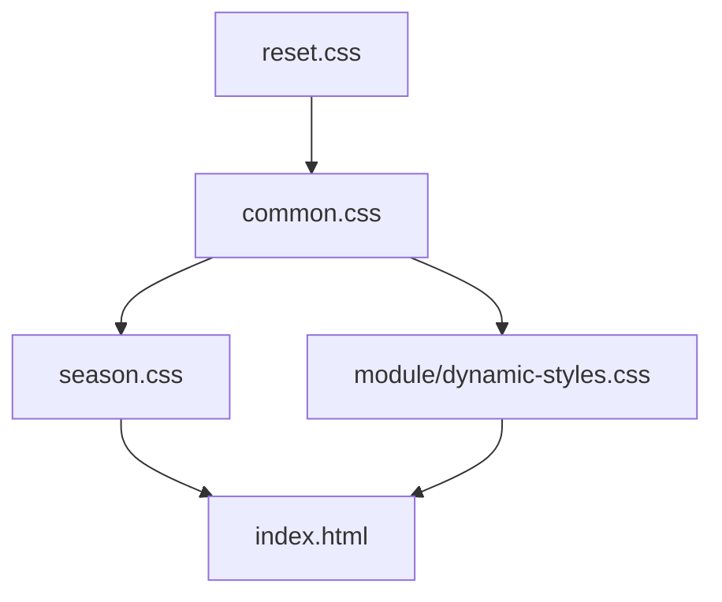

# 目录结构说明

<cite>
**本文档引用的文件**  
- [README.md](file://README.md)
- [index.html](file://index.html)
- [ranking.html](file://ranking.html)
- [package.json](file://package.json)
- [css/reset.css](file://css/reset.css)
- [css/common.css](file://css/common.css)
- [css/season.css](file://css/season.css)
- [css/module/dynamic-styles.css](file://css/module/dynamic-styles.css)
- [data/characters.js](file://data/characters.js)
- [data/config.js](file://data/config.js)
- [data/utils/helpers.js](file://data/utils/helpers.js)
- [js/main.js](file://js/main.js)
- [js/filters.js](file://js/filters.js)
- [js/scrolls.js](file://js/scrolls.js)
- [js/settings.js](file://js/settings.js)
- [js/ui.js](file://js/ui.js)
- [js/modal.js](file://js/modal.js)
</cite>

## 目录结构说明
1. [项目结构概览](#项目结构概览)
2. [CSS模块分析](#css模块分析)
3. [数据模块分析](#数据模块分析)
4. [JavaScript模块分析](#javascript模块分析)
5. [根目录文件说明](#根目录文件说明)
6. [资源文件说明](#资源文件说明)

## 项目结构概览

本项目采用模块化设计，文件组织结构清晰，主要分为 `css/`、`data/`、`js/` 和根目录四大模块。项目旨在为《边狱公司》玩家提供一个罪人和人格的随机选择器，帮助玩家决定游戏时长和角色搭配。

项目结构如下：
```
.
├── css/               # 样式文件
│   ├── module/        # 模块化样式文件
│   ├── common.css     # 通用样式
│   ├── reset.css      # 重置样式
│   └── season.css     # 季节性样式
├── data/              # 数据和工具模块
│   ├── utils/
│   │   └── helpers.js # 工具函数
│   ├── characters.js  # 罪人数据
│   └── config.js      # 配置常量
├── js/                # JavaScript模块
│   ├── common.js      # 通用功能
│   ├── main.js        # 主应用逻辑
│   ├── filters.js     # 筛选功能模块
│   ├── scrolls.js     # 滚动列表功能模块
│   ├── settings.js    # 设置功能模块
│   ├── ui.js          # UI功能模块
│   └── modal.js       # 弹窗系统模块
├── assets/            # 资源文件（图片、字体等）
├── .gitignore
├── README.md
├── index.html         # 主页面
├── ranking.html       # 个人排行榜页面
├── package.json       # 项目配置文件
└── ...
```

**Section sources**
- [README.md](file://README.md#L15-L45)
- [index.html](file://index.html#L7-L10)

## CSS模块分析

### 样式分层设计原则

项目采用样式分层设计原则，将CSS文件按功能和作用域进行划分，确保样式管理的清晰性和可维护性。这种分层设计遵循了"重置 -> 通用 -> 特定"的层级结构。



**Diagram sources**
- [css/reset.css](file://css/reset.css#L1-L6)
- [css/common.css](file://css/common.css#L1-L794)
- [css/season.css](file://css/season.css#L1-L38)
- [css/module/dynamic-styles.css](file://css/module/dynamic-styles.css#L1-L800)
- [index.html](file://index.html#L7-L10)

### reset.css

`reset.css` 文件负责浏览器默认样式的重置，为整个项目提供一致的样式基础。它通过设置通用的 `margin`、`padding` 和 `box-sizing` 属性，消除不同浏览器间的默认样式差异。

该文件的主要作用包括：
- 统一所有元素的外边距和内边距为0
- 设置 `box-sizing: border-box`，使元素的宽度和高度计算包含边框和内边距
- 为后续样式的应用提供干净、一致的基础环境

**Section sources**
- [css/reset.css](file://css/reset.css#L1-L6)

### common.css

`common.css` 文件包含项目的全局通用样式，定义了应用的整体视觉风格和布局规范。它包含了颜色方案、字体设置、布局结构、按钮样式、表单元素等基础UI组件的样式定义。

该文件的主要职责包括：
- 定义全局字体、颜色和背景样式
- 设置容器、标题、段落等基本元素的样式
- 提供按钮、表单控件等交互元素的统一外观
- 实现响应式设计，确保在不同设备上的良好显示效果

**Section sources**
- [css/common.css](file://css/common.css#L1-L794)

### season.css

`season.css` 文件专门用于实现第七赛季的动画效果，特别是标题文字的发光和闪烁效果。它通过CSS动画和关键帧（`@keyframes`）来创建动态的视觉效果，增强用户界面的吸引力。

该文件的主要特点包括：
- 引入Lora字体，为标题提供特定的字体风格
- 定义 `.season-text` 类，设置文字颜色、粗细和字体
- 使用 `@keyframes glow-in` 创建文字的渐显和发光动画
- 通过 `animation` 属性将动画应用到特定元素上

**Section sources**
- [css/season.css](file://css/season.css#L1-L38)

### module/目录

`module/` 目录包含模块化的样式文件，主要用于动态生成和管理特定功能模块的样式。`dynamic-styles.css` 文件包含了筛选头像、人格卡片、分页按钮等组件的样式定义。

该目录的主要作用包括：
- 提供筛选界面中罪人和人格头像的样式
- 定义人格设置卡片的布局和外观
- 实现分页控件的样式和交互效果
- 包含计时器弹窗等特定功能模块的样式

**Section sources**
- [css/module/dynamic-styles.css](file://css/module/dynamic-styles.css#L1-L800)

## 数据模块分析

### characters.js

`characters.js` 文件负责管理罪人和人格的数据，是整个应用的核心数据源。它导出了一个包含12名罪人信息的数组，每名罪人都有其独特的ID、名称、颜色和人格列表。

该文件的主要结构和职责包括：
- 定义 `sinnerData` 数组，包含所有罪人的基本信息
- 每个罪人对象包含 `id`、`name`、`avatar`（头像路径）和 `color`（代表色）
- 每个罪人拥有一个 `personalities` 数组，包含其所有可选人格
- 每个人格对象包含 `name`（人格名称）和 `avatar`（人格头像路径）

数据结构示例：
```javascript
{
    id: 1,
    name: "李箱 (Yi Sang)",
    avatar: "assets/images/Yi_Sang/Yi_Sang-LCB.jpg",
    color: '#9370DB',
    personalities: [
        { name: "W公司3级清扫人员", avatar: "assets/images/Yi_Sang/Yi_Sang-W3.webp" },
        // ... 其他人格
    ]
}
```

**Section sources**
- [data/characters.js](file://data/characters.js#L1-L260)

### config.js

`config.js` 文件集中管理应用的配置常量，将硬编码的值提取到一个统一的配置对象中，提高了代码的可维护性和可扩展性。它导出了一个名为 `Config` 的常量对象，包含多个配置项。

该文件的主要配置项包括：
- **项目配置**：`itemHeight`（项目高度）、`minVisibleRows`（最小可见行数）、`maxVisibleRows`（最大可见行数）
- **滚动配置**：`scrollSpeed`（滚动速度）、`scrollInterval`（滚动间隔时间）、`transitionDuration`（过渡时长）、`transitionType`（过渡类型）
- **界面配置**：`defaultPage`（默认页面）
- **动画配置**：`highlightAnimationDuration`（高亮动画时长）
- **数据配置**：`defaultFilterAll`（默认是否全选）
- **消息配置**：`errorMessages`（错误消息，如未选择人格时的提示）

**Section sources**
- [data/config.js](file://data/config.js#L1-L29)

### utils/helpers.js

`utils/helpers.js` 文件包含一系列工具函数，为应用提供通用的功能支持。这些函数被多个模块共享使用，避免了代码重复。

该文件导出的主要工具函数包括：
- **secureRandInt(max)**：安全随机整数生成函数，优先使用浏览器的加密API（`crypto.randomInt` 或 `crypto.getRandomValues`），在不支持时回退到 `Math.random`
- **debounce(func, wait)**：防抖函数，用于限制函数的执行频率，常用于处理频繁触发的事件（如窗口调整、输入事件）
- **throttle(func, limit)**：节流函数，确保函数在指定时间间隔内最多执行一次，适用于需要控制执行频率的场景

这些工具函数增强了应用的稳定性和用户体验。

**Section sources**
- [data/utils/helpers.js](file://data/utils/helpers.js#L1-L45)

## JavaScript模块分析

### main.js

`main.js` 文件是应用的主控逻辑入口，负责初始化应用、管理全局状态和协调各个模块之间的交互。它通过模块化导入的方式，将各个功能模块组合在一起。

该文件的主要职责包括：
- 导入并初始化所有功能模块（筛选、滚动、设置、UI等）
- 定义全局状态变量，如 `filteredSinnerData`（筛选后的罪人数据）、`filteredPersonalityData`（筛选后的人格数据）、`currentSelectedSinner`（当前选中的罪人）等
- 实现页面导航功能，处理主页面和设置页面之间的切换
- 初始化应用，创建罪人筛选复选框、滚动列表等UI元素
- 处理罪人和人格的点击事件，更新选择状态

**Section sources**
- [js/main.js](file://js/main.js#L1-L261)

### scrolls.js

`scrolls.js` 文件负责管理所有与滚动动画相关的功能，包括罪人和人格的滚动列表。它实现了平滑的滚动效果和随机选择逻辑。

该文件的主要功能包括：
- **initScrollModule**：初始化滚动模块，设置DOM元素和全局状态
- **createSinnerScrollList**：创建罪人滚动列表，根据筛选后的数据生成滚动项
- **createPersonaScrollList**：创建人格滚动列表，根据当前选中的罪人生成对应的人格列表
- **startSinnerScroll**：启动罪人滚动动画
- **stopSinnerScroll**：停止罪人滚动并随机选择一名罪人
- **startPersonaScroll**：启动人格滚动动画
- **stopPersonaScroll**：停止人格滚动并随机选择一个人格
- **highlightSelectedItem**：高亮显示选中的项目

该模块通过CSS `transform` 和 `transition` 实现流畅的滚动动画，并使用随机算法确保选择的公平性。

**Section sources**
- [js/scrolls.js](file://js/scrolls.js#L1-L718)

### filters.js

`filters.js` 文件管理罪人的筛选功能，允许用户自定义参与随机选择的罪人范围。它实现了筛选状态的管理和验证。

该文件的主要功能包括：
- **createSinnerFilter**：创建罪人筛选复选框，为每个罪人生成一个可勾选的选项
- **updateFilteredSinnerData**：更新筛选后的罪人数据，根据复选框状态过滤 `sinnerData`
- **toggleAllCheckboxes**：全选/全不选所有罪人
- **invertSelection**：反选所有罪人的选择状态
- **validateFilterSettings**：验证筛选设置是否有效（至少选择一个罪人）
- **applyFilters**：应用筛选设置，保存当前状态并返回主页面
- **refreshScrollsOnReturn**：返回主页面时刷新滚动列表，确保显示最新的筛选结果

**Section sources**
- [js/filters.js](file://js/filters.js#L1-L274)

### settings.js

`settings.js` 文件控制人格的筛选设置，允许用户为每个罪人单独选择可用的人格。它实现了人格筛选的精细化管理。

该文件的主要功能包括：
- **createPersonalitySettings**：创建人格设置界面，为每个选中的罪人生成一个分页
- **updatePersonalityFilter**：更新特定罪人人格的筛选状态
- **toggleAllPersonalities**：全选/全不选所有人格
- **invertAllPersonalities**：反选所有人格
- **toggleSinnerPersonalities**：为特定罪人全选/全不选其所有人格
- **invertSinnerPersonalities**：为特定罪人反选其所有人格

该模块通过分页设计，使用户可以方便地为不同罪人设置不同的人格筛选规则。

**Section sources**
- [js/settings.js](file://js/settings.js#L1-L263)

### ui.js

`ui.js` 文件负责页面导航和UI元素的管理，处理用户界面的交互逻辑。它协调了不同页面和功能模块之间的切换。

该文件的主要功能包括：
- **initPageNavigation**：初始化页面导航，处理主页面和设置页面之间的切换
- **setupButtonEvents**：设置按钮事件监听器，将UI操作与功能模块连接起来
- **addApplyFilterButton**：为设置页面动态添加"应用筛选"按钮
- **init**：初始化UI，调用上述方法完成UI设置

**Section sources**
- [js/ui.js](file://js/ui.js#L1-L66)

### modal.js

`modal.js` 文件实现弹窗系统，提供用户交互的对话框。它被用于显示确认、提示和计时器等功能。

该文件的主要功能包括：
- **confirm(message, title)**：显示确认对话框，返回用户的选择（确定/取消）
- **alert(message, title)**：显示提示对话框，仅提供确定按钮
- **showTimerModal()**：显示计时器弹窗，提供开始、暂停、重置等功能

弹窗系统增强了用户体验，使重要操作（如重置筛选、清空记录）需要用户确认，防止误操作。

**Section sources**
- [js/modal.js](file://js/modal.js#L1-L100)

## 根目录文件说明

### index.html

`index.html` 是应用的主页面，包含了所有核心功能的UI元素。它通过链接CSS文件和导入JavaScript模块，构建了完整的用户界面。

主要功能区域包括：
- **主选择器页面**：包含罪人和人格的滚动选择器、开始/停止按钮、选择结果展示
- **筛选设置页面**：包含罪人筛选网格、人格整体筛选设置、应用/重置按钮
- **使用说明**：提供操作指南和项目信息
- **计时器弹窗**：提供单通时间计时功能

**Section sources**
- [index.html](file://index.html#L1-L176)

### ranking.html

`ranking.html` 是独立的个人排行榜页面，采用边狱巴士风格设计，提供沉浸式体验。它从 `localStorage` 中读取通关记录并动态生成排行榜。

主要功能包括：
- 显示按时间排序的排行榜
- 提供返回主页和清空记录的按钮
- 支持查看和保存通关记录

**Section sources**
- [ranking.html](file://ranking.html#L1-L94)

### package.json

`package.json` 是项目的配置文件，定义了项目的基本信息、依赖和脚本命令。

主要信息包括：
- 项目名称：`lam-scroll-app`
- 版本号：`1.2.1`
- 描述：`边狱公司 - 今天蛋筒什么？滚动应用`
- 入口文件：`js/main.js`
- 模块类型：`module`（支持ES6模块导入）
- 许可证：`MIT`

**Section sources**
- [package.json](file://package.json#L1-L17)

## 资源文件说明

根据 `README.md` 文件的说明，`assets/` 目录虽然未在文件树中显示，但存在于项目中，包含应用所需的图片、字体等资源。

该目录的结构如下：
```
assets/
├── images/        # 角色头像图片
│   └── [角色名]/  # 按角色分类的头像
├── fonts/         # 字体文件
└── media/         # 媒体文件
```

- **图片资源**：所有角色头像图片存放在 `assets/images/[角色名]/` 目录下，支持 `.jpg` 和 `.webp` 格式。如果图片加载失败，会显示带背景色的问号占位符。
- **字体资源**：包含项目使用的自定义字体文件。
- **媒体资源**：可能包含音频、视频等其他媒体文件。

这些资源文件为应用提供了丰富的视觉元素，增强了用户体验。

**Section sources**
- [README.md](file://README.md#L66-L70)