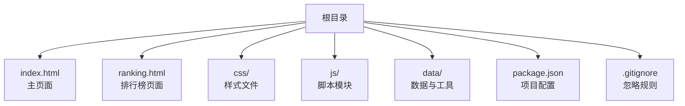
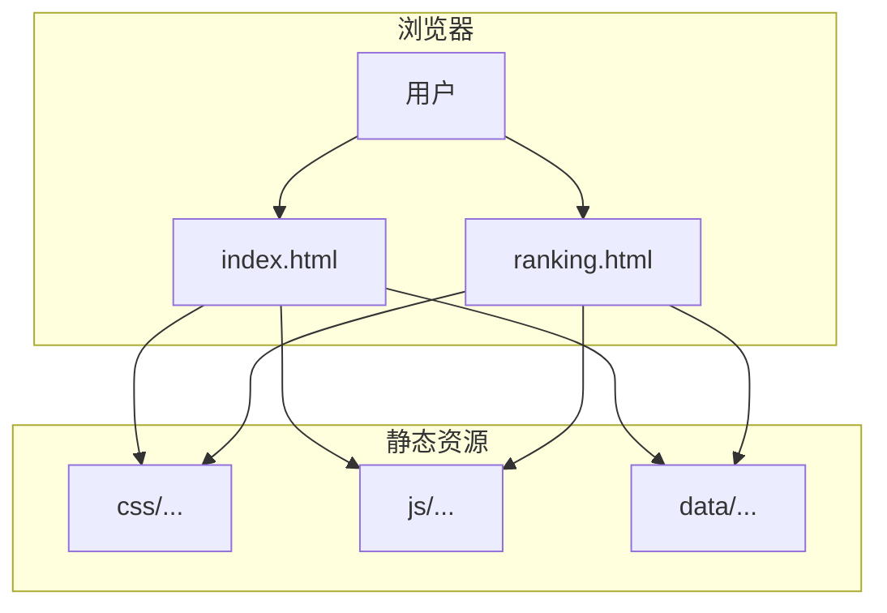
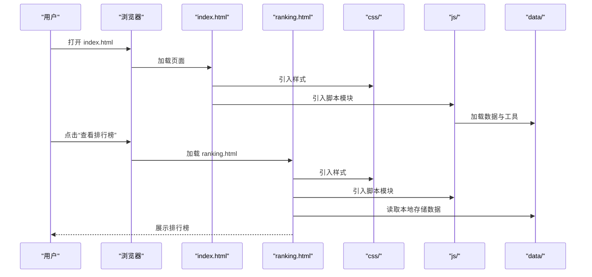

# 部署说明

<cite>
**本文引用的文件**
- [README.md](file://README.md)
- [index.html](file://index.html)
- [ranking.html](file://ranking.html)
- [package.json](file://package.json)
- [.gitignore](file://.gitignore)
</cite>

## 目录
1. [简介](#简介)
2. [项目结构](#项目结构)
3. [核心组件](#核心组件)
4. [架构总览](#架构总览)
5. [详细组件分析](#详细组件分析)
6. [依赖分析](#依赖分析)
7. [性能考虑](#性能考虑)
8. [故障排查指南](#故障排查指南)
9. [结论](#结论)
10. [附录](#附录)

## 简介
本文件面向两类部署场景：本地运行与 GitHub Pages 静态托管。项目为纯前端静态站点，无需后端服务即可运行；通过浏览器直接打开入口页面即可体验，也可使用本地 HTTP 服务器提升兼容性与开发效率；若希望公开发布，可将仓库推送到 GitHub 并启用 Pages 功能，即可获得全球可访问的静态站点。

## 项目结构
项目采用静态网站结构，入口页面为 index.html，排行榜页面为 ranking.html，资源按目录划分：
- 样式：css/
- 脚本：js/
- 数据与工具：data/
- 根目录入口：index.html、ranking.html
- 构建与脚本：package.json
- 版本控制忽略：.gitignore

图表来源
- [index.html](file://index.html#L1-L176)
- [ranking.html](file://ranking.html#L1-L94)
- [package.json](file://package.json#L1-L17)
- [.gitignore](file://.gitignore#L1-L19)

章节来源
- [README.md](file://README.md#L15-L45)
- [index.html](file://index.html#L1-L176)
- [ranking.html](file://ranking.html#L1-L94)
- [package.json](file://package.json#L1-L17)
- [.gitignore](file://.gitignore#L1-L19)

## 核心组件
- 入口页面 index.html：负责加载样式与脚本，承载主选择器、筛选设置、计时器与排行榜交互。
- 排行榜页面 ranking.html：独立页面，基于本地存储展示与管理个人最佳记录。
- 构建与脚本：package.json 提供脚本入口，便于后续扩展（如测试）。
- 版本控制忽略：.gitignore 避免提交不必要的系统与依赖文件。

章节来源
- [index.html](file://index.html#L1-L176)
- [ranking.html](file://ranking.html#L1-L94)
- [package.json](file://package.json#L1-L17)
- [.gitignore](file://.gitignore#L1-L19)

## 架构总览
静态站点由浏览器直接加载 HTML/CSS/JS 资源，无需服务器端渲染或数据库。页面间通过相对路径跳转，资源通过相对路径引用，适合静态托管平台。

图表来源
- [index.html](file://index.html#L1-L176)
- [ranking.html](file://ranking.html#L1-L94)

## 详细组件分析

### 本地运行部署
- 直接双击 index.html 的限制
  - 浏览器出于安全策略限制，可能无法加载某些资源或启用部分功能（例如跨域资源、本地文件读取等）。建议使用本地 HTTP 服务器启动，以避免同源策略与资源加载问题。
- 推荐使用 Python 内置 HTTP 服务器
  - 在项目根目录启动本地服务器，然后在浏览器访问对应地址，即可正常加载所有资源与功能。
- 适用场景
  - 快速预览、开发调试、离线演示。

章节来源
- [README.md](file://README.md#L47-L56)

### GitHub Pages 部署
- 步骤概览
  - 在 GitHub 上创建新仓库（可公开或私有），将项目文件推送至该仓库。
  - 进入仓库“Settings”页面，启用“Pages”功能，选择主分支作为部署源，保存后等待几分钟，即可获得 GitHub Pages 提供的可访问链接。
  - 访问生成的 Pages URL 即可使用。
- 注意事项
  - 静态托管无需后端支持，可全球访问。
  - 若出现 404，请检查资源路径是否正确（如 css/、js/、data/ 等相对路径）。
  - 若需自定义域名，可在 Pages 设置中配置。
- 适用场景
  - 免费公开发布、快速分享给他人、无需服务器维护。

章节来源
- [README.md](file://README.md#L57-L64)

### 页面与资源关系
- index.html 引入样式与脚本模块，承载主功能与交互。
- ranking.html 独立页面，通过本地存储管理排行榜数据。
- 两页面均通过相对路径引用样式与脚本，适合静态托管。

图表来源
- [index.html](file://index.html#L1-L176)
- [ranking.html](file://ranking.html#L1-L94)

章节来源
- [index.html](file://index.html#L1-L176)
- [ranking.html](file://ranking.html#L1-L94)

## 依赖分析
- 构建与脚本
  - package.json 定义了项目名称、版本、入口脚本与测试脚本，便于后续扩展与自动化。
- 版本控制忽略
  - .gitignore 忽略系统文件、编辑器配置、日志与 node_modules，减少无关文件进入仓库。
- 资源路径
  - index.html 与 ranking.html 均通过相对路径引入资源，确保在静态托管环境下正常加载。

章节来源
- [package.json](file://package.json#L1-L17)
- [.gitignore](file://.gitignore#L1-L19)
- [index.html](file://index.html#L1-L176)
- [ranking.html](file://ranking.html#L1-L94)

## 性能考虑
- 静态资源体积与加载
  - 将样式与脚本按需组织，避免一次性加载过多资源，有助于提升首屏速度。
- 缓存策略
  - 在静态托管平台可利用浏览器缓存与 CDN 加速，进一步降低延迟。
- 资源压缩
  - 可对 CSS/JS 进行压缩与合并，减少请求次数与传输体积（建议在构建流程中集成）。

## 故障排查指南
- 404 错误
  - 检查 index.html 与 ranking.html 中的资源路径是否正确（如 css/、js/、data/），确保与实际目录一致。
  - 若使用 GitHub Pages，请确认 Pages 设置中选择了正确的分支与根目录。
- 跨域或本地文件加载失败
  - 避免直接双击打开 HTML 文件，改用本地 HTTP 服务器启动，以规避浏览器安全策略限制。
- 自定义域名或 HTTPS
  - 在 GitHub Pages 的 Settings 中配置自定义域名与强制 HTTPS（如需）。

章节来源
- [README.md](file://README.md#L57-L64)
- [index.html](file://index.html#L1-L176)
- [ranking.html](file://ranking.html#L1-L94)

## 结论
本项目为纯前端静态站点，既可本地运行快速体验，也可一键部署到 GitHub Pages 实现全球访问。部署的关键在于正确配置资源路径与 Pages 源分支，同时遵循浏览器安全策略，优先使用本地 HTTP 服务器进行开发与调试。

## 附录
- 本地运行步骤
  - 克隆或下载项目后，在项目根目录启动本地 HTTP 服务器，然后在浏览器访问对应地址。
- GitHub Pages 部署步骤
  - 在 GitHub 创建仓库并推送文件，进入仓库“Settings”，启用 Pages 并选择主分支，保存后等待部署完成，即可访问 Pages URL。

章节来源
- [README.md](file://README.md#L47-L64)