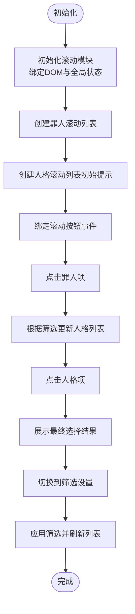

# 项目概述

<cite>
**本文引用的文件**
- [README.md](file://README.md)
- [index.html](file://index.html)
- [ranking.html](file://ranking.html)
- [package.json](file://package.json)
- [data/characters.js](file://data/characters.js)
- [data/config.js](file://data/config.js)
- [data/utils/helpers.js](file://data/utils/helpers.js)
- [js/main.js](file://js/main.js)
- [js/filters.js](file://js/filters.js)
- [js/scrolls.js](file://js/scrolls.js)
- [js/settings.js](file://js/settings.js)
- [js/ui.js](file://js/ui.js)
- [js/modal.js](file://js/modal.js)
- [css/common.css](file://css/common.css)
</cite>

## 目录
1. [简介](#简介)
2. [项目结构](#项目结构)
3. [核心组件](#核心组件)
4. [架构总览](#架构总览)
5. [详细组件分析](#详细组件分析)
6. [依赖关系分析](#依赖关系分析)
7. [性能考量](#性能考量)
8. [故障排查指南](#故障排查指南)
9. [结论](#结论)
10. [附录](#附录)

## 简介
本项目是一个纯前端的《边狱公司》随机选择器，帮助玩家在12名罪人与对应的人格之间进行公平、便捷的随机决策。项目提供：
- 两级滚动选择器：先随机选择罪人，再随机选择该罪人的人格
- 自定义筛选：可按罪人与人格维度自由勾选，支持全选/反选/重置
- 单通计时与排行榜：内置计时器，支持将通关时间保存至本地存储并查看历史记录
- 无后端、静态部署友好：仅依赖浏览器能力，无需服务器，可直接托管于 GitHub Pages 等静态站点

项目定位为工具型应用，强调易用性、可扩展性与跨设备适配，适合在移动端、平板与桌面端使用。

## 项目结构
项目采用模块化组织，核心目录与职责如下：
- data：存放数据与工具模块（罪人数据、配置常量、辅助函数）
- js：前端模块（主入口、滚动选择、筛选、设置、UI、弹窗）
- css：样式文件（通用样式、模块化样式、季节性样式、重置样式）
- 根目录：HTML 页面（主页面与排行榜页面）、包配置、说明文档

图表来源
- [index.html](file://index.html#L1-L176)
- [ranking.html](file://ranking.html#L1-L94)
- [data/characters.js](file://data/characters.js#L1-L260)
- [data/config.js](file://data/config.js#L1-L29)
- [data/utils/helpers.js](file://data/utils/helpers.js#L1-L45)
- [js/main.js](file://js/main.js#L1-L261)
- [js/filters.js](file://js/filters.js#L1-L274)
- [js/scrolls.js](file://js/scrolls.js#L1-L718)
- [js/settings.js](file://js/settings.js#L1-L263)
- [js/ui.js](file://js/ui.js#L1-L66)
- [js/modal.js](file://js/modal.js#L1-L109)
- [css/common.css](file://css/common.css#L1-L794)

章节来源
- [README.md](file://README.md#L1-L121)
- [package.json](file://package.json#L1-L17)

## 核心组件
- 主应用逻辑（js/main.js）：负责页面导航、滚动模块初始化、筛选与滚动事件绑定、结果展示与状态管理
- 筛选模块（js/filters.js）：构建罪人筛选复选框、维护筛选状态、校验筛选完整性、应用/重置筛选
- 滚动模块（js/scrolls.js）：实现罪人与人格的无限循环滚动、随机停止定位、高亮选中项、一键选择
- 设置模块（js/settings.js）：按罪人分页的人格筛选界面、全选/反选/重置、分页切换
- UI模块（js/ui.js）：页面导航切换、按钮事件绑定、应用筛选按钮注入
- 弹窗模块（js/modal.js）：统一的提示与确认对话框，替代浏览器原生弹窗
- 数据与配置（data/characters.js、data/config.js、data/utils/helpers.js）：罪人与人格数据、配置常量、安全随机数与防抖节流
- 样式（css/common.css）：滚动列表、按钮、筛选、分页、排行榜等视觉与交互样式

章节来源
- [js/main.js](file://js/main.js#L1-L261)
- [js/filters.js](file://js/filters.js#L1-L274)
- [js/scrolls.js](file://js/scrolls.js#L1-L718)
- [js/settings.js](file://js/settings.js#L1-L263)
- [js/ui.js](file://js/ui.js#L1-L66)
- [js/modal.js](file://js/modal.js#L1-L109)
- [data/characters.js](file://data/characters.js#L1-L260)
- [data/config.js](file://data/config.js#L1-L29)
- [data/utils/helpers.js](file://data/utils/helpers.js#L1-L45)
- [css/common.css](file://css/common.css#L1-L794)

## 架构总览
项目采用“模块化前端架构”，以 ES 模块导入导出组织代码，主入口负责协调各模块协作；数据与配置独立于视图层，便于维护与扩展；UI 与交互通过模块化 JS 组织，样式集中在 CSS 文件中，保证结构清晰、职责分离。

图表来源
- [js/main.js](file://js/main.js#L1-L261)
- [js/filters.js](file://js/filters.js#L1-L274)
- [js/scrolls.js](file://js/scrolls.js#L1-L718)
- [js/settings.js](file://js/settings.js#L1-L263)
- [js/ui.js](file://js/ui.js#L1-L66)
- [js/modal.js](file://js/modal.js#L1-L109)

## 详细组件分析

### 主应用逻辑（js/main.js）
- 职责
  - 初始化滚动模块与 DOM 元素映射
  - 绑定滚动按钮事件（罪人/人格）
  - 处理罪人与人格点击选择
  - 管理页面导航（主页面/设置页面）
  - 与筛选模块协作，应用/重置筛选并刷新滚动列表
- 关键点
  - 使用 window 对象共享筛选状态与当前选中项，确保模块间一致性
  - 通过异步导入模块，避免阻塞主流程
  - 在返回主页面时刷新滚动列表，保持 UI 与数据一致

图表来源
- [js/main.js](file://js/main.js#L1-L261)

章节来源
- [js/main.js](file://js/main.js#L1-L261)

### 筛选模块（js/filters.js）
- 职责
  - 动态生成罪人筛选复选框，支持头像占位符与错误回退
  - 维护筛选状态（罪人与人格），并在设置页面变更时同步
  - 校验筛选完整性（至少一个罪人、每个罪人至少一个人格）
  - 应用筛选、重置筛选、自动选中单个罪人场景
- 关键点
  - 通过 window 对象保存原始筛选状态，支持“未保存更改”检测
  - 与滚动模块协作，返回主页面时刷新列表并高亮选中项
  - 与设置模块联动，动态创建人格设置界面

图表来源
- [js/filters.js](file://js/filters.js#L1-L274)

章节来源
- [js/filters.js](file://js/filters.js#L1-L274)

### 滚动模块（js/scrolls.js）
- 职责
  - 实现罪人与人格的无限循环滚动，支持快速滚动与平滑停止
  - 随机停止定位到中心行，高亮选中项
  - 一键选择：当仅剩一个选项时直接选中，跳过滚动
  - 处理单个罪人/人格时的按钮状态与提示
- 关键点
  - 使用配置常量控制滚动速度、过渡时长与可见行数
  - 通过安全随机数生成器保证随机性
  - 与主应用协作，更新当前选中项并刷新人格列表

图表来源
- [js/scrolls.js](file://js/scrolls.js#L1-L718)
- [data/config.js](file://data/config.js#L1-L29)
- [data/utils/helpers.js](file://data/utils/helpers.js#L1-L45)

章节来源
- [js/scrolls.js](file://js/scrolls.js#L1-L718)

### 设置模块（js/settings.js）
- 职责
  - 为每个罪人创建人格筛选卡片，支持全选/反选/重置
  - 按罪人分页展示，支持分页切换
  - 将筛选状态写入 window 对象，供其他模块读取
- 关键点
  - 通过 dataset 传递罪人与人格索引，精确控制筛选状态
  - 与筛选模块协同，确保筛选完整性

章节来源
- [js/settings.js](file://js/settings.js#L1-L263)

### UI 模块（js/ui.js）
- 职责
  - 页面导航切换（主页面/设置页面）
  - 注入“应用筛选”按钮
  - 统一按钮事件绑定，减少重复逻辑
- 关键点
  - 通过异步导入模块，避免循环依赖
  - 与主应用解耦，专注于界面行为

章节来源
- [js/ui.js](file://js/ui.js#L1-L66)

### 弹窗模块（js/modal.js）
- 职责
  - 提供统一的 alert/confirm 对话框，替代浏览器原生弹窗
  - 支持异步确认与回调
- 关键点
  - 通过单例模式管理弹窗容器，避免重复创建
  - 与各模块解耦，提供一致的交互体验

章节来源
- [js/modal.js](file://js/modal.js#L1-L109)

### 数据与配置（data/characters.js、data/config.js、data/utils/helpers.js）
- 职责
  - characters.js：提供罪人与人格数据，含头像与颜色等元信息
  - config.js：集中管理滚动、界面、消息等配置常量
  - helpers.js：提供安全随机数、防抖与节流工具
- 关键点
  - 数据与配置独立，便于维护与扩展
  - 安全随机数优先使用 Web Crypto API，回退到 Math.random

章节来源
- [data/characters.js](file://data/characters.js#L1-L260)
- [data/config.js](file://data/config.js#L1-L29)
- [data/utils/helpers.js](file://data/utils/helpers.js#L1-L45)

### 样式（css/common.css）
- 职责
  - 定义滚动列表、按钮、筛选、分页、排行榜等通用样式
  - 提供响应式布局，适配移动端与桌面端
- 关键点
  - 使用渐变与阴影营造“边狱巴士”风格
  - 高亮选中项与交互反馈，增强滚动体验

章节来源
- [css/common.css](file://css/common.css#L1-L794)

## 依赖关系分析
- 模块依赖
  - main.js 依赖 filters.js、scrolls.js、settings.js、ui.js、modal.js、characters.js、config.js、helpers.js
  - filters.js 依赖 config.js、modal.js、characters.js
  - scrolls.js 依赖 config.js、helpers.js、characters.js、modal.js
  - settings.js 依赖 filters.js、modal.js、characters.js
  - ui.js 依赖 settings.js、scrolls.js、filters.js
  - modal.js 为通用弹窗服务
- 数据依赖
  - 所有模块共享 window 上的筛选状态与当前选中项
  - 滚动列表依赖筛选后的数据集
- 外部依赖
  - 仅依赖浏览器 API 与 Font Awesome 图标库
  - 无后端依赖，完全静态部署友好

图表来源
- [js/main.js](file://js/main.js#L1-L261)
- [js/filters.js](file://js/filters.js#L1-L274)
- [js/scrolls.js](file://js/scrolls.js#L1-L718)
- [js/settings.js](file://js/settings.js#L1-L263)
- [js/ui.js](file://js/ui.js#L1-L66)
- [js/modal.js](file://js/modal.js#L1-L109)
- [data/characters.js](file://data/characters.js#L1-L260)
- [data/config.js](file://data/config.js#L1-L29)
- [data/utils/helpers.js](file://data/utils/helpers.js#L1-L45)

章节来源
- [js/main.js](file://js/main.js#L1-L261)
- [js/filters.js](file://js/filters.js#L1-L274)
- [js/scrolls.js](file://js/scrolls.js#L1-L718)
- [js/settings.js](file://js/settings.js#L1-L263)
- [js/ui.js](file://js/ui.js#L1-L66)
- [js/modal.js](file://js/modal.js#L1-L109)
- [data/characters.js](file://data/characters.js#L1-L260)
- [data/config.js](file://data/config.js#L1-L29)
- [data/utils/helpers.js](file://data/utils/helpers.js#L1-L45)

## 性能考量
- 滚动性能
  - 使用固定可见行数与线性过渡，降低 DOM 重排成本
  - 通过定时器与循环重置实现平滑滚动，避免频繁计算
- 随机选择
  - 优先使用安全随机数生成器，保证公平性与可预测性
- 事件绑定
  - 采用异步导入模块，避免主入口阻塞
  - 使用防抖/节流工具（helpers.js）优化高频事件
- 数据访问
  - 通过 window 对象共享筛选状态，减少重复查询与计算
- 样式与布局
  - 使用 transform 进行滚动，利用 GPU 加速
  - 响应式布局减少移动端卡顿

[本节为通用性能讨论，不直接分析具体文件]

## 故障排查指南
- 无法选择罪人/人格
  - 检查筛选设置：是否至少选择一个罪人与该罪人的人格
  - 若只有一个罪人，确认其人格列表已正确生成
- 滚动按钮不可用
  - 当仅有一个罪人或仅有一个人格时，开始按钮会自动禁用，需先调整筛选
- 未保存更改提示
  - 切换页面前若有未保存筛选，将弹窗提示是否保存
- 头像加载失败
  - 图片加载失败会显示占位符，不影响功能
- 排行榜为空
  - 首次使用时无记录属正常，完成一次通关计时并保存后即可查看

章节来源
- [js/filters.js](file://js/filters.js#L1-L274)
- [js/scrolls.js](file://js/scrolls.js#L1-L718)
- [js/modal.js](file://js/modal.js#L1-L109)
- [ranking.html](file://ranking.html#L1-L94)

## 结论
本项目以模块化前端架构为核心，围绕“随机选择”这一核心需求，提供了直观、高效且可扩展的工具型应用。通过罪人与人格两级滚动选择、灵活筛选、计时与排行榜，有效提升了游戏决策效率与趣味性。项目无后端依赖、静态部署友好，适合广泛传播与二次开发。

[本节为总结性内容，不直接分析具体文件]

## 附录
- 部署与运行
  - 本地运行：直接打开 index.html 或使用本地 HTTP 服务器
  - 静态部署：将项目文件上传至 GitHub Pages 等静态托管平台
- 数据与资源
  - 罪人与人格数据集中于 data/characters.js
  - 配置常量集中于 data/config.js
  - 样式集中在 css/common.css
- 功能对照
  - 随机选择罪人与人格
  - 自定义筛选（罪人/人格）
  - 单通计时与排行榜
  - 响应式界面与无障碍体验

章节来源
- [README.md](file://README.md#L1-L121)
- [index.html](file://index.html#L1-L176)
- [ranking.html](file://ranking.html#L1-L94)
- [package.json](file://package.json#L1-L17)